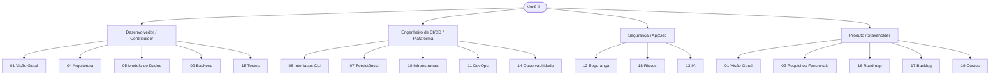

# Documentação do Quorum — Índice

Esta é a landing page (índice mestre) da documentação enterprise do **Quorum** (`quorum-sec-scan`),
uma ferramenta de **consensus security scanning** entregue como **CLI e imagens Docker**. O Quorum
orquestra um pool de scanners OSS (trivy, grype, checkov, kics, dockle, kubescape), normaliza tudo
para um modelo canônico (`model.Finding`), resolve aliases de vulnerabilidade (CVE/GHSA via OSV.dev),
correlaciona findings equivalentes por um `correlationKey` determinístico, calcula um score de
confiança (consensus) e emite relatório **SARIF** (primário), **JSON** ou **XML**. O princípio de
projeto é **"false split > false merge"** e o lema operacional é **"0 findings is not proof of safety"**.
Esta documentação descreve o produto **AS-IS na versão v0.2.3** (branch `main` como fonte de verdade);
itens de **frontend web, banco de dados relacional, API REST HTTP e IA/LLM** são marcados **N/A** por
arquitetura, com justificativa técnica e, quando útil, uma "Proposta futura" claramente separada.

---

## Sumário (TOC)

| # | Documento | Descrição (1 linha) |
|---|-----------|---------------------|
| 00 | [Índice](00-index.md) | Esta página: landing, mapa de leitura, registros de premissas/lacunas e metadados. |
| 01 | [Visão Geral](01-visao-geral.md) | O que é o Quorum, escopo CLI/Docker, princípios e fronteiras N/A. |
| 02 | [Requisitos Funcionais](02-requisitos-funcionais.md) | Comandos, flags, exit codes, scanners e matriz de targets suportados. |
| 03 | [Requisitos Não Funcionais](03-requisitos-nao-funcionais.md) | Metas de performance, SLO/SLI alvo, supply chain, conformidade interpretativa. |
| 04 | [Arquitetura](04-arquitetura.md) | Pipeline, pacotes `internal/*`, fan-out do orchestrator e diagrama de sequência. |
| 05 | [Modelagem de Dados](05-modelo-de-dados.md) | `model.Finding`, MergedFinding, fingerprints e formas de JSON/XML. |
| 06 | [Interfaces (CLI) e Formatos de Saída](06-interfaces-cli-e-formatos.md) | Contrato da CLI, `list-scanners`, SARIF/JSON/XML e exemplos de invocação. |
| 07 | [Persistência e Artefatos](07-persistencia-e-artefatos.md) | Cache de aliases, Grype DB, crosswalk YAML, baseline `.quorumignore` e relatórios. |
| 08 | [Frontend / Experiência de Terminal](08-frontend.md) | UX de terminal: stdout/stderr, summary, ausência de cor/TTY (web é N/A). |
| 09 | [Backend](09-backend.md) | `cmd/quorum` + `internal/*` como "backend" CLI; sem servidor/daemon (web N/A). |
| 10 | [Infraestrutura](10-infraestrutura.md) | Build, distribuição GHCR (`:full`/`:slim`), cosign + SLSA; runtime hospedado N/A. |
| 11 | [DevOps](11-devops.md) | Workflows CI/e2e/release, fluxo de PR, tag móvel `v0` e verificação do consumidor. |
| 12 | [Segurança](12-seguranca.md) | Modelo de ameaças, riscos R1–R8, supply chain e mapeamentos de framework. |
| 13 | [IA (Inteligência Artificial)](13-ia.md) | Confirmação de **ausência de IA/LLM/ML**; OSV é lookup determinístico (N/A + proposta futura). |
| 14 | [Observabilidade](14-observabilidade.md) | Logs `[quorum]` em stderr, campos SARIF/JSON e telemetria proposta. |
| 15 | [Testes](15-testes.md) | Estratégia de testes, contract tests, e2e de consenso e propostas de cobertura. |
| 16 | [Roadmap](16-roadmap.md) | Fases V1/V2/V3, status do Polaris e gates de release SemVer. |
| 17 | [Backlog](17-backlog.md) | Epics/Stories priorizados (MoSCoW, story points Fibonacci). |
| 18 | [Matriz de Riscos](18-riscos.md) | Riscos técnicos/supply-chain/operacionais com matriz 5x5 qualitativa. |
| 19 | [Custos](19-custos.md) | Modelagem de custos (Actions/GHCR/headcount), licenças e câmbio. |
| 20 | [Melhorias e Recomendações](20-melhorias.md) | Oportunidades de performance/UX/supply chain priorizadas. |
| 99 | [Checklists](99-checklists.md) | Checklists acionáveis de adoção, operação e release. |

---

## Como ler / mapa da documentação

Escolha a trilha conforme seu papel:

Trilhas sugeridas:

- **Primeiro contato:** [01-visao-geral](01-visao-geral.md) → [06-interfaces-cli-e-formatos](06-interfaces-cli-e-formatos.md) → [99-checklists](99-checklists.md).
- **Entender o "como funciona":** [04-arquitetura](04-arquitetura.md) → [05-modelo-de-dados](05-modelo-de-dados.md) → [09-backend](09-backend.md).
- **Adotar em pipeline:** [06-interfaces-cli-e-formatos](06-interfaces-cli-e-formatos.md) → [10-infraestrutura](10-infraestrutura.md) → [11-devops](11-devops.md) → [14-observabilidade](14-observabilidade.md).
- **Avaliar postura de segurança:** [12-seguranca](12-seguranca.md) → [18-riscos](18-riscos.md) → [13-ia](13-ia.md).
- **Planejar evolução:** [16-roadmap](16-roadmap.md) → [17-backlog](17-backlog.md) → [20-melhorias](20-melhorias.md).

Convenção de nomes: arquivos seguem o padrão `NN-arquivo.md`, com `00` como índice e `99` para
checklists. Cross-links usam caminhos relativos dentro de `docs/`.

---

## Fronteiras de escopo (AS-IS)

O Quorum é **CLI/Docker only**. Os domínios abaixo são **N/A por arquitetura** na v0.2.3:

| Domínio | Status | Justificativa técnica | Onde se aprofundar |
|---------|--------|-----------------------|--------------------|
| Frontend web / UI | **N/A** | Não há servidor HTTP nem assets de browser; a UX é terminal (stdout/stderr). | [08-frontend](08-frontend.md) |
| Banco de dados relacional | **N/A** | Não há datastore de domínio persistente; só caches de arquivo reconstruíveis (aliases, Grype DB). | [07-persistencia-e-artefatos](07-persistencia-e-artefatos.md) |
| API REST HTTP | **N/A** | Não há endpoint/serviço residente; a interface é o binário CLI e a imagem Docker. | [06-interfaces-cli-e-formatos](06-interfaces-cli-e-formatos.md) |
| Autenticação / contas | **N/A** | Não há usuários, sessões ou identidade gerenciada pelo produto. | [12-seguranca](12-seguranca.md) |
| IA / LLM / ML | **N/A** | Zero ocorrências de IA no código; OSV.dev é lookup determinístico, não ML. | [13-ia](13-ia.md) |
| Runtime security (Falco/Tetragon), runtime hospedado/K8s | **N/A (proposta futura)** | O produto roda em batch no pipeline; não há componente residente em cluster. | [10-infraestrutura](10-infraestrutura.md), [16-roadmap](16-roadmap.md) |

---

## Registro de Premissas (consolidado)

Premissas transversais que governam toda a suíte de documentação. Premissas específicas de cada
documento aparecem na seção "## Premissas" do respectivo arquivo.

| ID | Premissa | Documentos-fonte |
|----|----------|------------------|
| A-01 | A **branch `main` (produto v0.2.3)** é a fonte de verdade; onde `DESIGN.md` (Draft v0.1) diverge, prevalece o código. | 04, 05, 09, 18 |
| A-02 | A constante `version` em `root.go` é `0.1.0` por ser **sobrescrita em build-time via `-ldflags`**; releases injetam `0.2.3`. Exemplos usam `0.2.3`. | 02, 05, 06, 09 |
| A-03 | `report.Version = "0.1.0"` é reportado fielmente e tratado como **versão de contrato / namespace de fingerprint** (`quorum/v1`), não versão do produto. | 05, 06 |
| A-04 | O Quorum é **CLI/Docker only**: web, RDBMS, API REST, auth e IA/LLM são **N/A** por arquitetura. | 01, 03, 08, 09, 13, 15, 17, 20, 99 |
| A-05 | **OSV.dev é a única dependência de rede em runtime**, opcional e com degradação graciosa; `--offline` a desabilita (operação air-gapped). | 01, 02, 03, 12 |
| A-06 | `--timeout` mapeia para **PerScannerTime** (por scanner); o **ProbeTime de 60s** (`defaultProbeTime`) é separado e **não exposto como flag** na v0.2.3. | 02, 14, 99 |
| A-07 | `correlationKey` e `confidence` são **determinísticos** sobre os dados normalizados. | 01, 05 |
| A-08 | **`polaris`** aparece em `scannerCategory` (família k8s) mas **não há adapter registrado**; tratado como mapeamento preparado para extensão futura, não scanner ativo. | 02, 05, 09, 16 |
| A-09 | A matriz de targets reflege `Supports`/`Capabilities` lidos do código, **preservando divergências** (ex.: kubescape `Supports` repo+k8s mas declara capability só k8s). | 02 |
| A-10 | O **cache de aliases não tem TTL**; gerenciamento/limpeza são manuais; melhorias listadas como proposta futura. | 02, 07 |
| A-11 | Metas de performance e **SLO/SLI são alvos de engenharia**, não validados por benchmark formal no repo. | 03, 20 |
| A-12 | **Mapeamentos PCI/ISO/ASVS/Top10/DREAD** são interpretativos do código as-is, não atestação de conformidade; scores DREAD são qualitativos. | 03, 12 |
| A-13 | Owner/repo é **`Martinez1991/quorum-sec-scan`** e o registry é **`ghcr.io/martinez1991/quorum-sec-scan`** (lowercase). | 10, 11, 99 |
| A-14 | Imagem **`:full` é `linux/amd64`** (Grype DB pré-cacheado em build-time); **`:slim`** cobre `amd64+arm64` com scanners no PATH, alterando perfil de performance/disponibilidade. | 03, 09, 10, 99 |
| A-15 | O **consumidor em produção** verifica imagem/binário (cosign + `gh attestation`) e pina por digest; o produto **só fornece os meios**. | 03, 11 |
| A-16 | Disponibilidade de distribuição depende de **terceiros (GHCR/Releases/OSV)** fora do controle do projeto. | 03 |
| A-17 | Logs são **texto com prefixo `[quorum]` em stderr** (não JSON, sem níveis/timestamps por linha); o consumidor da telemetria é a plataforma invocadora. | 03, 14 |
| A-18 | Repositório é **público OSS** (cotas gratuitas de Actions/storage); faixas pagas modelam o caso privado/excedente. Câmbio US$ 1 ≈ R$ 5,50. | 19 |
| A-19 | Licença do Quorum é **Apache-2.0** (confirmada via `LICENSE`); licenças dos scanners empacotados são estimativas a confirmar no upstream. | 19 |
| A-20 | Tamanhos de imagem/artefato são **qualitativos** (inferidos dos Dockerfiles), não medidos no repo. | 10, 19 |
| A-21 | Fixtures em `internal/adapter/testdata` **não fazem parte do caminho de execução de produção**. | 13, 15 |

---

## Registro de Lacunas

Itens não verificados na origem, divergências e dívidas conhecidas. Estes são candidatos naturais a
backlog ([17-backlog](17-backlog.md)) e melhorias ([20-melhorias](20-melhorias.md)).

| ID | Lacuna | Impacto | Documentos-fonte |
|----|--------|---------|------------------|
| G-01 | **Versão divergente**: `report.Version` hardcoded `0.1.0` vs produto v0.2.3; intenção (contrato estável vs defasagem) não clara no código. | Médio | 05 |
| G-02 | **`durationMs` em `scanners[]`** serializa como **nanosegundos** (sem `MarshalJSON` custom), enquanto `summary.durationMs` usa `.Milliseconds()`; nome diverge da unidade. | Médio | 06 |
| G-03 | **`polaris`** referenciado em consenso sem adapter correspondente em `internal/adapter`. | Baixo | 02, 05, 09, 16 |
| G-04 | **Cache de aliases sem TTL, sem versão de esquema e sem locking entre processos**; execuções concorrentes podem perder entradas (sem corrupção); mudança incompatível tolerada como cache vazio sem aviso. | Médio | 07, 02 |
| G-05 | **Crosswalk YAML sem campo de versão**; esquema implícito no struct `Control`, sem migração automática. | Baixo | 07 |
| G-06 | **Grype DB congelado** no build da `:full`; pode perder CVEs recentes sem rebuild/repull. | Alto | 07, 18 |
| G-07 | **Pin incompleto de supply chain**: nem todos os scanners no `Dockerfile.full` estão pinados por `@sha256` (alguns por versão+checksum; Grype/Syft/Kubescape/Checkov via `curl\|sh`/`pip`); sem SBOM da imagem `:full`. | Alto | 03, 12, 18 |
| G-08 | **Sem logging estruturado JSON nem métricas/telemetria exportáveis**; observabilidade é texto em stderr. | Médio | 03, 14 |
| G-09 | **`--output` sem `Abs`/`Clean`** (perm 0644): risco de path traversal/overwrite (R3). | Alto | 12 |
| G-10 | **`id` da OSV concatenado na URL sem `url.PathEscape`** nem validação de formato (R6). | Médio | 12 |
| G-11 | **Ref do alvo concatenado nos args sem separador `--`** nem rejeição de refs iniciando com `-` (R1 argument injection residual). | Médio | 12 |
| G-12 | **Sem cap de bytes no stdout do scanner** e sem limite de tamanho de alvo (R2/R5 DoS). | Médio | 12 |
| G-13 | **`aliases.json` sem integridade/assinatura** (perm 0644): risco de cache poisoning (R7). | Médio | 12 |
| G-14 | **Sem redaction de valores de segredo** no relatório (R8). | Médio | 12 |
| G-15 | **Cobertura de testes não coletada no CI**; `internal/{model,purl,consensus,crosswalk}` sem `_test.go` dedicado; e2e não-determinístico (gate só checa `multiDetected>=1`). | Médio | 15 |
| G-16 | **Tag móvel `v0`** do Action não tem workflow versionado que a mova (operação manual de mantenedor). | Baixo | 11, 99 |
| G-17 | **Sem números reais** medidos no repo: minutos de Actions, tamanho de imagens, storage GHCR, benchmarks de performance. | Baixo | 19, 03, 10, 20 |
| G-18 | **Licenças/NOTICE de terceiros** na `:full` e termos de redistribuição do Grype DB não confirmados no upstream. | Médio | 19 |
| G-19 | **Verificação não exaustiva**: vários adapters (checkov/kics/dockle/kubescape/grype) e reporters (json/xml) não foram lidos linha a linha; alguns detalhes de DESIGN.md/`action.yml`/`release.yml` vêm do briefing. | Baixo | 02, 04, 09, 12, 20 |

---

## Perguntas em aberto (para stakeholders)

Decisões que dependem de produto/mantenedores e que destravam ou ajustam a documentação.

**Produto e escopo**

- [ ] **Polaris**: virará adapter (e em qual release — v0.3.x vs série v1.x/V3) ou a entrada em `scannerCategory` deve ser removida? (G-03)
- [ ] **kubescape**: a divergência `Supports` repo+k8s vs capability só k8s é intencional? Pode confundir usuários em alvos `repo`. (A-09)
- [ ] Há apetite por **perfis de imagem adicionais** (`:sca`/`:iac`/`:k8s`) ou o par `:full`/`:slim` é definitivo?
- [ ] Há apetite por **`--format table/markdown`** e PR decoration mantendo o produto estritamente CLI (automação só no Action)?

**Contratos e versionamento**

- [ ] **`report.Version`** deve refletir a versão do produto via ldflags ou é versionamento de contrato independente proposital? (G-01)
- [ ] O dump de `[]MergedFinding` no campo `findings` do JSON (com `Members` completos) é **contrato estável** ou detalhe interno sujeito a mudança?
- [ ] **`durationMs` em `scanners[]`** deveria ser convertido para milissegundos (coerência com `summary`)? (G-02)
- [ ] Pretende-se publicar oficialmente o **JSON Schema** (`quorum-report-v1.json`) como arquivo versionado?

**Configuração e operação**

- [ ] O **ProbeTime de 60s** deve ser exposto como flag de CLI/Action ou permanece interno? (A-06)
- [ ] Introduzir **`schemaVersion`** no `aliases.json` e/ou nos YAML de crosswalk para migração explícita? (G-04, G-05)
- [ ] Oferecer **TTL configurável** ou comando `quorum cache clear` para o cache de aliases? (A-10)
- [ ] **Crosswalk customizado** deveria **mesclar** com o bundled (em vez de substituir) quando `--crosswalk` aponta para outro diretório?
- [ ] Qual a **cadência oficial** recomendada para rebuild/repull da imagem `:full` (Grype DB fresco)? (G-06)

**Supply chain, segurança e CI**

- [ ] Há plano de **endurecer todos os scanners do `Dockerfile.full` para `@sha256`** e gerar SBOM da `:full`? (G-07)
- [ ] `release.yml` publica **atestação SLSA + assinatura cosign para ambas as imagens** (`:full` e `:slim`) e binários?
- [ ] Há intenção de **mirror interno/configurável da OSV** (BaseURL por env) para air-gapped além do `--offline`?
- [ ] **SAST** (golangci-lint/gosec/CodeQL) e **secret scanning** (gitleaks) entram no `ci.yml` ou em workflow dedicado?
- [ ] Deve haver **gate de cobertura bloqueante** no CI e qual a meta oficial (sugestão: 80% global / 90% núcleo)? (G-15)
- [ ] Deve rodar **self-scan (dogfooding)** das imagens publicadas no `release.yml` antes do push?
- [ ] A **tag móvel `v0`** será movida por automação após o release? (G-16)
- [ ] Existe **branch protection** com required checks (ci/e2e) configurada nas settings do GitHub a refletir formalmente?

**Negócio e governança**

- [ ] O repositório é **público (cotas OSS)** ou privado (sujeito a overage)? Há orçamento/headcount real ou regime voluntário? (A-18)
- [ ] Qual a **política de retenção/GC** de tags antigas no GHCR? (G-17)
- [ ] Confirmar oficialmente a **licença de cada scanner empacotado** e a obrigação de incluir NOTICE de terceiros na `:full`. (G-18)
- [ ] Deve haver **warning automático** para o caso "todos scanners `ran` mas 0 findings" ou isso fica só na documentação?

---

## Premissas

Premissas específicas deste índice (além das consolidadas acima):

- O TOC foi construído a partir de um `Glob docs/*.md` real (21 documentos presentes além deste índice);
  as descrições de uma linha derivam dos H1 e do escopo conhecido de cada arquivo.
- Os Registros de Premissas, Lacunas e Perguntas consolidam o conteúdo das seções homônimas dos
  documentos 01–20 e 99; cada item referencia os documentos-fonte para rastreabilidade.
- A classificação de impacto das lacunas (Baixo/Médio/Alto) é qualitativa e serve para priorização,
  não é medição.
- Cross-links usam caminhos relativos `NN-arquivo.md` e assumem que todos os arquivos listados no TOC
  permanecem no diretório `docs/`.

---

## Metadados

| Campo | Valor |
|-------|-------|
| Produto | Quorum (`quorum-sec-scan`) |
| Versão documentada | **v0.2.3** (AS-IS) |
| Fonte de verdade | branch `main` |
| Linguagem | Go 1.26 (CLI com cobra) |
| Distribuição | Docker GHCR `:full`/`:slim` + binários GoReleaser (cosign keyless + SLSA build-provenance) |
| Owner/repo | `Martinez1991/quorum-sec-scan` |
| Registry | `ghcr.io/martinez1991/quorum-sec-scan` |
| Licença | Apache-2.0 |
| Idioma da doc | pt-BR |
| Data de revisão | 2026-06-27 |
| Status | Em revisão — pendente de respostas dos stakeholders (ver "Perguntas em aberto") |
