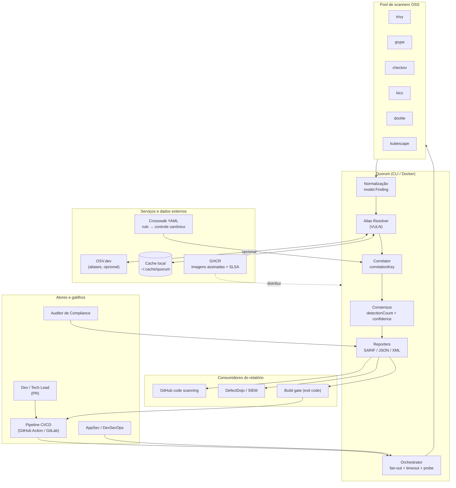

# Visão Geral

O **Quorum** (`quorum-sec-scan`, v0.2.3) é uma ferramenta **CLI/Docker** de *consensus security scanning*: ela orquestra um *pool* de scanners de segurança open source (Trivy, Grype, Checkov, KICS, Dockle, Kubescape) sobre um alvo, normaliza todos os achados para um modelo canônico, resolve aliases de vulnerabilidade, correlaciona findings equivalentes entre as ferramentas e emite **um único relatório** que informa **quantos e quais** scanners detectaram cada problema — acrescido de um *score* de confiança derivado desse consenso. O Quorum **não é mais um scanner**: é a camada leve de correlação + consenso sobre as ferramentas que você já confia, projetada para rodar dentro de um *pipeline* de CI/CD e barrar um *build* via *exit code*. Este documento descreve objetivo, problema resolvido, público-alvo, personas, benefícios, diferenciais e casos de uso.

> Referências de código verificadas para este documento: [`README.md`](https://github.com/Martinez1991/quorum-sec-scan/blob/main/README.md), [`DESIGN.md`](https://github.com/Martinez1991/quorum-sec-scan/blob/main/DESIGN.md), [`cmd/quorum/root.go`](https://github.com/Martinez1991/quorum-sec-scan/blob/main/cmd/quorum/root.go), [`cmd/quorum/scan.go`](https://github.com/Martinez1991/quorum-sec-scan/blob/main/cmd/quorum/scan.go).

---

## 1. Objetivo do sistema

O objetivo do Quorum é **transformar múltiplos relatórios de scanners incompatíveis em um único relatório consolidado e priorizável**, no qual cada finding carrega evidência de consenso (quantas e quais engines o detectaram) e um score de confiança calculado, de forma **determinística** e **acionável em CI/CD**.

Em termos operacionais, o Quorum entrega:

1. **Orquestração** — roda os scanners suportados para o alvo em paralelo, com *timeout* por scanner.
2. **Normalização** — converte a saída de cada ferramenta em um `model.Finding` canônico (uma única escala de severidade, PURLs para pacotes, AVD/CIS/categoria para controles).
3. **Resolução de aliases** — unifica `CVE-…` e `GHSA-…` do mesmo bug (apenas para `VULN`) via aliases locais → cache local → OSV.dev (CVE preferido).
4. **Correlação** — agrupa findings equivalentes por um `correlationKey` determinístico, específico por tipo.
5. **Consenso** — calcula `detectionCount` e `confidence` (0..1) para cada grupo.
6. **Relatório** — emite SARIF (primário), JSON ou XML, sempre com o **status por scanner**.

```text
target → normalize → resolve aliases → correlate → score → report (SARIF/JSON/XML)
```

Pipeline conforme [`DESIGN.md` §3](https://github.com/Martinez1991/quorum-sec-scan/blob/main/DESIGN.md) e o estágio-a-estágio descrito no [`README.md`](https://github.com/Martinez1991/quorum-sec-scan/blob/main/README.md).

---

## 2. Problema resolvido

Diferentes scanners encontram problemas **sobrepostos mas não idênticos** e os reportam em formatos incompatíveis. Quem roda três ferramentas obtém três relatórios, findings duplicados e **nenhum sinal** sobre quais findings estão *corroborados*. Daí decorrem dores concretas:

| Dor sem o Quorum | Como o Quorum resolve |
|------------------|-----------------------|
| Três scanners → três relatórios em formatos distintos | Modelo canônico único (`model.Finding`) + um relatório consolidado |
| Findings duplicados (o mesmo CVE em Trivy e Grype) | Correlação por `correlationKey` determinístico + dedup |
| `GHSA-…` (Grype) e `CVE-…` (Trivy) tratados como bugs diferentes | Alias Resolver unifica para a forma canônica (CVE preferido) |
| Sem sinal de corroboração entre ferramentas | `detectionCount` + `detectedBy` + `confidence` por finding |
| "0 findings" interpretado como "está seguro" | **Status por scanner** explícito (`ran`/`skipped`/`unavailable`/`error`/`timeout`) |
| Dedup temporal manual entre execuções de CI | `partialFingerprints["quorum/v1"] = sha256(correlationKey)` no SARIF |
| Imagens/binários de scanner como vetor de *supply chain* | Distribuição assinada keyless (cosign) + atestação SLSA build-provenance |

**Princípio orientador:** *false split > false merge.* Na dúvida, o Quorum mantém os findings separados e os marca como `unmapped` — um *merge* errado **esconde risco**. (Ver [`DESIGN.md` §6](https://github.com/Martinez1991/quorum-sec-scan/blob/main/DESIGN.md), "Regra do não-match".)

### O que o problema NÃO é (escopo)

O Quorum **não** se propõe a ser:

- um scanner novo (ele reusa scanners OSS existentes);
- uma solução de *runtime security* (modelo de *stream*, fora de escopo — proposta futura no roadmap);
- uma plataforma com painel web, *daemon* ou serviço persistente.

---

## 3. Público-alvo

O Quorum é destinado a equipes que **já operam scanners OSS** e precisam consolidar e priorizar resultados dentro de *pipelines* automatizados:

- Equipes de **AppSec / DevSecOps** que mantêm *security gates* em CI/CD.
- **Times de plataforma / engenharia de produtividade** que padronizam tooling de segurança entre repositórios.
- **Tech Leads / mantenedores** que precisam de um sinal confiável (consenso) para decidir o que bloqueia um merge.
- **Auditores de compliance** que precisam de evidência rastreável (controles canônicos AVD/CIS, status por scanner, fingerprints estáveis).

> O Quorum é **CLI/Docker only**: não há frontend web, banco relacional, API REST HTTP nem IA/LLM (ver [§7 Diferenciais](#7-diferenciais) e [§9 Premissas](#9-premissas)). O público é, portanto, técnico e centrado em automação.

---

## 4. Personas

| Persona | Objetivo principal | Como usa o Quorum | Métrica de sucesso |
|---------|--------------------|-------------------|--------------------|
| **AppSec / DevSecOps Engineer** | Reduzir ruído e priorizar o que é real | Configura `--fail-on`, `--min-severity`, `.quorumignore`; analisa `confidence` e `detectionCount` | Menos falsos positivos no gate; findings corroborados priorizados |
| **Tech Lead / Mantenedor** | Decidir o que bloqueia o merge sem virar gargalo | Usa o gate de PR (exit code 1) e o resumo por severidade no stderr | PRs barrados apenas quando há risco corroborado |
| **Auditor de Compliance** | Evidência rastreável e mapeada a controles | Lê SARIF/JSON com `partialFingerprints`, controles canônicos (AVD/CIS) e status por scanner | Trilha de auditoria reproduzível; supressões sempre logadas |
| **Plataforma / CI/CD** | Padronizar o scan entre N repositórios sem instalar scanners | Usa a imagem `:full` ou o GitHub Action composite (cosign-verificado) | Onboarding de repositórios sem instalar tooling local |
| **Engenheiro de Cloud/IaC** | Validar Terraform/K8s antes do apply | `quorum scan . --type repo` / `--type k8s`, crosswalk rule→controle | Misconfig de IaC correlacionada entre engines |

---

## 5. Benefícios

- **Sinal em vez de ruído.** O consenso (`detectionCount` + `confidence`) separa findings corroborados de detecções isoladas; a contagem bruta **não** é confiança — a fórmula pesa diversidade de engine, severidade e confirmação autoritativa ([`DESIGN.md` §9](https://github.com/Martinez1991/quorum-sec-scan/blob/main/DESIGN.md)).
- **Um relatório, vários formatos.** SARIF (primário, para GitHub code scanning/DefectDojo), JSON (para processamento) e XML (pipelines legados/JUnit-like).
- **Dedup temporal grátis.** `partialFingerprints["quorum/v1"]` permite que ferramentas externas reconheçam o mesmo finding entre execuções.
- **Resiliência operacional.** Scanner ausente vira `unavailable` e é pulado — o scan **nunca falha só porque uma ferramenta não está instalada**. *Timeout*/OOM são distinguidos de "não instalado" via *probe* de versão.
- **Honestidade sobre cobertura.** *"0 findings is not proof of safety"* é parte do produto: o status por scanner deixa explícito se algo de fato rodou.
- **Gate de CI direto.** Exit code: `0` = ok / nenhum finding atingiu `--fail-on`; `1` = gate disparou; `2` = erro de uso/runtime.
- **Cadeia de suprimentos verificável.** Imagens e binários assinados keyless com cosign (OIDC) + atestação SLSA build-provenance, verificáveis no release.
- **Determinismo.** `correlationKey` e `Fingerprint = sha256(correlationKey)` são funções puras dos dados normalizados → relatórios reproduzíveis.

---

## 6. Diagrama de contexto



---

## 7. Diferenciais

| Diferencial | O que é | Onde se vê no produto |
|-------------|---------|-----------------------|
| **Consenso + score** | `detectionCount` e `confidence` (0..1) por finding; confiança pondera diversidade de engine, severidade e confirmação autoritativa | `properties.detectedBy/detectionCount/confidence` no SARIF; [`DESIGN.md` §9](https://github.com/Martinez1991/quorum-sec-scan/blob/main/DESIGN.md) |
| **false split > false merge** | Na dúvida, não une findings; controle sem mapeamento fica isolado e `unmapped` | "Regra do não-match", [`DESIGN.md` §6](https://github.com/Martinez1991/quorum-sec-scan/blob/main/DESIGN.md) |
| **Transparência de status por scanner** | Todo relatório expõe `ran`/`skipped`/`unavailable`/`error`/`timeout`; *probe* de versão distingue timeout/OOM/não-instalado | Resumo no stderr ([`cmd/quorum/scan.go`](https://github.com/Martinez1991/quorum-sec-scan/blob/main/cmd/quorum/scan.go), `printSummary`); *"0 findings is not proof of safety"* |
| **Correlação determinística** | `correlationKey` por tipo + `Fingerprint = sha256(correlationKey)`; `partialFingerprints["quorum/v1"]` no SARIF | [`DESIGN.md` §6, §11](https://github.com/Martinez1991/quorum-sec-scan/blob/main/DESIGN.md) |
| **Alias resolution com degradação graciosa** | CVE/GHSA unificados via OSV.dev; falha de rede não derruba o scan; `--offline` desliga OSV | [`DESIGN.md` §7](https://github.com/Martinez1991/quorum-sec-scan/blob/main/DESIGN.md); [`cmd/quorum/scan.go`](https://github.com/Martinez1991/quorum-sec-scan/blob/main/cmd/quorum/scan.go) |
| **Supply chain assinado** | Imagens `:full`/`:slim` e binários assinados keyless (cosign/OIDC) + atestação SLSA build-provenance; Action composite cosign-verifica antes de rodar | [`README.md`](https://github.com/Martinez1991/quorum-sec-scan/blob/main/README.md) seção Install/CI/CD |
| **Crosswalk plugável** | YAML `rule → controle canônico` (AVD/CIS); bundled em `/opt/quorum/crosswalk` com fallback automático | [`DESIGN.md` §8](https://github.com/Martinez1991/quorum-sec-scan/blob/main/DESIGN.md); `resolveCrosswalkDir` em [`cmd/quorum/scan.go`](https://github.com/Martinez1991/quorum-sec-scan/blob/main/cmd/quorum/scan.go) |
| **Baseline auditável** | `.quorumignore` por fingerprint/correlationKey; supressões **sempre logadas**, nunca descartadas em silêncio | [`README.md`](https://github.com/Martinez1991/quorum-sec-scan/blob/main/README.md) seção Baseline; `filter.Apply` |

---

## 8. Casos de uso

### 8.1 Gate de Pull Request (consenso em CI)

Barrar um PR quando houver finding corroborado igual ou acima de um limiar, aceitando riscos já triados via baseline.

```yaml
# GitHub Actions — via Action composite (cosign-verifica a imagem :full)
- uses: Martinez1991/quorum-sec-scan@v0   # pin por @<sha> em produção
  with:
    target: .
    type: repo
    fail-on: high
```

- [ ] Defina `--fail-on` (ex.: `high` ou `critical`).
- [ ] Crie/mantenha `.quorumignore` para riscos aceitos (com comentário e data).
- [ ] Faça upload do SARIF para o GitHub code scanning.
- [ ] Trate exit code `1` como gate e `2` como erro de pipeline.

### 8.2 Scan de imagem (SCA / vulnerabilidades)

Consenso de SCA sobre uma imagem de container, com aliases CVE/GHSA unificados.

```bash
quorum scan myimage:1.2.3 --type image --scanners trivy,grype --fail-on critical
```

- [ ] Use `trivy` + `grype` para corroboração de VULN.
- [ ] Mantenha `--offline` se o ambiente não puder acessar a OSV.dev (usa aliases locais + cache).

### 8.3 Infraestrutura como Código (IaC / misconfig)

Consenso de misconfig sobre Terraform, com SARIF para code scanning.

```bash
quorum scan . --type repo --format sarif -o quorum.sarif
```

- [ ] Garanta que o crosswalk mapeie as regras do Checkov/KICS para o controle canônico (AVD).
- [ ] Lembre-se: regra sem mapeamento fica `unmapped` (não é chutada).

### 8.4 Postura de Kubernetes (K8s posture)

Avaliação de postura sobre manifests K8s.

```bash
quorum scan ./k8s --type k8s --format json -o quorum.json
```

- [ ] Use `--type k8s` para acionar `kubescape` (e demais adapters que suportam k8s).
- [ ] Processe o JSON (findings + resumo por scanner + rollup de severidade) downstream.

> Distribuição: imagem `:full` (todos os scanners, `linux/amd64`, grype DB pré-cacheado) para CI self-contained; `:slim` (orquestrador apenas, amd64+arm64) quando os scanners já estão no PATH. Binários nativos via GoReleaser.

---

## 9. Premissas

- **Versão.** Documento alinhado à v0.2.3; flags, exit codes e comandos refletem [`cmd/quorum/scan.go`](https://github.com/Martinez1991/quorum-sec-scan/blob/main/cmd/quorum/scan.go) e [`cmd/quorum/root.go`](https://github.com/Martinez1991/quorum-sec-scan/blob/main/cmd/quorum/root.go) lidos no momento da redação.
- **Escopo de produto.** O Quorum é CLI/Docker only. Não há frontend web, banco de dados relacional, API REST HTTP, autenticação/contas de usuário nem IA/LLM. Itens correspondentes em templates enterprise são tratados como **N/A** por decisão de arquitetura (orquestrador *stateless* que se integra a CI/CD, não um serviço).
- **Runtime security é N/A no presente.** Modelo de *stream* (Falco/Tetragon) está fora de escopo; aparece apenas como proposta futura no roadmap do [`README.md`](https://github.com/Martinez1991/quorum-sec-scan/blob/main/README.md)/[`DESIGN.md`](https://github.com/Martinez1991/quorum-sec-scan/blob/main/DESIGN.md).
- **Dependência opcional de rede.** A resolução de aliases via OSV.dev é opcional e degrada graciosamente; `--offline` a desabilita. O scan **não depende** de conectividade para concluir.
- **Catálogos ilustrativos.** Os números AVD/CKV e UUIDs de KICS no crosswalk de exemplo são ilustrativos do formato e devem ser conferidos contra os catálogos oficiais antes de produção (conforme nota no [`README.md`](https://github.com/Martinez1991/quorum-sec-scan/blob/main/README.md) e [`DESIGN.md` §8](https://github.com/Martinez1991/quorum-sec-scan/blob/main/DESIGN.md)).
- **Cadeia de suprimentos como fronteira de confiança.** Binários de scanner embutidos na imagem `:full` fazem parte do *trust boundary*; para produção, recomenda-se pinar por digest e verificar assinaturas/atestações.
- **`confidence`/`correlationKey` determinísticos.** Os valores de confiança e as chaves de correlação são funções dos dados normalizados; mudanças de versão de scanner podem alterar a entrada e, consequentemente, a saída.
