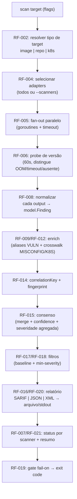
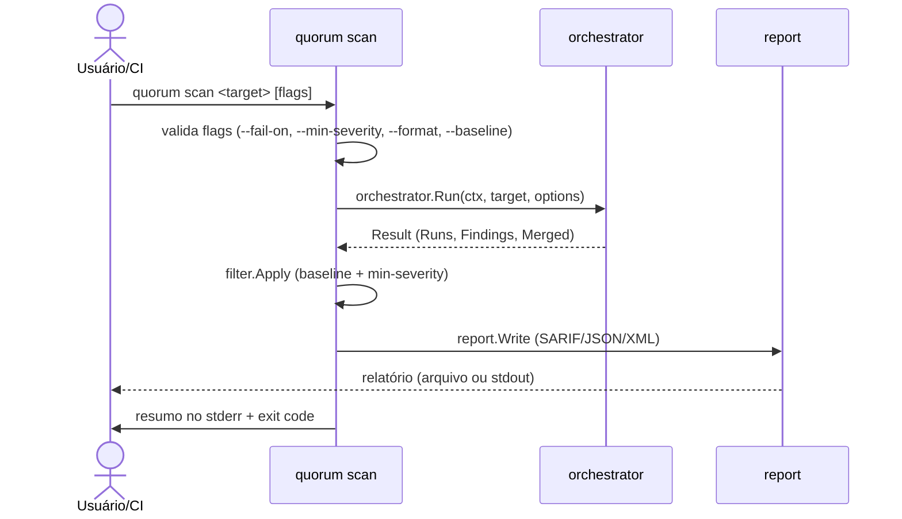
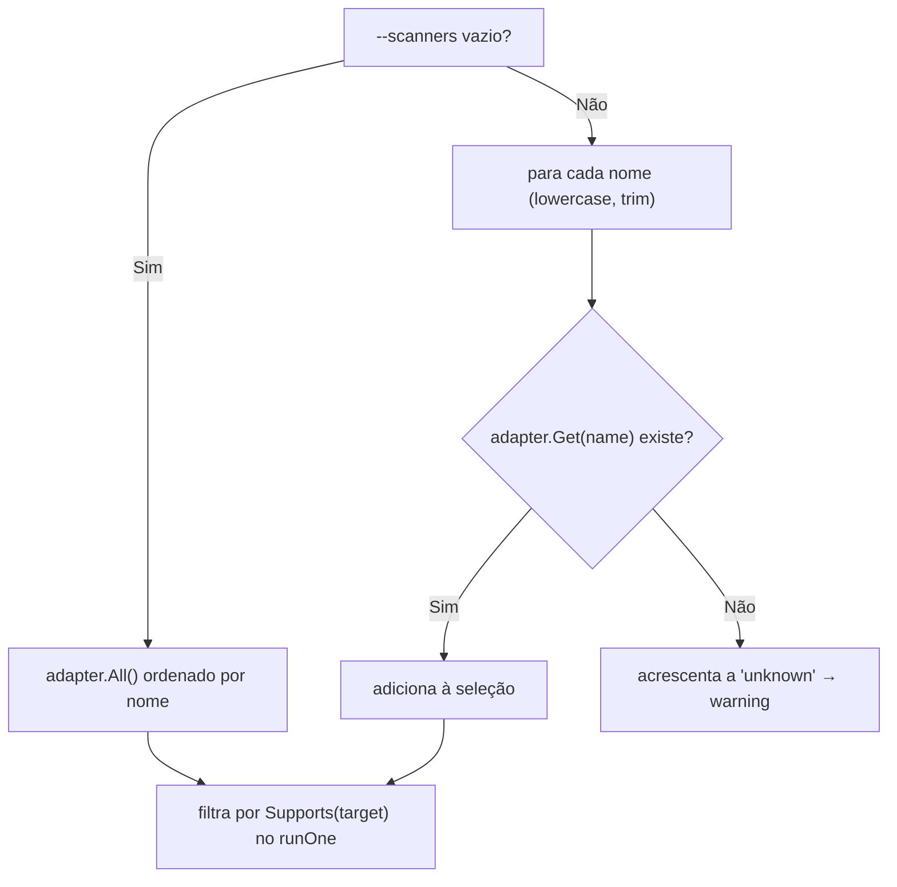
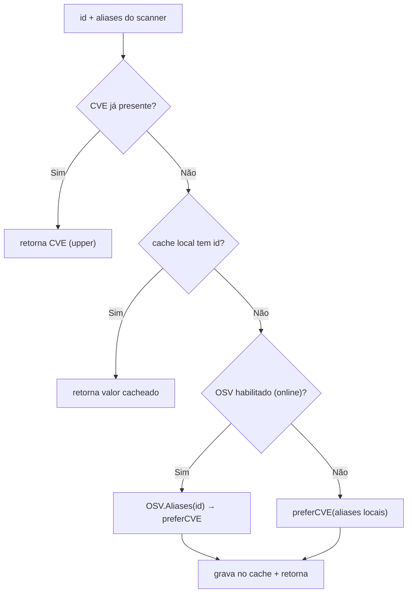

# Requisitos Funcionais

Este documento especifica os **Requisitos Funcionais (RF)** do Quorum (`quorum-sec-scan`), versão **v0.2.3**. O Quorum é uma ferramenta **CLI/Docker** de _consensus security scanning_: orquestra um pool de scanners open-source (trivy, grype, checkov, kics, dockle, kubescape), normaliza todos os achados para um modelo canônico (`model.Finding`), resolve aliases de vulnerabilidade, correlaciona achados equivalentes por uma chave determinística (`correlationKey`), pontua a confiança do consenso (`confidence`) e emite um relatório unificado (SARIF/JSON/XML), com _gating_ por exit code para CI/CD.

Cada RF abaixo é derivado **diretamente do código-fonte** (`cmd/quorum/*.go` e `internal/*`) e descrito com ID, Nome, Descrição, Fluxo, Entradas, Saídas, Regras de negócio, Prioridade e Dependências. Os RFs cobrem a superfície real do produto **as-is**; capacidades que não existem (frontend web, banco relacional, API REST, IA/LLM, autenticação) estão marcadas como **N/A** na seção [Itens fora de escopo (N/A)](#itens-fora-de-escopo-na).

> Princípio de projeto que permeia todos os RFs: **"false split > false merge"** e **"0 findings is not proof of safety"**. O sistema prefere isolar um achado a fundi-lo incorretamente, e nunca trata "0 vulnerabilidades" como prova de segurança — o status por scanner é sempre reportado.

---

## Índice de Requisitos

| ID | Nome | Prioridade | Componente principal |
|----|------|-----------|----------------------|
| [RF-001](#rf-001--comando-scan-de-um-target) | Comando `scan` de um target | Obrigatório | `cmd/quorum/scan.go` |
| [RF-002](#rf-002--inferência-e-seleção-do-tipo-de-target) | Inferência e seleção do tipo de target | Obrigatório | `cmd/quorum/scan.go` |
| [RF-003](#rf-003--listar-scanners-registrados-list-scanners) | Listar scanners registrados (`list-scanners`) | Obrigatório | `cmd/quorum/root.go` |
| [RF-004](#rf-004--seleção-de-scanners) | Seleção de scanners | Obrigatório | `orchestrator`, `adapter` |
| [RF-005](#rf-005--execução-paralela-fan-out-com-timeout-por-scanner) | Execução paralela (fan-out) com timeout por scanner | Obrigatório | `orchestrator` |
| [RF-006](#rf-006--probe-de-versão-e-disponibilidade-do-scanner) | Probe de versão e disponibilidade do scanner | Obrigatório | `orchestrator`, `adapter` |
| [RF-007](#rf-007--status-por-scanner-transparência-de-execução) | Status por scanner (transparência de execução) | Obrigatório | `orchestrator`, `report` |
| [RF-008](#rf-008--normalização-canônica-de-achados) | Normalização canônica de achados | Obrigatório | `adapter`, `model`, `severity` |
| [RF-009](#rf-009--resolução-de-aliases-de-vulnerabilidade) | Resolução de aliases de vulnerabilidade | Obrigatório | `alias`, `cache` |
| [RF-010](#rf-010--modo-offline-osv-desligado) | Modo offline (OSV desligado) | Obrigatório | `cmd/quorum/scan.go`, `alias` |
| [RF-011](#rf-011--cache-de-aliases) | Cache de aliases | Recomendado | `cache` |
| [RF-012](#rf-012--crosswalk-rule--controle-canônico) | Crosswalk rule → controle canônico | Obrigatório | `crosswalk`, `correlate` |
| [RF-013](#rf-013--fallback-automático-do-crosswalk-bundled) | Fallback automático do crosswalk bundled | Recomendado | `cmd/quorum/scan.go` |
| [RF-014](#rf-014--correlação-por-correlationkey-e-fingerprint) | Correlação por `correlationKey` e fingerprint | Obrigatório | `correlate` |
| [RF-015](#rf-015--scoring-de-consenso-e-agregação) | Scoring de consenso e agregação | Obrigatório | `consensus` |
| [RF-016](#rf-016--emissão-de-relatório-sarifjsonxml) | Emissão de relatório SARIF/JSON/XML | Obrigatório | `report` |
| [RF-017](#rf-017--baseline-de-supressão-quorumignore) | Baseline de supressão (`.quorumignore`) | Obrigatório | `filter` |
| [RF-018](#rf-018--filtro-de-severidade-mínima-min-severity) | Filtro de severidade mínima (`--min-severity`) | Obrigatório | `filter`, `severity` |
| [RF-019](#rf-019--gate-de-falha-fail-on-e-exit-codes) | Gate de falha (`--fail-on`) e exit codes | Obrigatório | `cmd/quorum/scan.go`, `severity` |
| [RF-020](#rf-020--saída-em-arquivo-ou-stdout) | Saída em arquivo ou stdout | Obrigatório | `cmd/quorum/scan.go` |
| [RF-021](#rf-021--resumo-de-console-e-logs-de-progresso) | Resumo de console e logs de progresso | Recomendado | `cmd/quorum/scan.go` |
| [RF-022](#rf-022--versão-da-ferramenta) | Versão da ferramenta | Recomendado | `cmd/quorum/root.go` |

---

## Visão geral do pipeline

O pipeline executado pelo comando `scan` é linear e determinístico após a fase de fan-out:



Referência de pacotes: `cmd/quorum` (CLI cobra) → `internal/orchestrator` → `internal/adapter` (scanners) → `internal/{alias,cache,crosswalk}` (enrich) → `internal/correlate` → `internal/consensus` → `internal/filter` → `internal/report`.

---

## RF-001 — Comando `scan` de um target

| Campo | Conteúdo |
|-------|----------|
| **ID** | RF-001 |
| **Nome** | Comando `scan` de um target |
| **Descrição** | O usuário deve poder escanear um único target (imagem de container, repositório/diretório IaC ou manifests k8s) executando o pool de scanners e produzindo um relatório de consenso. É o comando central da ferramenta. |
| **Prioridade** | Obrigatório |

**Fluxo**



**Entradas**

| Entrada | Origem | Obrigatório |
|---------|--------|-------------|
| `<target>` (1 argumento posicional) | `cobra.ExactArgs(1)` | Sim |
| Flags `--type, --scanners, --format/-f, --output/-o, --fail-on, --min-severity, --baseline, --crosswalk, --cache, --timeout, --offline, --quiet/-q` | CLI | Não (têm default) |

**Saídas**: relatório no formato escolhido (stdout ou arquivo), resumo de execução no stderr, exit code (0/1/2).

**Regras de negócio**
- `cobra.ExactArgs(1)`: exatamente um target é exigido; 0 ou 2+ argumentos → erro de uso (exit 2).
- Flags inválidas (ex.: `--fail-on` fora de `critical|high|medium|low`, `--format` desconhecido) abortam antes de qualquer scanner rodar.
- O comando nunca falha por causa de cache/aliases/crosswalk corrompidos — esses degradam graciosamente (ver RF-009, RF-011, RF-012).

**Dependências**: RF-002, RF-004, RF-005, RF-008, RF-014, RF-015, RF-016, RF-017, RF-018, RF-019.

---

## RF-002 — Inferência e seleção do tipo de target

| Campo | Conteúdo |
|-------|----------|
| **ID** | RF-002 |
| **Nome** | Inferência e seleção do tipo de target |
| **Descrição** | O tipo de target (`image`, `repo`, `k8s`) pode ser informado via `--type` ou inferido automaticamente. O tipo seleciona quais adapters são aplicáveis e como cada scanner é invocado. |
| **Prioridade** | Obrigatório |

**Fluxo / Regras de mapeamento** (`resolveTargetType` em `scan.go`)

| Valor de `--type` | Resultado |
|-------------------|-----------|
| `image` | `TargetImage` |
| `repo` / `fs` / `dir` | `TargetRepo` |
| `k8s` / `kubernetes` / `manifests` | `TargetK8s` |
| _(vazio)_ + caminho existente em disco | `TargetRepo` (inferido) |
| _(vazio)_ + caminho inexistente | `TargetImage` (inferido — assume ref de imagem) |
| qualquer outro valor | **erro** `invalid --type` (exit 2) |

**Entradas**: `--type` (string, case-insensitive), `<target>` (usado em `os.Stat` para inferência).

**Saídas**: `adapter.TargetType` resolvido, propagado para `adapter.Target{Type, Ref}`.

**Regras de negócio**
- A inferência usa `os.Stat(ref)`: existir no disco → `repo`; caso contrário → `image`.
- O tipo é case-insensitive (`strings.ToLower`).
- O tipo determina o `Supports(target)` de cada adapter (RF-004) e os argumentos de CLI de cada scanner (RF-008).

**Dependências**: RF-001. Consumido por RF-004 e RF-008.

---

## RF-003 — Listar scanners registrados (`list-scanners`)

| Campo | Conteúdo |
|-------|----------|
| **ID** | RF-003 |
| **Nome** | Listar scanners registrados (`list-scanners`) |
| **Descrição** | O usuário deve poder listar todos os adapters de scanner registrados e os tipos de finding que cada um cobre (capabilities). |
| **Prioridade** | Obrigatório |

**Fluxo** (`newListScannersCmd` em `root.go`): obtém `adapter.Names()`, ordena, e para cada nome imprime `nome` + lista de `Capability.Type`.

**Entradas**: nenhuma (sem argumentos nem flags próprias).

**Saídas** (stdout, uma linha por scanner, formato `%-12s %v`), exemplo conceitual:

| Scanner | Tipos cobertos (Capabilities) |
|---------|-------------------------------|
| `checkov` | `[MISCONFIG]` |
| `dockle` | `[IMG_HARDENING]` |
| `grype` | `[VULN]` |
| `kics` | `[MISCONFIG]` |
| `kubescape` | `[K8S_POSTURE]` |
| `trivy` | `[VULN MISCONFIG SECRET]` |

**Regras de negócio**
- A lista vem do `registry` populado em tempo de compilação pelos `init()` de cada adapter (`adapter.Register`).
- Saída ordenada alfabeticamente por nome (`sort.Strings`).
- Não verifica se o binário do scanner está instalado — lista capacidades declaradas, não disponibilidade em runtime (isso é função do RF-006 durante o scan).

**Dependências**: registro de adapters (`adapter.Register`, `adapter.Names`, `adapter.Get`, `Capabilities`).

---

## RF-004 — Seleção de scanners

| Campo | Conteúdo |
|-------|----------|
| **ID** | RF-004 |
| **Nome** | Seleção de scanners |
| **Descrição** | Por padrão todos os adapters que suportam o target são executados; o usuário pode restringir a um subconjunto via `--scanners` (lista separada por vírgula). Nomes desconhecidos são avisados, não falham o scan. |
| **Prioridade** | Obrigatório |

**Fluxo** (`splitScanners` em `scan.go` + `selectAdapters` em `orchestrator.go`)



**Entradas**: `--scanners` (string CSV, ex.: `trivy,grype`), `target`.

**Saídas**: conjunto de adapters a executar; lista de nomes desconhecidos (para warning).

**Regras de negócio**
- `--scanners` vazio ⇒ **todos** os adapters registrados (`adapter.All()`), ordenados por nome.
- Nomes são normalizados para lowercase e _trimmed_; entradas vazias são descartadas.
- Nome inexistente ⇒ é colocado em `unknown` e emite warning `unknown scanner %q ignored (known: ...)` — **não** aborta o scan.
- Mesmo selecionado, um scanner que não suporta o tipo de target é marcado como `skipped` (ver RF-006).

**Dependências**: RF-002 (tipo de target), registro de adapters. Consumido por RF-005.

---

## RF-005 — Execução paralela (fan-out) com timeout por scanner

| Campo | Conteúdo |
|-------|----------|
| **ID** | RF-005 |
| **Nome** | Execução paralela (fan-out) com timeout por scanner |
| **Descrição** | Os scanners selecionados são executados concorrentemente (uma goroutine por scanner), cada um com um timeout individual configurável. Os resultados são coletados e agregados ao final. |
| **Prioridade** | Obrigatório |

**Fluxo** (`orchestrator.Run` + `runOne`): para cada adapter selecionado é disparada uma goroutine; um `sync.WaitGroup` aguarda todas; um `sync.Mutex` protege a coleta de `Runs` e `findings`. Após `wg.Wait()`, os runs são ordenados por nome.

**Entradas**: adapters selecionados (RF-004), `--timeout` (mapeado para `Options.PerScannerTime`, default `5m`), `context.Background()`.

**Saídas**: `[]ScannerRun` (status/duração/erro por scanner) + `[]model.Finding` agregados.

**Regras de negócio**
- Cada scanner roda com `context.WithTimeout(ctx, PerScannerTime)` quando `PerScannerTime > 0`. Estouro do prazo ⇒ status `timeout` (RF-007).
- `PerScannerTime == 0` ⇒ sem timeout adicional (só o do contexto raiz).
- A coleta concorrente é protegida por mutex; a ordem final de `Runs` é determinística (ordenada por nome) independentemente da ordem de término.
- `runCmd` trata exit code não-zero **com** saída em stdout como sucesso (vários scanners retornam não-zero ao encontrar achados); exit não-zero **sem** stdout vira erro com stderr anexado.

**Dependências**: RF-004, RF-006. Alimenta RF-008.

---

## RF-006 — Probe de versão e disponibilidade do scanner

| Campo | Conteúdo |
|-------|----------|
| **ID** | RF-006 |
| **Nome** | Probe de versão e disponibilidade do scanner |
| **Descrição** | Antes de rodar cada scanner, o orquestrador executa um probe de versão com timeout dedicado (60s) para detectar binário ausente, lentidão/_resource starvation_ e _kill_ por OOM, classificando o resultado em status distintos. |
| **Prioridade** | Obrigatório |

**Fluxo** (`runOne`): `Supports(target)` → se não suporta, `skipped`; senão `Version(verCtx)` com `context.WithTimeout(ctx, ProbeTime)`. O resultado do erro é classificado.

**Entradas**: adapter, target, `Options.ProbeTime` (default `defaultProbeTime = 60s`).

**Saídas**: versão do scanner (em sucesso) ou `ScannerRun.Status = "unavailable"` com mensagem de diagnóstico específica.

**Regras de negócio — classificação do probe**

| Condição | Status | Diagnóstico |
|----------|--------|-------------|
| `!Supports(target)` | `skipped` | "does not support target" |
| `verCtx.Err() == DeadlineExceeded` | `unavailable` | "version probe exceeded 60s — tool too slow / resource-starved" |
| erro contém `signal: killed` | `unavailable` | "version probe killed — likely OOM; raise memory limit" |
| outro erro (binário ausente) | `unavailable` | erro bruto ("not installed/available") |

- O probe é **generoso (60s)** por design: tools pesadas (ex.: checkov/Python) têm cold start lento, especialmente quando todos os scanners sobem em paralelo em runner com pouca memória. Um budget apertado marcaria um tool funcional como `unavailable`.
- `ProbeTime <= 0` ⇒ usa `defaultProbeTime` (60s).
- Um scanner `unavailable`/`skipped` **não** contribui com findings, mas **aparece** no relatório (RF-007).

**Dependências**: RF-002, RF-004. Consumido por RF-005, RF-007.

---

## RF-007 — Status por scanner (transparência de execução)

| Campo | Conteúdo |
|-------|----------|
| **ID** | RF-007 |
| **Nome** | Status por scanner (transparência de execução) |
| **Descrição** | Cada execução de scanner é registrada com nome, versão, status, contagem de findings, duração e erro. Esse status é exibido no resumo e embutido no relatório, para que "0 findings" nunca seja confundido com "scan não rodou". |
| **Prioridade** | Obrigatório |

**Estados possíveis** (`ScannerRun.Status`):

| Status | Significado |
|--------|-------------|
| `ran` | executou com sucesso; `Findings` reflete a contagem |
| `skipped` | não suporta o tipo de target |
| `unavailable` | binário ausente, lento (timeout de probe) ou _killed_ (OOM) |
| `error` | falhou na execução (não foi timeout) |
| `timeout` | execução excedeu `--timeout` |

**Entradas**: resultados de cada `runOne`.

**Saídas**: `Result.Runs []ScannerRun`; resumo no stderr (RF-021); bloco `scanners` no SARIF (`properties.scanners` com `name/status/version`) e equivalente em JSON/XML.

**Regras de negócio**
- Princípio **"0 findings is not proof of safety"**: o resumo sempre imprime a nota e os status por scanner; SARIF inclui `scannerSummary` em `properties`.
- Mensagens de erro são truncadas a 60 chars no resumo de console (a versão completa fica no relatório JSON/SARIF).

**Dependências**: RF-005, RF-006. Consumido por RF-016, RF-021.

---

## RF-008 — Normalização canônica de achados

| Campo | Conteúdo |
|-------|----------|
| **ID** | RF-008 |
| **Nome** | Normalização canônica de achados |
| **Descrição** | Cada adapter invoca seu scanner nativo e traduz a saída para `model.Finding`, com tipo, severidade normalizada, identidade (CVE/PURL/RuleID/Resource/Location) e metadados. Nenhuma etapa posterior opera sobre JSON bruto de scanner. |
| **Prioridade** | Obrigatório |

**Tipos canônicos** (`model.FindingType`): `VULN`, `MISCONFIG`, `SECRET`, `K8S_POSTURE`, `IMG_HARDENING`.

**Normalização de severidade** (`internal/severity`): converge para `CRITICAL > HIGH > MEDIUM > LOW > INFO > UNKNOWN`.

| Função | Mapeamento |
|--------|-----------|
| `FromCVSS` | ≥9.0 CRIT · ≥7.0 HIGH · ≥4.0 MED · >0 LOW · 0 UNKNOWN |
| `FromLabel` | enums de Trivy/Grype/Checkov/KICS/Kubescape (ex.: ERROR/DANGER→HIGH, WARNING→MED, NEGLIGIBLE→INFO) |
| `FromDockle` | FATAL→HIGH · WARN→MED · INFO→LOW · PASS/SKIP/IGNORE→INFO |

**Matriz de cobertura por adapter** (de `Supports`/`Capabilities`/`Run`):

| Scanner | Targets suportados (`Supports`) | Tipos produzidos (`Capabilities`) |
|---------|---------------------------------|-----------------------------------|
| trivy | image, repo, k8s | VULN, MISCONFIG, SECRET |
| grype | image, repo | VULN |
| checkov | repo, k8s | MISCONFIG |
| kics | repo, k8s | MISCONFIG |
| dockle | image | IMG_HARDENING |
| kubescape | k8s, repo | K8S_POSTURE |

**Entradas**: `adapter.Target`, contexto com timeout.

**Saídas**: `[]model.Finding` com campos populados por tipo (VULN: `VulnID/PURL/CVSS`; MISCONFIG: `RuleID/CanonicalControl/Resource/Location`; etc.).

**Regras de negócio**
- Adapters **nunca** calculam `CorrelationKey`/`Fingerprint` — isso é centralizado no correlator (RF-014).
- Trivy emite ids AVD diretamente; `normalizeAVD` reconstrói o prefixo `AVD-` quando versões novas o omitem (ex.: `AWS-0086` → `AVD-AWS-0086`).
- `Confirmed` é setado quando o achado tem fonte autoritativa (ex.: Trivy com `DataSource`), influenciando o consenso (RF-015).
- Cada adapter possui contract test contra fixtures em `internal/adapter/testdata`.

**Dependências**: RF-002, RF-005. Alimenta RF-009, RF-012, RF-014.

---

## RF-009 — Resolução de aliases de vulnerabilidade

| Campo | Conteúdo |
|-------|----------|
| **ID** | RF-009 |
| **Nome** | Resolução de aliases de vulnerabilidade |
| **Descrição** | Para findings do tipo `VULN`, o identificador é resolvido para uma forma canônica (CVE preferido) usando uma cadeia em camadas: aliases locais do scanner → cache local → OSV.dev. Garante que GHSA-xxxx (Grype) e CVE-yyyy (Trivy) para o mesmo bug correlacionem em vez de dividir. |
| **Prioridade** | Obrigatório |

**Fluxo da cadeia** (`chainResolver.Canonical`)



**Entradas**: `VulnID`, `Aliases`, contexto; cliente OSV (quando online), `*cache.Store`.

**Saídas**: `VulnID` canônico (CVE > GHSA > primeiro não-vazio).

**Regras de negócio**
- Preferência: **CVE > GHSA > primeiro id não-vazio** (`preferCVE`).
- A cadeia **nunca retorna erro** — em qualquer falha (rede/HTTP), degrada para o melhor id disponível (DESIGN §7).
- OSV (`api.osv.dev/v1/vulns/{id}`) usa cliente com timeout 8s, `MaxRetries=2` (backoff exponencial 200ms base); só 429/5xx/erro de rede são _retryable_.
- Resultados resolvidos são gravados no cache (RF-011) para idempotência entre re-scans de CI.
- Só `VULN` passa por alias; outros tipos usam crosswalk (RF-012).

**Dependências**: RF-008, RF-010 (offline), RF-011 (cache). Alimenta RF-014.

---

## RF-010 — Modo offline (OSV desligado)

| Campo | Conteúdo |
|-------|----------|
| **ID** | RF-010 |
| **Nome** | Modo offline (OSV desligado) |
| **Descrição** | A flag `--offline` desabilita toda consulta de rede à OSV.dev; a resolução de aliases passa a usar apenas aliases locais do scanner e o cache. |
| **Prioridade** | Obrigatório |

**Fluxo**: em `runScan`, `if !f.offline { osv = alias.NewOSVClient() }`; passando `nil` ao `alias.New`, a Layer 3 (OSV) é pulada.

**Entradas**: `--offline` (bool, default `false`).

**Saídas**: resolver que opera só com Layers 1 e 2.

**Regras de negócio**
- `--offline` ⇒ nenhuma chamada HTTP é feita; aliases dependem só do que o scanner reportou + cache existente.
- O estado offline é logado: `... offline=%v`.
- Recomendado em ambientes _air-gapped_ e para builds reprodutíveis.

**Dependências**: RF-009.

---

## RF-011 — Cache de aliases

| Campo | Conteúdo |
|-------|----------|
| **ID** | RF-011 |
| **Nome** | Cache de aliases |
| **Descrição** | Um armazenamento chave/valor persistente em arquivo JSON acelera e dá idempotência à resolução de aliases entre re-scans, sem dependência de banco de dados. |
| **Prioridade** | Recomendado |

**Entradas**: `--cache` (path; default `os.UserCacheDir()/quorum/aliases.json`, fallback `.quorum-cache.json`).

**Saídas**: arquivo JSON `{id: canonical}` atualizado a cada `Put`.

**Regras de negócio**
- Arquivo ausente/ilegível ⇒ cache vazio, **nunca** erro (otimização, não fonte de falha).
- Escrita atômica via `*.tmp` + `os.Rename`; falhas de flush são silenciosamente ignoradas.
- Seguro para uso concorrente intra-processo (`sync.RWMutex`).
- Não há TTL/expiração: entradas persistem (premissa — ver [Premissas](#premissas)).

**Dependências**: RF-009.

---

## RF-012 — Crosswalk rule → controle canônico

| Campo | Conteúdo |
|-------|----------|
| **ID** | RF-012 |
| **Nome** | Crosswalk rule → controle canônico |
| **Descrição** | Para findings `MISCONFIG`/`K8S_POSTURE`/`IMG_HARDENING`, o rule id nativo de cada scanner é mapeado para um controle canônico compartilhado (AVD, com fallback de categoria semântica), via arquivos YAML, para que misconfigs equivalentes de engines diferentes correlacionem. |
| **Prioridade** | Obrigatório |

**Fluxo** (`crosswalk.Load` + `Correlator.resolveControl`): carrega todos os `*.yaml/*.yml` de um diretório, indexa `"scanner|ruleID"` → `Resolution{Control, Category, CWE, Title}`. No enrich, se o finding já tem `CanonicalControl` (ex.: Trivy AVD), mantém; senão resolve pelo `RuleID`.

**Entradas**: `--crosswalk` (diretório; default `./crosswalk`), `Scanner`, `RuleID`.

**Saídas**: `CanonicalControl` (+ `Category`/`Title`) preenchidos, ou `Unmapped=true`.

**Regras de negócio**
- Diretório ausente **não** é erro (`os.IsNotExist`) — a ferramenta roda sem crosswalk custom, e os findings ficam `Unmapped`.
- **"Never guess a match"** (DESIGN §6): sem mapeamento, o finding é isolado e marcado `Unmapped=true`; nunca é fundido por adivinhação.
- Mapeamento é case-insensitive no nome do scanner; a chave é `lower(scanner)|trim(ruleID)`.
- Finding já canônico (`CanonicalControl != ""`) não é re-resolvido.

**Dependências**: RF-008, RF-013 (fallback de diretório). Alimenta RF-014.

---

## RF-013 — Fallback automático do crosswalk bundled

| Campo | Conteúdo |
|-------|----------|
| **ID** | RF-013 |
| **Nome** | Fallback automático do crosswalk bundled |
| **Descrição** | Quando `--crosswalk` não é informado explicitamente e o `./crosswalk` padrão não existe, o sistema usa o crosswalk embarcado na imagem Docker em `/opt/quorum/crosswalk`, evitando carregar 0 regras silenciosamente em `docker run`. |
| **Prioridade** | Recomendado |

**Fluxo** (`resolveCrosswalkDir`)

| Condição | Diretório usado |
|----------|-----------------|
| `--crosswalk` passado explicitamente (`Changed`) | valor literal informado |
| default `./crosswalk` existe | `./crosswalk` |
| default ausente **e** `/opt/quorum/crosswalk` existe | `/opt/quorum/crosswalk` (bundled) |
| nenhum existe | retorna o default (carrega 0 regras) |

**Entradas**: `--crosswalk`, flag `Changed` do cobra, existência dos diretórios (`os.Stat`).

**Saídas**: diretório de crosswalk efetivo (logado: `crosswalk=%d rules (%s)`).

**Regras de negócio**
- O fallback **só** ocorre quando o usuário **não** mudou `--crosswalk` (respeita escolha explícita verbatim).
- Resolve o problema de `docker run … scan .` a partir de um workdir arbitrário onde `./crosswalk` não existe.

**Dependências**: RF-012.

---

## RF-014 — Correlação por `correlationKey` e fingerprint

| Campo | Conteúdo |
|-------|----------|
| **ID** | RF-014 |
| **Nome** | Correlação por `correlationKey` e fingerprint |
| **Descrição** | Cada finding recebe uma `correlationKey` determinística específica por tipo e um `Fingerprint = sha256(correlationKey)`. A chave é a identidade usada para agrupar findings equivalentes no consenso e para supressão/portabilidade no SARIF. |
| **Prioridade** | Obrigatório |

**Estratégias de chave por tipo** (`BuildKey`):

| Tipo | Estrutura da `correlationKey` |
|------|-------------------------------|
| `VULN` | `VULN\|UPPER(VulnID)\|nameVersion(PURL)` |
| `MISCONFIG` | `MISCONFIG\|fileBasename\|resourceType\|controlKey` |
| `K8S_POSTURE` | `K8S\|ns/kind/name\|container\|controlKey` |
| `IMG_HARDENING` | `IMGH\|controlKey` |
| `SECRET` | `SECRET\|normPath\|startLine\|lower(RuleID)` |
| _outros_ | `OTHER\|scanner\|title` |

**Entradas**: `model.Finding` enriquecido (após alias/crosswalk).

**Saídas**: `f.CorrelationKey`, `f.Fingerprint`.

**Regras de negócio**
- `controlKey` prefere `CanonicalControl`; quando `Unmapped`, usa `UNMAPPED:scanner:RuleID` para **nunca fundir** um achado não-mapeado com outro diferente (**false split > false merge**).
- `MISCONFIG` chaveia por **basename** do arquivo + tipo de recurso + controle (engines reportam paths/relatividade diferentes). Trade-off documentado: dois recursos distintos do mesmo tipo, mesmo controle e mesmo arquivo podem _over-merge_ — aceitável vs. nunca correlacionar.
- A chave é uma função **pura e determinística** dos dados normalizados.
- O `Fingerprint` é exposto no SARIF como `partialFingerprints["quorum/v1"]` (RF-016) e aceito pelo baseline (RF-017).
- Sem correlator, o orquestrador ainda aplica `BuildKey`/`Fingerprint` para permitir o agrupamento.

**Dependências**: RF-009, RF-012. Alimenta RF-015, RF-016, RF-017.

---

## RF-015 — Scoring de consenso e agregação

| Campo | Conteúdo |
|-------|----------|
| **ID** | RF-015 |
| **Nome** | Scoring de consenso e agregação |
| **Descrição** | Findings com a mesma `correlationKey` são agrupados em `MergedFinding`, com severidade agregada (máximo), lista de scanners que detectaram, `detectionCount` e um `confidence` (0..1) que pondera contagem, diversidade de engines, severidade e confirmação autoritativa. |
| **Prioridade** | Obrigatório |

**Fórmula de confiança** (`consensus.confidence`, DESIGN §9):

```
confidence = clamp01( 0.35·count + 0.25·diversity + 0.25·severity + 0.15·authoritative )
```

| Fator | Cálculo |
|-------|---------|
| `count` (0.35) | `ln(1+nScanners)/ln(5)` — retornos decrescentes |
| `diversity` (0.25) | famílias distintas de engine: 1→0.33, 2→0.66, 3+→1.0 |
| `severity` (0.25) | CRIT 1.0 · HIGH 0.8 · MED 0.5 · LOW 0.3 · INFO 0.1 |
| `authoritative` (0.15) | 1.0 se algum membro `Confirmed` ou CVE com CVSS>0; senão 0 |

**Famílias de engine** (`scannerCategory`): trivy/grype=`sca`, checkov/kics=`iac`, kubescape/polaris=`k8s`, dockle=`hardening`.

**Entradas**: `[]model.Finding` com `CorrelationKey`.

**Saídas**: `[]model.MergedFinding` (`Title`, `Severity` máx, `DetectedBy`, `DetectionCount`, `Confidence`, `Unmapped`, `Members`, `Fingerprint`), ordenado por (severidade ↓, confidence ↓, detectionCount ↓, key ↑).

**Regras de negócio**
- `DetectionCount` = número de scanners **distintos** (não de findings brutos).
- Diversidade de engines pesa mais que repetição da mesma família: 2 engines diferentes valem mais que 2 do mesmo grupo.
- `Unmapped` propaga se **qualquer** membro for unmapped.
- Severidade agregada é o **máximo** entre os membros (`severity.Max`).
- Ordenação estável e determinística para relatórios reproduzíveis.

**Dependências**: RF-014. Alimenta RF-016, RF-017, RF-018, RF-019.

---

## RF-016 — Emissão de relatório SARIF/JSON/XML

| Campo | Conteúdo |
|-------|----------|
| **ID** | RF-016 |
| **Nome** | Emissão de relatório SARIF/JSON/XML |
| **Descrição** | O resultado consolidado é serializado em um de três formatos: SARIF 2.1.0 (primário), JSON ou XML. O SARIF carrega fingerprints portáveis, propriedades de consenso e o resumo de scanners. |
| **Prioridade** | Obrigatório |

**Fluxo** (`report.ParseFormat` + `report.Write`): valida `--format` e despacha para `writeSARIF`/`writeJSON`/`writeXML`.

**Entradas**: `--format/-f` (`sarif|json|xml`, default `sarif`), `*orchestrator.Result`.

**Saídas — SARIF (primário)**:

| Elemento SARIF | Origem |
|----------------|--------|
| `runs[].tool.driver` | nome `quorum`, `version` (build-time), `rules` por finding |
| `results[].ruleId` | CVE (VULN) / CanonicalControl / RuleID / correlationKey |
| `results[].level` | CRIT/HIGH→`error`, MED→`warning`, demais→`note` |
| `results[].partialFingerprints["quorum/v1"]` | `Fingerprint` (sha256) |
| `results[].properties` | `detectedBy`, `detectionCount`, `confidence`, `severity`, `correlationKey`, `unmapped` |
| `runs[].properties.scanners` | resumo `name/status/version` (RF-007) |

**Regras de negócio**
- `--format` inválido ⇒ erro `unknown format` (exit 2), antes de rodar scanners.
- SARIF usa schema 2.1.0; `SetEscapeHTML(false)` para preservar caracteres em URIs.
- Regras SARIF são deduplicadas por `ruleId` e ordenadas.
- JSON inclui detalhe bruto canônico (`Result.Findings`); XML é a forma alternativa estruturada.

**Dependências**: RF-015, RF-007. Consumido por RF-020.

---

## RF-017 — Baseline de supressão (`.quorumignore`)

| Campo | Conteúdo |
|-------|----------|
| **ID** | RF-017 |
| **Nome** | Baseline de supressão (`.quorumignore`) |
| **Descrição** | Um arquivo de baseline lista findings conhecidos/aceitos a suprimir, por `Fingerprint` **ou** `correlationKey` (um por linha). Findings suprimidos são removidos do relatório e do _gating_, mas a supressão é sempre logada. |
| **Prioridade** | Obrigatório |

**Fluxo** (`filter.LoadBaseline` + `Baseline.Has` + `filter.Apply`): carrega ids (lowercase), ignora linhas em branco e comentários `#` (inclusive trailing `# nota`); um `MergedFinding` casa se seu fingerprint OU correlationKey está no conjunto.

**Entradas**: `--baseline` (path; default `.quorumignore`), `MergedFinding`.

**Saídas**: lista filtrada (`Result.Kept`) + contador `SuppressedBaseline`.

**Regras de negócio**
- Arquivo ausente: se `--baseline` **não** foi mudado, baseline vazio (silencioso); se foi mudado explicitamente e não existe ⇒ **erro** `baseline file not found` (exit 2).
- Casa por `Fingerprint` **ou** `correlationKey` — o usuário pode copiar qualquer um do relatório.
- Comparação case-insensitive.
- Supressões são logadas (`filtered: %d suppressed by baseline ...`) — **"a suppressed finding is still a finding"** (DESIGN §14).

**Dependências**: RF-014, RF-015.

---

## RF-018 — Filtro de severidade mínima (`--min-severity`)

| Campo | Conteúdo |
|-------|----------|
| **ID** | RF-018 |
| **Nome** | Filtro de severidade mínima (`--min-severity`) |
| **Descrição** | Findings abaixo da severidade mínima informada são removidos do relatório **e** do _gating_, reduzindo ruído em CI. |
| **Prioridade** | Obrigatório |

**Fluxo** (`severity.Parse` + `filter.Apply`): findings com `severity.AtLeast(m.Severity, minSeverity) == false` são descartados (quando `minSeverity != UNKNOWN`).

**Entradas**: `--min-severity` (`critical|high|medium|low`).

**Saídas**: lista filtrada + contador `SuppressedSeverity`.

**Regras de negócio**
- Valor inválido ⇒ erro `invalid --min-severity` (exit 2).
- Ausente ⇒ `SevUnknown` ⇒ filtro desabilitado (mantém tudo).
- Aplicado **após** o consenso e **antes** do _gating_ (RF-019), então afeta o exit code.
- Contagem de descartes é logada junto com a supressão por baseline.

**Dependências**: RF-015, `internal/severity`.

---

## RF-019 — Gate de falha (`--fail-on`) e exit codes

| Campo | Conteúdo |
|-------|----------|
| **ID** | RF-019 |
| **Nome** | Gate de falha (`--fail-on`) e exit codes |
| **Descrição** | Quando `--fail-on` é informado, o processo termina com exit code 1 se algum finding (após filtros) atingir ou exceder a severidade limite. Os exit codes são o contrato de integração com CI/CD. |
| **Prioridade** | Obrigatório |

**Contrato de exit codes**

| Exit | Significado |
|------|-------------|
| `0` | OK — sucesso, ou nenhum finding atingiu `--fail-on` |
| `1` | Gate disparou — algum finding ≥ `--fail-on` |
| `2` | Erro de uso/runtime (flag inválida, baseline ausente explícito, erro de orquestração) |

**Fluxo**: após emitir relatório e resumo, calcula `worstSeverity(res)`; se `severity.AtLeast(worst, failThreshold)` ⇒ `os.Exit(1)`.

**Entradas**: `--fail-on` (`critical|high|medium|low`).

**Saídas**: exit code; log `gate: found %s finding >= --fail-on %s → exit 1`.

**Regras de negócio**
- Valor inválido ⇒ erro `invalid --fail-on` (exit 2).
- O gate considera apenas findings que **sobreviveram** a baseline (RF-017) e min-severity (RF-018).
- Sem `--fail-on`, o scan nunca retorna 1 por causa de findings (exit 0), só 2 em erro.
- Exit 2 é produzido pelo `main.go` quando `Execute()` retorna erro.

**Dependências**: RF-015, RF-017, RF-018.

---

## RF-020 — Saída em arquivo ou stdout

| Campo | Conteúdo |
|-------|----------|
| **ID** | RF-020 |
| **Nome** | Saída em arquivo ou stdout |
| **Descrição** | O relatório é escrito em stdout por padrão ou em um arquivo via `--output/-o`; diretórios intermediários do caminho são criados automaticamente. |
| **Prioridade** | Obrigatório |

**Fluxo** (`emit`): renderiza para buffer; se `--output` vazio ⇒ `cmd.OutOrStdout()`; senão `os.MkdirAll(dir)` + `os.WriteFile` (0644).

**Entradas**: `--output/-o` (path; default stdout).

**Saídas**: relatório no destino escolhido.

**Regras de negócio**
- Diretório do arquivo é criado com `os.MkdirAll(..., 0o755)` se não existir.
- stdout permite _piping_; o resumo e os logs vão para **stderr** (RF-021), nunca poluindo a saída do relatório.

**Dependências**: RF-016.

---

## RF-021 — Resumo de console e logs de progresso

| Campo | Conteúdo |
|-------|----------|
| **ID** | RF-021 |
| **Nome** | Resumo de console e logs de progresso |
| **Descrição** | Durante e após o scan, o Quorum imprime no stderr logs de progresso (`[quorum] ...`) e um resumo final com status por scanner, contagens por severidade, findings multi-detectados, tempo decorrido e a nota de segurança. `--quiet/-q` suprime essa saída. |
| **Prioridade** | Recomendado |

**Entradas**: `--quiet/-q` (bool), `*orchestrator.Result`.

**Saídas** (stderr): linhas `[quorum] ...` de progresso e bloco `── quorum summary ──` com:
- status/versão/findings por scanner;
- total após consenso e quantos multi-detectados (`DetectionCount > 1`);
- contagens `CRIT/HIGH/MED/LOW/INFO`;
- tempo decorrido;
- nota: _"0 findings is not proof of safety — see scanner statuses above."_

**Regras de negócio**
- `--quiet` suprime **tanto** os logs de progresso quanto o resumo (mas não o relatório de RF-020 nem o exit code).
- Todos os logs vão para **stderr**, mantendo stdout limpo para o relatório.

**Dependências**: RF-007, RF-015.

---

## RF-022 — Versão da ferramenta

| Campo | Conteúdo |
|-------|----------|
| **ID** | RF-022 |
| **Nome** | Versão da ferramenta |
| **Descrição** | O Quorum reporta sua versão (flag `--version` do cobra), sobrescrita em build-time via `-ldflags "-X main.version=..."`, também estampada no driver SARIF. |
| **Prioridade** | Recomendado |

**Entradas**: `--version` (cobra), variável `version` (build-time).

**Saídas**: string de versão no stdout; `Version` propagado para `report.Version` (driver SARIF e namespace `quorum/v1`).

**Regras de negócio**
- Default em código é `0.1.0`; releases sobrescrevem via GoReleaser/ldflags (a release atual é v0.2.3).

**Dependências**: nenhuma.

---

## Rastreabilidade: RF → componente de código

| RF | Arquivos-chave |
|----|----------------|
| RF-001, RF-020 | `cmd/quorum/scan.go` (`runScan`, `emit`) |
| RF-002 | `cmd/quorum/scan.go` (`resolveTargetType`) |
| RF-003, RF-022 | `cmd/quorum/root.go`, `cmd/quorum/main.go` |
| RF-004, RF-005, RF-006, RF-007 | `internal/orchestrator/orchestrator.go` |
| RF-008 | `internal/adapter/*.go`, `internal/model/model.go`, `internal/severity/severity.go`, `internal/purl` |
| RF-009, RF-010 | `internal/alias/resolver.go`, `internal/alias/osv.go` |
| RF-011 | `internal/cache/store.go` |
| RF-012, RF-013 | `internal/crosswalk/crosswalk.go`, `internal/correlate/correlate.go`, `cmd/quorum/scan.go` |
| RF-014 | `internal/correlate/key.go`, `internal/correlate/correlate.go` |
| RF-015 | `internal/consensus/consensus.go` |
| RF-016 | `internal/report/{report,sarif,json,xml}.go` |
| RF-017, RF-018 | `internal/filter/filter.go` |
| RF-019 | `cmd/quorum/scan.go` (`worstSeverity`, gate), `cmd/quorum/main.go` |
| RF-021 | `cmd/quorum/scan.go` (`printSummary`, `logf`) |

---

## Itens fora de escopo (N/A)

O template enterprise prevê capacidades que **não existem** no Quorum por decisão arquitetural ("CLI/Docker only"). Estas são declaradas N/A com justificativa:

| Capacidade | Status | Justificativa técnica |
|------------|--------|-----------------------|
| Frontend web / painel | **N/A** | O produto é _panel-less_ e CI/CD-first (`root.go`: "No panel, no daemon"). A saída é relatório (SARIF/JSON/XML) + exit code. |
| Banco de dados relacional | **N/A** | Persistência limita-se ao cache JSON de aliases (`internal/cache`), explicitamente "without pulling in a CGO database". |
| API REST / HTTP server | **N/A** | Não há servidor; a única chamada de rede de saída é a OSV.dev para aliases (RF-009). |
| Autenticação / contas de usuário | **N/A** | Sem multiusuário; a ferramenta roda no contexto do processo CI/desenvolvedor. |
| IA / LLM | **N/A** | A correlação/consenso é determinística (chaves + fórmula), sem modelos de ML. |
| Orquestração de cloud/K8s em runtime | **N/A** | `k8s` é um **tipo de target** (manifests/cluster a escanear), não um runtime do próprio Quorum. |

> **Propostas futuras** (claramente separadas do as-is): TTL/expiração no cache de aliases; exportador de baseline (gerar `.quorumignore` a partir de um relatório); formato de saída adicional (ex.: SARIF + sumário Markdown). Nada disso está implementado em v0.2.3.

---

## Cross-links

- Modelo de dados, matriz de correlação (§6), matemática do consenso (§9) e status de scanner (§14): ver `DESIGN.md` na raiz do repositório.
- Documentos relacionados desta suíte: [01-visao-geral](01-visao-geral.md) · [03-requisitos-nao-funcionais](03-requisitos-nao-funcionais.md) · [04-arquitetura](04-arquitetura.md) _(criar conforme o índice da documentação)_.

---

## Premissas

1. **Versão de referência**: o documento descreve o comportamento **as-is** da v0.2.3; a constante `version` em `root.go` ainda é `0.1.0` por ser sobrescrita em build-time (RF-022), o que assumimos ser intencional.
2. **Capabilities vs. disponibilidade**: `list-scanners` (RF-003) reporta capacidades **declaradas** nos adapters, não disponibilidade real do binário — a disponibilidade só é verificada durante o `scan` (RF-006).
3. **`polaris` no mapa de consenso**: `scannerCategory` inclui `polaris` (família `k8s`), mas não há adapter `polaris` registrado no código atual; assumimos que é uma entrada preparatória/futura e não a listamos como scanner ativo (RF-008/RF-015).
4. **Cobertura de targets por adapter**: a matriz de RF-008 reflete os métodos `Supports`/`Capabilities` lidos diretamente do código; eventuais divergências entre `Supports` (o que roda) e `Capabilities` (o que `list-scanners` mostra) foram preservadas como estão (ex.: kubescape `Supports` repo+k8s mas declara capability só de k8s).
5. **Cache sem expiração**: o `internal/cache` não implementa TTL; assume-se que o usuário gerencia/limpa o arquivo manualmente quando necessário (listado como proposta futura).
6. **Nomes de documentos cruzados** (`01-...`, `03-...`, `04-...`) seguem a convenção numérica da suíte de docs; os arquivos podem ainda não existir no repositório.
7. **OSV.dev como única dependência de rede**: assume-se que nenhuma outra etapa do pipeline faz I/O de rede; `--offline` (RF-010) é suficiente para operação _air-gapped_.
8. **`--timeout` mapeia para timeout por scanner** (`PerScannerTime`), não para o scan inteiro; o `ProbeTime` (60s) é separado e não é exposto como flag de CLI na v0.2.3.
