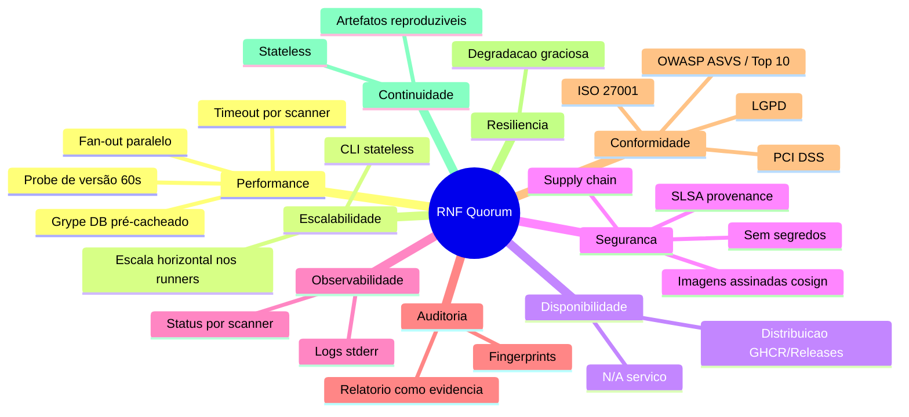
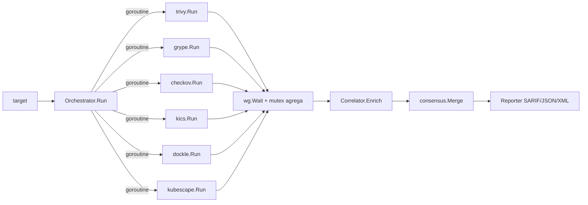
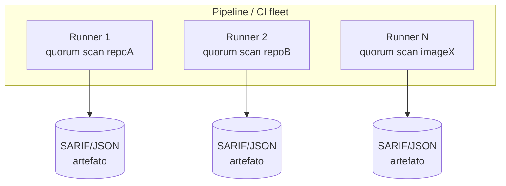
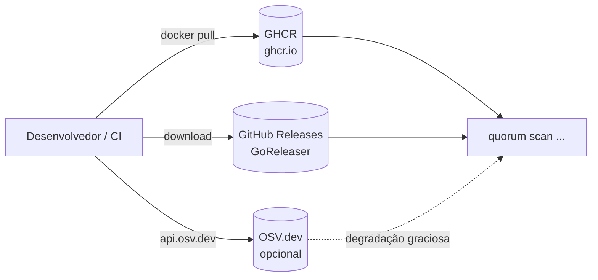
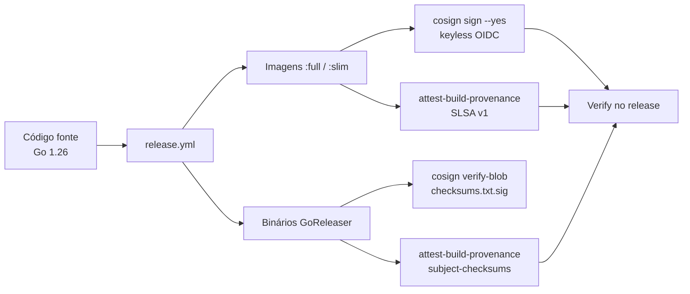
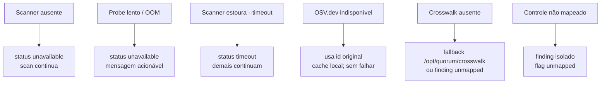

# Requisitos Não Funcionais

Este documento especifica os **Requisitos Não Funcionais (RNF)** do Quorum
(`quorum-sec-scan`), versão **v0.2.3**. O Quorum é uma ferramenta de *consensus
security scanning* distribuída como **CLI e imagem Docker** — sem frontend web,
sem banco de dados, sem API REST, sem autenticação de usuário e sem IA/LLM. Ele
orquestra um pool de scanners OSS (Trivy, Grype, Checkov, KICS, Dockle,
Kubescape), normaliza tudo para um modelo canônico (`model.Finding`), resolve
aliases de vulnerabilidade, correlaciona findings equivalentes, calcula um score
de confiança (consenso) e emite SARIF/JSON/XML.

Por ser um **binário/imagem de execução efêmera** (não um serviço de longa
duração), vários RNF clássicos de produtos SaaS não se aplicam diretamente. Onde
for o caso, o requisito é declarado explicitamente como **N/A** com justificativa
técnica, e — quando agregar valor — acompanhado de uma **Proposta futura**
claramente separada. A natureza arquitetural do produto está descrita em
[01-visao-geral.md](01-visao-geral.md) e [04-arquitetura.md](04-arquitetura.md)
(crie-os se ainda não existirem); o modelo de dados, a matriz de correlação e a
matemática do consenso estão em [DESIGN.md](https://github.com/Martinez1991/quorum-sec-scan/blob/main/DESIGN.md).

> Convenção de criticidade dos RNF: **P0** = essencial (release bloqueia se
> violado), **P1** = importante, **P2** = desejável.

---

## 1. Panorama dos RNF



| # | Categoria | Aplicabilidade | Prioridade | Resumo |
|---|-----------|----------------|------------|--------|
| 2 | Performance | Aplicável | P0 | Paralelismo, timeouts, DB pré-cacheado |
| 3 | Escalabilidade | Aplicável | P1 | CLI stateless, escala horizontal em CI |
| 4 | Disponibilidade | Reinterpretado | P1 | Não é serviço; vale a distribuição |
| 5 | Segurança | Aplicável | P0 | Supply chain, assinaturas, sem segredos |
| 6 | Observabilidade | Aplicável | P1 | Logs em stderr, status por scanner |
| 7 | Auditoria | Aplicável | P1 | Relatório como evidência, fingerprints |
| 8 | LGPD | Aplicável (por exclusão) | P1 | Sem PII processada |
| 9 | PCI DSS | N/A como produto | P2 | Pode auxiliar compliance |
| 10 | ISO 27001 | Mapeamento parcial | P2 | Controles aplicáveis ao binário/pipeline |
| 11 | OWASP ASVS | Subconjunto CLI | P1 | Controles relevantes a um CLI |
| 12 | OWASP Top 10 | Aplicável ao próprio artefato | P0 | Risco do binário/imagem, não do alvo |
| 13 | Resiliência | Aplicável | P0 | Degradação graciosa |
| 14 | Backup/DR/RTO/RPO | N/A (stateless) | P2 | Artefatos reproduzíveis |
| 15 | SLA/SLO/SLI | Definido | P1 | Uso em CI e pipeline de release |

---

## 2. Performance

O Quorum é dominado por **I/O e por subprocessos** (cada scanner é um binário
externo invocado via `exec`). O tempo de parede de um scan é, na prática,
`max(tempo de cada scanner) + overhead de correlação/consenso`, porque os
adapters rodam em paralelo.

### 2.1 Paralelismo (fan-out)

O orquestrador dispara uma **goroutine por adapter** e agrega os resultados sob
mutex (`internal/orchestrator/orchestrator.go`, `Run`):



Implicações de performance:

- **Escalonamento por scanner mais lento**, não pela soma. Adicionar um scanner
  rápido a um conjunto que já contém um lento não altera muito o tempo total.
- A fase de **correlação/consenso é in-process e CPU-leve** (agrupamento por
  `correlationKey` em mapas, `sha256` por chave) — desprezível frente aos
  scanners.
- A **resolução de aliases** pode adicionar latência de rede (OSV.dev). Mitigada
  por cache local (`~/.cache/quorum/aliases.json`) e desligável com `--offline`.

### 2.2 Timeout por scanner

Dois orçamentos de tempo distintos protegem o pipeline contra travamentos:

| Parâmetro | Default | Onde | Efeito ao estourar |
|-----------|---------|------|--------------------|
| `--timeout` (`PerScannerTime`) | **5m** | `cmd/quorum/scan.go`, `Options.PerScannerTime` | Scanner marcado `timeout`; demais continuam |
| `ProbeTime` (probe de versão) | **60s** | `orchestrator.defaultProbeTime` | Scanner marcado `unavailable` com diagnóstico |

O **probe de versão de 60s** é deliberadamente generoso: ferramentas pesadas
(ex.: Checkov, um processo Python) demoram a inicializar a frio, especialmente
quando todos os scanners sobem ao mesmo tempo num runner com pouca memória. O
orquestrador distingue três falhas do probe e emite mensagem acionável:

- **timeout** do probe → "tool too slow to start or resource-starved (give the
  container more memory, or scope `--scanners`)";
- **killed (OOM)** — `signal: killed` → "likely out of memory; raise the
  container's memory limit";
- **não instalado** → "not installed/available".

Um timeout de execução nunca derruba o scan inteiro: o status do scanner vira
`timeout`/`error` e o relatório registra isso explicitamente — *"0 findings is
not proof of safety"*.

### 2.3 Grype DB pré-cacheado

A imagem `:full` (`Dockerfile.full`) congela a base de vulnerabilidades do Grype
em build time:

```dockerfile
ENV GRYPE_DB_CACHE_DIR=/opt/grype/db \
    GRYPE_DB_AUTO_UPDATE=false
RUN grype db update && grype db status
```

Benefícios diretos de performance e resiliência:

- O **primeiro scan funciona offline** e não falha com *"failed to load
  vulnerability db: database does not exist"*.
- Elimina o download da DB no caminho crítico de cada job de CI.
- Trade-off documentado: a DB é **congelada na data do build** — rebuild para
  atualizar, ou `GRYPE_DB_AUTO_UPDATE=true` em runtime (requer rede).

### 2.4 Metas de performance (SLO de produto)

> Metas-alvo; ainda não validadas por benchmark formal (ver [Gaps](#gaps)).

| Métrica | Meta | Condição | Prioridade |
|---------|------|----------|------------|
| Overhead do orquestrador (correlação+consenso+report) | ≤ 2s | ≤ 50k findings brutos | P1 |
| Tempo do probe de todos os scanners | ≤ 60s | imagem `:full` warm | P0 |
| Latência de alias (cache hit) | ~0 (sem rede) | re-scan idempotente | P1 |
| Tempo total de scan SCA (`:full`, imagem média) | ≤ tempo do scanner mais lento + 2s | runner 2 vCPU / 4 GB | P1 |
| Pico de memória do orquestrador (excluindo scanners) | ≤ 256 MB | ≤ 50k findings | P2 |

Checklist de performance:

- [ ] Rodar com `--offline` em CI quando a rede OSV não for desejada no caminho crítico.
- [ ] Restringir `--scanners` ao necessário em runners pequenos.
- [ ] Persistir `~/.cache/quorum/aliases.json` entre jobs de CI.
- [ ] Garantir memória suficiente ao container `:full` (Checkov/KICS são pesados).

---

## 3. Escalabilidade

### 3.1 CLI stateless

Cada execução do Quorum é **autocontida e sem estado compartilhado**:

- Nenhum estado é persistido entre execuções além de **caches opcionais**
  (aliases em disco) que são *idempotentes* e reconstruíveis.
- Não há servidor, sessão, fila ou coordenação entre processos.
- A saída (SARIF/JSON/XML) é **função determinística** das entradas (alvo +
  scanners + crosswalk + baseline), com os `correlationKey`/`Fingerprint` puros.

### 3.2 Escala horizontal nos runners de CI



- A escala é **embaraçosamente paralela**: N execuções independentes em N
  runners, sem ponto central de contenção (exceto o registry/Releases na
  *obtenção* do artefato).
- O **gargalo de escala** é o recurso do runner (CPU/memória para os scanners),
  não o Quorum em si.
- Dependência externa única na execução: **OSV.dev** para aliases — mitigável com
  `--offline` ou cache compartilhado.

| Vetor de escala | Mecanismo | Limite |
|-----------------|-----------|--------|
| Mais repositórios/imagens | mais jobs/runners paralelos | capacidade da frota de CI |
| Mais scanners por scan | fan-out de goroutines | memória do runner |
| Re-scans frequentes | cache de aliases | tamanho do cache (negligível) |

**N/A:** escalabilidade vertical de um serviço (auto-scaling de pods,
sharding de banco, balanceamento de carga) — não há serviço de longa duração.
Ver [§4](#4-disponibilidade).

---

## 4. Disponibilidade

**N/A como serviço.** O Quorum não expõe endpoint, daemon ou processo de longa
duração; portanto não há *uptime* de serviço a medir. O conceito é reinterpretado
como **disponibilidade da distribuição** — a capacidade de obter e executar o
artefato.



| Dependência | Papel | Disponibilidade | Mitigação |
|-------------|-------|-----------------|-----------|
| GHCR (`ghcr.io`) | distribuição das imagens `:full`/`:slim` | SLA do GitHub | pin por `@sha256`, mirror interno, cache de runner |
| GitHub Releases | binários nativos + checksums + assinaturas | SLA do GitHub | mirror interno, cópia versionada |
| OSV.dev | resolução de aliases (apenas VULN) | best-effort | `--offline`, cache local, degradação graciosa |
| Binários dos scanners | execução real | local (imagem `:full`) ou PATH (`:slim`) | `:full` já embute tudo |

Metas de disponibilidade de distribuição:

- [ ] Imagens publicadas de forma reprodutível a cada tag semver (`release.yml`).
- [ ] Possível operar 100% offline com `:full` (DB do Grype pré-cacheada +
  crosswalk embutido + `--offline`).
- [ ] Recomendação enterprise: **espelhar** as imagens em registry interno e
  pinar por digest.

**Proposta futura (claramente separada):** não há plano de transformar o Quorum
em serviço hospedado; caso surja, esta seção passaria a definir uptime/SLA de
serviço real.

---

## 5. Segurança

A superfície de segurança do Quorum tem duas frentes: (a) **segurança do próprio
artefato e da sua cadeia de suprimentos**, e (b) **higiene de execução** (não
manusear segredos). O alvo escaneado é dado de entrada — o Quorum só o lê.

### 5.1 Cadeia de suprimentos (supply chain)



| Controle | Implementação | Evidência |
|----------|---------------|-----------|
| Assinatura keyless de imagem | `cosign sign` via OIDC do GitHub (sem chaves) | `release.yml`, README §Install |
| Atestação SLSA build-provenance | `actions/attest-build-provenance@v2` (imagens e binários) | `release.yml` |
| Verificação no próprio release | `gh attestation verify oci://…@DIGEST` falha o build se inválida | `release.yml` (step "Verify provenance") |
| Assinatura de binários | `checksums.txt` + `cosign verify-blob` (`.sig`/`.pem`) | README §Native binary |
| Pin de scanners por digest | `FROM …@sha256:` para Trivy/KICS; instaladores com checksum | `Dockerfile.full` |
| GitHub Action verifica antes de rodar | `action.yml` faz cosign-verify da `:full` por padrão | `action.yml` |
| Trigger de release restrito | tags semver `v[0-9]+.[0-9]+.[0-9]+` apenas | `release.yml` |
| Tag móvel `v0` para pin do action | não dispara release; permite pin reprodutível | `release.yml`, README §CI/CD |

Verificação esperada do consumidor (recomendado em produção):

```bash
cosign verify ghcr.io/martinez1991/quorum-sec-scan:full \
  --certificate-identity-regexp \
    "https://github.com/Martinez1991/quorum-sec-scan/.github/workflows/release.yml@.*" \
  --certificate-oidc-issuer https://token.actions.githubusercontent.com

gh attestation verify oci://ghcr.io/martinez1991/quorum-sec-scan:full \
  --repo Martinez1991/quorum-sec-scan
```

> **Nota de risco honesta:** no `Dockerfile.full`, Trivy e KICS são pinados por
> `@sha256`, mas alguns scanners (Grype/Syft/Dockle/Kubescape/Checkov) usam
> instaladores oficiais por versão com checksum, não por digest imutável de
> imagem. Endurecer todos para digest é uma melhoria recomendada (DESIGN §12,
> README §"Security of the chain itself"). Ver [Gaps](#gaps).

### 5.2 Ausência de segredos

| Aspecto | Estado | Justificativa |
|---------|--------|---------------|
| Credenciais de usuário | **inexistentes** | sem contas/autenticação |
| Tokens de API próprios | **inexistentes** | OSV.dev é endpoint público sem chave |
| Segredos em build/release | apenas `GITHUB_TOKEN` efêmero do runner | escopo mínimo (`contents`, `packages`, `id-token`, `attestations`) |
| Persistência de segredos | **nenhuma** | nada é gravado além de cache de aliases (públicos) |
| Detecção de segredos no alvo | via adapter `trivy` (TypeSecret) | findings reportados, nunca persistidos fora do relatório |

Princípios de execução segura:

- [ ] O Quorum **não solicita nem armazena credenciais**.
- [ ] Logs vão para **stderr** e não devem conter segredos (o conteúdo de
      segredos detectados pertence ao relatório controlado pelo usuário).
- [ ] Permissões do workflow de release seguem **least privilege**.
- [ ] Imagens devem ser **verificadas antes do uso** (cosign + provenance).

### 5.3 Modelo de ameaças resumido

| Ameaça | Vetor | Mitigação |
|--------|-------|-----------|
| Imagem adulterada | registry comprometido / tag mutável | assinatura cosign + SLSA + pin por digest |
| Binário de scanner trojanizado | upstream comprometido | pin por digest/checksum no build |
| Falso negativo silencioso | scanner não roda mas reporta 0 | status por scanner explícito (§6) |
| Bind mount malformado | `-v` errado escaneia `/work` vazio | aviso na doc; resultado 0 ≠ seguro |
| Exfiltração de dados do alvo | rede em runtime | `--offline`; única chamada externa é OSV (somente IDs de vuln) |

---

## 6. Observabilidade

Sendo um CLI efêmero, a observabilidade é **local ao processo**: logs estruturados
para humanos em **stderr** e status de máquina **no próprio relatório**.

### 6.1 Logs (stderr)

- Toda a telemetria de progresso vai para **stderr** com prefixo `[quorum]`
  (`scan.go`, `logf`), deixando **stdout** limpo para o relatório quando não há
  `--output`.
- `--quiet`/`-q` suprime os logs de progresso e o sumário.
- Eventos logados: alvo/tipo/contagem de regras do crosswalk, início/fim por
  scanner com duração, supressões de baseline/min-severity, e o disparo do gate.

```text
[quorum] target=. type=repo crosswalk=42 rules (./crosswalk) offline=false
[quorum] run  trivy (0.71.2) ...
[quorum] done trivy: 17 findings in 4.2s
[quorum] skip grype: does not support target repo
[quorum] filtered: 3 suppressed by baseline (5 entries), 2 below min-severity medium
[quorum] gate: found HIGH finding >= --fail-on high → exit 1
```

### 6.2 Status por scanner

Cada execução produz um `ScannerRun` (`orchestrator.go`) com **status de máquina**,
exposto no sumário (stderr) e no relatório:

| Status | Significado |
|--------|-------------|
| `ran` | rodou e produziu resultados (mesmo que 0) |
| `skipped` | scanner não suporta o tipo de alvo |
| `unavailable` | binário ausente / probe falhou (timeout/OOM/não instalado) |
| `error` | erro de execução do scanner |
| `timeout` | execução excedeu `--timeout` |

O sumário ao final imprime status, contagem por severidade, findings
multi-detectados e a frase âncora *"0 findings is not proof of safety — see
scanner statuses above."* Isso transforma o **status em sinal observável**, não
em ruído.

### 6.3 Lacunas e propostas

| Capacidade | Estado | Observação |
|------------|--------|------------|
| Logs em stderr | ✅ Implementado | prefixados, com `--quiet` |
| Status por scanner | ✅ Implementado | no sumário e no relatório |
| Duração por scanner | ✅ Implementado | `ScannerRun.Duration` |
| Métricas estruturadas (Prometheus/OTel) | ❌ N/A | sem processo de longa duração para expor |
| Log estruturado JSON em stderr | ⚠️ Proposta futura | hoje é texto humano |

---

## 7. Auditoria

O **relatório é a evidência de auditoria**. Ele é reproduzível, carimba quem
detectou o quê e fornece identidade estável por finding.

| Artefato de auditoria | Conteúdo | Onde |
|-----------------------|----------|------|
| Status por scanner | `ran/skipped/unavailable/error/timeout` + versão + duração | `Result.Runs`, relatório |
| Procedência da detecção | `detectedBy[]`, `detectionCount`, `confidence` | `MergedFinding`, SARIF `properties` |
| Identidade estável | `Fingerprint = sha256(correlationKey)` | SARIF `partialFingerprints["quorum/v1"]`, JSON `fingerprint` |
| Supressões | sempre **logadas** e contabilizadas, nunca descartadas em silêncio | baseline `.quorumignore`, `filter.Apply` |
| Versão dos scanners | `ScannerVersion` por finding / `ScannerRun.Version` | relatório |

Propriedades de auditoria:

- **Reprodutibilidade:** mesma entrada → mesmo `correlationKey`/`Fingerprint`
  (função pura). Permite *diff* temporal de relatórios.
- **Rastreabilidade de supressão:** um finding suprimido pelo baseline é
  reportado como suprimido (com a entrada que o suprimiu), não some.
- **Cadeia de custódia do artefato:** SARIF/JSON pode ser arquivado como evidência
  de gate de CI; assinaturas/provenance (§5) atestam a origem do binário que o
  gerou.

Checklist de auditoria em CI:

- [ ] Arquivar o relatório (SARIF/JSON) como artefato do job.
- [ ] Versionar o `.quorumignore` (cada supressão revisada e datada).
- [ ] Reter a saída do sumário (status por scanner) junto ao artefato.
- [ ] Registrar a versão/digest da imagem Quorum usada.

---

## 8. LGPD (Lei Geral de Proteção de Dados)

**Aplicável por exclusão — o Quorum não trata dados pessoais.** A justificativa é
técnica: os dados processados são **metadados de software e infraestrutura**, não
dados de pessoas naturais.

| Categoria de dado | Processado? | Natureza |
|-------------------|-------------|----------|
| Identificadores de vulnerabilidade (CVE/GHSA) | Sim | dado técnico público |
| PURLs / versões de pacote | Sim | dado técnico |
| Caminhos de arquivo, recursos IaC/K8s | Sim | dado técnico do alvo |
| Conteúdo de segredos detectados (Trivy) | Possível | **não é PII por definição**; fica só no relatório do usuário |
| Dados pessoais (nome, CPF, e-mail, etc.) | **Não** | fora do escopo funcional |

Consequências:

- **Sem PII** ⇒ sem necessidade de base legal, consentimento, DPO ou DPIA
  *atribuíveis ao Quorum como controlador/operador*.
- A única chamada externa (**OSV.dev**) envia **somente IDs de vulnerabilidade**
  (ex.: `CVE-2021-…`) — não há dado pessoal no tráfego. Desligável com
  `--offline`.
- **Responsabilidade do usuário:** se o *alvo* escaneado contiver PII (ex.: um
  segredo que seja um e-mail), o relatório gerado pode contê-la. O tratamento e a
  retenção desse relatório são responsabilidade de quem opera o Quorum, não do
  produto.

> **N/A:** direitos do titular, portabilidade, anonimização interna — não há base
> de dados pessoais sob controle do Quorum.

---

## 9. PCI DSS

**N/A como produto.** O Quorum **não armazena, processa ou transmite dados de
cartão (CHD/SAD)** e não faz parte de um Cardholder Data Environment (CDE) por
construção. Logo, não está *no escopo* do PCI DSS como sistema.

Entretanto, o Quorum **pode auxiliar a conformidade** de quem opera um CDE, como
ferramenta de apoio aos requisitos abaixo:

| Requisito PCI DSS v4.0 | Como o Quorum auxilia |
|------------------------|------------------------|
| 6.2 / 6.3 — desenvolver software seguro e gerir vulnerabilidades | consenso de SCA (Trivy+Grype) com `confidence` para priorização |
| 6.3.1 — identificar vulnerabilidades por fontes reconhecidas | IDs CVE via OSV; confirmação autoritativa pesa no score |
| 6.3.2 — inventário de componentes (bespoke/3rd-party) | PURLs por finding; SBOM via Syft na imagem `:full` |
| 6.4 / 6.5 — proteger aplicações e gerir mudanças | gate em CI por `--fail-on`; baseline auditável |
| 11.3 — varreduras de vulnerabilidade | varredura automatizável em pipeline, evidência em SARIF |

> O Quorum **não substitui** um ASV scan externo nem um pentest. É um controle
> compensatório/preventivo no SDLC, não uma atestação de conformidade.

---

## 10. ISO/IEC 27001 (Anexo A)

Mapeamento dos controles **aplicáveis ao Quorum** (como ferramenta e como cadeia
de build). Controles organizacionais amplos ficam a cargo de quem adota.

| Controle (ISO 27001:2022) | Aplicabilidade | Como o Quorum endereça |
|---------------------------|----------------|------------------------|
| A.8.8 — Gestão de vulnerabilidades técnicas | ✅ Direta | núcleo do produto: detecção + consenso + gate |
| A.8.25 — Ciclo de vida de desenvolvimento seguro | ✅ Apoia | integra-se ao SDLC via CI |
| A.8.28 — Codificação segura | ✅ Apoia | findings IaC/MISCONFIG/SECRET acionáveis |
| A.8.29 — Testes de segurança em dev/aceite | ✅ Apoia | gate por exit code |
| A.8.30 — Desenvolvimento terceirizado | ⚙️ Parcial | scan de componentes 3rd-party (SCA) |
| A.8.31 — Separação de ambientes | ➖ Do adotante | execução isolada por job efêmero |
| A.8.15 — Logging | ⚙️ Parcial | logs em stderr + status por scanner |
| A.5.23 — Segurança em serviços cloud | ➖ Do adotante | N/A (sem serviço cloud próprio) |
| A.5.7 — Threat intelligence | ⚙️ Parcial | OSV/CVE como fonte de vulnerabilidade |
| Cadeia de suprimentos (A.5.19–A.5.23) | ✅ Própria | assinatura cosign + SLSA provenance (§5) |

Legenda: ✅ atende/apoia diretamente · ⚙️ parcial · ➖ responsabilidade do adotante.

---

## 11. OWASP ASVS (controles relevantes a um CLI)

A maioria dos capítulos do ASVS pressupõe uma aplicação web com sessão e
autenticação — **N/A** aqui. Restam os controles aplicáveis a um binário/CLI:

| Domínio ASVS | Aplicabilidade | Estado no Quorum |
|--------------|----------------|------------------|
| V1 Arquitetura & threat modeling | ✅ | DESIGN.md + §5.3 deste doc |
| V5 Validação de entrada | ✅ | parsing de flags (cobra), parsers de adapter com contract tests |
| V7 Tratamento de erros & logging | ✅ | erros acionáveis, logs em stderr, sem vazar segredos |
| V10 Código malicioso / integridade | ✅ | assinatura, provenance, pin de dependências |
| V12 Arquivos & recursos | ⚙️ | lê alvo/crosswalk/baseline; escreve relatório com perms `0644`/`0755` |
| V14 Configuração | ✅ | defaults seguros (`--offline` opcional, crosswalk com fallback) |
| V2 Autenticação | ➖ N/A | sem autenticação |
| V3 Sessão | ➖ N/A | sem sessão |
| V4 Controle de acesso | ➖ N/A | sem multiusuário |
| V6 Criptografia armazenada | ➖ N/A | não armazena dado sensível |
| V8/V9 Dados/Comunicação | ⚙️ | OSV via HTTPS; sem dado sensível em trânsito |
| V13 APIs | ➖ N/A | não expõe API |

Checklist ASVS prática:

- [ ] Validar formato/severidade das flags e falhar com exit code `2` em uso inválido.
- [ ] Garantir que parsers de adapter tenham fixture/contract test versionado.
- [ ] Não emitir conteúdo de segredo em logs de progresso.
- [ ] Verificar integridade do binário/imagem antes de executar.

---

## 12. OWASP Top 10 (do próprio binário/imagem)

> Escopo: riscos **do artefato Quorum em si**, não do alvo que ele escaneia (esse
> é o trabalho dos scanners). Mapeamento ao OWASP Top 10:2021.

| Risco | Relevância p/ o Quorum | Controle |
|-------|------------------------|----------|
| A01 Broken Access Control | Baixa | sem controle de acesso (CLI local) |
| A02 Cryptographic Failures | Baixa | não guarda segredos; assinaturas via Sigstore |
| A03 Injection | **Média** | invoca scanners via `exec`; argumentos controlados pelo orquestrador, não shell-interpolados |
| A04 Insecure Design | Média | princípio "false split > false merge"; threat model em DESIGN |
| A05 Security Misconfiguration | **Média** | defaults seguros; aviso de bind mount; crosswalk com fallback |
| A06 Vulnerable & Outdated Components | **Alta** | deps Go + binários de scanner pinados; SBOM; o próprio Quorum deve ser escaneado |
| A07 Identification & Auth Failures | N/A | sem autenticação |
| A08 Software & Data Integrity Failures | **Alta** | cosign + SLSA provenance + pin por digest/checksum |
| A09 Logging & Monitoring Failures | Média | status por scanner evita falso negativo silencioso |
| A10 SSRF | Baixa | única saída de rede é OSV.dev (host fixo); `--offline` desliga |

Ações priorizadas:

- [ ] A06/A08: rebuild periódico para refrescar DB do Grype e bumps de versão de scanner.
- [ ] A08: converter tags mutáveis restantes para `@sha256` no `Dockerfile.full`.
- [ ] A03: manter invocação de scanners por *args* (sem shell), revisada em code review.

---

## 13. Resiliência (degradação graciosa)

A resiliência é um **princípio de design central**: uma falha parcial **degrada,
não derruba**, e a degradação é sempre **visível**.



| Falha | Comportamento | Fonte |
|-------|---------------|-------|
| Scanner não instalado | `unavailable`, scan prossegue | `orchestrator.runOne` |
| Probe lento / OOM | `unavailable` com diagnóstico (memória/scope) | `orchestrator.runOne` |
| Timeout de execução | `timeout`, outros scanners continuam | `orchestrator` + `--timeout` |
| Rede OSV indisponível | aliases degradam para id original; nunca falha o scan | `alias`/DESIGN §7 |
| `:full` sem rede | DB do Grype pré-cacheada + crosswalk embutido | `Dockerfile.full` |
| Crosswalk default ausente | fallback automático para `/opt/quorum/crosswalk` | `resolveCrosswalkDir` |
| Controle não mapeável | finding fica isolado, flag `unmapped` (não chuta merge) | DESIGN §6 |

Invariante de resiliência: **"0 findings is not proof of safety"** — toda
degradação aparece como status, evitando que uma falha vire um falso "tudo certo".

---

## 14. Backup, DR, RTO e RPO

**N/A — o Quorum é stateless.** Não há dado de produção sob sua custódia que possa
ser perdido. A continuidade depende de **artefatos reproduzíveis**, não de
backup/restore.

| Conceito | Aplicabilidade | Justificativa |
|----------|----------------|---------------|
| Backup de dados | **N/A** | sem armazenamento persistente de estado de negócio |
| Disaster Recovery (DR) | **N/A (serviço)** | não há serviço para recuperar |
| RTO | **~minutos**, reinterpretado | "recuperar" = re-executar o scan em outro runner |
| RPO | **0**, reinterpretado | nada a perder; cada scan é recomputável da fonte |

O que substitui backup/DR:

- **Reprodutibilidade:** imagens pinadas por digest + binários assinados +
  provenance permitem reconstruir/obter exatamente o mesmo artefato.
- **Mirror de distribuição:** espelhar imagens/binários em registry interno
  protege contra indisponibilidade do GHCR/Releases.
- **Cache de aliases:** descartável; reconstruído a partir do OSV/scanner.

Único item recuperável de fato: o **relatório arquivado** como evidência (§7) —
sua retenção/backup é responsabilidade do pipeline que o gera, não do Quorum.

> **Proposta futura (separada):** se um modo com cache persistente compartilhado
> for adotado em larga escala, definir política de backup/retenção desse cache.

---

## 15. SLA / SLO / SLI

Não há SLA contratual de serviço (não é serviço). Definimos SLO/SLI para dois
contextos operacionais reais: **uso em CI** e **pipeline de release**.

### 15.1 Uso em CI (o binário/imagem como dependência do pipeline)

| SLI | Definição | SLO alvo | Como medir |
|-----|-----------|----------|-----------|
| Confiabilidade do scan | % de jobs que terminam com exit `0/1` (sem `2`) | ≥ 99% | exit codes do job |
| Determinismo | % de re-scans da mesma entrada com mesmo fingerprint set | 100% | diff de relatórios |
| Latência de overhead | overhead do orquestrador (sem scanners) | ≤ 2s p95 | sumário/`Duration` |
| Resiliência a falha de rede | scans concluídos com OSV indisponível | 100% (degrada) | execução `--offline` |
| Cobertura de execução | % de scanners suportados com status `ran` | ≥ 95% em `:full` | status por scanner |

### 15.2 Pipeline de release (publicação do artefato)

| SLI | Definição | SLO alvo | Como medir |
|-----|-----------|----------|-----------|
| Sucesso de publicação | % de tags semver que publicam imagens+binários | 100% | `release.yml` |
| Integridade verificada | % de releases com cosign+provenance **verificados no próprio build** | 100% | step "Verify provenance" |
| Reprodutibilidade do build | build determinístico (`-trimpath`, deps pinadas) | 100% | `Dockerfile.full`/GoReleaser |
| Tempo de release | tag → imagens+binários publicados | ≤ 30 min | duração do workflow |

> Distinção importante de **SLA do produto vs. integridade**: a *disponibilidade*
> de publicação depende do GitHub/GHCR (não controlado por nós), mas a
> *integridade* (assinatura + provenance verificadas) é **bloqueante** no próprio
> release — um artefato com atestação quebrada falha o build.

---

## Premissas

- Os números/metas em [§2.4](#24-metas-de-performance-slo-de-produto) e
  [§15](#15-sla--slo--sli) são **alvos de engenharia**, ainda **não validados por
  benchmark formal** neste repositório.
- Assume-se que o consumidor em produção **verifica** imagem/binário (cosign +
  `gh attestation verify`) e, idealmente, **pina por digest** — o produto fornece
  os meios, a aplicação é do adotante.
- O `--offline` é o modo recomendado quando a política de CI proíbe egressos de
  rede; com isso a única dependência externa em runtime (OSV.dev) é eliminada.
- "Sem PII" pressupõe que o produto não é configurado para tratar dados pessoais;
  PII eventualmente presente *no alvo* é responsabilidade do operador do relatório.
- Mapeamentos de PCI DSS, ISO 27001, ASVS e OWASP Top 10 são **interpretativos**,
  baseados no comportamento as-is do código (v0.2.3), e **não constituem
  atestação de conformidade**.
- A disponibilidade da distribuição depende de serviços de terceiros (GitHub
  GHCR/Releases, OSV.dev), cujos SLAs não são controlados por este projeto.
- A imagem `:full` é `linux/amd64` (scanners amd64); cenários arm64 usam `:slim`
  com scanners no PATH, o que altera o perfil de performance/disponibilidade
  local.

<a id="gaps"></a>
### Lacunas conhecidas (gaps)

- Não há **benchmark de performance** versionado para sustentar os SLOs alvo.
- Nem todos os scanners no `Dockerfile.full` estão pinados por **digest imutável**
  (alguns por versão+checksum); endurecer para `@sha256` é recomendado.
- Não há **logging estruturado (JSON)** nem métricas/telemetria exportáveis —
  observabilidade é texto em stderr por design.
- Não há mecanismo nativo de **mirror/retenção** de artefatos; é responsabilidade
  do adotante.
