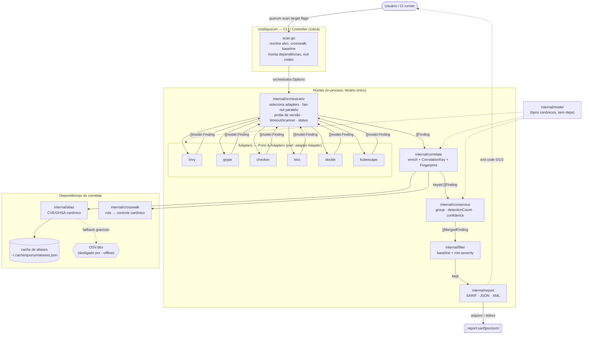

# Arquitetura

Este documento descreve a arquitetura do **Quorum** (v0.2.3), uma ferramenta CLI/Docker de *consensus security scanning*. O Quorum não é um scanner: ele orquestra um pool de scanners OSS (trivy, grype, checkov, kics, dockle, kubescape), normaliza toda a saída para um modelo canônico (`model.Finding`), resolve aliases de vulnerabilidade, correlaciona findings equivalentes por uma chave determinística, calcula um score de confiança (consenso) e emite um relatório unificado (SARIF/JSON/XML). O estilo arquitetural escolhido é um **Modular Monolith** (binário Go único) organizado segundo **Ports & Adapters** (hexagonal) e estruturado como um **Pipeline** determinístico. Este documento justifica essas escolhas, mapeia as camadas para os pacotes reais do repositório e descreve o fluxo de execução com diagramas de componentes e de sequência.

> Documentos relacionados: [Visão geral](01-visao-geral.md) · [Modelo de dados / Design](DESIGN.md) · [CLI e flags](05-cli.md) · [Supply chain e distribuição](12-supply-chain.md). Quando um link apontar para um arquivo ainda não escrito, trate-o como referência futura.

---

## 1. Sumário executivo

| Atributo | Valor |
|----------|-------|
| Estilo principal | Modular Monolith (um único binário Go) |
| Padrão de integração | Ports & Adapters (hexagonal) — interface `adapter.Adapter` |
| Padrão de processamento | Pipeline determinístico (`scan → normalize → alias → correlate → score → report`) |
| Concorrência | Fan-out paralelo (goroutines), um por scanner, com timeout por scanner |
| Estado | Sem estado persistente além de caches em disco (aliases, grype DB) |
| Linguagem / runtime | Go 1.26, CLI com cobra |
| Comandos | `scan <target>`, `list-scanners` |
| Distribuição | Imagens Docker (`:full`, `:slim`) no GHCR + binários nativos via GoReleaser |
| Princípio de design | *False split > false merge* — na dúvida, não una findings |

---

## 2. Estilo arquitetural

### 2.1 Modular Monolith (binário único)

O Quorum compila para **um único executável Go** (`cmd/quorum`). Todos os módulos — orquestração, adapters, correlação, consenso, alias, crosswalk, filtro, relatório — vivem no mesmo processo e se comunicam por chamadas de função in-process, não por rede. A modularidade é garantida por **fronteiras de pacote** (`internal/*`) com responsabilidades únicas e dependências unidirecionais, não por separação em serviços.

Por que monolito modular:

- **A unidade de trabalho é uma execução curta e batch.** Um `quorum scan` roda, produz um artefato (relatório) e termina. Não há tráfego contínuo, sessões, nem multitenancy que justifiquem processos de longa duração.
- **CI/CD é o ambiente alvo.** O binário precisa ser fácil de baixar, pinar por digest e executar num runner ou container. Um único artefato assinado (cosign + SLSA) é trivial de auditar; um enxame de serviços não é.
- **Latência e simplicidade.** Passar `[]model.Finding` entre etapas por chamada de função custa nanossegundos e zero serialização. A correlação precisa de todos os findings em memória ao mesmo tempo (agrupamento por chave) — distribuí-los só adicionaria custo.
- **Operação trivial.** Sem orquestração de containers em runtime, sem service discovery, sem rede interna. O usuário roda um comando.

### 2.2 Ports & Adapters (hexagonal)

O coração da extensibilidade é a interface **`adapter.Adapter`** (`internal/adapter/adapter.go`), o *port* que isola o núcleo (orquestrador, correlação, consenso) das ferramentas externas. Cada scanner OSS é um *adapter* que sabe (a) invocar a CLI da ferramenta e (b) traduzir a saída nativa para `model.Finding`. Adicionar um scanner = adicionar um arquivo em `internal/adapter/`; **nada no núcleo muda**.

```go
// internal/adapter/adapter.go
type Adapter interface {
    Name() string
    Version(ctx context.Context) (string, error) // probe: detecta tool ausente/lenta
    Supports(target Target) bool                  // este adapter cobre este alvo?
    Capabilities() []Capability                   // tipos/alvos que produz
    Run(ctx context.Context, target Target) ([]model.Finding, error)
}
```

Pontos hexagonais importantes, verificados no código:

- **Registro por `init()`.** Cada adapter chama `adapter.Register(a)` no seu `init()`; o núcleo descobre adapters via `adapter.All()` / `adapter.Get(name)` sem conhecer tipos concretos. Registro duplicado é *panic* (erro de programação).
- **O núcleo depende da abstração, não da implementação.** O orquestrador opera sobre `[]adapter.Adapter`. Trivy, grype etc. são detalhes plugáveis.
- **Adapters NÃO calculam identidade.** Eles emitem `Finding` cru/normalizado; `CorrelationKey` e `Fingerprint` são responsabilidade centralizada de `internal/correlate` — isso garante consistência entre ferramentas (DESIGN §5/§6).
- **Teste de contrato por adapter.** Cada adapter tem fixtures versionadas em `internal/adapter/testdata` e um teste que quebra quando o formato de saída do scanner muda (antes da produção, não depois).

### 2.3 Pipeline determinístico

O processamento é um **pipeline** de estágios bem definidos, documentado no comentário de pacote do orquestrador e em DESIGN §3:

```
scan → normalize → resolve aliases → correlate → score → report
```

Cada estágio é uma transformação pura (ou quase-pura) sobre os dados do estágio anterior. Determinismo é um princípio explícito: a `CorrelationKey` é função pura dos dados normalizados (DESIGN princípio 4), o consenso ordena a saída de forma estável, e o `Fingerprint` é `sha256(correlationKey)`. Mesma entrada ⇒ mesma saída ⇒ dedup temporal de graça (via `partialFingerprints["quorum/v1"]` no SARIF).

---

## 3. Por que NÃO microservices / serverless / event-driven / CQRS

O template pede uma justificativa explícita de trade-offs. Cada estilo abaixo foi considerado e **declarado N/A** com fundamento técnico.

| Estilo | Veredito | Justificativa técnica |
|--------|----------|-----------------------|
| **Microservices** | N/A | A carga é batch, de curta duração e single-tenant. Quebrar correlação/consenso/relatório em serviços introduziria rede, serialização e *service discovery* sem nenhum ganho de escala ou isolamento — e quebraria o requisito central de distribuir **um artefato assinável** (cosign + SLSA). A correlação exige todos os findings em memória simultaneamente; distribuí-los seria contraproducente. |
| **Serverless (FaaS)** | N/A | Scanners pesados (checkov é um processo Python; grype precisa de DB de vulnerabilidades pré-cacheado de centenas de MB) violam limites de cold-start, tamanho de pacote e tempo de execução de funções. O ambiente alvo é o runner de CI, onde o binário já roda; FaaS adicionaria latência e custo. O timeout padrão de scan é 5m e o probe de versão tolera até 60s de cold-start — incompatível com FaaS típico. |
| **Event-driven / mensageria** | N/A | Não há produtores/consumidores assíncronos nem fluxo de eventos. O fan-out paralelo dos scanners já é feito in-process com goroutines + `sync.WaitGroup`; um broker (Kafka/NATS/SQS) seria infraestrutura sem propósito para um job que começa e termina. |
| **CQRS** | N/A | CQRS separa modelos de leitura e escrita sobre um *datastore* mutável. O Quorum não tem banco de dados relacional nem comandos que mutam estado compartilhado: a única "escrita" é o arquivo de relatório, e a única persistência é cache *read-through* (aliases). Sem domínio de escrita, não há nada a segregar. |
| **Event Sourcing** | N/A | Não há histórico de eventos de domínio a reconstruir; cada scan é independente e idempotente. |

> Onde houver demanda futura legítima — por exemplo, um modo *runtime/streaming* (Falco/Tetragon) — o próprio DESIGN §2 já o classifica como **produto separado** com modelo de stream, fora do escopo deste binário batch. Ver "Propostas futuras" ao final.

---

## 4. Camadas e mapa de pacotes

A dependência flui em uma direção: a camada de CLI (controller) orquestra o pipeline; o pipeline depende do modelo canônico e das abstrações; os adapters dependem apenas do modelo. `internal/model` é o núcleo sem dependências.

| Camada | Pacote(s) | Responsabilidade |
|--------|-----------|------------------|
| CLI / Controller | `cmd/quorum` (`main.go`, `root.go`, `scan.go`) | Parse de flags (cobra), resolução de alvo/crosswalk/baseline, montagem das dependências, exit codes, sumário em stderr |
| Orquestração | `internal/orchestrator` | Seleção de adapters por alvo, fan-out paralelo, probe de versão, timeout por scanner, status por scanner, coleta de findings |
| Adapters (port) | `internal/adapter` (+ `trivy.go`, `grype.go`, `checkov.go`, `kics.go`, `dockle.go`, `kubescape.go`) | Invocar CLI da ferramenta e traduzir para `model.Finding`; registro; probe `Version`; `Supports`/`Capabilities` |
| Identidade / Correlação | `internal/correlate` (`correlate.go`, `key.go`) | Enriquecer (alias + crosswalk), estampar `CorrelationKey` + `Fingerprint` |
| Resolução de alias | `internal/alias` (`resolver.go`, `osv.go`) | CVE/GHSA → forma canônica (CVE preferido); cadeia local→cache→OSV |
| Crosswalk | `internal/crosswalk` | Carregar YAML rule→controle canônico (AVD/CIS); resolver `scanner|ruleID` |
| Consenso | `internal/consensus` | Agrupar por `CorrelationKey`, agregar severidade, `detectionCount`, `confidence`, ordenação estável |
| Filtro / Gating | `internal/filter` | Baseline (`.quorumignore`), `--min-severity`, supressões logadas |
| Relatório | `internal/report` (`sarif.go`, `json.go`, `xml.go`) | Serializar `Result`/`[]MergedFinding` para SARIF (primário), JSON, XML |
| Suporte | `internal/cache`, `internal/purl`, `internal/severity`, `internal/model` | Cache de aliases; parsing/normalização de PURL; normalização de severidade; tipos canônicos |

Observações fiéis ao código:

- O *controller* (`scan.go`) é quem **monta** as dependências: abre o `cache.Store`, cria o `alias.OSVClient` (a menos que `--offline`), carrega o `crosswalk`, constrói o `correlate.Correlator` e injeta tudo em `orchestrator.Options`. Isso mantém o orquestrador agnóstico de I/O de configuração.
- Filtro e gating acontecem **depois** do consenso, no controller: `filter.Apply` remove supressões/abaixo-do-mínimo de `res.Merged` antes de emitir e de aplicar `--fail-on`.

---

## 5. Diagrama de componentes (Mermaid)



Leitura do diagrama: o controller é a única camada com I/O de configuração; o orquestrador é o coordenador de concorrência; os adapters são plugáveis pela interface `adapter.Adapter`; correlação/consenso/filtro/relatório são estágios sequenciais do pipeline; `internal/model` é o núcleo do qual todos dependem mas que não depende de ninguém.

---

## 6. Diagrama de sequência do pipeline (Mermaid)

Fluxo `scan → normalize → alias → correlate → score → report` para um scan típico.

```mermaid
sequenceDiagram
    autonumber
    actor U as Usuário/CI
    participant C as cmd/quorum (scan.go)
    participant O as orchestrator
    participant A as adapters (N em paralelo)
    participant R as correlate
    participant AL as alias
    participant X as crosswalk
    participant K as consensus
    participant F as filter
    participant P as report

    U->>C: quorum scan target --type ... --format sarif
    C->>C: resolve alvo, crosswalk dir, baseline
    C->>C: monta cache + OSV (se !offline) + Correlator
    C->>O: Run(ctx, target, Options{Scanners, PerScannerTime, Correlator})

    O->>O: selectAdapters(target, scanners)
    note over O,A: fan-out: 1 goroutine por adapter, WaitGroup

    par scan (paralelo)
        O->>A: Supports(target)? Version(ctx) [probe 60s]
        note right of A: distingue timeout / killed(OOM) / não-instalado
        A-->>O: status = ran|skipped|unavailable|error|timeout
        O->>A: Run(ctx, target) [timeout por scanner]
        A->>A: normalize: saída nativa → []model.Finding
        A-->>O: []model.Finding (canônico)
    end
    O->>O: junta todos os findings + ScannerRun[] (status)

    O->>R: Enrich(ctx, allFindings)
    loop por finding
        alt Type == VULN
            R->>AL: Canonical(id, knownAliases)
            AL->>AL: 1) aliases locais → 2) cache → 3) OSV (CVE preferido)
            AL-->>R: id canônico (degrada gracioso se rede falha)
        else MISCONFIG / K8S / IMG_HARDENING
            R->>X: Resolve(scanner, ruleID)
            X-->>R: controle canônico (ou Unmapped=true: nunca chuta match)
        end
        R->>R: CorrelationKey = BuildKey(f); Fingerprint = sha256(key)
    end
    R-->>O: []Finding com chave/fingerprint

    O->>K: Merge(findings)
    K->>K: agrupa por CorrelationKey
    K->>K: detectionCount, severidade agregada (max)
    K->>K: confidence = f(count, diversidade, severidade, autoritativo)
    K->>K: ordena estável (severidade, confidence, count)
    K-->>O: []MergedFinding

    O-->>C: Result{Runs, Findings, Merged, Duration}

    C->>F: Apply(merged, minSeverity, baseline)
    F->>F: suprime por fingerprint/correlationKey + abaixo de min-severity
    F-->>C: kept (supressões sempre logadas)

    C->>P: Write(buf, result, format)
    P-->>C: SARIF/JSON/XML
    C->>U: escreve arquivo / stdout + sumário (stderr)
    C->>U: exit 0 (ok) | 1 (--fail-on disparou) | 2 (erro)
```

Pontos fiéis ao código que o diagrama reflete:

- O **probe de versão** roda com timeout próprio (`Options.ProbeTime`, default **60s**) e classifica a falha: *timeout* (lento/sem memória), *killed* (provável OOM, via `signal: killed`) ou *não-instalado*. O status nunca confunde "0 findings" com "não rodou" (DESIGN §14, "0 findings is not proof of safety").
- Um exit não-zero de scanner com saída em stdout é tratado como **sucesso** (`runCmd`): vários scanners saem não-zero justamente por terem encontrado problemas.
- Se o `Correlator` for `nil`, o orquestrador ainda estampa `CorrelationKey`/`Fingerprint` (via `BuildKey`/`Fingerprint`) para permitir agrupamento — apenas pula o enriquecimento (alias/crosswalk).

---

## 7. Decisões e trade-offs registrados

| Decisão | Alternativa rejeitada | Trade-off aceito |
|---------|----------------------|------------------|
| Binário único (monolito modular) | Microservices/FaaS | Menos isolamento de falha entre estágios; ganha simplicidade, assinabilidade e latência |
| Ports & Adapters via interface | Acoplar scanners no núcleo | Um pouco mais de boilerplate por adapter; ganha extensibilidade sem tocar no core |
| Fan-out com goroutines + timeout/scanner | Execução sequencial | Maior pico de memória (todos os scanners ao mesmo tempo); ganha tempo de parede |
| Probe de 60s generoso | Probe curto | Scan demora mais a marcar tool ausente; evita falso "unavailable" em cold-start/runner com pouca RAM |
| *False split > false merge* | Merge agressivo | Mais findings duplicados aparentes; nunca esconde risco por merge errado |
| Cache de alias read-through | Sempre consultar OSV | Possível staleness do cache; ganha idempotência e velocidade em CI, e funciona offline |
| Crosswalk com `Unmapped` flag | Inferir match | Findings isolados quando não mapeados; nunca inventa correlação |

---

## 8. Atributos de qualidade (mapeamento)

- **Extensibilidade:** novo scanner = novo arquivo em `internal/adapter` + fixture de contrato; zero mudança no núcleo.
- **Determinismo/Idempotência:** chaves e fingerprints são funções puras; consenso ordena de forma estável; mesma entrada ⇒ mesmo SARIF.
- **Resiliência:** degradação graciosa em falha de rede (alias/OSV); status explícito por scanner; timeout isolado por scanner não derruba os demais.
- **Observabilidade:** logs de progresso em stderr (silenciáveis com `--quiet`), sumário por scanner com status, supressões sempre logadas.
- **Segurança da cadeia:** artefato único assinado keyless (cosign/OIDC) + atestação SLSA build-provenance; imagens `:full`/`:slim` no GHCR; ver [12-supply-chain.md](12-supply-chain.md).
- **Testabilidade:** contract tests por adapter; injeção de dependências no controller permite stub de OSV/cache nos testes.

---

## 9. Checklist de conformidade arquitetural

Use ao adicionar/alterar componentes para manter a arquitetura íntegra.

- [ ] Novo scanner implementa **toda** a interface `adapter.Adapter` (`Name/Version/Supports/Capabilities/Run`).
- [ ] Novo adapter chama `adapter.Register` no `init()` e não colide com nome existente.
- [ ] Adapter **não** calcula `CorrelationKey`/`Fingerprint` (responsabilidade de `internal/correlate`).
- [ ] Adapter possui fixture versionada em `internal/adapter/testdata` e contract test.
- [ ] `Run` traduz a saída para `model.Finding`; nenhuma lógica de negócio opera sobre JSON cru de scanner.
- [ ] Falhas de rede (OSV) degradam graciosamente, nunca falham o scan inteiro.
- [ ] Mudanças no pipeline preservam determinismo (chave = função pura dos dados normalizados).
- [ ] Status de scanner reportado corretamente (`ran|skipped|unavailable|error|timeout`); "0 findings" nunca mascara "não rodou".
- [ ] Nenhuma dependência nova reintroduz frontend web, banco relacional, API REST, IA ou runtime de longa duração.
- [ ] Crosswalk não resolvido marca `Unmapped` em vez de chutar correlação.

---

## 10. Não-objetivos e propostas futuras (claramente separadas)

**Não-objetivos (N/A por design):** frontend web, banco de dados relacional, API REST HTTP, autenticação/contas de usuário, IA/LLM, e runtime/cloud de longa duração. Justificativa: o Quorum é um job batch CLI/Docker single-tenant cujo contrato é "entra alvo, sai relatório + exit code". Esses componentes exigiriam um modelo operacional incompatível com o artefato único assinável e com a execução em runner de CI.

**Propostas futuras (não implementadas hoje):**

- **Módulo runtime separado** (Falco *ou* Tetragon): modelo de *stream*, fora deste binário batch — seria um produto à parte (DESIGN §2/§13).
- **Perfis de imagem** (`:sca`, `:iac`, `:k8s`) caso o tamanho da `:full` incomode (DESIGN §12).
- **Policy-as-code opcional** (Conftest/OPA) como camada que o usuário traz, integrada ao mesmo relatório (DESIGN §13, v1.0).

Estas propostas são roadmap, não comportamento atual da v0.2.3.

---

## Premissas

1. Tomei o código da branch `main` (v0.2.3) como fonte de verdade. Onde DESIGN.md (marcado "Draft v0.1") diverge do código, segui o código — por exemplo, a assinatura real de `alias.Resolver.Canonical(ctx, id, knownAliases)` e o `defaultProbeTime = 60s` em `orchestrator.go`.
2. Assumi que `internal/adapter/testdata` contém as fixtures de contrato citadas no DESIGN §5/§14; não inspecionei cada fixture individualmente, mas a presença dos testes (`adapter_test.go`, `realdata_test.go`) confirma o padrão.
3. Os detalhes de distribuição/supply chain (imagens `:full`/`:slim`, cosign, SLSA, GitHub Action composite) vêm do briefing do produto e do DESIGN §12; este documento os referencia mas não os auditou em `release.yml`/`action.yml` — ver [12-supply-chain.md](12-supply-chain.md) para a fonte autoritativa.
4. Os links relativos para outros documentos de `docs/` (`01-visao-geral.md`, `05-cli.md`, `12-supply-chain.md`) assumem a numeração padrão do conjunto de docs; no momento da escrita, este (`04-arquitetura.md`) é o arquivo presente em `docs/`.
5. O diagrama de sequência representa o caminho feliz com `Correlator` não-nulo e `--offline` desligado; variações (offline, correlator nil, scanner indisponível) estão descritas em texto.
