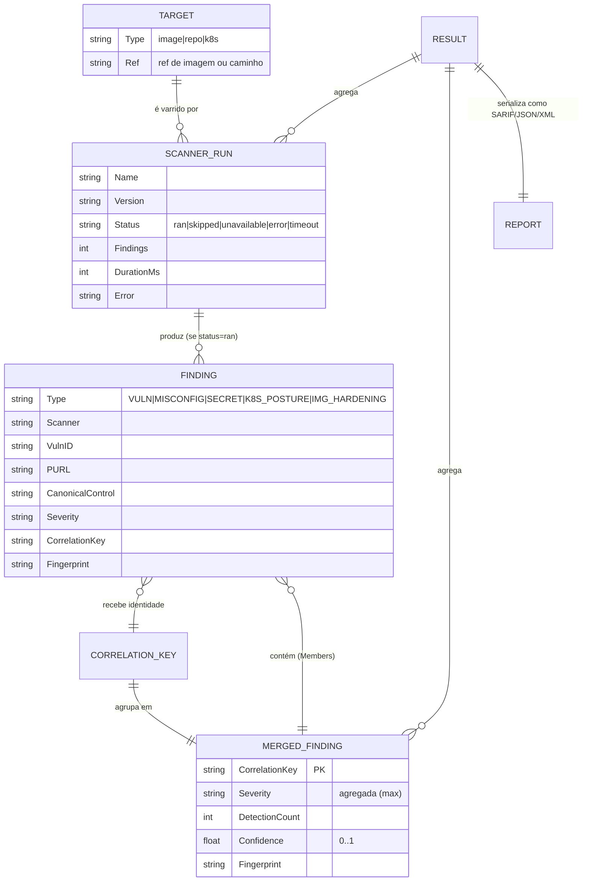
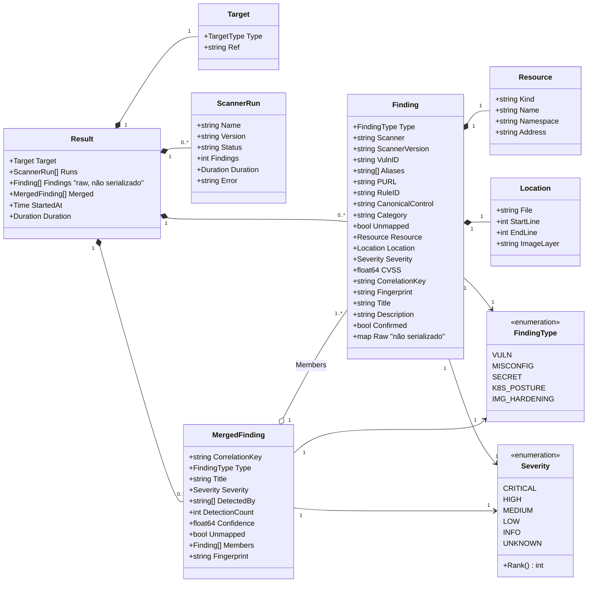
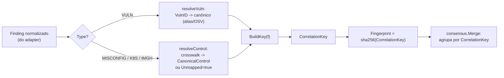
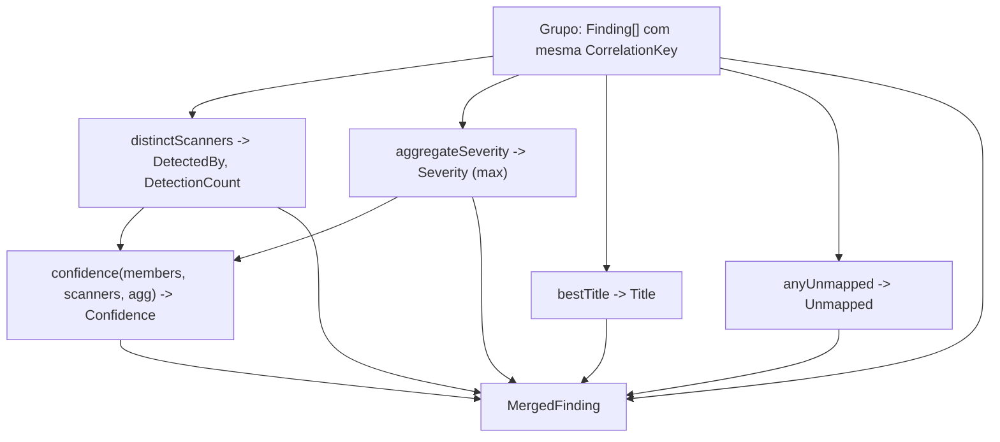

# 05 — Modelagem de Dados

Este documento descreve o **modelo de dados do Quorum** (`quorum-sec-scan`, v0.2.3). O Quorum é uma ferramenta **CLI/Docker** de *consensus security scanning*: ela orquestra um pool de scanners OSS (trivy, grype, checkov, kics, dockle, kubescape), normaliza toda a saída para um **modelo de domínio canônico em memória**, resolve aliases de vulnerabilidade, correlaciona findings equivalentes por um `correlationKey` determinístico, calcula um *score* de confiança (consenso) e serializa o resultado em SARIF (primário), JSON ou XML.

Como o Quorum **não possui banco de dados** (ver [§1](#1-não-há-rdbms--justificativa)), "modelo de dados" aqui significa o **modelo de domínio**: um conjunto de `struct`s Go imutáveis durante o pipeline, com três projeções de persistência (SARIF/JSON/XML) geradas a cada execução. Este documento cobre os três níveis clássicos de modelagem — **Conceitual**, **Lógico** e **Físico** — adaptados a esse contexto, com diagramas Mermaid, invariantes e checklists.

> Fontes verificadas no código: [`internal/model/model.go`](https://github.com/Martinez1991/quorum-sec-scan/blob/main/internal/model/model.go), [`internal/correlate/key.go`](https://github.com/Martinez1991/quorum-sec-scan/blob/main/internal/correlate/key.go), [`internal/correlate/correlate.go`](https://github.com/Martinez1991/quorum-sec-scan/blob/main/internal/correlate/correlate.go), [`internal/consensus/consensus.go`](https://github.com/Martinez1991/quorum-sec-scan/blob/main/internal/consensus/consensus.go), [`internal/orchestrator/orchestrator.go`](https://github.com/Martinez1991/quorum-sec-scan/blob/main/internal/orchestrator/orchestrator.go), [`internal/report/{sarif,json,xml}.go`](https://github.com/Martinez1991/quorum-sec-scan/blob/main/internal/report/), [`internal/severity/severity.go`](https://github.com/Martinez1991/quorum-sec-scan/blob/main/internal/severity/severity.go), [`internal/purl/purl.go`](https://github.com/Martinez1991/quorum-sec-scan/blob/main/internal/purl/purl.go), [`internal/adapter/adapter.go`](https://github.com/Martinez1991/quorum-sec-scan/blob/main/internal/adapter/adapter.go).

---

## 1. Não há RDBMS — justificativa

O Quorum **não usa banco de dados relacional** (PostgreSQL, MySQL, SQLite etc.), nem NoSQL, nem qualquer *datastore* persistente de domínio. Isso é uma decisão arquitetural, não uma lacuna.

| Critério | Realidade do Quorum |
|---|---|
| Topologia de execução | Processo **CLI** efêmero (ou container Docker), uma execução = uma varredura |
| Ciclo de vida dos dados | Todos os findings vivem **em memória** (`[]model.Finding`) durante uma única execução e são **serializados para arquivo/stdout** ao final |
| Estado entre execuções | **Stateless** por design. Não há histórico, usuários, sessões ou multi-tenancy |
| Persistência existente | Apenas **caches de arquivo**: aliases (`~/.cache/quorum/aliases.json`) e DB do grype pré-cacheado na imagem `:full` — caches reconstruíveis, não fonte de verdade |
| Concorrência de escrita | Inexistente — não há writers concorrentes a coordenar; o paralelismo é fan-out de leitura de scanners (goroutines) |

**Por que um RDBMS seria a ferramenta errada:**

1. **Sem entidades de longa duração.** Um banco serve para guardar estado que sobrevive a processos e é consultado/atualizado por múltiplos clientes. O Quorum produz um relatório e termina. O "estado" é o arquivo SARIF/JSON/XML.
2. **A integração natural é o ecossistema de CI/segurança.** O destino dos dados é o GitHub Code Scanning (via SARIF), artefatos de pipeline e *gates* de exit code — não dashboards consultando um banco.
3. **Reprodutibilidade.** O `correlationKey`/`Fingerprint` são **determinísticos e puros** (função do conteúdo do finding). A "chave primária" do domínio é derivada, não auto-incremento de um banco.
4. **Operação simples e auditável.** Sem banco não há *migrations*, *connection pools*, *backups* ou superfície de ataque de dados em repouso. Alinha com o princípio de *supply chain* mínima do projeto.

> **Proposta futura (claramente separada, NÃO implementada):** se um dia surgir necessidade de histórico/tendências (ex.: "este CVE reaparece há 3 releases"), o caminho idiomático seria **ingerir os SARIF/JSON já emitidos** em um *store* externo (ex.: o próprio GitHub Advanced Security, um data lake, ou um SQLite append-only de séries temporais) **fora** do binário Quorum. O núcleo permaneceria stateless. Isso é uma ideia, não um compromisso de roadmap.

---

## 2. Modelo Conceitual

No nível conceitual, o domínio do Quorum descreve **o que** é representado, independentemente de Go ou de formato de arquivo.

### 2.1 Entidades de domínio

| Entidade | Significado conceitual |
|---|---|
| **Target** | O artefato sendo varrido: imagem de container, repositório/IaC ou manifestos/cluster k8s |
| **Scanner (Adapter)** | Um motor OSS que inspeciona o Target e produz achados nativos |
| **ScannerRun** | O registro de **o que aconteceu** com um scanner em uma execução (rodou? falhou? indisponível?) — transparência: "0 vulns nunca pode parecer 'não rodou'" |
| **Finding** | A **unidade canônica** de achado, normalizada de qualquer scanner para um único formato |
| **CorrelationKey / Fingerprint** | A **identidade** determinística de um achado, usada para agrupar achados equivalentes de scanners diferentes |
| **MergedFinding** | O resultado de **consenso**: um grupo de Findings equivalentes, com severidade agregada e *score* de confiança |
| **Report** | A projeção serializada (SARIF/JSON/XML) do conjunto de MergedFindings + ScannerRuns |

### 2.2 Diagrama conceitual (ER)



### 2.3 Princípio central: *false split > false merge*

A regra de ouro do domínio é que **separar erroneamente dois achados distintos é preferível a fundir erroneamente achados diferentes**. Isso permeia todo o modelo de identidade (`correlationKey`) e o consenso: na dúvida, o `correlationKey` é mais específico, e findings `Unmapped` nunca se fundem silenciosamente com outros (ver [§4.4](#44-controlkey-e-tratamento-de-unmapped)).

---

## 3. Modelo Lógico

O nível lógico descreve **atributos, tipos, cardinalidades, invariantes e relacionamentos** — ainda sem se prender à sintaxe Go.

### 3.1 Diagrama de classes



### 3.2 Enumerações

#### `FindingType` — classifica e seleciona a estratégia de correlação

| Valor | Significado | Produzido por (típico) |
|---|---|---|
| `VULN` | Vulnerabilidade de software (SCA) | trivy, grype |
| `MISCONFIG` | Má-configuração de IaC | checkov, kics, trivy |
| `SECRET` | Segredo exposto | trivy |
| `K8S_POSTURE` | Postura de segurança Kubernetes | kubescape |
| `IMG_HARDENING` | Endurecimento de imagem de container | dockle |

`FindingType` é o **discriminador** que seleciona o algoritmo de `BuildKey` (ver [§4](#4-correlationkey-e-fingerprint-identidade)).

#### `Severity` — escala normalizada única

| Valor | `Rank()` | Origem da normalização |
|---|---|---|
| `CRITICAL` | 5 | CVSS ≥ 9.0; labels "CRITICAL"/"CRIT" |
| `HIGH` | 4 | CVSS ≥ 7.0; "HIGH"/"ERROR"/"DANGER"; Dockle "FATAL" |
| `MEDIUM` | 3 | CVSS ≥ 4.0; "MEDIUM"/"MODERATE"/"WARNING"; Dockle "WARN" |
| `LOW` | 2 | CVSS > 0; "LOW"/"MINOR"; Dockle "INFO" |
| `INFO` | 1 | "INFO"/"INFORMATIONAL"/"NEGLIGIBLE"; Dockle "PASS/SKIP/IGNORE" |
| `UNKNOWN` | 0 | CVSS = 0; "UNKNOWN"/"NONE"/vazio; rótulo não reconhecido |

A normalização vive em [`internal/severity/severity.go`](https://github.com/Martinez1991/quorum-sec-scan/blob/main/internal/severity/severity.go): `FromCVSS`, `FromLabel`, `FromDockle`, mais utilitários `Max`, `AtLeast` (usado por `--fail-on`/`--min-severity`) e `Parse`. `Rank()` torna a escala ordenável para agregação e ordenação de relatório.

### 3.3 Atributos de `Finding` (entidade central)

| Atributo | Tipo lógico | Obrigatório | Notas |
|---|---|---|---|
| `Type` | FindingType | Sim | Discriminador de correlação |
| `Scanner` | string | Sim | Nome do adapter de origem |
| `ScannerVersion` | string | Não | Versão do binário |
| `VulnID` | string | Condicional (VULN) | CVE/GHSA; **canônico após resolução de alias** |
| `Aliases` | string[] | Não | Outros ids reportados pelo scanner |
| `PURL` | string | Condicional (VULN) | `pkg:type/ns/name@version` |
| `RuleID` | string | Condicional (MISCONFIG/etc.) | Id nativo da regra; entrada do crosswalk |
| `CanonicalControl` | string | Não | Resultado do crosswalk (AVD/CWE/CIS) |
| `Category` | string | Não | Categoria semântica (fallback do crosswalk) |
| `Unmapped` | bool | Não | `true` quando o crosswalk não resolveu controle |
| `Resource` | Resource | Não | Objeto IaC/k8s alvo |
| `Location` | Location | Não | Arquivo/linha ou layer de imagem |
| `Severity` | Severity | Sim | Escala normalizada |
| `CVSS` | float64 | Não | `0` = ausente |
| `CorrelationKey` | string | **Computado** | Atribuído pelo correlator, nunca pelo adapter |
| `Fingerprint` | string | **Computado** | `sha256(CorrelationKey)` |
| `Title` | string | Sim | Título legível |
| `Description` | string | Não | |
| `Confirmed` | bool | Não | Confirmado por fonte autoritativa (NVD/OSV) |
| `Raw` | map[string]any | Não | Payload original; **não serializado** (tag `json:"-"`) |

### 3.4 Relacionamentos e cardinalidades

| Relacionamento | Cardinalidade | Regra |
|---|---|---|
| Result → ScannerRun | 1 : 0..N | Um run por adapter selecionado (mesmo se `skipped`/`unavailable`) |
| ScannerRun → Finding | 1 : 0..N | Só `status=ran` produz findings; demais produzem 0 |
| Finding → CorrelationKey | N : 1 | Muitos findings podem compartilhar a mesma chave |
| CorrelationKey → MergedFinding | 1 : 1 | Cada chave distinta vira exatamente um MergedFinding |
| MergedFinding → Finding (Members) | 1 : 1..N | Sempre ≥ 1 membro (grupo nunca vazio) |
| Finding → Resource / Location | 1 : 1 | *Value objects* embutidos (sempre presentes, possivelmente vazios) |

### 3.5 Invariantes e *constraints* lógicas

Estas são as restrições que substituem as *constraints* de um RDBMS. Não há um motor que as imponha em uma tabela — elas são garantidas **por construção no código** e/ou verificadas por testes de contrato/unitários.

- **INV-1 (identidade computada).** Adapters **nunca** preenchem `CorrelationKey`/`Fingerprint`. Esses campos são atribuídos centralmente em `Correlator.Enrich` (ou no fallback do orchestrator). Origem: comentário em `model.go` e `orchestrator.go` linhas 95-103.
- **INV-2 (Fingerprint deriva da chave).** Sempre `Fingerprint == sha256hex(CorrelationKey)`. Função pura, sem sal. Origem: `correlate.Fingerprint`.
- **INV-3 (severidade agregada = máximo).** `MergedFinding.Severity == max(Members[*].Severity)` por `Rank()`. Origem: `consensus.aggregateSeverity`.
- **INV-4 (contagem por scanner distinto).** `DetectionCount == |distinct(lower(Members[*].Scanner))|`, **não** o número de findings — dois findings do mesmo scanner contam 1. Origem: `consensus.distinctScanners`/`DetectionCount`.
- **INV-5 (`DetectedBy` ordenado e único).** Lista de scanners distintos, *lowercased* e ordenada alfabeticamente. Origem: `distinctScanners` (usa `sort.Strings`).
- **INV-6 (confiança limitada).** `0 ≤ Confidence ≤ 1` (via `clamp01`). Origem: `consensus.confidence`.
- **INV-7 (propagação de `Unmapped`).** `MergedFinding.Unmapped == OR(Members[*].Unmapped)`. Origem: `consensus.anyUnmapped`.
- **INV-8 (não-fusão de unmapped).** Um finding `Unmapped` é chaveado por `UNMAPPED:<scanner>:<ruleID>`, garantindo que **nunca** se funda silenciosamente a outro de controle diferente. Origem: `correlate.controlKey`.
- **INV-9 (grupo não-vazio).** Todo `MergedFinding` tem `len(Members) ≥ 1`; `Type`, `Fingerprint` herdam de `Members[0]`. Origem: `consensus.Merge`.
- **INV-10 (`Title` resolvido).** `MergedFinding.Title` é o primeiro título não-vazio entre os membros; *fallback* para o `CorrelationKey`. Origem: `consensus.bestTitle`.
- **INV-11 (ordenação determinística do relatório).** MergedFindings são ordenados por `(Severity.Rank desc, Confidence desc, DetectionCount desc, CorrelationKey asc)`. O critério final por `CorrelationKey` garante estabilidade total. Origem: `consensus.Merge` (`sort.SliceStable`).
- **INV-12 (transparência de scanner).** Todo adapter selecionado gera um `ScannerRun` com `Status ∈ {ran, skipped, unavailable, error, timeout}`, mesmo sem findings. Origem: `orchestrator.runOne`.

#### Checklist de validação de invariantes (para revisão/PR)

- [ ] Nenhum adapter atribui `CorrelationKey` ou `Fingerprint` (INV-1)
- [ ] `Fingerprint` confere com `sha256hex(CorrelationKey)` (INV-2)
- [ ] `Severity` do merge é o máximo dos membros (INV-3)
- [ ] `DetectionCount` = scanners distintos, não findings (INV-4)
- [ ] `Confidence` permanece em [0,1] (INV-6)
- [ ] Findings `Unmapped` jamais co-agrupados com controles diferentes (INV-8)
- [ ] Ordenação do relatório é totalmente determinística (INV-11)
- [ ] Todo scanner selecionado aparece em `Runs` com status válido (INV-12)

---

## 4. `correlationKey` e `Fingerprint` (identidade)

A "chave primária" do domínio é o **`correlationKey`**, uma função **pura e determinística** do conteúdo normalizado do finding, definida em [`internal/correlate/key.go`](https://github.com/Martinez1991/quorum-sec-scan/blob/main/internal/correlate/key.go). **Não há chave universal**: cada `FindingType` tem sua estratégia, refletindo o fato de que "equivalência" significa coisas diferentes para um CVE e para uma má-config de Terraform.

### 4.1 Pipeline de identidade



Enriquecimento e *keying* acontecem em `Correlator.Enrich`; o **agrupamento** é responsabilidade do pacote `consensus`. O pacote `correlate` "owns identity", o `consensus` "owns grouping".

### 4.2 Fórmulas de `BuildKey` por tipo

| Type | Fórmula do `correlationKey` | Estabilidade-alvo |
|---|---|---|
| `VULN` | `VULN\|<UPPER(VulnID)>\|<purl.NameVersion(PURL)>` | Mesmo CVE + mesmo `name@version` correlaciona entre scanners, ignorando prefixo de ecossistema/qualificadores |
| `MISCONFIG` | `MISCONFIG\|<fileKey>\|<resourceType>\|<controlKey>` | `fileKey` = basename minúsculo; `resourceType` derivado do *address* (ex.: `aws_s3_bucket`) |
| `K8S_POSTURE` | `K8S\|<objectRef>\|<lower(Address)>\|<controlKey>` | `objectRef` = `ns/kind/name`; `Address` usado como container |
| `IMG_HARDENING` | `IMGH\|<controlKey>` | Endurecimento é global à imagem |
| `SECRET` | `SECRET\|<normPath>\|<lineKey>\|<lower(RuleID)>` | Caminho normalizado + linha + regra |
| *(default)* | `OTHER\|<Scanner>\|<Title>` | Fallback conservador |

### 4.3 Normalização de componentes

| Helper | O que faz | Por quê |
|---|---|---|
| `purl.NameVersion` | Tira `pkg:`, qualificadores `?`/`#`; minúsculo | Mesmo pacote correlaciona apesar de variações de ecossistema |
| `fileKey` | `path.Base` + minúsculo | Scanners reportam raízes/relatividade diferentes; só o basename é estável |
| `normPath` | Normaliza separadores, `path.Clean`, remove `./`,`/`, minúsculo | Caminho estável para SECRET |
| `resourceType` | Primeiro segmento do *address* contendo `_` (ex.: `aws_s3_bucket`); *fallback* para `Kind` | Engines discordam entre *address* Terraform e nome literal do recurso |
| `objectRef` | `lower(namespace/kind/name)`, `namespace` vazio → `default` | Identidade estável de objeto k8s |
| `lineKey` | `StartLine` (ou `0` se ausente) | Discrimina segredos na mesma regra/arquivo |

### 4.4 `controlKey` e tratamento de `Unmapped`

`controlKey` prefere `CanonicalControl` (maiúsculo). Quando **não há controle resolvido**, faz *fallback* para `UNMAPPED:<lower(scanner)>:<UPPER(RuleID)>`. Isso materializa o princípio *false split > false merge*: um finding sem mapeamento canônico **mantém uma identidade própria** e nunca colide com outro de controle distinto.

> **Trade-off documentado (KNOWN ISSUE no código):** para `MISCONFIG`, dois recursos distintos do **mesmo tipo** com o **mesmo controle** no **mesmo arquivo** podem *super-fundir*. Foi aceito conscientemente como preferível a nunca correlacionar entre engines.

---

## 5. Consenso e `MergedFinding`

O `consensus.Merge` ([`internal/consensus/consensus.go`](https://github.com/Martinez1991/quorum-sec-scan/blob/main/internal/consensus/consensus.go)) agrupa `Finding`s por `CorrelationKey` e produz `MergedFinding`s pontuados. **Contagem bruta de detecções não é confiança** — diversidade de engine, severidade e confirmação autoritativa também pesam (DESIGN §9).

### 5.1 Fórmula de `Confidence`

```
confidence = clamp01(
      0.35 * count
    + 0.25 * diversity
    + 0.25 * severity
    + 0.15 * authoritative
)
```

| Componente | Cálculo | Faixa |
|---|---|---|
| `count` | `log(1+N) / log(5)`, N = scanners distintos (retornos decrescentes) | ~0..1 |
| `diversity` | famílias de engine distintas: 1→0.33, 2→0.66, 3+→1.0 | 0..1 |
| `severity` | CRITICAL=1.0, HIGH=0.8, MEDIUM=0.5, LOW=0.3, INFO/UNKNOWN=0.1 | 0.1..1 |
| `authoritative` | 1.0 se algum membro `Confirmed`, **ou** for CVE com CVSS>0; senão 0 | 0 ou 1 |

Famílias de engine (`scannerCategory`): `trivy`/`grype` → `sca`; `checkov`/`kics` → `iac`; `kubescape`/`polaris` → `k8s`; `dockle` → `hardening`. Scanners desconhecidos viram `other:<nome>`, contando como família própria (diversidade não infla artificialmente).

### 5.2 Diagrama de derivação do MergedFinding



---

## 6. Modelo Físico

No nível físico, o "armazenamento" do Quorum é (a) o **layout de structs Go em memória** e (b) as **três projeções serializadas**. Não há *schema* SQL.

### 6.1 Físico em memória — structs Go

As definições canônicas estão em [`internal/model/model.go`](https://github.com/Martinez1991/quorum-sec-scan/blob/main/internal/model/model.go). Pontos físicos relevantes:

- `Finding.Raw map[string]any` tem tag `json:"-"` → **nunca serializado**; existe só para depuração/adapters.
- `Result.Findings` tem tag `json:"-"` → os findings brutos **não** vão para o relatório padrão; o relatório expõe `Merged` (renomeado para `findings` no JSON). Origem: `orchestrator.Result`.
- Campos com `omitempty` desaparecem quando vazios (ex.: `aliases`, `purl`, `cvss`, `description`).
- `Severity` e `FindingType` são `string` *typedef*s — serializam como strings literais (`"CRITICAL"`, `"VULN"`).

### 6.2 Físico serializado — três projeções

| Formato | Reporter | Papel | Forma |
|---|---|---|---|
| **SARIF 2.1.0** | [`sarif.go`](https://github.com/Martinez1991/quorum-sec-scan/blob/main/internal/report/sarif.go) | **Primário** — GitHub Code Scanning | `runs[].results[]` com `partialFingerprints["quorum/v1"]` |
| **JSON** | [`json.go`](https://github.com/Martinez1991/quorum-sec-scan/blob/main/internal/report/json.go) | Integração genérica / detalhe | `{tool, version, target, scanners, summary, findings}` (`findings` = dump de `[]MergedFinding`) |
| **XML** | [`xml.go`](https://github.com/Martinez1991/quorum-sec-scan/blob/main/internal/report/xml.go) | Pipelines legados/JUnit-like | `<quorumReport>` espelhando o JSON |

#### 6.2.1 Mapeamento canônico → SARIF

| Campo canônico | Destino SARIF |
|---|---|
| `MergedFinding.Fingerprint` | `result.partialFingerprints["quorum/v1"]` |
| `Severity` | `result.level` (CRITICAL/HIGH→`error`, MEDIUM→`warning`, resto→`note`) |
| `Title` | `result.message.text` + `rule.shortDescription` |
| `Type` | `rule.name` + `rule.properties.type` |
| `VulnID` / `CanonicalControl` / `RuleID` | `result.ruleId` (nessa ordem de preferência; *fallback* `CorrelationKey`) |
| `Location.File`/`StartLine`/`EndLine` | `result.locations[].physicalLocation` (deduplicado por arquivo) |
| `DetectedBy`, `DetectionCount`, `Confidence` (arredondado 2 casas), `Severity`, `CorrelationKey`, `Unmapped` | `result.properties` |
| `Result.Target.Ref` + resumo de scanners | `run.properties` |

> **Nota de versão:** `report.Version` (namespace do fingerprint e versão do driver SARIF) está fixado em `"0.1.0"` no código ([`sarif.go`](https://github.com/Martinez1991/quorum-sec-scan/blob/main/internal/report/sarif.go) linha 13), distinto da versão do produto (v0.2.3). Ver [Gaps](#gaps).

#### 6.2.2 Estrutura do JSON

```jsonc
{
  "tool": "quorum",
  "version": "0.1.0",
  "target": { "type": "repo", "ref": "./" },
  "scanners": [
    { "name": "trivy", "version": "0.50.0", "status": "ran",
      "findings": 12, "durationMs": 1842 }
  ],
  "summary": {
    "totalFindings": 7,          // = len(Merged)
    "durationMs": 5300,
    "bySeverity": { "CRITICAL": 1, "HIGH": 3 },
    "multiDetected": 2           // findings com detectionCount > 1
  },
  "findings": [ /* []MergedFinding */ ]
}
```

#### 6.2.3 Estrutura do XML

`<quorumReport tool="quorum" version="...">` com `<target>`, `<scanners><scanner .../></scanners>` e `<findings><finding>...</finding></findings>`. Cada `<finding>` carrega `type`, `severity`, `detectionCount`, `confidence`, `unmapped`, `fingerprint` como atributos, e `correlationKey`, `title`, `detectedBy>scanner`, `locations>location` como elementos.

### 6.3 Índices, Triggers, Views, Procedures, Sequences — **N/A**

| Construto | Status | Justificativa |
|---|---|---|
| **Índices** | **N/A** | Não há banco a indexar. O "índice" lógico é o `map[string][]Finding` por `CorrelationKey` em `consensus.Merge`, construído em memória por execução (acesso O(1) amortizado, descartado ao fim) |
| **Triggers** | **N/A** | Sem banco e sem mutações persistentes. A "reação a evento" análoga é o pipeline funcional puro `scan → normalize → alias → correlate → score → report` |
| **Views** | **N/A** | As três serializações (SARIF/JSON/XML) **são** as "views" de leitura do mesmo conjunto canônico, geradas em tempo de execução pelos reporters |
| **Stored Procedures / Functions** | **N/A** | Toda a lógica é código Go (ex.: `BuildKey`, `confidence`). Não há SQL/PL nem RPC de banco |
| **Sequences / Auto-increment** | **N/A** | A identidade é **derivada do conteúdo** (`Fingerprint = sha256(CorrelationKey)`), não gerada por sequência |
| **Constraints (FK/UNIQUE/CHECK)** | **N/A no SGBD; equivalentes no código** | As FKs/uniques são garantidas por construção: agrupamento por `CorrelationKey` (UNIQUE lógico), `Members ⊆ Findings` (FK lógica). Os CHECKs equivalentes são as invariantes da [§3.5](#35-invariantes-e-constraints-lógicas) |
| **Migrations** | **N/A** | Sem *schema* persistente. Mudanças de modelo são mudanças de struct + versionamento de release; compatibilidade externa é responsabilidade do contrato SARIF/JSON/XML |

> **Proposta futura (NÃO implementada):** caso o ingest externo descrito na [§1](#1-não-há-rdbms--justificativa) seja adotado, índices em `(fingerprint)` e `(vulnId)` e *views* materializadas de tendência fariam sentido — **no store externo**, jamais no binário.

---

## 7. Dicionário de dados (resumo)

| Struct | Pacote | Papel | Serializado em |
|---|---|---|---|
| `Finding` | `model` | Unidade canônica normalizada | JSON (dentro de `members`), SARIF (origem dos campos) |
| `MergedFinding` | `model` | Grupo pontuado pós-consenso | SARIF/JSON/XML (unidade de relatório) |
| `Resource` | `model` | Objeto IaC/k8s alvo | embutido |
| `Location` | `model` | Arquivo/linha/layer | SARIF locations, XML locations |
| `Severity` | `model` | Escala normalizada (enum) | string |
| `FindingType` | `model` | Discriminador de correlação (enum) | string |
| `ScannerRun` | `orchestrator` | Transparência de execução | JSON/XML `scanners`, SARIF `run.properties` |
| `Result` | `orchestrator` | Saída completa do scan | base de todos os reporters |
| `Target` | `adapter` | Artefato varrido | `target` em todos os formatos |

---

## Premissas

- **Versão do código analisada:** estado do repositório na branch `main` no momento da redação (produto rotulado v0.2.3). As citações refletem os arquivos lidos diretamente; nenhum comportamento foi inferido sem leitura.
- **`report.Version = "0.1.0"`** foi reportado fielmente como está no código. Assumiu-se que essa string é a versão do **contrato de saída/namespace de fingerprint**, não a versão do produto — ver Gaps.
- **DESIGN.md** é referenciado por seções (§6, §9, §10, §14) conforme comentários no código; o conteúdo detalhado desse documento não foi relido aqui, apenas as âncoras citadas no fonte.
- Os exemplos de JSON/XML são **ilustrativos** da forma definida pelas tags de struct; valores são fictícios.
- "Banco de dados" foi interpretado como *datastore* de domínio persistente; os caches de arquivo (aliases, DB do grype) são tratados como caches reconstruíveis, não como modelo de dados.

### Gaps

- `report.Version` está *hardcoded* em `"0.1.0"` e diverge da versão do produto (v0.2.3); não ficou claro no código se isso é intencional (versionamento de contrato) ou defasagem. Documentado como observação.
- `polaris` aparece em `scannerCategory` (consenso) mas **não** consta na lista de adapters do produto (trivy/grype/checkov/kics/dockle/kubescape); é um placeholder de família de engine. Não há adapter `polaris` em `internal/adapter`.
- O conteúdo numérico exato de algumas seções do DESIGN.md (ex.: matriz de correlação completa) não foi transcrito; apenas o comportamento presente no código foi documentado.

### Open Questions

- A string `report.Version` deve passar a refletir a versão do produto (via *ldflags* do GoReleaser), ou é deliberadamente um versionamento de contrato independente?
- Há intenção de adicionar um adapter `polaris` (justificando sua presença em `scannerCategory`), ou a entrada deve ser removida?
- O dump de `[]MergedFinding` no campo `findings` do JSON inclui `Members` (cada um um `Finding` completo); isso é um contrato de saída estável e suportado, ou detalhe interno sujeito a mudança?
