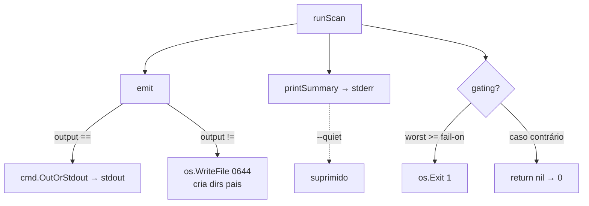
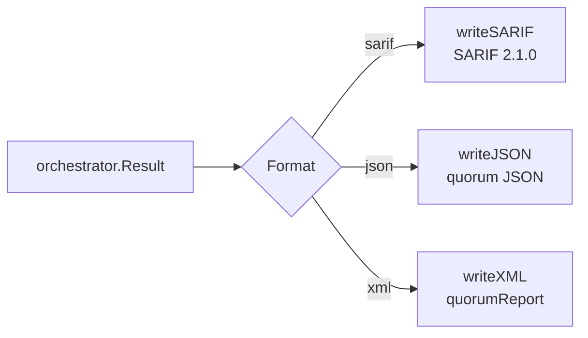
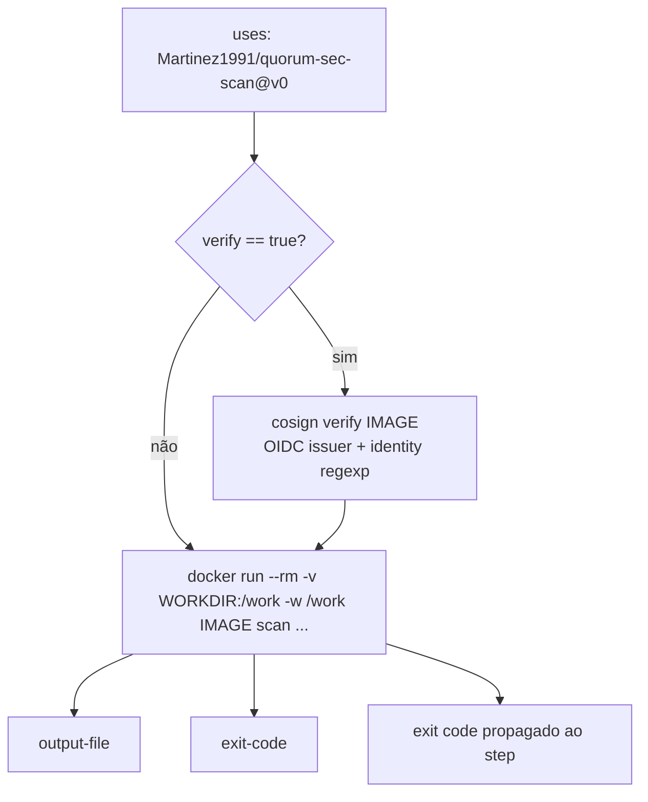
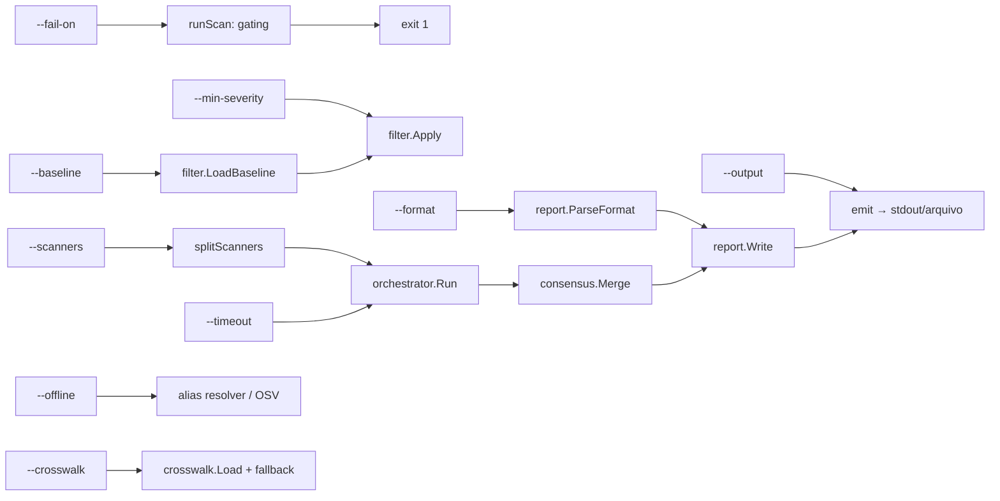

# Interfaces (CLI) e Formatos de Saída

O Quorum (`quorum-sec-scan`, v0.2.3) é uma ferramenta **CLI/Docker only** de _consensus
security scanning_. Não há frontend web, banco de dados relacional, API REST/HTTP ou
camada de autenticação. Portanto, o equivalente a "APIs" deste produto é o conjunto de
**contratos de interface** que ele expõe ao mundo externo:

1. A **interface de linha de comando** (`quorum scan`, `quorum list-scanners`) — entradas
   (args/flags/env), saídas (stdout/stderr/arquivo) e _exit codes_;
2. Os **formatos de saída** (SARIF primário, JSON, XML) — cada um um contrato de
   serialização estável;
3. A **GitHub Action composite** (`action.yml`) — _inputs_/_outputs_ declarativos que
   embrulham a imagem `:full` assinada.

Este documento trata cada comando, flag e formato como um **contrato versionado**: método
de invocação, entradas, saídas, validação, erros e exemplos. Onde o template "API" pede
OpenAPI/HTTP, registramos **N/A** com justificativa técnica e entregamos no lugar um
**JSON Schema** do output JSON e a **interface declarativa do `action.yml`**.

Referências de código (fonte da verdade desta página):
[`cmd/quorum/scan.go`](https://github.com/Martinez1991/quorum-sec-scan/blob/main/cmd/quorum/scan.go), [`cmd/quorum/root.go`](https://github.com/Martinez1991/quorum-sec-scan/blob/main/cmd/quorum/root.go),
[`internal/report/`](https://github.com/Martinez1991/quorum-sec-scan/blob/main/internal/report), [`internal/orchestrator/orchestrator.go`](https://github.com/Martinez1991/quorum-sec-scan/blob/main/internal/orchestrator/orchestrator.go),
[`internal/model/model.go`](https://github.com/Martinez1991/quorum-sec-scan/blob/main/internal/model/model.go), [`action.yml`](https://github.com/Martinez1991/quorum-sec-scan/blob/main/action.yml).

---

## 1. Por que "API HTTP / OpenAPI = N/A"

| Item do template "API" | Aplicabilidade no Quorum | Justificativa técnica |
| --- | --- | --- |
| Endpoint HTTP / REST | **N/A** | Não existe servidor, daemon ou _listener_ de rede. O binário roda, produz o relatório e termina. O `root.go` declara explicitamente "No panel, no daemon". |
| Especificação OpenAPI/Swagger | **N/A** | Não há superfície HTTP a descrever. O contrato equivalente é a **CLI** (esta página) + o **JSON Schema do output** (§7) + a **interface do `action.yml`** (§8). |
| Autenticação / OAuth / API keys | **N/A** | Sem contas, sem sessão, sem multi-tenant. A única credencial relevante é a verificação **keyless cosign (OIDC)** da imagem na Action — não é autenticação de usuário. Ver [10-infraestrutura.md](10-infraestrutura.md). |
| _Rate limiting_ de API | **N/A para a CLI**; aplica-se de forma indireta ao OSV.dev | A CLI não impõe nem sofre _rate limit_ próprio. O único acesso de rede é a resolução de aliases via OSV.dev, com **degradação graciosa** em falha/limite e desligamento total via `--offline`. Ver §5 e [07-persistencia-e-artefatos.md](07-persistencia-e-artefatos.md). |
| Versionamento de API | Aplica-se como **versionamento por release/semver** + **schema `quorum/v1`** | Ver §9. |

> A rede só é tocada para enriquecimento de aliases (OSV.dev) e, no contexto da Action,
> para baixar/verificar a imagem. O fluxo de scan em si é local ao host/contêiner.

---

## 2. Mapa das interfaces

```mermaid
flowchart LR
    subgraph Invocacao
        A[Binário nativo<br/>quorum] 
        B[Docker<br/>ghcr.io/.../quorum-sec-scan:full|:slim]
        C[GitHub Action<br/>Martinez1991/quorum-sec-scan@v0]
    end
    A --> CLI[CLI cobra]
    B --> CLI
    C -->|docker run| B
    CLI -->|scan <target>| ORCH[Orchestrator]
    CLI -->|list-scanners| REG[Registro de adapters]
    ORCH --> REP[report.Write]
    REP -->|sarif / json / xml| OUT{--output?}
    OUT -->|vazio| STDOUT[stdout]
    OUT -->|arquivo| FILE[arquivo no disco]
    CLI -->|progresso/summary| STDERR[stderr]
    CLI -->|0 / 1 / 2| EXIT[exit code]
```

---

## 3. Contrato global da CLI

| Aspecto | Contrato |
| --- | --- |
| Binário | `quorum` |
| Comandos | `scan <target>`, `list-scanners` |
| Flags globais | `--version` / `-v` (imprime a versão), `--help` / `-h` |
| Versão | Injetada em build via `-ldflags "-X main.version=..."`; default de fallback `0.1.0` (`root.go`). A versão também é estampada no driver SARIF e no namespace de fingerprint (`report.Version`). |
| `stdout` | **Apenas o relatório** quando `--output` está vazio. Nada mais é escrito em stdout. |
| `stderr` | Logs de progresso (`[quorum] ...`) e o bloco de _summary_ humano. Silenciável com `--quiet`/`-q`. |
| Comportamento de erro | `SilenceUsage: true` e `SilenceErrors: true` no root — erros são tratados pelo `main` (sem _usage dump_ ruidoso). |

### 3.1 Contrato de exit codes (compartilhado por todos os comandos)

| Exit code | Significado | Origem no código |
| --- | --- | --- |
| `0` | OK — execução concluída e **nenhum finding atingiu `--fail-on`** (ou `--fail-on` ausente). | Retorno normal de `runScan`. |
| `1` | **Gate disparado** — pelo menos um finding tem severidade `>= --fail-on`. | `os.Exit(1)` em `runScan` após `severity.AtLeast(worst, failThreshold)`. |
| `2` | **Erro de uso ou runtime** — flag inválida, baseline inexistente, formato desconhecido, falha de carga de crosswalk, erro fatal do pipeline. | Retorno de `error` de `RunE`, convertido em exit 2 pelo `main`. |

> Princípio operacional: o exit code é o **mecanismo de gating em CI**. `0` não significa
> "seguro" — significa "nada cruzou o limiar". O próprio _summary_ reforça: _"0 findings is
> not proof of safety"_. Ver [09-backend.md](09-backend.md).

---

## 4. Comando `scan <target>` — contrato detalhado

### 4.1 Invocação

```text
quorum scan <target> [flags]
```

- `<target>` é **obrigatório e exatamente 1 argumento** (`cobra.ExactArgs(1)`). Zero ou
  mais de um argumento → erro de uso (exit 2).
- `<target>` é uma referência de imagem (`alpine:3.19`), um diretório de
  repositório/IaC (`.`, `/work`) ou um diretório de manifestos k8s.

### 4.2 Entradas — flags

Definidas em [`cmd/quorum/scan.go`](https://github.com/Martinez1991/quorum-sec-scan/blob/main/cmd/quorum/scan.go) (`newScanCmd`):

| Flag | Curta | Tipo | Default | Descrição / validação |
| --- | --- | --- | --- | --- |
| `--type` | — | string | `""` (inferido) | `image \| repo \| k8s`. Aceita aliases: `repo` = `fs`/`dir`, `k8s` = `kubernetes`/`manifests`. Valor inválido → erro (exit 2). Se omitido, infere: caminho existente em disco ⇒ `repo`; caso contrário ⇒ `image`. |
| `--scanners` | — | string (CSV) | `""` (todos) | Lista separada por vírgula. Normalizada para minúsculas, espaços e itens vazios descartados. Nomes desconhecidos **não abortam**: geram `warning: unknown scanner ...` e são ignorados (orchestrator). |
| `--format` | `-f` | string | `sarif` | `sarif \| json \| xml` (case-insensitive, _trimmed_). Inválido → `unknown format ...` (exit 2). |
| `--output` | `-o` | string | `""` (stdout) | Caminho do arquivo de saída. Diretórios pais são criados (`MkdirAll 0755`); arquivo escrito com modo `0644`. Vazio ⇒ stdout. |
| `--fail-on` | — | string | `""` | `critical \| high \| medium \| low`. Habilita gating. Inválido → erro (exit 2). |
| `--min-severity` | — | string | `""` | Remove findings abaixo deste nível **do relatório e do gating** (filtro aplicado antes de emitir/gating). Inválido → erro (exit 2). |
| `--baseline` | — | string | `.quorumignore` | Arquivo de fingerprints/correlationKeys a suprimir. Se o usuário **passou explicitamente** a flag e o arquivo não existe ⇒ erro (exit 2). Se for o default e não existir ⇒ segue sem baseline. |
| `--crosswalk` | — | string | `./crosswalk` | Diretório de mapeamentos. Se default e `./crosswalk` ausente, faz **fallback automático** para `/opt/quorum/crosswalk` (bundle da imagem). Se passado explicitamente, é respeitado _verbatim_. |
| `--cache` | — | string | `~/.cache/quorum/aliases.json` (via `os.UserCacheDir`) | Arquivo de cache do resolvedor de aliases. Fallback `.quorum-cache.json` se o cache dir do SO não resolver. |
| `--timeout` | — | duration | `5m` | _Timeout_ **por scanner** (não global). Formato Go `time.Duration` (`30s`, `2m`, `1h`). |
| `--offline` | — | bool | `false` | Desliga lookups OSV.dev (usa aliases locais do scanner + cache). |
| `--quiet` | `-q` | bool | `false` | Suprime logs de progresso e o _summary_ em stderr. |

> **Nota sobre o _probe_ de versão**: o _timeout_ de _probe_ (60s, `Options.ProbeTime`) é
> uma constante interna do orchestrator e **não é exposto como flag** nesta versão. Distingue
> _timeout_ / killed(OOM) / não-instalado. Ver [09-backend.md](09-backend.md).

### 4.3 Entradas — variáveis de ambiente

A CLI **não lê variáveis de ambiente próprias** para configuração (não há binding env→flag
no `scan.go`). As únicas variáveis relevantes são herdadas do ambiente:

- `HOME` / equivalentes do SO — usadas por `os.UserCacheDir()` para resolver o default de `--cache`.
- A **Action** (`action.yml`) injeta os _inputs_ como env (`TARGET`, `TYPE`, ...) **apenas
  dentro do seu próprio script shell**, traduzindo-os para flags da CLI; isso é detalhe da
  Action, não da CLI.

### 4.4 Saídas



- **stdout**: o relatório serializado (SARIF/JSON/XML) quando `--output` é vazio.
- **arquivo**: o mesmo conteúdo, quando `--output` é informado.
- **stderr**: logs `[quorum] target=... type=... crosswalk=N rules ...`, status por scanner
  e o bloco `── quorum summary ──` (contagens por severidade, multi-detectados, _elapsed_, e
  a nota "0 findings is not proof of safety"). Tudo isso é suprimido por `--quiet`.

### 4.5 Validação e erros (resumo)

| Condição | Mensagem (forma) | Exit |
| --- | --- | --- |
| Nº de args ≠ 1 | erro de args do cobra | 2 |
| `--type` inválido | `invalid --type "x" (want image\|repo\|k8s)` | 2 |
| `--fail-on` inválido | `invalid --fail-on "x" (want critical\|high\|medium\|low)` | 2 |
| `--min-severity` inválido | `invalid --min-severity "x" (...)` | 2 |
| `--baseline` explícito inexistente | `baseline file not found: <path>` | 2 |
| `--format` inválido | `unknown format "x" (want sarif\|json\|xml)` | 2 |
| Falha ao carregar crosswalk | `loading crosswalk: ...` | 2 |
| Erro no pipeline (orchestrator) | erro propagado | 2 |
| Finding `>= --fail-on` | (não é erro) gate logado, exit 1 | 1 |

### 4.6 Exemplos

```bash
# 1) Scan de repositório, gate em HIGH, SARIF para arquivo (caso típico de CI)
quorum scan . --type repo --fail-on high -o quorum.sarif

# 2) Scan de imagem, apenas dois scanners, saída JSON em stdout
quorum scan alpine:3.19 --type image --scanners trivy,grype --format json

# 3) Manifests k8s, offline, suprimindo achados abaixo de MEDIUM
quorum scan ./k8s --type k8s --offline --min-severity medium

# 4) Com baseline e timeout maior por scanner
quorum scan . --baseline .quorumignore --timeout 10m -o report.xml -f xml

# 5) Via Docker (imagem self-contained :full)
docker run --rm -v "$PWD:/work" -w /work \
  ghcr.io/martinez1991/quorum-sec-scan:full \
  scan . --type repo --fail-on critical -o quorum.sarif
```

---

## 5. `--offline`, OSV.dev e _rate limiting_

- Sem `--offline`, o resolvedor de aliases pode consultar **OSV.dev** (preferindo IDs CVE),
  com cache local em `~/.cache/quorum/aliases.json`.
- A CLI **não implementa _rate limiting_ próprio** e não expõe controles de _throttling_. Em
  falha de rede ou indisponibilidade do OSV, há **degradação graciosa**: o pipeline segue com
  aliases locais do scanner + cache, sem abortar.
- `--offline` desliga completamente o acesso de rede do resolvedor (`osv` fica `nil` em
  `runScan`). Em ambientes de CI _air-gapped_, é a flag a usar.

Detalhes em [07-persistencia-e-artefatos.md](07-persistencia-e-artefatos.md).

---

## 6. Comando `list-scanners` — contrato

### 6.1 Invocação

```text
quorum list-scanners
```

- Sem argumentos, sem flags específicas.
- Lista os adapters registrados (ordenados por nome) e seus tipos de finding suportados
  (`Capabilities()`).

### 6.2 Saída

- **stdout**, uma linha por scanner, formato `"%-12s %v"` (nome alinhado + slice de tipos):

```text
checkov      [MISCONFIG SECRET]
dockle       [IMG_HARDENING]
grype        [VULN]
kics         [MISCONFIG]
kubescape    [K8S_POSTURE]
trivy        [VULN MISCONFIG SECRET]
```

> Os tipos exatos por scanner vêm de cada adapter (`Capabilities()`). A tabela acima é
> ilustrativa da **forma** da saída — consulte os adapters em
> [`internal/adapter/`](https://github.com/Martinez1991/quorum-sec-scan/blob/main/internal/adapter) para a lista canônica e
> [09-backend.md](09-backend.md).

### 6.3 Exit codes

- `0` em sucesso; `2` apenas em erro inesperado de runtime.

---

## 7. Contrato dos formatos de saída

Selecionados por `--format`/`-f`. Todos os três serializam o **mesmo `orchestrator.Result`**
(`internal/report/report.go` → `Write`). Diferem na forma e no consumidor-alvo.



### 7.1 SARIF (primário) — `--format sarif`

Fonte: [`internal/report/sarif.go`](https://github.com/Martinez1991/quorum-sec-scan/blob/main/internal/report/sarif.go).

- `$schema`: `https://raw.githubusercontent.com/oasis-tcs/sarif-spec/master/Schemata/sarif-schema-2.1.0.json`
- `version`: `2.1.0`
- Um único `run` com:
  - `tool.driver`: `name: "quorum"`, `informationUri`, `version` (= `report.Version`), e a
    lista `rules` (deduplicada por `ruleId`, ordenada por id).
  - `results[]`: um por `MergedFinding`.
  - `properties` do run: `target` (ref) e `scanners` (array de `{name, status, version}`).

**Contrato de cada `result`:**

| Campo | Origem | Observação |
| --- | --- | --- |
| `ruleId` | `sarifRuleID(m)` | Para `VULN`: `VulnID` do 1º membro (CVE/GHSA). Para os demais tipos: `CanonicalControl` (AVD/CIS) ou, na falta, `RuleID` do scanner; _fallback_ final: `CorrelationKey`. |
| `level` | `sarifLevel(severity)` | `CRITICAL`/`HIGH` ⇒ `error`; `MEDIUM` ⇒ `warning`; demais ⇒ `note`. |
| `message.text` | `m.Title` | |
| `locations[]` | membros com `Location.File` | Deduplicadas por arquivo; `region.startLine/endLine` quando `StartLine > 0`. |
| `partialFingerprints` | `{ "quorum/v1": m.Fingerprint }` | **Chave de correlação estável** entre execuções (= `sha256(correlationKey)`). É o que evita duplicação/_re-alert_ em GitHub Code Scanning. |
| `properties` | objeto Quorum | `detectedBy` (lista de scanners), `detectionCount`, `confidence` (arredondado a 2 casas), `severity`, `correlationKey`, `unmapped`. |

Exemplo (recortado):

```json
{
  "$schema": "https://raw.githubusercontent.com/oasis-tcs/sarif-spec/master/Schemata/sarif-schema-2.1.0.json",
  "version": "2.1.0",
  "runs": [
    {
      "tool": {
        "driver": {
          "name": "quorum",
          "informationUri": "https://github.com/quorum-sec/quorum",
          "version": "0.2.3",
          "rules": [
            { "id": "CVE-2023-1234", "name": "VULN",
              "shortDescription": { "text": "openssl: heap overflow" },
              "properties": { "type": "VULN" } }
          ]
        }
      },
      "results": [
        {
          "ruleId": "CVE-2023-1234",
          "level": "error",
          "message": { "text": "openssl: heap overflow" },
          "locations": [],
          "partialFingerprints": { "quorum/v1": "9f2b...c0" },
          "properties": {
            "detectedBy": ["trivy", "grype"],
            "detectionCount": 2,
            "confidence": 0.88,
            "severity": "HIGH",
            "correlationKey": "VULN|CVE-2023-1234|pkg:apk/alpine/openssl",
            "unmapped": false
          }
        }
      ],
      "properties": {
        "target": "alpine:3.19",
        "scanners": [
          { "name": "grype", "status": "ran", "version": "0.74.0" },
          { "name": "trivy", "status": "ran", "version": "0.50.0" }
        ]
      }
    }
  ]
}
```

> O `partialFingerprints["quorum/v1"]` é o **ponto de integração mais importante** com
> plataformas que consomem SARIF (ex.: GitHub Advanced Security): garante deduplicação
> determinística baseada no consenso, e não no scanner individual.

### 7.2 JSON — `--format json`

Fonte: [`internal/report/json.go`](https://github.com/Martinez1991/quorum-sec-scan/blob/main/internal/report/json.go). _Encoder_ com indentação de
2 espaços e `SetEscapeHTML(false)`.

Forma estável (`jsonReport`):

```jsonc
{
  "tool": "quorum",
  "version": "0.2.3",
  "target": { "type": "image", "ref": "alpine:3.19" },
  "scanners": [ /* []orchestrator.ScannerRun */ ],
  "summary": {
    "totalFindings": 12,
    "durationMs": 8421,
    "bySeverity": { "CRITICAL": 1, "HIGH": 4, "MEDIUM": 5, "LOW": 2 },
    "multiDetected": 6
  },
  "findings": [ /* []model.MergedFinding */ ]
}
```

#### 7.2.1 JSON Schema (Draft 2020-12) — substituto do OpenAPI

Este é o contrato formal do output JSON. Reflete `jsonReport`, `ScannerRun` e `MergedFinding`
(com `members` = `Finding`). Campos com tag `omitempty` no Go são opcionais aqui.

```json
{
  "$schema": "https://json-schema.org/draft/2020-12/schema",
  "$id": "https://github.com/quorum-sec/quorum/schema/quorum-report-v1.json",
  "title": "Quorum JSON Report (quorum/v1)",
  "type": "object",
  "required": ["tool", "version", "target", "scanners", "summary", "findings"],
  "additionalProperties": false,
  "properties": {
    "tool":    { "const": "quorum" },
    "version": { "type": "string", "description": "versão do binário/relatório" },
    "target": {
      "type": "object",
      "required": ["type", "ref"],
      "properties": {
        "type": { "type": "string", "enum": ["image", "repo", "k8s"] },
        "ref":  { "type": "string" }
      },
      "additionalProperties": false
    },
    "scanners": {
      "type": "array",
      "items": { "$ref": "#/$defs/scannerRun" }
    },
    "summary": {
      "type": "object",
      "required": ["totalFindings", "durationMs", "bySeverity", "multiDetected"],
      "properties": {
        "totalFindings": { "type": "integer", "minimum": 0 },
        "durationMs":    { "type": "integer", "minimum": 0 },
        "bySeverity": {
          "type": "object",
          "additionalProperties": { "type": "integer", "minimum": 0 }
        },
        "multiDetected": { "type": "integer", "minimum": 0,
          "description": "findings com detectionCount > 1" }
      },
      "additionalProperties": false
    },
    "findings": {
      "type": "array",
      "items": { "$ref": "#/$defs/mergedFinding" }
    }
  },
  "$defs": {
    "severity": {
      "type": "string",
      "enum": ["CRITICAL", "HIGH", "MEDIUM", "LOW", "INFO", "UNKNOWN"]
    },
    "findingType": {
      "type": "string",
      "enum": ["VULN", "MISCONFIG", "SECRET", "K8S_POSTURE", "IMG_HARDENING"]
    },
    "scannerRun": {
      "type": "object",
      "required": ["name", "status", "findings", "durationMs"],
      "properties": {
        "name":      { "type": "string" },
        "version":   { "type": "string" },
        "status":    { "type": "string",
          "enum": ["ran", "skipped", "unavailable", "error", "timeout"] },
        "findings":  { "type": "integer", "minimum": 0 },
        "durationMs":{ "type": "integer" },
        "error":     { "type": "string" }
      },
      "additionalProperties": false
    },
    "mergedFinding": {
      "type": "object",
      "required": ["correlationKey", "type", "title", "severity",
                   "detectedBy", "detectionCount", "confidence",
                   "members", "fingerprint"],
      "properties": {
        "correlationKey": { "type": "string" },
        "type":           { "$ref": "#/$defs/findingType" },
        "title":          { "type": "string" },
        "severity":       { "$ref": "#/$defs/severity" },
        "detectedBy":     { "type": "array", "items": { "type": "string" } },
        "detectionCount": { "type": "integer", "minimum": 1 },
        "confidence":     { "type": "number", "minimum": 0, "maximum": 1 },
        "unmapped":       { "type": "boolean" },
        "members":        { "type": "array", "items": { "$ref": "#/$defs/finding" } },
        "fingerprint":    { "type": "string",
          "description": "sha256(correlationKey)" }
      },
      "additionalProperties": false
    },
    "finding": {
      "type": "object",
      "required": ["type", "scanner", "severity", "title"],
      "properties": {
        "type":             { "$ref": "#/$defs/findingType" },
        "scanner":          { "type": "string" },
        "scannerVersion":   { "type": "string" },
        "vulnId":           { "type": "string" },
        "aliases":          { "type": "array", "items": { "type": "string" } },
        "purl":             { "type": "string",
          "description": "pkg:type/ns/name@version" },
        "ruleId":           { "type": "string" },
        "canonicalControl": { "type": "string" },
        "category":         { "type": "string" },
        "unmapped":         { "type": "boolean" },
        "resource": {
          "type": "object",
          "properties": {
            "kind":      { "type": "string" },
            "name":      { "type": "string" },
            "namespace": { "type": "string" },
            "address":   { "type": "string" }
          },
          "additionalProperties": false
        },
        "location": {
          "type": "object",
          "properties": {
            "file":       { "type": "string" },
            "startLine":  { "type": "integer" },
            "endLine":    { "type": "integer" },
            "imageLayer": { "type": "string" }
          },
          "additionalProperties": false
        },
        "severity":       { "$ref": "#/$defs/severity" },
        "cvss":           { "type": "number", "description": "0 = ausente" },
        "correlationKey": { "type": "string" },
        "fingerprint":    { "type": "string" },
        "title":          { "type": "string" },
        "description":    { "type": "string" },
        "confirmed":      { "type": "boolean",
          "description": "confirmado por fonte autoritativa (NVD/OSV)" }
      },
      "additionalProperties": false
    }
  }
}
```

> **Observação de fidelidade:** o campo `Raw` de `Finding` tem tag `json:"-"` e **nunca é
> serializado**. Por isso não aparece no schema acima. Da mesma forma, `Result.Findings`
> (raw canônicos) tem tag `json:"-"` no nível do `Result`, mas o reporter JSON publica os
> findings **mergeados** via `MergedFinding.Members`, então os `Finding` aparecem aninhados.

### 7.3 XML — `--format xml`

Fonte: [`internal/report/xml.go`](https://github.com/Martinez1991/quorum-sec-scan/blob/main/internal/report/xml.go). Espelha a estrutura JSON para
pipelines _legacy_/JUnit-like. Cabeçalho `xml.Header`, indentação de 2 espaços.

Forma (`quorumReport`):

```xml
<?xml version="1.0" encoding="UTF-8"?>
<quorumReport tool="quorum" version="0.2.3">
  <target type="image">alpine:3.19</target>
  <scanners>
    <scanner name="trivy" status="ran" version="0.50.0" findings="9"></scanner>
    <scanner name="grype" status="ran" version="0.74.0" findings="7"></scanner>
  </scanners>
  <findings>
    <finding type="VULN" severity="HIGH" detectionCount="2" confidence="0.88"
             fingerprint="9f2b...c0">
      <correlationKey>VULN|CVE-2023-1234|pkg:apk/alpine/openssl</correlationKey>
      <title>openssl: heap overflow</title>
      <detectedBy>
        <scanner>trivy</scanner>
        <scanner>grype</scanner>
      </detectedBy>
      <locations>
        <location file="Dockerfile" startLine="3" endLine="3"></location>
      </locations>
    </finding>
  </findings>
</quorumReport>
```

Atributos/elementos relevantes: `unmapped` só aparece quando `true` (`omitempty`); `error`
no `<scanner>` só quando presente; locations deduplicadas por arquivo.

### 7.4 Comparativo dos formatos

| Característica | SARIF | JSON | XML |
| --- | --- | --- | --- |
| Default | **Sim** | Não | Não |
| Consumidor-alvo | GitHub Code Scanning, IDEs, dashboards SARIF | automação/scripts, _diff_ programático | pipelines legacy/JUnit-like |
| Fingerprint estável | `partialFingerprints["quorum/v1"]` | `findings[].fingerprint` | atributo `fingerprint` |
| Summary agregado | via `properties` + rules | bloco `summary` dedicado | atributos no `<scanner>` |
| Status por scanner | `run.properties.scanners` | `scanners[]` completo | `<scanners>` |
| Membros brutos (`Finding`) | não (só consenso) | sim (`members[]`) | parcial (locations/detectedBy) |

---

## 8. Interface da GitHub Action (`action.yml`) — substituto do "contrato de API"

Fonte: [`action.yml`](https://github.com/Martinez1991/quorum-sec-scan/blob/main/action.yml). Tipo **composite**. Disponível a partir de v0.2.1+;
_pin_ via tag móvel `v0`. A Action embrulha a imagem `:full` (self-contained) e, por padrão,
**verifica a assinatura cosign** antes de rodar.



### 8.1 Inputs

| Input | Required | Default | Mapeia para |
| --- | --- | --- | --- |
| `target` | não | `.` | arg `<target>` |
| `type` | não | `""` | `--type` (se não vazio) |
| `scanners` | não | `""` | `--scanners` (se não vazio) |
| `format` | não | `sarif` | `--format` |
| `output` | não | `quorum.sarif` | `--output` (relativo ao working dir) |
| `fail-on` | não | `""` | `--fail-on` (se não vazio) |
| `min-severity` | não | `""` | `--min-severity` (se não vazio) |
| `baseline` | não | `""` | `--baseline` (se não vazio) |
| `crosswalk` | não | `/opt/quorum/crosswalk` | `--crosswalk` |
| `timeout` | não | `""` | `--timeout` (se não vazio) |
| `offline` | não | `"false"` | `--offline` (quando `"true"`) |
| `quiet` | não | `"false"` | `--quiet` (quando `"true"`) |
| `image` | não | `ghcr.io/martinez1991/quorum-sec-scan:full` | imagem a rodar (recomenda-se _pin_ por `@sha256:...` em produção) |
| `verify` | não | `"true"` | habilita `cosign verify` antes do run |
| `working-directory` | não | `${{ github.workspace }}` | montado como `/work` no contêiner |

### 8.2 Outputs

| Output | Descrição | Origem |
| --- | --- | --- |
| `output-file` | Caminho absoluto do relatório escrito (`${WORKDIR}/${OUTPUT}`); vazio se saída foi stdout. | `steps.run.outputs.output-file` |
| `exit-code` | Exit code do Quorum: `0` ok, `1` gate, `2` erro. | `steps.run.outputs.exit-code` |

> O step propaga o exit code do `docker run` (`exit "${code}"`), então o gating de `--fail-on`
> reprova o job naturalmente. Para capturar o relatório sem reprovar o job, combine com
> `continue-on-error` e leia o output `exit-code`.

### 8.3 Verificação de assinatura (cosign)

Quando `verify: true`, o step instala o cosign (se ausente) e executa:

```bash
cosign verify "${IMAGE}" \
  --certificate-identity-regexp \
    "https://github.com/Martinez1991/quorum-sec-scan/.github/workflows/release.yml@.*" \
  --certificate-oidc-issuer https://token.actions.githubusercontent.com
```

Isto valida a **assinatura keyless OIDC** emitida pelo workflow de release. A atestação
**SLSA build-provenance** complementa a cadeia no momento do release. Ver
[10-infraestrutura.md](10-infraestrutura.md).

### 8.4 Exemplo de uso

```yaml
name: security
on: [pull_request]
permissions:
  contents: read
  security-events: write   # para upload-sarif
jobs:
  quorum:
    runs-on: ubuntu-latest
    steps:
      - uses: actions/checkout@v4
      - id: scan
        uses: Martinez1991/quorum-sec-scan@v0
        with:
          target: .
          type: repo
          fail-on: high
          output: quorum.sarif
        continue-on-error: true   # capturar SARIF mesmo se o gate reprovar
      - name: Upload SARIF
        if: always()
        uses: github/codeql-action/upload-sarif@v3
        with:
          sarif_file: ${{ steps.scan.outputs.output-file }}
      - name: Enforce gate
        if: steps.scan.outputs.exit-code == '1'
        run: exit 1
```

### 8.5 Checklist de adoção em CI

- [ ] _Pin_ da Action por tag (`@v0`) ou commit SHA.
- [ ] Em produção, _pin_ da imagem por digest (`image: ...@sha256:...`).
- [ ] `verify: true` (default) habilitado.
- [ ] `permissions: security-events: write` se for fazer upload de SARIF.
- [ ] `fail-on` definido conforme a política de gate do time.
- [ ] `offline: true` em runners _air-gapped_.
- [ ] Captura do `output-file` para artefato/integração downstream.

---

## 9. Versionamento e estabilidade dos contratos

| Contrato | Como é versionado | Estabilidade |
| --- | --- | --- |
| Versão do produto | **SemVer** por release (tags `v[0-9]+.[0-9]+.[0-9]+`). Estampada em `version` (build via ldflags). | v0.x — pré-1.0; mudanças incompatíveis podem ocorrer em _minor_, anunciadas no release. |
| Schema do output (todos os formatos) | Namespace **`quorum/v1`** — visível como `partialFingerprints["quorum/v1"]` no SARIF e como `$id .../quorum-report-v1.json` no JSON Schema. | A forma `v1` é o contrato estável de _findings_; uma quebra incompatível introduziria `quorum/v2`. |
| CLI (flags/exit codes) | Acompanha a SemVer do produto. Exit codes `0/1/2` são contrato de longo prazo. | Estável; novas flags são aditivas. |
| Action (inputs/outputs) | Tag móvel `v0` para _pin_; inputs aditivos. | Estável dentro de `v0`. |
| Versão do scanner | Reportada por scanner em `scanners[].version`; o **probe** distingue indisponibilidade. | Informacional. |

> **Compatibilidade do fingerprint:** como `Fingerprint = sha256(correlationKey)` e o
> `correlationKey` é determinístico por tipo, qualquer mudança na construção da chave **muda
> os fingerprints** e, portanto, é tratada como quebra do contrato `quorum/v1`. Ver
> [DESIGN.md](https://github.com/Martinez1991/quorum-sec-scan/blob/main/DESIGN.md) §6 (matriz de correlação).

---

## 10. Rastreabilidade — flag → código → saída



---

## Premissas

1. **Versão do produto (v0.2.3):** o default de `version` no código é `0.1.0` (fallback de
   build); assumimos que o release v0.2.3 injeta `0.2.3` via `-ldflags`. Os exemplos usam
   `"version": "0.2.3"` para refletir o release documentado, não o default do fonte.
2. **Saída de `list-scanners`:** a lista de scanners e seus tipos exibidos é ilustrativa da
   _forma_ (`"%-12s %v"`); os tipos exatos por adapter dependem de cada `Capabilities()` em
   `internal/adapter/` e não foram enumerados linha a linha aqui.
3. **JSON Schema:** redigido como representação fiel de `jsonReport`/`ScannerRun`/
   `MergedFinding`/`Finding` (tags `json`), com `additionalProperties: false` por escolha
   editorial de rigor; o produto **não publica** esse schema como arquivo no repo nesta versão
   — é um artefato documental derivado do código.
4. **`durationMs` no JSON:** ✅ **corrigido na v0.2.4** ([#18](https://github.com/Martinez1991/quorum-sec-scan/issues/18)).
   Até a v0.2.3, `scanners[].durationMs` serializava em **nanosegundos** (a struct
   `ScannerRun.Duration` é `time.Duration` e usava a serialização padrão do Go), divergindo de
   `summary.durationMs` (que já convertia via `.Milliseconds()`). A partir da v0.2.4,
   `ScannerRun.MarshalJSON` emite `durationMs` em **milissegundos** nos dois lugares.
   ⚠️ Mudança de contrato: consumidores que liam o valor antigo (ns) de `scanners[].durationMs`
   devem se ajustar.
5. **Variáveis de ambiente:** assumimos que a CLI não faz binding env→flag próprio; o único
   uso de env é indireto (`os.UserCacheDir`) e dentro do shell da Action.
6. **Cross-links:** os arquivos `09-backend.md`, `07-persistencia-e-artefatos.md`, `09-backend.md`
   e `10-infraestrutura.md` são referenciados por convenção de numeração; podem ainda não existir
   no momento desta escrita.
