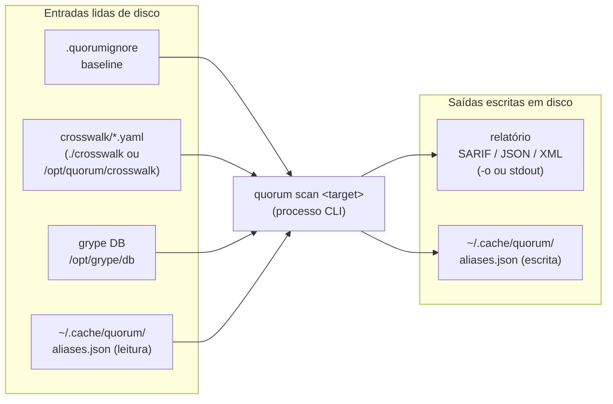
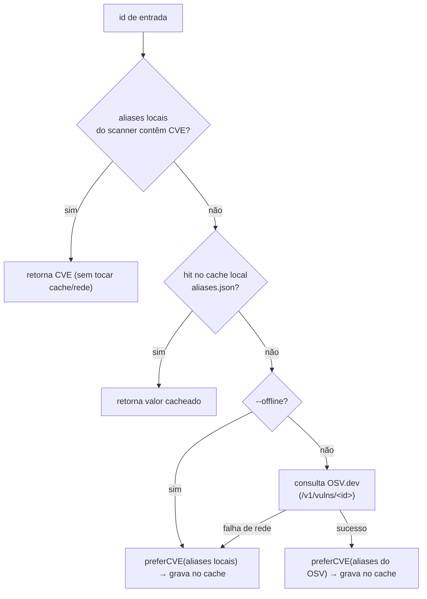
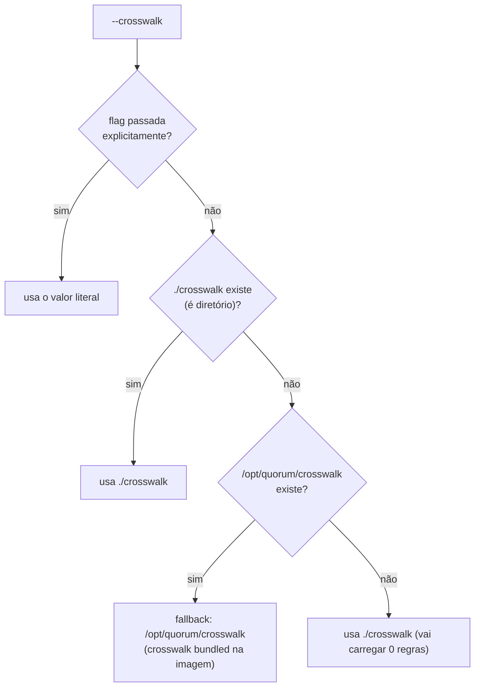
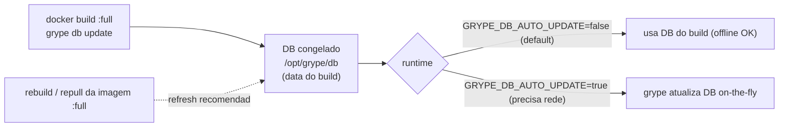

# 07 - Persistência e Artefatos

Este documento descreve **tudo o que o Quorum (`quorum-sec-scan`, v0.2.3) persiste em disco e lê de disco** durante uma execução: formatos, localização, ciclo de vida, versionamento e estratégia de atualização/migração de cada artefato. O Quorum é uma ferramenta **CLI/Docker** de _consensus security scanning_; não há banco de dados relacional, servidor de aplicação ou estado compartilhado de longa duração. A "persistência" do produto é deliberadamente minimalista e composta apenas por arquivos: um cache local de aliases, o baseline de supressão, os arquivos YAML de crosswalk, o banco de vulnerabilidades do Grype embutido na imagem e os arquivos de relatório de saída.

> Princípio de design relacionado: o cache e os artefatos auxiliares **nunca** podem ser fonte de falha de scan. Onde um artefato está ausente, ilegível ou corrompido, o Quorum degrada graciosamente para um comportamento seguro (ver `internal/cache/store.go`, `internal/crosswalk/crosswalk.go`, `internal/filter/filter.go`).

Documentos relacionados: [Arquitetura](03-arquitetura.md) · [Modelo de Dados](04-modelo-de-dados.md) · [Supply Chain](12-supply-chain.md).

---

## 1. Banco de dados relacional — N/A

**Status: N/A (não se aplica).**

O Quorum **não usa banco de dados relacional** (PostgreSQL, MySQL, SQLite com SQL, etc.) e isso é uma decisão arquitetural, não uma lacuna.

Justificativa técnica:

- **Modelo de execução stateless / batch.** O Quorum é invocado como um processo CLI de vida curta (`quorum scan <target>`), executa um pool de scanners em paralelo, correlaciona os resultados em memória e emite um relatório. Ao terminar o processo, não há estado a manter entre execuções — exceto o cache de aliases, que é puramente uma otimização (ver §2).
- **Sem multiusuário, sem concorrência entre processos.** Não há contas de usuário, sessões, API REST ou serviço persistente. Não existe a necessidade de transações, controle de concorrência multi-writer ou consultas relacionais.
- **Portabilidade e zero-dependência.** O binário é compilado com `CGO_ENABLED=0` (ver `Dockerfile`/`Dockerfile.full`). Introduzir SQLite (CGO) ou um servidor de banco quebraria a premissa de "binário estático único" e a distribuição `:slim` (orquestrador puro, `amd64+arm64`).
- **O único estado que justificaria um KV store já é atendido por um arquivo JSON.** O cache de aliases é um mapa `string→string` pequeno; um banco relacional seria sobre-engenharia. Comentário literal em `internal/cache/store.go`: _"It gives the alias resolver idempotency and speed across CI re-scans without pulling in a CGO database."_

### Proposta futura (claramente separada — NÃO implementada)

Se, em uma evolução, o produto passar a oferecer um modo "servidor" (histórico de scans, dashboards, deduplicação cross-repo), aí sim um armazenamento estruturado seria pertinente. Mesmo nesse cenário, a recomendação seria começar por um KV/embedded store (ex.: BoltDB/Pebble) ou um datastore append-only, e não necessariamente um RDBMS. **Isso está fora do escopo da v0.2.3.**

---

## 2. Visão geral dos artefatos persistidos



Tabela-resumo de todos os artefatos:

| Artefato | Caminho padrão | Formato | Direção | Escrito por | Ciclo de vida |
|----------|----------------|---------|---------|-------------|---------------|
| Cache de aliases | `~/.cache/quorum/aliases.json` (`os.UserCacheDir()`) | JSON (mapa `string→string`) | leitura + escrita | Quorum (`internal/cache`) | persistente entre scans; regenerável |
| Baseline | `.quorumignore` (cwd) | texto, 1 entrada/linha | leitura | usuário | versionado no repo do usuário |
| Crosswalk | `./crosswalk` → fallback `/opt/quorum/crosswalk` | YAML (`[]Control`) | leitura | mantenedores / usuário | bundled na imagem; versionado |
| Grype DB | `/opt/grype/db` (`GRYPE_DB_CACHE_DIR`) | DB do Grype/Syft (gerenciado pelo Grype) | leitura | build da imagem (Grype) | congelado no build; atualizável |
| Relatório de saída | `-o <arquivo>` ou stdout | SARIF / JSON / XML | escrita | Quorum (`internal/report`) | efêmero (artefato de CI) |

---

## 3. Cache de aliases — `~/.cache/quorum/aliases.json`

### 3.1 Propósito

O resolvedor de aliases (`internal/alias`) normaliza qualquer identificador de vulnerabilidade para uma forma canônica (preferindo CVE), de modo que o `GHSA-xxxx` do Grype e o `CVE-yyyy` do Trivy para o mesmo bug **correlacionem** em vez de se dividirem. A cadeia de resolução (`chainResolver.Canonical`) é:



O cache existe para dar **idempotência e velocidade** em re-scans de CI sem trazer um banco com CGO (comentário em `internal/cache/store.go`).

### 3.2 Formato

JSON puro, um objeto de mapa `string → string` (id de entrada → forma canônica), indentado com 2 espaços (`json.MarshalIndent(snapshot, "", "  ")`). Exemplo:

```json
{
  "GHSA-xxxx-yyyy-zzzz": "CVE-2024-12345",
  "GHSA-aaaa-bbbb-cccc": "CVE-2023-99999"
}
```

A chave é o `id` de entrada (não normalizado, como veio do scanner). O valor é o resultado de `preferCVE(...)` no momento da resolução (ver `internal/alias/resolver.go`, linha `r.local.Put(id, canon)`).

### 3.3 Localização

- **Padrão:** `defaultCachePath()` em `cmd/quorum/scan.go` retorna `filepath.Join(os.UserCacheDir(), "quorum", "aliases.json")`.
  - Linux: `~/.cache/quorum/aliases.json`
  - macOS: `~/Library/Caches/quorum/aliases.json`
  - Windows: `%LocalAppData%\quorum\aliases.json`
- **Fallback:** se `os.UserCacheDir()` falhar, usa `.quorum-cache.json` no diretório corrente.
- **Override:** flag `--cache <arquivo>`. Passar `--cache ""` (string vazia) coloca o store em **modo somente memória** — `cache.Open("")` não lê nem grava em disco (ver `store.go` e `store_test.go`).

### 3.4 Ciclo de vida e semântica de escrita

- **Abertura (`cache.Open`):** lê o arquivo se existir; arquivo ausente ou ilegível resulta em **cache vazio, não erro** — _"a bad cache never breaks a scan"_.
- **Escrita (`cache.Put`):** ocorre a cada nova resolução que chega à camada 3 da cadeia. A escrita é **atômica**: serializa um snapshot, grava em `aliases.json.tmp` e faz `os.Rename(tmp, path)`. Falhas de flush são **deliberadamente engolidas** — o cache é otimização, nunca fonte de falha.
- **Criação de diretório:** `os.MkdirAll(filepath.Dir(path), 0o755)` é feito preguiçosamente no primeiro `Put`.
- **Permissões:** arquivo `0o644`, diretório `0o755`.
- **Concorrência:** seguro para uso concorrente **dentro de um processo** (`sync.RWMutex`). Não há locking entre processos — dois `quorum scan` simultâneos compartilhando o mesmo cache podem sobrescrever um ao outro; como a escrita é via rename atômico, o arquivo nunca fica corrompido, mas a última escrita vence (perda de algumas entradas, sem impacto de corretude pois cada entrada é regenerável).

### 3.5 Versionamento e migração

| Aspecto | Situação atual (v0.2.3) |
|---------|--------------------------|
| Esquema versionado | **Não.** O JSON é um mapa simples sem campo de versão/cabeçalho. |
| Validação de esquema | Nenhuma além de `json.Unmarshal` tolerante (erro de unmarshal → cache vazio). |
| Migração | **Desnecessária / trivial.** Por ser um mapa `string→string`, qualquer mudança de formato é resolvida apagando o arquivo. |
| TTL / expiração | **Não há.** Entradas vivem indefinidamente. |
| Invalidação | Manual: apagar o arquivo. |

**Estratégia de atualização/regeneração (acionável):**

- [ ] Para forçar re-resolução via OSV, **apague** `~/.cache/quorum/aliases.json` (ou aponte `--cache` para um caminho novo).
- [ ] Em CI, **cacheie** este arquivo entre execuções para acelerar e reduzir chamadas ao OSV.dev (ex.: `actions/cache` com chave estável).
- [ ] Use `--offline` para nunca consultar OSV; o cache + aliases locais do scanner passam a ser as únicas fontes.
- [ ] Se um mapeamento de alias estiver errado (raro), apagar o arquivo é a "migração".

> Observação sobre robustez do esquema: como não há versão embutida, uma mudança **incompatível** futura no formato seria silenciosamente tolerada (entradas inválidas viram cache vazio). Ver [Premissas](#premissas) e [Gaps](#gaps-conhecidos).

---

## 4. Baseline — `.quorumignore`

### 4.1 Propósito

O baseline é a lista de findings **conhecidos/aceitos** que devem ser suprimidos do relatório e do gating (`--fail-on`). Sem ele, `--fail-on` seria "ruído inutilizável" em CI (comentário em `internal/filter/filter.go`). Uma supressão **sempre é logada** (`scan.go` imprime `filtered: N suppressed by baseline ...`) — _"a suppressed finding is still a finding"_.

### 4.2 Formato

Arquivo de texto, **uma entrada por linha**, onde cada entrada é um **Fingerprint** OU um **CorrelationKey** copiado de um relatório anterior. Regras de parsing (`filter.LoadBaseline`):

- Linhas em branco são ignoradas.
- Linhas iniciadas por `#` são comentários.
- Comentário de fim de linha é permitido: `entrada  # nota`.
- A comparação é **case-insensitive** (entradas e findings são normalizados com `strings.ToLower`).

Exemplo:

```text
# .quorumignore — findings aceitos para este repositório

# por fingerprint (sha256 do correlationKey)
3b1f...c0de   # CVE-2024-12345 em lib X — aceito até upgrade no Q3

# por correlationKey (mais legível, mais amplo)
VULN|CVE-2023-0001|pkg:npm/left-pad@1.0.0
```

> Uma entrada por **CorrelationKey** suprime todos os findings que compartilham aquela chave; uma entrada por **Fingerprint** é mais específica. Ver [Modelo de Dados](04-modelo-de-dados.md) para a definição de ambos.

### 4.3 Localização e ciclo de vida

- **Padrão:** `.quorumignore` no diretório corrente (flag `--baseline`).
- **Ciclo de vida:** é um **artefato do usuário**, versionado no repositório alvo (como `.gitignore`). O Quorum apenas o lê; nunca o escreve.
- **Ausência:**
  - Se o usuário **não** passou `--baseline` explicitamente e o arquivo não existe → baseline vazio, scan prossegue (ver `scan.go`: `present == false` e flag não alterada).
  - Se o usuário **passou** `--baseline` explicitamente e o arquivo não existe → **erro fatal** (`baseline file not found`), exit code 2. Isso evita "supressão silenciosamente desligada" por caminho errado.

### 4.4 Versionamento e migração

| Aspecto | Situação atual |
|---------|----------------|
| Esquema versionado | Não aplicável — é uma lista de tokens opacos. |
| Migração | Nenhuma necessária. Entradas que não casam com nenhum finding simplesmente não fazem efeito. |
| Manutenção | Responsabilidade do usuário (revisar/limpar entradas obsoletas). |

**Checklist de uso (acionável):**

- [ ] Gere um relatório, copie o `fingerprint`/`partialFingerprints["quorum/v1"]` ou `correlationKey` do finding aceito.
- [ ] Adicione ao `.quorumignore` com um comentário justificando e/ou um prazo de revisão.
- [ ] Faça commit do `.quorumignore` no repositório alvo.
- [ ] Revise periodicamente: como supressões são logadas, audite o stderr do CI.

---

## 5. Crosswalk — `./crosswalk` → `/opt/quorum/crosswalk`

### 5.1 Propósito

O crosswalk mapeia os _rule ids_ próprios de cada scanner para um **controle canônico compartilhado** (hub AVD, com fallback de categoria semântica), de modo que misconfigs equivalentes de IaC/k8s vindos de engines diferentes (Trivy/Checkov/KICS) correlacionem (`internal/crosswalk/crosswalk.go`, DESIGN §8). Princípio conservador: _"false split > false merge"_ — só controles claramente equivalentes são agrupados.

### 5.2 Formato

YAML, uma **lista** de objetos `Control` (note: o arquivo inteiro é uma sequência YAML de topo, não um mapa). Estrutura (struct `Control`):

```yaml
- canonicalControl: AVD-AWS-0092        # controle canônico (hub)
  category: public-access               # categoria semântica (fallback)
  cwe: CWE-732                          # opcional
  title: "S3 bucket com ACL de acesso público"
  ids:                                  # scanner -> [ruleIDs]
    trivy:   [AVD-AWS-0092]
    checkov: [CKV_AWS_20]
    kics:    ["38c5ee0d-7f22-4260-ab72-5073048df100"]
```

Indexação interna: ao carregar, cada par `(scanner, ruleID)` vira a chave `"scanner|ruleid"` (lowercased, trimmed) apontando para uma `Resolution{Control, Category, CWE, Title}` (ver `key()` e `add()` em `crosswalk.go`). Exemplo real completo em [`crosswalk/aws.yaml`](../crosswalk/aws.yaml).

### 5.3 Localização e resolução de diretório

A escolha do diretório é feita por `resolveCrosswalkDir` (`cmd/quorum/scan.go`):



O fallback existe para que `docker run … scan .` a partir de um workdir arbitrário ainda obtenha os mapeamentos embutidos, em vez de silenciosamente carregar 0 regras. As imagens `:slim` e `:full` copiam `crosswalk` para `/opt/quorum/crosswalk` (`COPY crosswalk /opt/quorum/crosswalk` nos dois Dockerfiles).

### 5.4 Carregamento e tolerância a falhas

`crosswalk.Load(dir)`:

- Lê **todos** os arquivos `*.yaml`/`*.yml` (case-insensitive na extensão) no diretório e **mescla** todos os controles.
- Subdiretórios são ignorados.
- **Diretório ausente NÃO é erro** (`os.IsNotExist` → crosswalk vazio): a ferramenta roda sem crosswalk customizado, e cada lookup que erra mantém o finding isolado e marcado como _unmapped_ (DESIGN §6, "never guess a match").
- **Erro de leitura de arquivo ou YAML inválido É erro fatal** (`Load` retorna o erro; `scan.go` envolve como `loading crosswalk: ...`, exit 2). Diferente da ausência de diretório, um arquivo presente-mas-quebrado falha rápido.

O número de regras carregadas é logado: `crosswalk=%d rules (%s)` no stderr.

### 5.5 Versionamento, "tabela" e migração

O crosswalk **é a tabela de mapeamento** do produto (o análogo mais próximo de "schema/migrations" que o Quorum possui). Versionamento:

| Aspecto | Situação atual |
|---------|----------------|
| Versionamento | Acoplado à versão do Quorum: os YAMLs vivem no repo (`crosswalk/`) e são embutidos na imagem por versão (v0.2.3). |
| Campo de versão por arquivo | **Não há** campo `version`/`schema` no YAML; o esquema é o struct `Control`. |
| Migração de esquema | Mudanças de campo exigiriam atualizar o struct `Control` + os YAMLs; não há mecanismo de migração automática (os YAMLs são reescritos junto com o código). |
| Extensão pelo usuário | Apontar `--crosswalk <dir>` para um diretório próprio, ou adicionar arquivos ao diretório bundled, **substitui** o default (não há merge entre default e custom além de `Load` mesclar arquivos do **mesmo** diretório). |
| Origem dos mapeamentos | Derivados de saída **real** dos scanners e cross-checados semanticamente (cabeçalho de `aws.yaml`). |

**Checklist de manutenção/atualização (acionável):**

- [ ] Ao bumpar uma versão de scanner, re-rodar contra fixtures e revisar se rule ids mudaram (KICS usa UUIDs de query; podem mudar entre versões).
- [ ] Adicionar novos controles como itens da lista YAML, mantendo o `canonicalControl` no hub AVD quando existir.
- [ ] Para customização local: copiar o diretório bundled, editar, e passar `--crosswalk <seu-dir>`.
- [ ] Validar com `quorum scan ...` e conferir o contador `crosswalk=N rules` no stderr.

---

## 6. Grype DB — `/opt/grype/db`

### 6.1 Propósito

O banco de vulnerabilidades do Grype é necessário para que o scanner Grype funcione. Na imagem `:full`, ele é **pré-cacheado no build** para que o primeiro scan funcione **offline** e nunca atinja o erro _"failed to load vulnerability db: database does not exist"_ (comentário no `Dockerfile.full`).

### 6.2 Formato e localização

- **Formato:** banco do Grype/Syft, **gerenciado internamente pelo próprio Grype** (o Quorum não lê nem escreve este DB diretamente — apenas invoca o binário `grype`). É opaco para o Quorum.
- **Localização:** `/opt/grype/db`, definido via `ENV GRYPE_DB_CACHE_DIR=/opt/grype/db` no `Dockerfile.full`.
- **Populado por:** `RUN grype db update && grype db status` durante o build da imagem.
- **Disponível somente na imagem `:full`** (que embute os scanners). A `:slim` não inclui scanners nem DB — espera scanners no PATH do runner.

### 6.3 Ciclo de vida, versionamento e atualização

| Aspecto | Situação atual |
|---------|----------------|
| Estado no build | DB **congelado no momento do build** da imagem `:full`. |
| Auto-update em runtime | **Desligado por padrão** (`ENV GRYPE_DB_AUTO_UPDATE=false`). |
| Atualização "on the fly" | Definir `GRYPE_DB_AUTO_UPDATE=true` em runtime (requer rede) para o Grype atualizar o DB sozinho. |
| Atualização recomendada | **Reconstruir/repuxar a imagem** `:full` para obter um DB mais recente. |
| Versionamento | Acoplado à tag da imagem (`GRYPE_VERSION` pinado por digest no `Dockerfile.full`) e à data do build. |
| Migração de schema do DB | Gerenciada pelo Grype, não pelo Quorum. |



**Implicação operacional:** o DB envelhece junto com a imagem. Um DB desatualizado pode **perder CVEs recentes** — isso reforça o aviso do produto _"0 findings is not proof of safety"_. Mantenha a imagem `:full` atualizada em pipelines de longa duração.

**Checklist (acionável):**

- [ ] Para ambientes air-gapped: confiar no DB do build e repuxar a imagem em cadência regular (ex.: semanal).
- [ ] Para ambientes com rede: considerar `GRYPE_DB_AUTO_UPDATE=true` para frescor máximo.
- [ ] Verificar a idade do DB com `grype db status` dentro do container.

---

## 7. Relatórios de saída — SARIF / JSON / XML

### 7.1 Propósito e formato

Saída final do scan, serializada por `internal/report` (`report.Write`):

- **SARIF** (primário, `--format sarif`, default): inclui `partialFingerprints["quorum/v1"]` e o `Fingerprint = sha256(correlationKey)` para integração com plataformas de code scanning.
- **JSON** (`--format json`): modelo canônico serializado.
- **XML** (`--format xml`).

Formato inválido → erro de uso (exit 2). Ver `report.ParseFormat`.

### 7.2 Localização e ciclo de vida

`emit()` em `cmd/quorum/scan.go`:

- **Sem `-o`/`--output`:** escreve em **stdout** (`cmd.OutOrStdout()`).
- **Com `-o <arquivo>`:** cria o diretório pai se necessário (`os.MkdirAll(dir, 0o755)`) e escreve o arquivo com permissão `0o644` (sobrescrevendo se existir).
- **Ciclo de vida:** **efêmero**. É um artefato de CI/saída; o Quorum não mantém histórico nem reabre relatórios. Persistência/retenção é responsabilidade do pipeline (ex.: upload de SARIF para GitHub Code Scanning, artefato de build).

### 7.3 Versionamento

- O esquema SARIF segue o padrão SARIF; o namespace de fingerprint próprio é versionado explicitamente como **`quorum/v1`** em `partialFingerprints`.
- Não há "migração" — cada execução produz um relatório novo e completo.

---

## 8. Resumo de tolerância a falhas por artefato

| Artefato | Ausente | Ilegível / corrompido | Estratégia |
|----------|---------|------------------------|-----------|
| Cache de aliases | cache vazio, scan prossegue | cache vazio, scan prossegue | sempre degrada; nunca falha |
| Baseline (`.quorumignore`) | vazio se default; **erro** se passado explicitamente | erro de leitura propagado (exceto not-exist) | falha explícita só quando o usuário pediu o arquivo |
| Crosswalk (dir) | crosswalk vazio (0 regras), findings ficam unmapped | **erro fatal** se arquivo presente-mas-inválido | ausência tolerada; conteúdo quebrado falha rápido |
| Grype DB | erro do Grype (mas `:full` sempre tem) | gerenciado pelo Grype | pré-cacheado no build |
| Relatório de saída | N/A (é escrita) | N/A | cria diretório pai; sobrescreve |

---

## Premissas

- A descrição reflete a base de código na **v0.2.3** (branch `main`), conforme leitura de `internal/cache/store.go`, `internal/alias/resolver.go`, `internal/alias/osv.go`, `internal/crosswalk/crosswalk.go`, `internal/filter/filter.go`, `cmd/quorum/scan.go`, `internal/report/report.go`, `Dockerfile`, `Dockerfile.full` e `crosswalk/aws.yaml`.
- Caminhos por SO do cache derivam do contrato de `os.UserCacheDir()` da stdlib do Go; os exemplos por SO (Linux/macOS/Windows) seguem a documentação dessa função, não uma string hardcoded no código (o código só compõe `<UserCacheDir>/quorum/aliases.json`).
- O formato interno do Grype DB é tratado como **opaco** pelo Quorum; afirmações sobre ele baseiam-se no contrato do Grype e nas variáveis `GRYPE_DB_CACHE_DIR`/`GRYPE_DB_AUTO_UPDATE` configuradas no `Dockerfile.full`, não em leitura do binário do DB.
- "Relatório efêmero" assume o uso típico em CI; o Quorum não impõe retenção — qualquer persistência de relatórios é externa ao produto.
- Os detalhes de SARIF (`partialFingerprints["quorum/v1"]`, `Fingerprint = sha256(correlationKey)`) baseiam-se na especificação do produto e no roteamento em `internal/report`; o conteúdo exato do `sarif.go` não foi citado linha a linha aqui (ver [Modelo de Dados](04-modelo-de-dados.md)).

## Gaps conhecidos

- **Cache sem versão de esquema:** `aliases.json` não tem cabeçalho/versão; uma mudança de formato incompatível seria silenciosamente tolerada como cache vazio, sem aviso ao usuário.
- **Cache sem TTL/invalidação automática:** entradas vivem indefinidamente; só a remoção manual do arquivo as renova.
- **Sem locking entre processos no cache:** execuções concorrentes que compartilham o mesmo `--cache` podem perder entradas (sem corrupção, graças ao rename atômico).
- **Crosswalk sem campo de versão:** o esquema é implícito (struct `Control`); não há mecanismo de migração nem merge entre diretório default e custom.
- **Idade do Grype DB:** congelado no build da imagem `:full`; sem atualização, pode perder CVEs recentes.

## Perguntas em aberto

- Deve-se introduzir um campo `schemaVersion` no `aliases.json` e/ou nos arquivos de crosswalk para habilitar migração explícita no futuro?
- Há intenção de oferecer um TTL configurável ou comando `quorum cache clear` para o cache de aliases?
- Qual a cadência oficial recomendada para rebuild/repull da imagem `:full` a fim de manter o Grype DB fresco em pipelines de longa duração?
- O crosswalk customizado deveria **mesclar** com o bundled (em vez de substituir) quando `--crosswalk` aponta para outro diretório?
