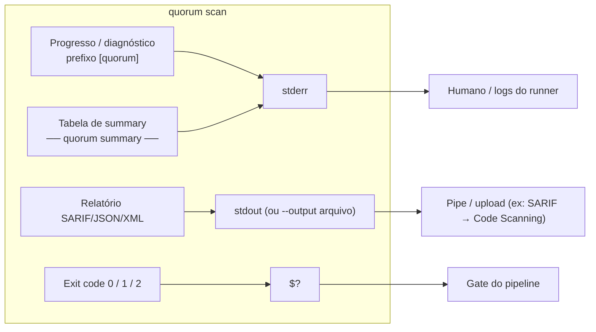
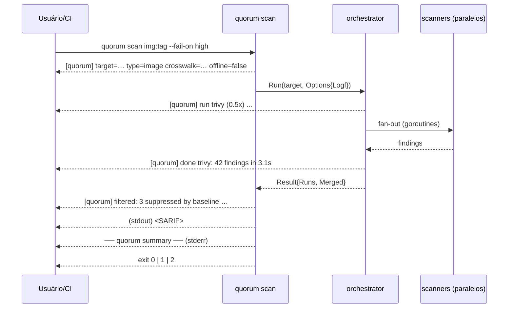
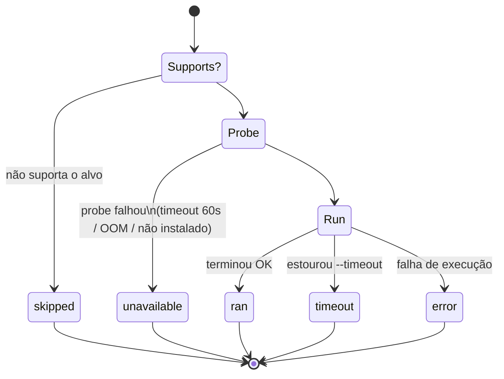
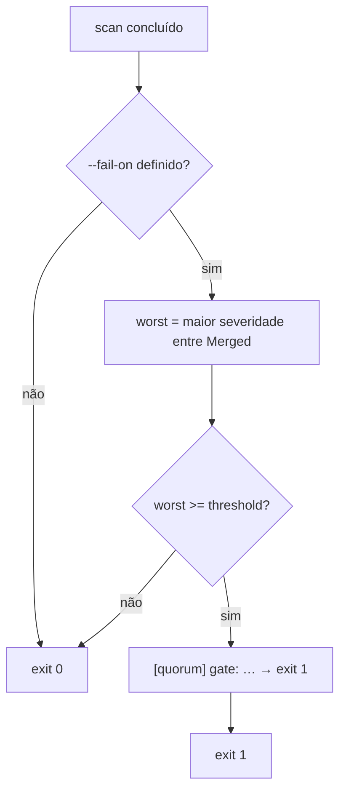
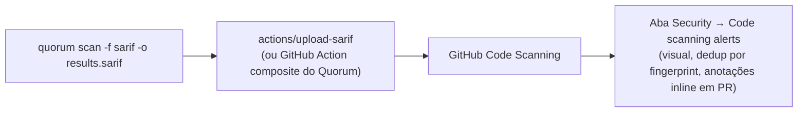

# Frontend / Experiência de Terminal

O Quorum **não possui frontend gráfico** (web, desktop ou mobile). Ele é, por
design, uma ferramenta **CLI/Docker** orientada a CI/CD: "configure via flags,
gate via exit code. No panel, no daemon" ([`cmd/quorum/root.go`](../cmd/quorum/root.go)).
A "interface de usuário" do Quorum é, portanto, a **experiência de terminal**:
logs de progresso em `stderr` com prefixo `[quorum]`, uma tabela de _summary_
ao final, _exit codes_ determinísticos para gating, e o artefato SARIF — que,
quando consumido pelo GitHub Code Scanning, vira a superfície visual mais
próxima de uma GUI. Este documento descreve essa UX como ela existe no código
(as-is), trata o que não existe como **N/A** com justificativa, e separa
claramente eventuais propostas futuras.

---

## 1. Veredito: GUI / Web — N/A

| Item de template típico                     | Status | Justificativa técnica (as-is)                                                                                                      |
| ------------------------------------------- | :----: | -------------------------------------------------------------------------------------------------------------------------------- |
| SPA / aplicação web (React, Vue, etc.)      |  N/A   | Não há código de UI no repositório. O binário é um CLI Cobra (`cmd/quorum`). `main()` apenas executa o comando raiz e sai.        |
| Servidor HTTP / API REST que sirva uma UI   |  N/A   | Não há servidor; não há `net/http` handlers de aplicação. O Quorum é _stateless_ e _one-shot_: roda, emite relatório, encerra.    |
| Painel/dashboard, daemon, _long-running_    |  N/A   | Princípio explícito: "No panel, no daemon" ([`root.go`](../cmd/quorum/root.go)). Cada invocação é um processo efêmero.            |
| Autenticação / contas / sessões de usuário  |  N/A   | Não há multiusuário nem persistência de sessão. A única persistência é o cache local de aliases (`~/.cache/quorum/aliases.json`). |
| Componentes visuais, CSS, design system web |  N/A   | A renderização é texto puro em `stderr`/`stdout`. Sem ANSI/cores no código Go.                                                    |
| Responsividade / breakpoints / mobile       |  N/A   | Conceito de viewport não se aplica a um TUI não-interativo. Ver [§7 Responsividade](#7-responsividade--n-a).                       |

> **Por que isso é uma decisão, não uma lacuna.** O alvo do Quorum é o _runner_
> de CI/CD e o terminal do desenvolvedor. Um painel web exigiria
> servidor, estado, autenticação e superfície de ataque — tudo contrário ao
> modelo de ameaça de uma ferramenta de segurança que roda dentro do pipeline.
> A "visualização" rica é delegada a sistemas já existentes (GitHub Code
> Scanning, qualquer viewer SARIF), via o artefato SARIF padronizado.

A superfície visual mais próxima de uma GUI é tratada em
[§8 GitHub Code Scanning](#8-github-code-scanning-como-superficie-visual).

---

## 2. Anatomia da experiência de terminal

A UX de terminal do Quorum tem três canais bem separados, o que é deliberado
para permitir _piping_ do relatório sem poluí-lo com logs:



| Canal         | Conteúdo                                                  | Quando aparece                                         | Controlado por          |
| ------------- | -------------------------------------------------------- | ----------------------------------------------------- | ----------------------- |
| `stdout`      | Relatório (SARIF/JSON/XML)                               | Sempre que `--output`/`-o` **não** é dado             | `--format`, `--output`  |
| `stderr`      | Logs de progresso `[quorum] …` + tabela de _summary_     | Durante o scan e ao final                             | `--quiet`/`-q`          |
| _exit code_   | `0` ok, `1` gate disparou, `2` erro de uso/runtime       | Ao encerrar                                           | `--fail-on`             |

> **Garantia de separação.** Como o relatório vai para `stdout` e todo o ruído
> vai para `stderr`, `quorum scan img -f json > report.json` produz um JSON
> limpo mesmo sem `--quiet`. A tabela de _summary_ nunca contamina `stdout`.

---

## 3. Logs de progresso (`[quorum] …`)

Os logs de progresso são emitidos pela closure `logf` em
[`runScan`](../cmd/quorum/scan.go), que prefixa toda linha com `[quorum] ` e
escreve em `stderr` — **a menos que `--quiet` esteja ativo**:

```go
logf := func(format string, args ...any) {
    if !f.quiet {
        fmt.Fprintf(os.Stderr, "[quorum] "+format+"\n", args...)
    }
}
```

Essa mesma `logf` é injetada no orquestrador via `orchestrator.Options.Logf`,
de modo que o pipeline inteiro fala pelo mesmo canal e com o mesmo prefixo.

### 3.1 Catálogo de mensagens de progresso

| Origem                  | Mensagem (formato)                                                                  | Significado                                                          |
| ----------------------- | --------------------------------------------------------------------------------- | ------------------------------------------------------------------- |
| `runScan` (preâmbulo)   | `target=… type=… crosswalk=N rules (dir) offline=bool`                              | Resumo da configuração resolvida antes do fan-out                   |
| `orchestrator.Run`      | `warning: unknown scanner "x" ignored (known: …)`                                  | Nome passado em `--scanners` não corresponde a adapter registrado   |
| `runOne` (skip)         | `skip <name>: does not support target <type>`                                       | Adapter não suporta o tipo de alvo → status `skipped`               |
| `runOne` (probe lento)  | `skip <name>: version probe timed out after 60s (slow start / low memory?)`         | _Probe_ de versão excedeu `ProbeTime` → status `unavailable`        |
| `runOne` (OOM)          | `skip <name>: version probe killed (likely OOM — increase container memory)`        | `signal: killed` no _probe_ → provável OOM → status `unavailable`   |
| `runOne` (ausente)      | `skip <name>: not installed/available`                                              | Binário não instalado/encontrado → status `unavailable`            |
| `runOne` (execução)     | `run  <name> (<ver>) ...`                                                           | Scanner iniciou                                                     |
| `runOne` (sucesso)      | `done <name>: N findings in <dur>`                                                  | Scanner terminou com N achados brutos → status `ran`                |
| `runOne` (falha)        | `fail <name>: <err>`                                                                | Scanner falhou (status `error`) ou estourou timeout (`timeout`)    |
| `runScan` (filtro)      | `filtered: N suppressed by baseline (M entries), K below min-severity <sev>`        | Pós-processamento por `.quorumignore` / `--min-severity`           |
| `runScan` (gate)        | `gate: found <sev> finding >= --fail-on <thr> → exit 1`                             | Gating disparou; processo sairá com código 1                       |

> **Supressões sempre logam.** Quando o baseline ou o `--min-severity`
> descartam achados, o número é registrado em `stderr`. Isso atende ao
> princípio de transparência: nada é silenciosamente removido do relatório.

### 3.2 Sequência típica (sucesso, sem `--quiet`)



---

## 4. Tabela de _summary_

Ao final de cada scan, [`printSummary`](../cmd/quorum/scan.go) escreve em
`stderr` um bloco legível para humanos. Ele é **suprimido por `--quiet`**
(retorna imediatamente quando `quiet == true`). Layout real produzido pelo
código:

```text
── quorum summary ───────────────────────────
  trivy      ran           42 findings
  grype      ran           38 findings
  checkov    unavailable    0 findings  (version probe killed — likely out…)
  kics       skipped        0 findings
  dockle     ran            5 findings
  kubescape  timeout        0 findings  (context deadline exceeded)
  ----------------------------------------
  57 findings after consensus  (31 multi-detected)
  CRIT 4  HIGH 12  MED 28  LOW 11  INFO 2
  elapsed 7.412s
  note: 0 findings is not proof of safety — see scanner statuses above.
```

### 4.1 Estrutura

| Bloco                  | Conteúdo                                                                                  | Fonte de dados                          |
| ---------------------- | --------------------------------------------------------------------------------------- | --------------------------------------- |
| Linha por scanner      | `name`, `status`, contagem de _findings brutos_, e (se houver) erro truncado em 60 chars | `res.Runs` (`[]ScannerRun`)             |
| Erro inline            | `(…)` com `truncate(err, 60)` quando `ScannerRun.Error != ""`                            | `ScannerRun.Error`                      |
| Total pós-consenso     | `N findings after consensus  (M multi-detected)`                                          | `len(res.Merged)` + `DetectionCount>1`  |
| Distribuição           | `CRIT … HIGH … MED … LOW … INFO …`                                                       | contagem por `m.Severity`               |
| Tempo                  | `elapsed <dur>` arredondado a milissegundos                                              | `res.Duration`                          |
| Nota de cautela        | `note: 0 findings is not proof of safety …`                                              | literal (DESIGN §14)                    |

> **`findings brutos` vs `após consenso`.** A coluna por scanner mostra o número
> de achados que aquele scanner emitiu **antes** de correlação. A linha de total
> mostra os achados **após** o merge de consenso. Por isso a soma das colunas é
> normalmente maior que o total — é esperado e desejável (vários scanners
> detectando o mesmo CVE colapsam em um achado com `DetectionCount > 1`).

---

## 5. Estados de scanner (status)

Cada scanner termina em exatamente um de cinco estados, definidos em
[`orchestrator.ScannerRun.Status`](../internal/orchestrator/orchestrator.go).
Eles são a peça central da transparência da UX — "0 vulns" nunca pode parecer
"o scan não rodou" (DESIGN §14).



| Status        | Quando ocorre                                                              | Diagnóstico ao usuário                                                                 |
| ------------- | ------------------------------------------------------------------------- | ------------------------------------------------------------------------------------- |
| `ran`         | `Supports==true`, _probe_ OK, `Run` retornou sem erro                     | Contagem de _findings_ na tabela                                                       |
| `skipped`     | `Supports(target)==false`                                                  | "does not support target …" — não é falha, só não se aplica                           |
| `unavailable` | `Version()` (probe) falhou: timeout (60s), `signal: killed` (OOM), ausente | Mensagem distingue _slow start_, OOM e binário ausente, com sugestão de correção      |
| `timeout`     | `Run` excedeu `--timeout` (default 5m) → `context.DeadlineExceeded`        | status `timeout` + erro inline                                                         |
| `error`       | `Run` retornou erro que não é deadline                                     | status `error` + erro inline (truncado a 60 chars no summary)                         |

> **_Probe_ de versão de 60s.** O orquestrador roda um _probe_ de versão antes
> de cada scanner com `ProbeTime = 60s` (generoso de propósito, porque tools
> Python como o `checkov` têm _cold start_ lento e podem ser SIGKILLed em
> _runners_ com pouca memória). É esse _probe_ que distingue
> `unavailable`/timeout/OOM de uma execução real.

---

## 6. _Exit codes_ e gating

Os _exit codes_ são a API de máquina da UX — é como o pipeline lê o resultado.

| Código | Significado                                                | Origem no código                                                  |
| :----: | --------------------------------------------------------- | ----------------------------------------------------------------- |
|  `0`   | OK — nenhum achado atingiu `--fail-on` (ou sem `--fail-on`) | `runScan` retorna `nil`                                            |
|  `1`   | Gate disparou — algum achado ≥ `--fail-on`                | `os.Exit(1)` em `runScan` após `severity.AtLeast(worst, thr)`     |
|  `2`   | Erro de uso ou runtime (flag inválida, alvo ruim, etc.)   | `main()`: `fmt.Fprintln(os.Stderr, "quorum:", err); os.Exit(2)`   |

Fluxo de decisão do gate:



Checklist para usar gating em CI:

- [ ] Defina `--fail-on` com a severidade-limite (`critical|high|medium|low`).
- [ ] Considere `--min-severity` para **remover** ruído abaixo de um piso (afeta relatório **e** gating).
- [ ] Trate `exit 2` como erro de configuração/infra (não como "achados encontrados").
- [ ] Não confunda `exit 0` com "seguro" — confira os _status_ de scanner (`unavailable`/`timeout` mascaram cobertura).
- [ ] Em runners com pouca RAM, se vir `unavailable (OOM)`, aumente a memória do container ou restrinja `--scanners`.

> **Cuidado com `exit 0`.** Um `exit 0` só garante que nenhum achado atingiu o
> limiar; **não** garante que todos os scanners rodaram. Um scanner
> `unavailable`/`timeout` pode ter deixado uma classe inteira de achados de
> fora. A nota `0 findings is not proof of safety` existe exatamente por isso.

---

## 7. Modo silencioso (`--quiet` / `-q`)

`--quiet` desliga **tudo** que vai para `stderr`:

1. Os logs `[quorum] …` (a closure `logf` vira no-op).
2. A tabela de _summary_ (`printSummary` retorna no início se `quiet`).

O que **não** é afetado por `--quiet`:

- O relatório em `stdout`/`--output` (continua sendo emitido normalmente).
- O _exit code_ (gating continua funcionando).
- A linha de erro fatal em `main()` (`quorum: <err>` com `exit 2`).

| Cenário                                  | Sem `--quiet`                       | Com `--quiet`                       |
| ---------------------------------------- | ----------------------------------- | ----------------------------------- |
| Progresso `[quorum] …`                   | sim (`stderr`)                      | não                                 |
| Tabela de _summary_                      | sim (`stderr`)                      | não                                 |
| Relatório (`stdout`/`-o`)                | sim                                 | sim                                 |
| _Exit code_ / gate                       | sim                                 | sim                                 |
| Erro fatal de uso/runtime               | sim (`exit 2`)                      | sim (`exit 2`)                      |

> **Recomendação CI.** Use `--quiet -o report.sarif --fail-on high`. Você ainda
> recebe o gate e o arquivo SARIF para upload, sem poluir o log do _runner_.

---

## 8. Responsividade — N/A

| Conceito        | Status | Justificativa                                                                                                       |
| --------------- | :----: | ------------------------------------------------------------------------------------------------------------------ |
| Breakpoints     |  N/A   | Não há layout web; nada se reflui por largura de viewport.                                                          |
| Layout fluido   |  N/A   | A tabela de _summary_ usa colunas de largura fixa (`%-10s %-12s %3d`), pensadas para ≥ ~50 colunas de terminal.    |
| Mobile/tablet   |  N/A   | O alvo é terminal de CI/desenvolvedor; não há cliente móvel.                                                        |

A única consideração de "largura" é o _summary_: erros são truncados a 60
caracteres (`truncate(r.Error, 60)`) para não estourar o terminal. Não há
detecção de largura de terminal (`COLUMNS`) no código.

---

## 9. Acessibilidade

A UX é texto puro, o que já elimina muitas barreiras (compatível com leitores
de tela e _braille displays_ via terminal). Estado atual (as-is):

| Aspecto              | Estado (as-is)                                                                                                  |
| -------------------- | -------------------------------------------------------------------------------------------------------------- |
| Cor / ANSI           | **Não há cor.** Nenhum código de escape ANSI é emitido pelo Go. Logo, não há dependência de cor para entender o output. |
| `NO_COLOR`           | Não é necessário tratar `NO_COLOR`: como já não há cor, a saída é estável independentemente da variável.        |
| Texto sem cor        | Status (`ran`/`unavailable`/…) e severidades (`CRIT`/`HIGH`/…) são **rótulos textuais**, nunca apenas cor.     |
| Modo silencioso      | `--quiet` oferece uma saída mínima/determinística para quem quer apenas o arquivo + exit code.                  |
| Unicode              | O cabeçalho usa box-drawing (`──`) e reticências (`…`). Requer terminal UTF-8; o conteúdo informativo é ASCII. |
| Idioma das mensagens | As mensagens de runtime são em inglês (no código); esta documentação é pt-BR.                                   |

Checklist de acessibilidade (validação contínua):

- [ ] Garantir que nenhuma informação dependa de cor (já satisfeito: sem ANSI).
- [ ] Manter rótulos textuais para severidade e status (não substituir por ícones-only).
- [ ] Manter o conteúdo de severidade/contagens em ASCII para terminais sem UTF-8.
- [ ] Manter `--quiet` como caminho previsível para automação e ferramentas assistivas.

> **Proposta futura (claramente separada — não existe hoje).** Se cores forem
> adicionadas algum dia, devem (a) respeitar `NO_COLOR` e `--no-color`,
> (b) só ativar quando `stderr` for um TTY, e (c) nunca codificar significado
> apenas por cor. Nada disso está implementado atualmente.

---

## 10. Mensagens de erro e validação

A validação acontece cedo, em [`runScan`](../cmd/quorum/scan.go), e erros
retornam pela cadeia `RunE` → `main()`, que imprime `quorum: <err>` em `stderr`
e sai com **exit 2**. Como o comando raiz usa `SilenceUsage`/`SilenceErrors`,
não há _dump_ de help a cada erro — só a mensagem objetiva.

| Validação / erro                                  | Mensagem                                                                         | Exit |
| ------------------------------------------------- | ------------------------------------------------------------------------------- | :--: |
| `--type` inválido                                 | `invalid --type "x" (want image\|repo\|k8s)`                                     |  2   |
| `--fail-on` inválido                              | `invalid --fail-on "x" (want critical\|high\|medium\|low)`                       |  2   |
| `--min-severity` inválido                         | `invalid --min-severity "x" (want critical\|high\|medium\|low)`                  |  2   |
| `--format` inválido                               | `unknown format "x" (want sarif\|json\|xml)`                                     |  2   |
| `--baseline` explícito mas inexistente            | `baseline file not found: <path>`                                               |  2   |
| Falha ao carregar baseline/crosswalk              | `loading baseline: …` / `loading crosswalk: …`                                  |  2   |
| Nº de argumentos errado                           | erro do Cobra (`cobra.ExactArgs(1)`)                                            |  2   |
| Scanner desconhecido em `--scanners`              | `warning: unknown scanner "x" ignored (known: …)` (**warning, não erro**)       |  —   |

> **Princípio:** erros de configuração são fatais e explícitos (exit 2);
> situações degradadas mas recuperáveis (scanner ausente, OSV offline, scanner
> desconhecido na lista) são **avisos** que não interrompem o scan. Ver
> degradação graciosa em [09-...](#) quando aplicável.

---

## 11. GitHub Code Scanning como superfície visual

A representação visual mais rica do Quorum **não** é dele — é a **UI de Code
Scanning do GitHub**, alimentada pelo SARIF que o Quorum emite como formato
**primário** ([`internal/report/sarif.go`](../internal/report/sarif.go)).



O que o SARIF do Quorum carrega para essa UI:

| Campo SARIF                                    | Conteúdo do Quorum                                                                 | Efeito na UI do GitHub                                              |
| --------------------------------------------- | -------------------------------------------------------------------------------- | ------------------------------------------------------------------ |
| `level`                                       | `error` (CRIT/HIGH), `warning` (MED), `note` (resto)                              | Severidade/ícone do alerta                                          |
| `ruleId`                                       | `VulnID` (CVE), `CanonicalControl`, `RuleID` ou `correlationKey` (fallback)       | Agrupamento por regra                                              |
| `partialFingerprints["quorum/v1"]`            | `m.Fingerprint` = `sha256(correlationKey)`                                        | **Dedup estável** de alertas entre execuções                       |
| `locations`                                   | arquivo + região (linhas) por membro com `Location.File`                          | Anotação inline no diff do PR / navegação para o ponto             |
| `properties.detectedBy` / `detectionCount`    | quais e quantos scanners detectaram                                              | Evidência de consenso (visível ao expandir o alerta)               |
| `properties.confidence`                       | score de consenso (2 casas)                                                      | Sinal de confiança                                                 |
| `properties.correlationKey` / `unmapped`      | chave determinística e flag de não-mapeado                                       | Rastreabilidade e triagem                                          |
| `run.properties.scanners`                     | nome/status/versão de cada scanner                                              | Transparência de cobertura no artefato                             |

> **`partialFingerprints` é o que torna a UI utilizável ao longo do tempo:** o
> GitHub usa esse fingerprint para reconhecer "o mesmo alerta" entre commits,
> evitando que cada execução crie alertas duplicados. Como o fingerprint do
> Quorum é determinístico (`sha256(correlationKey)`), o dedup é estável.

Checklist de integração com Code Scanning:

- [ ] Rodar `quorum scan … -f sarif -o results.sarif` (SARIF é o default de `--format`).
- [ ] Fazer upload via `github/codeql-action/upload-sarif` (ou a Action composite do Quorum, que verifica a imagem com cosign antes).
- [ ] Confirmar permissão `security-events: write` no workflow.
- [ ] Usar `--quiet` no passo de scan para manter o log do runner limpo.
- [ ] Opcional: combinar com `--fail-on` para bloquear o PR via exit code, independentemente da UI.

JSON e XML existem como formatos alternativos de máquina (ver
[`json.go`](../internal/report/json.go) e `xml.go`), úteis para
ferramentas próprias — mas nenhum deles é uma "tela".

---

## 12. Como testar / verificar a UX

```bash
# 1) Summary + progresso completos, relatório SARIF no stdout
quorum scan alpine:3.18 --fail-on high

# 2) Saída limpa para CI: SARIF em arquivo, sem ruído, com gate
quorum scan alpine:3.18 -q -o results.sarif --fail-on critical
echo "exit=$?"

# 3) Confirmar separação de canais: stdout puro, stderr descartado
quorum scan . -f json 2>/dev/null | jq '.summary'

# 4) Forçar erro de validação (exit 2) e ver a mensagem
quorum scan x --fail-on banana   # → quorum: invalid --fail-on "banana" (...)

# 5) Inspecionar estados de scanner (restringindo o pool)
quorum scan . --scanners trivy,inexistente   # → warning: unknown scanner ...
```

Checklist de verificação manual:

- [ ] `stdout` contém **apenas** o relatório (nenhum `[quorum]`).
- [ ] `stderr` contém o progresso e a tabela de _summary_ quando sem `--quiet`.
- [ ] Com `--quiet`, `stderr` fica vazio (exceto erro fatal).
- [ ] `--fail-on` produz `exit 1` quando há achado no limiar; `exit 0` caso contrário.
- [ ] Flags inválidas produzem `exit 2` com mensagem `quorum: …`.
- [ ] Cada scanner aparece no summary com um dos 5 _status_.

---

## Premissas

1. **Fonte da verdade é o código.** Tudo aqui foi verificado em
   `cmd/quorum/{main.go,root.go,scan.go}`,
   `internal/orchestrator/orchestrator.go`, `internal/report/{report,sarif,json}.go`
   e `internal/severity/severity.go` na versão atual do repositório (v0.2.3).
2. **Ausência de cor/ANSI** foi inferida de uma busca por `color`/`NO_COLOR`/
   `isatty`/`IsTerminal` no código Go, que **não** retornou implementação de
   coloração (a única ocorrência de `color` está em `action.yml`, que é a cor do
   _badge_ da Action no Marketplace, não saída de terminal). Se cor for
   adicionada no futuro, a seção de Acessibilidade precisará ser revista.
3. **O exemplo de tabela de _summary_** na [§4](#4-tabela-de-summary) é
   ilustrativo (valores fictícios), mas o **layout** segue exatamente os
   `Fprintf` de `printSummary`.
4. **Detalhes de degradação graciosa** (OSV offline, cache de alias, crosswalk
   fallback) são tocados aqui só onde afetam a UX de terminal; o tratamento
   completo pertence aos documentos de orquestração/alias.
5. **Mensagens de runtime estão em inglês** no código; esta documentação é
   pt-BR e traduz o _significado_, não o literal das strings emitidas.
6. **Cross-links** para outros documentos do diretório `docs/` (ex.: alias,
   supply chain) usam o padrão `NN-arquivo.md`; alguns alvos podem ainda não
   existir no momento da escrita deste arquivo.
