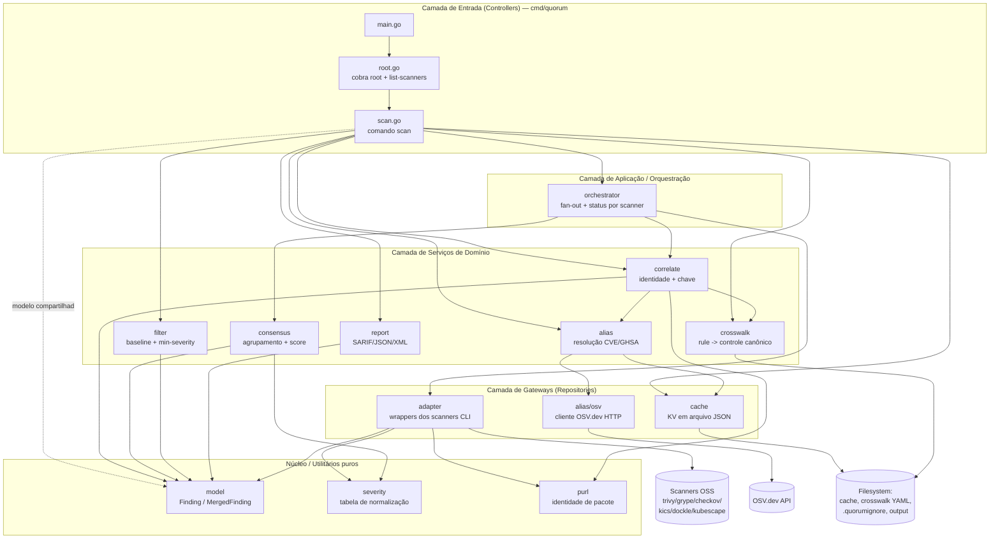
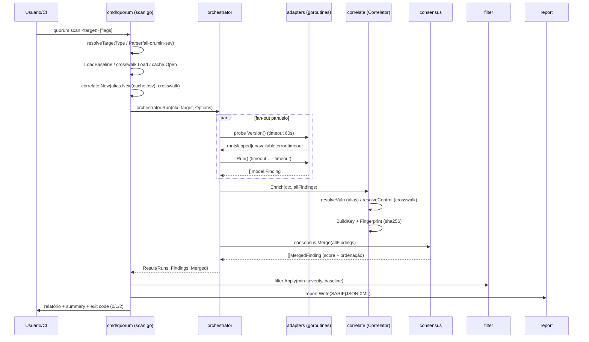
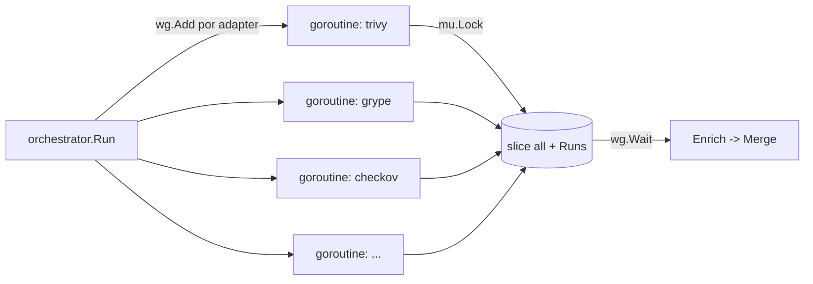
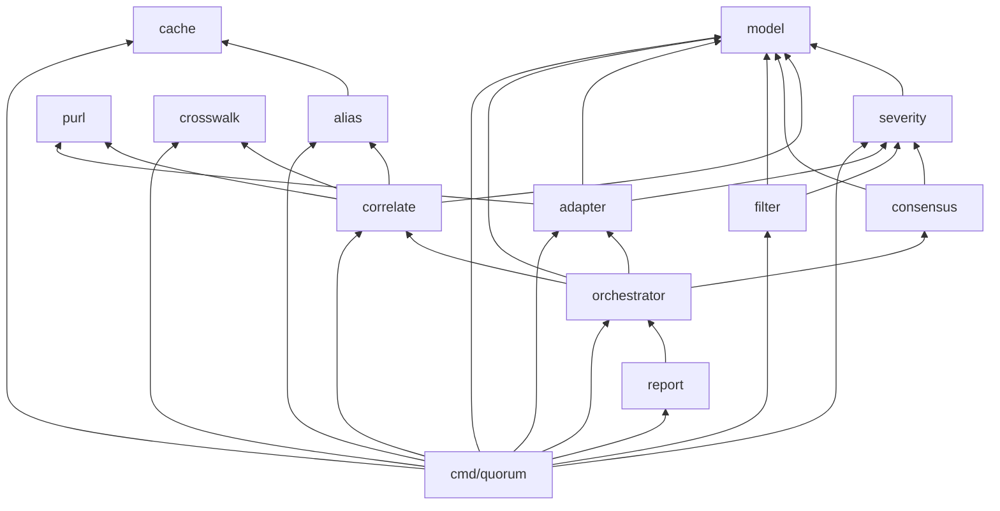

# Backend

O "backend" do **Quorum** (v0.2.3) é o conjunto de pacotes Go que compõem a CLI/Docker.
Não existe servidor de aplicação, processo de longa duração (daemon) nem API HTTP: o backend
é uma biblioteca de pacotes `internal/*` orquestrada por um binário de linha de comando
(`cmd/quorum`). Cada execução de `quorum scan` é um processo efêmero que faz fan-out de
scanners externos (trivy, grype, checkov, kics, dockle, kubescape), normaliza tudo para o
modelo canônico `model.Finding`, resolve aliases de vulnerabilidade, correlaciona findings
equivalentes, calcula um score de consenso e emite um relatório SARIF/JSON/XML. O princípio
de design que permeia todo o código é **"false split > false merge"** (preferir nunca fundir
dois findings distintos a fundir incorretamente dois findings diferentes) e **"0 findings is
not proof of safety"** (ausência de resultados nunca equivale a segurança comprovada).

Este documento mapeia o template enterprise de "Backend" (Camadas, Serviços, Repositories,
Controllers, Middlewares, Workers, Jobs, Cache, Fila/Mensageria) sobre a realidade do código.
Quando o template pede um conceito típico de aplicações web/distribuídas que **não existe**
neste produto, o item é marcado como **N/A** com justificativa técnica.

Documentos relacionados: [Arquitetura](04-arquitetura.md) · [Modelo de dados](05-modelo-de-dados.md)
· [CLI / Comandos](06-interfaces-cli-e-formatos.md) · este arquivo é a referência canônica do código Go.

---

## 1. Visão geral em camadas

O backend é estritamente em camadas, com dependências apontando **sempre para dentro** (do
binário CLI para o domínio). Nenhum pacote de domínio importa `cmd/quorum`, e o pacote
`model` não importa ninguém — é o núcleo estável que todos compartilham.



### Tabela de camadas

| Camada | Pacote(s) | Responsabilidade | Depende de |
| --- | --- | --- | --- |
| Entrada (Controllers) | `cmd/quorum` | Parsing de flags (cobra), resolução de tipo de alvo, montagem das dependências, exit codes | toda a camada de aplicação/serviços |
| Aplicação / Orquestração | `internal/orchestrator` | Selecionar adapters, fan-out paralelo, timeout/probe, coletar findings, disparar enrich+consensus | adapter, correlate, consensus, model |
| Serviços de domínio | `correlate`, `consensus`, `alias`, `crosswalk`, `filter`, `report` | Lógica de negócio: identidade, score, resolução de aliases/controles, supressão, serialização | model, severity, purl, cache, osv |
| Gateways (Repositories) | `adapter`, `cache`, `alias/osv` | Acesso a recursos externos: processos CLI, arquivo de cache, HTTP OSV | model, severity, purl |
| Núcleo / utilitários | `model`, `severity`, `purl` | Tipos canônicos e funções puras sem efeitos colaterais | nada (model é folha) |

> Regra de ouro do repo (`internal/model/model.go`): *"Nothing in the pipeline operates on a
> scanner's raw JSON — every adapter normalizes into Finding, and every later stage speaks
> Finding and MergedFinding only."* O `Raw map[string]any` é mantido mas marcado `json:"-"`
> (não serializado por padrão).

---

## 2. Pipeline de execução (do comando ao relatório)

O caminho completo de uma execução de `scan`, com os pacotes responsáveis por cada etapa:



Etapas em prosa:

1. **Controller** (`scan.go`) valida flags, infere o tipo de alvo, carrega baseline/crosswalk/cache
   e injeta as dependências no `Correlator`.
2. **Orchestrator** seleciona os adapters que suportam o alvo, executa cada um numa goroutine,
   faz a *version probe* e a execução com timeout, e coleta os `Finding` canônicos.
3. **Correlate** enriquece (resolve aliases para VULN, controles para MISCONFIG/K8S) e estampa
   `CorrelationKey` + `Fingerprint`.
4. **Consensus** agrupa por `CorrelationKey` e calcula `Confidence`/`DetectionCount`.
5. **Filter** aplica `--min-severity` e o baseline `.quorumignore`.
6. **Report** serializa; o controller decide o exit code via `--fail-on`.

---

## 3. Serviços (lógica de domínio)

Os "serviços" do template correspondem aos pacotes de domínio. Nenhum deles tem estado global
mutável de longa duração; são funções/objetos instanciados por execução.

### 3.1 `internal/orchestrator` — serviço de orquestração

Arquivo-chave: `orchestrator.go`. Expõe `Run(ctx, target, Options) (*Result, error)`.

- `Options` carrega: `Scanners []string`, `PerScannerTime` (timeout por scanner), `ProbeTime`
  (timeout da version probe, default `60s` via `defaultProbeTime`), `Correlator` e `Logf`.
- `Result` agrega `Runs []ScannerRun`, `Findings []model.Finding` (cru, para detalhe JSON),
  `Merged []model.MergedFinding`, `Duration`.
- `ScannerRun.Status` assume **`ran | skipped | unavailable | error | timeout`** — a
  transparência de status é deliberada: *"0 vulns must never look like scan didn't run"*.
- `runOne` distingue causas de falha da probe: timeout (`DeadlineExceeded`),
  morto por sinal/OOM (`killedSignal` detecta `"signal: killed"`) e binário ausente, emitindo
  mensagens de erro acionáveis (ex.: "raise the container's memory limit").
- Quando `Correlator == nil`, o orchestrator ainda calcula `CorrelationKey`/`Fingerprint` via
  `correlate.BuildKey`/`Fingerprint` para que o agrupamento de consenso funcione mesmo sem
  enriquecimento.

### 3.2 `internal/correlate` — serviço de identidade

Arquivos: `correlate.go` (enriquecimento) e `key.go` (chave determinística).

- `Correlator{Alias, Crosswalk}` — ambas dependências podem ser `nil` (degrada para id-as-is /
  unmapped).
- `Enrich` itera os findings: `TypeVuln` → `resolveVuln` (alias); `TypeMisconfig`/`TypeK8sPosture`/
  `TypeImgHardening` → `resolveControl` (crosswalk). Depois aplica `BuildKey` + `Fingerprint`.
- `BuildKey` é **pura e determinística**, com chave **por tipo** (não há chave universal):

| Tipo | Forma da `CorrelationKey` |
| --- | --- |
| `VULN` | `VULN\|<VULNID maiúsculo>\|<name@version do PURL>` |
| `MISCONFIG` | `MISCONFIG\|<basename do arquivo>\|<tipo do recurso>\|<controle>` |
| `K8S_POSTURE` | `K8S\|<ns/kind/name>\|<container/address>\|<controle>` |
| `IMG_HARDENING` | `IMGH\|<controle>` |
| `SECRET` | `SECRET\|<path normalizado>\|<linha>\|<ruleId>` |
| outros | `OTHER\|<scanner>\|<title>` |

- `Fingerprint(key) = sha256(key)` em hex — é a `partialFingerprints["quorum/v1"]` no SARIF.
- `controlKey` prefere o controle canônico resolvido; quando *unmapped*, usa
  `UNMAPPED:<scanner>:<ruleId>` para **nunca** fundir silenciosamente findings distintos.

### 3.3 `internal/consensus` — serviço de score

Arquivo: `consensus.go`. Expõe `Merge([]Finding) []MergedFinding`.

- Agrupa por `CorrelationKey` preservando ordem de primeira aparição.
- Para cada grupo calcula: `DetectedBy` (scanners distintos), `Severity` (máximo agregado),
  `DetectionCount`, `Unmapped` (qualquer membro), `Confidence`.
- **Fórmula de confiança** (DESIGN §9), pesos: contagem `0.35`, diversidade `0.25`,
  severidade `0.25`, autoritativa `0.15`.
  - contagem: `log(1+n)/log(5)` — retornos decrescentes.
  - diversidade: famílias de engine distintas (`scannerCategory`: sca, iac, k8s, hardening);
    1 família ≈ 0.33, 2 ≈ 0.66, 3+ = 1.0 — *dois engines diferentes valem mais que dois iguais*.
  - autoritativa: 1.0 se `Confirmed` ou se for CVE com CVSS > 0.
- Ordena por `(severidade, confidence, detectionCount, correlationKey)` descendente para saída
  estável e útil.

### 3.4 `internal/alias` — serviço de resolução de identificadores

Arquivos: `resolver.go` (cadeia) e `osv.go` (cliente OSV.dev).

- `chainResolver` resolve um id de vuln para a forma canônica preferindo **CVE**, em 3 camadas:
  1. aliases já presentes no finding (`preferCVE`),
  2. cache local (`cache.Store`),
  3. arbitragem OSV.dev (`osvSource`).
- **Nunca retorna erro**: degrada graciosamente para o melhor id disponível em falha de rede.
- `--offline` passa `osv = nil`, desligando a camada 3 (usa só aliases locais + cache).
- `OSVClient` tem retry com backoff exponencial (`MaxRetries=2`, `Backoff=200ms`), timeout HTTP
  de 8s, e classifica falhas como *retryable* (rede, 429, 5xx) ou não.

### 3.5 `internal/crosswalk` — serviço de mapeamento de controles

Arquivo: `crosswalk.go`. Carrega `*.yaml`/`*.yml` de um diretório e indexa
`"scanner|ruleID"` → `Resolution{Control, Category, CWE, Title}`.

- Diretório ausente **não é erro** (roda sem crosswalk customizado).
- `Resolve` retorna `ok=false` quando não há mapeamento — o chamador mantém o finding isolado e
  marca `Unmapped` ("never guess a match", DESIGN §6).
- O diretório default é `./crosswalk` com fallback automático para `/opt/quorum/crosswalk`
  (bundle da imagem Docker), via `resolveCrosswalkDir` em `scan.go`.

### 3.6 `internal/filter` — serviço de pós-processamento/gating

Arquivo: `filter.go`. Aplica corte de severidade mínima e baseline antes de reportar/gate.

- `Baseline` casa por `Fingerprint` **OU** `CorrelationKey` (usuário pode copiar qualquer um do
  relatório); arquivo `.quorumignore` (default), `#` comenta, linhas em branco ignoradas.
- `LoadBaseline` distingue "ausente" (`ok=false`) de "presente porém vazio" — o controller
  exige existência apenas quando `--baseline` foi passado explicitamente.
- `Apply` retorna `Result{Kept, SuppressedBaseline, SuppressedSeverity}` — **sempre loga
  supressões** (um finding suprimido continua sendo um finding, DESIGN §14).

### 3.7 `internal/report` — serviço de serialização

Arquivos: `report.go` (despacho de formato), `sarif.go`, `json.go`, `xml.go`.

- `Write(w, res, format)` despacha para SARIF (primário), JSON ou XML.
- `ParseFormat` valida `--format`.
- SARIF carrega `partialFingerprints["quorum/v1"]` derivado do `Fingerprint`.

---

## 4. Repositories (gateways de acesso a recursos externos)

No Quorum não há repositório de banco relacional. O papel de "repository" (abstração de acesso a
um recurso externo persistente ou de I/O) é desempenhado por três gateways:

| Gateway | Pacote | Recurso externo | Padrão |
| --- | --- | --- | --- |
| Adapters de scanner | `internal/adapter` | Processos CLI (trivy, grype, ...) | Interface + Registry + `exec.CommandContext` |
| Cache de aliases | `internal/cache` | Arquivo JSON em disco | KV store com flush atômico |
| Cliente OSV | `internal/alias/osv.go` | API HTTP OSV.dev | HTTP client com retry/backoff |

### 4.1 Adapters como gateways de scanners

O pacote `adapter` é o gateway para o "mundo externo" dos scanners. Cada adapter implementa a
interface `Adapter`:

```go
type Adapter interface {
    Name() string
    Version(ctx context.Context) (string, error)
    Supports(target Target) bool
    Capabilities() []Capability
    Run(ctx context.Context, target Target) ([]model.Finding, error)
}
```

- **Registry**: cada adapter chama `Register(&xxx{})` no seu `init()`; `Get`/`All`/`Names`
  expõem o registro. Nome duplicado dá `panic` (erro de programação).
- **Execução de processo**: `runCmd` roda o binário, **funde stderr no erro**, e trata
  *exit não-zero com stdout não vazio como sucesso* (vários scanners saem != 0 justamente por
  terem achado problemas). `toolVersion` faz a probe de versão e detecta binário ausente.
- **Normalização**: cada adapter tem um parser próprio (ex.: `trivy.parse`) que traduz o JSON
  nativo para `[]model.Finding`, usando `severity.FromLabel/FromCVSS/FromDockle` e `purl.Build`.
  Adapters **nunca** computam `CorrelationKey` — isso é centralizado no correlator.
- **Contract tests**: cada adapter tem teste de contrato contra fixtures em
  `internal/adapter/testdata` (ver `adapter_test.go`, `realdata_test.go`).

Adapters registrados: `trivy`, `grype` (família **sca**); `checkov`, `kics` (**iac**);
`kubescape` (**k8s**); `dockle` (**hardening**).

### 4.2 Cache como repository

`internal/cache/store.go` é um KV `map[string]string` persistido em arquivo JSON — escolha
deliberada para dar idempotência/velocidade à resolução de aliases **sem trazer um banco CGO**.

- `Open(path)` carrega; arquivo ausente/corrompido vira cache vazio (nunca quebra um scan).
- `Put` escreve com **rename atômico** (`.tmp` → destino) e cria diretórios pais sob demanda;
  erros de flush são **engolidos de propósito** (cache é otimização, não fonte de falha).
- Seguro para uso concorrente (`sync.RWMutex`) — relevante porque os adapters rodam em paralelo
  e compartilham o resolver.
- Caminho default: `~/.cache/quorum/aliases.json` (via `os.UserCacheDir`), configurável por `--cache`.

### 4.3 Cliente OSV como repository remoto

`internal/alias/osv.go` é o gateway HTTP para OSV.dev (`GET /v1/vulns/<id>`), o "árbitro de
última instância" da cadeia de aliases. Detalhes em §3.4.

---

## 5. Controllers (comandos cobra)

A camada de entrada (`cmd/quorum`) é o "controller" do Quorum: traduz argumentos/flags em
chamadas aos serviços, monta dependências e define exit codes.

| Arquivo | Papel |
| --- | --- |
| `main.go` | Entry point; executa o root, imprime erro e sai com **exit 2** em falha de uso/runtime |
| `root.go` | Define o comando raiz `quorum` (cobra) e o subcomando `list-scanners` |
| `scan.go` | Define o comando `scan`, faz wiring de todas as dependências e roda o pipeline |

### 5.1 Comandos

- **`scan <target>`** (`ExactArgs(1)`): comando principal. Flags:
  `--type` (image|repo|k8s, inferido se omitido), `--scanners`, `--format/-f` (sarif|json|xml),
  `--output/-o`, `--fail-on`, `--min-severity`, `--baseline` (`.quorumignore`),
  `--crosswalk` (`./crosswalk` + fallback `/opt/quorum/crosswalk`), `--cache`,
  `--timeout` (default `5m`), `--offline`, `--quiet/-q`.
- **`list-scanners`**: lista adapters registrados e suas capacidades (`Capabilities().Type`).

### 5.2 Inferência de alvo

`resolveTargetType`: se `--type` omitido, um caminho existente em disco → `repo`; senão →
`image`. Aceita aliases (`fs`/`dir` → repo; `kubernetes`/`manifests` → k8s).

### 5.3 Exit codes (contrato de gating)

| Exit | Significado | Origem no código |
| --- | --- | --- |
| `0` | OK — nenhum finding atingiu `--fail-on` | retorno normal de `runScan` |
| `1` | Gate disparado — finding ≥ `--fail-on` | `os.Exit(1)` em `runScan` |
| `2` | Erro de uso/runtime | `os.Exit(2)` em `main.go` |

### 5.4 Saída de progresso e summary

O controller injeta um `Logf` que escreve em **stderr** com prefixo `[quorum]` (silenciável por
`--quiet`), e imprime um summary humano (status por scanner, contagem por severidade,
multi-detectados, tempo) — sempre encerrando com *"0 findings is not proof of safety"*.

---

## 6. Middlewares — N/A (com equivalentes)

**N/A.** Não há cadeia de middleware HTTP nem framework de interceptação, pois não existe
servidor HTTP. Os papéis que middlewares cumpririam numa aplicação web são preenchidos por
mecanismos da CLI/runtime Go:

| Papel típico de middleware | Equivalente no Quorum |
| --- | --- |
| Autenticação/autorização | N/A — sem contas/usuários (ferramenta local de CI) |
| Logging de requisição | `Logf` injetado pelo controller (stderr, `[quorum]`) |
| Timeout/cancelamento | `context.Context` propagado; `context.WithTimeout` por scanner e na probe |
| Tratamento de erro central | `runCmd`/`toolVersion` foldam stderr; `main.go` centraliza exit 2 |
| Recuperação de panic | Não há `recover` global; panics são erros de programação (ex.: registro duplicado) |
| Rate limiting | Parcial — backoff/retry no cliente OSV (`osv.go`) |

---

## 7. Workers (concorrência do fan-out)

Os "workers" do Quorum são **goroutines efêmeras** criadas pelo orchestrator para o fan-out
paralelo de scanners. Não há pool de workers persistente nem fila de trabalho.



Mecânica (em `orchestrator.go`):

- Uma goroutine por adapter selecionado; `sync.WaitGroup` sincroniza o término.
- Resultados são agregados sob `sync.Mutex` (`res.Runs` e o slice `all`).
- Cada worker (`runOne`) faz: `Supports` → version probe com timeout (`ProbeTime`, 60s default)
  → `Run` com timeout (`PerScannerTime` = `--timeout`) → classifica status.
- O `context.Context` flui do controller; cada worker deriva sub-contextos com `WithTimeout` e
  cancela ao final (`defer cancel`).
- Não há limite explícito de paralelismo (concorrência = número de adapters suportados, hoje ≤ 6).

Checklist de garantias de concorrência:

- [x] Acesso compartilhado protegido por mutex (`res.Runs`, `all`).
- [x] Cache de aliases seguro para concorrência (`cache.Store` com `RWMutex`).
- [x] Timeout por scanner e por probe isolados via `context`.
- [x] Resultados ordenados deterministicamente após o `wg.Wait` (`sort.Slice` em `Runs`).
- [ ] Limite configurável de paralelismo (não existe — ver Premissas / proposta futura).

---

## 8. Jobs / agendamento — N/A

**N/A.** Não há scheduler, cron interno, jobs em background nem tarefas recorrentes dentro do
processo. O Quorum é *one-shot*: um processo por invocação, que termina ao emitir o relatório.

O agendamento, quando desejado, é **externo** ao backend: GitHub Actions agenda/dispara a CLI
(via `action.yml` composite ou imagem `:full`). Pré-aquecimentos como o cache do banco do grype
acontecem em **build time** da imagem Docker, não como job de runtime.

> Proposta futura (claramente separada): um modo `--watch` ou integração com agendadores
> externos poderia ser adicionado sem alterar o núcleo, mas **não existe hoje**.

---

## 9. Cache

A única camada de cache é o **cache de aliases** (`internal/cache`), detalhado em §4.2.

| Aspecto | Valor |
| --- | --- |
| Backend | Arquivo JSON (`map[string]string`) |
| Chave / valor | id de vuln → id canônico (CVE preferido) |
| Localização default | `~/.cache/quorum/aliases.json` (`os.UserCacheDir`) |
| Flag | `--cache <path>` |
| Escrita | Atômica (`.tmp` + `os.Rename`), erros engolidos |
| Concorrência | `sync.RWMutex` |
| Invalidação | Não há TTL/expiração — entradas são consideradas estáveis (id canônico não muda) |
| Tolerância a falha | Arquivo ausente/corrompido → cache vazio, scan prossegue |

Não há cache de resultados de scan, cache HTTP do OSV além desse KV, nem cache em memória
distribuído. O pré-cache do banco do **grype** é um artefato da imagem `:full` (build time),
não um cache gerenciado pelo backend Go.

---

## 10. Fila / Mensageria — N/A

**N/A.** Não há broker (Kafka/RabbitMQ/SQS), nem fila interna de mensagens, nem comunicação
assíncrona entre processos. A justificativa técnica:

- O Quorum é um processo único, *stateless* e efêmero; toda a coordenação interna usa
  primitivas in-process do Go (goroutines + `WaitGroup` + `Mutex` + `channel` no `sleepCtx`).
- O modelo de execução é fan-out/fan-in síncrono dentro de uma única invocação — não há
  produtor/consumidor desacoplado nem necessidade de durabilidade de mensagem.
- A "mensageria" entre estágios é simplesmente a passagem de slices `[]model.Finding` em memória
  pela pipeline (orchestrator → correlate → consensus → filter → report).

Não há proposta de mensageria: introduzi-la contrariaria o princípio de ser uma CLI leve e
sem daemon ("No panel, no daemon" — `root.go`).

---

## 11. Responsabilidade de cada pacote `internal/*`

Tabela de referência rápida (uma linha por pacote), fiel ao código lido:

| Pacote | Papel no template | Responsabilidade única | Arquivos | Depende de |
| --- | --- | --- | --- | --- |
| `model` | Núcleo | Tipos canônicos `Finding`/`MergedFinding`, `Severity` (com `Rank`), `Resource`, `Location` | `model.go` | — (folha) |
| `severity` | Utilitário | Normalização de severidade (de label, CVSS, Dockle), `Max`, `AtLeast`, `Parse` | `severity.go` | model |
| `purl` | Utilitário | Build/extração de identidade de pacote (`name@version`) para a chave VULN | `purl.go` | — |
| `adapter` | Repository/Gateway | Interface `Adapter` + registry + `runCmd`/`toolVersion`; um arquivo por scanner com parser | `adapter.go`, `trivy.go`, `grype.go`, `checkov.go`, `kics.go`, `dockle.go`, `kubescape.go` | model, severity, purl |
| `cache` | Repository (cache) | KV persistente em JSON com flush atômico e thread-safe | `store.go` | — |
| `alias` | Serviço + gateway | Cadeia de resolução de id (aliases→cache→OSV); cliente OSV HTTP | `resolver.go`, `osv.go` | cache |
| `crosswalk` | Serviço | Mapeia `scanner\|ruleID` → controle canônico (YAML) | `crosswalk.go` | yaml.v3 |
| `correlate` | Serviço | Enriquecimento + `CorrelationKey`/`Fingerprint` determinísticos | `correlate.go`, `key.go` | alias, crosswalk, model, purl |
| `consensus` | Serviço | Agrupa por chave e calcula `Confidence`/`DetectionCount`; ordena | `consensus.go` | model, severity |
| `filter` | Serviço | Baseline (`.quorumignore`) + corte por `--min-severity` | `filter.go` | model, severity |
| `report` | Serviço | Serializa `Result` em SARIF/JSON/XML | `report.go`, `sarif.go`, `json.go`, `xml.go` | orchestrator |
| `orchestrator` | Aplicação | Fan-out paralelo, probe/timeout, status por scanner, orquestra pipeline | `orchestrator.go` | adapter, correlate, consensus, model |

E os pacotes de comando:

| Pacote | Papel | Responsabilidade |
| --- | --- | --- |
| `cmd/quorum` | Controller | `main.go` (entry/exit), `root.go` (cobra root + list-scanners), `scan.go` (comando scan + wiring + exit codes) |

---

## 12. Grafo de dependências (acíclico)



Características do grafo: **acíclico**, `model` é folha, e todo o domínio é testável sem rede
(o cliente OSV é injetado via interface `osvSource`, stubbável nos testes).

---

## 13. Checklist de extensão (acionável)

Adicionar um novo scanner:

- [ ] Criar `internal/adapter/<scanner>.go` implementando a interface `Adapter`.
- [ ] Chamar `Register(&<scanner>{})` em `init()`.
- [ ] Implementar `Version`, `Supports`, `Capabilities`, `Run` + parser para `model.Finding`.
- [ ] Mapear a família do engine em `consensus.scannerCategory` (sca/iac/k8s/hardening).
- [ ] Adicionar fixtures em `internal/adapter/testdata` e o contract test.
- [ ] (Se IaC/k8s) acrescentar regras de crosswalk YAML para os `ruleID` do scanner.

Adicionar um novo formato de relatório:

- [ ] Acrescentar `Format` em `report/report.go` e o `case` em `Write`/`ParseFormat`.
- [ ] Criar `report/<formato>.go` com a função `write<Formato>(w, res)`.
- [ ] Atualizar a ajuda da flag `--format` em `scan.go`.

---

## Premissas

1. **Versão de referência**: o documento descreve o código da árvore atual (rotulada v0.2.3).
   A constante `version` em `root.go` ainda é `"0.1.0"` como default de build (sobrescrita por
   `-ldflags` no GoReleaser); a versão "real" do release vem do ldflag, não do código.
2. **"Backend" = pacotes Go**: interpretei "backend" como o conjunto `cmd/quorum` + `internal/*`,
   já que não existe servidor/serviço de longa duração. Itens de template orientados a web
   (Middlewares HTTP, Jobs/scheduler, Fila/Mensageria) foram tratados como **N/A** com
   justificativa, conforme as regras de escrita.
3. **Famílias de engine**: a tabela `scannerCategory` em `consensus.go` inclui `polaris` (k8s)
   mesmo não havendo adapter `polaris` registrado hoje — tratei como mapeamento preparado para
   extensão futura, não como scanner ativo.
4. **Limite de paralelismo**: assumi que a concorrência do fan-out é igual ao número de adapters
   suportados (≤ 6 hoje), pois não há limitador configurável no código.
5. **Detalhes de serialização SARIF/JSON/XML**: li `report.go`, `sarif.go` e o uso de
   `partialFingerprints["quorum/v1"]`; o detalhamento campo-a-campo do schema SARIF é deixado
   para [Modelo de dados](05-modelo-de-dados.md) para evitar duplicação.
6. **Pré-cache do grype**: assumi que o banco do grype na imagem `:full` é populado em build time
   (Dockerfile.full), e portanto **não** é uma camada de cache gerenciada pelo backend Go.
