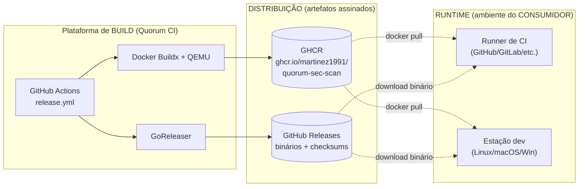
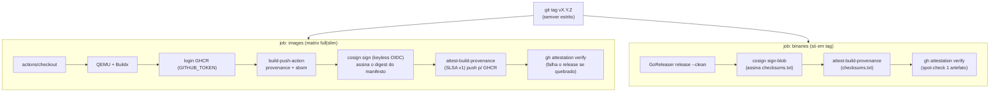

# Infraestrutura

> Documento de referência da infraestrutura do **Quorum** (`quorum-sec-scan`), v0.2.3.
> Escrito em pt-BR, padrão enterprise.

O Quorum é uma ferramenta **CLI/Docker** de _consensus security scanning_. Ele **não possui
infraestrutura de runtime própria**: não há serviço hospedado, cluster, banco de dados, fila,
load balancer ou API exposta. O produto executa **na máquina/pipeline do consumidor** — um
runner de CI, uma estação de trabalho de desenvolvedor ou um job de orquestração — e termina
o processo ao final da varredura. Toda a "infraestrutura" do projeto, portanto, é **infra de
_build_ e _distribuição_** (a cadeia de fornecimento de software, _supply chain_), não de
operação contínua.

Este documento descreve a infra **real** (imagens Docker, registry GHCR, GitHub Actions como
plataforma de build, distribuição de binários e a postura de _supply chain_), e declara
explicitamente como **N/A** os componentes clássicos de infraestrutura de runtime que não se
aplicam a este modelo de produto.

> Nota importante: o Quorum **escaneia** alvos Kubernetes e IaC (Terraform, CloudFormation,
> manifestos K8s, Dockerfiles etc.). Isso é **capacidade de produto**, não infraestrutura de
> runtime do Quorum. Não confunda "o Quorum analisa K8s" com "o Quorum roda em K8s".

---

## 1. Modelo de implantação



| Camada | Quem é dono | O que existe | Observação |
|---|---|---|---|
| **Build** | Projeto Quorum | GitHub Actions, GoReleaser, Buildx | Efêmero; runners `ubuntu-latest` |
| **Distribuição** | Projeto Quorum | GHCR (imagens), GitHub Releases (binários) | Artefatos imutáveis e assinados |
| **Runtime** | **Consumidor** | Nenhum recurso provisionado pelo Quorum | Processo de vida curta |

---

## 2. Infraestrutura de RUNTIME — N/A (declarações)

O Quorum não opera nenhum dos componentes abaixo. Cada item é declarado **N/A** com a
justificativa técnica.

| Componente | Status | Justificativa |
|---|---|---|
| **Cloud (AWS/GCP/Azure)** | **N/A** | Não há serviço hospedado. O binário/imagem roda no ambiente do consumidor. |
| **Kubernetes (runtime próprio)** | **N/A** | O Quorum é um processo CLI de vida curta; não há Deployment, Pod ou Operator do produto. (Ele _escaneia_ manifestos/clusters K8s — isso é função de produto.) |
| **Ingress / Gateway** | **N/A** | Não há serviço HTTP de entrada — não existe API REST nem frontend. |
| **Load Balancer** | **N/A** | Não há tráfego de requisições a balancear; execução é monoprocesso. |
| **CDN** | **N/A** | Distribuição de artefatos delegada ao GHCR/GitHub Releases (que já têm sua própria borda). O projeto não opera CDN. |
| **WAF** | **N/A** | Sem superfície HTTP exposta a proteger. |
| **Banco de dados relacional** | **N/A** | Estado é efêmero; correlação/consenso acontecem em memória por execução. Único "estado" persistido é cache local de aliases em `~/.cache/quorum/aliases.json` (arquivo, não DB). |
| **Fila / mensageria** | **N/A** | Fan-out de scanners é via goroutines no mesmo processo (orchestrator), não broker externo. |
| **Autenticação / IAM de runtime** | **N/A** | Não há contas de usuário nem API protegida. |
| **Observabilidade de runtime (APM/metrics/tracing)** | **N/A** | Sem serviço de longa duração; diagnóstico é via logs em `stderr` e status por scanner (`ran/skipped/unavailable/error/timeout`). |
| **Secrets de runtime** | **N/A** | A execução normal não requer segredos. OSV.dev é consultado sem credencial; `--offline` desativa. Ver §8. |

### Proposta futura (claramente separada — NÃO implementada)

Conforme [DESIGN.md](../DESIGN.md) §13, há a ideia de um **módulo runtime separado** (Falco
_ou_ Tetragon, OpenSCAP de host) como **produto à parte**, com modelo de _stream_. Caso isso
seja construído, passaria a existir infra de runtime (agentes, coleta contínua) — mas **isso
não faz parte do Quorum v0.2.x** e está fora do escopo deste documento.

---

## 3. Imagens Docker (infra real de distribuição)

O Quorum publica **duas variantes** de imagem, com objetivos distintos. Ambas usam build
multi-stage a partir de `golang:1.26-alpine` (compilação) e `alpine:3.20` (runtime).

| Variante | Dockerfile | Conteúdo | Plataformas | Tamanho/uso |
|---|---|---|---|---|
| **`:slim`** | [`Dockerfile`](../Dockerfile) | Apenas o orquestrador (binário `quorum`) + crosswalks | `linux/amd64`, `linux/arm64` | Pequena. BYO-scanners: os scanners devem estar no `PATH` (montados ou presentes no runner). |
| **`:full`** | [`Dockerfile.full`](../Dockerfile.full) | Orquestrador + **todos** os scanners + grype DB pré-cacheado | `linux/amd64` apenas | Autossuficiente para CI. Os binários de scanner empacotados são amd64, daí a restrição de arquitetura. |

### 3.1 Tags publicadas

Geradas em [`release.yml`](../.github/workflows/release.yml) (passo _Resolve version and image name_):

| Variante | Tags |
|---|---|
| `full` | `:full`, `:<version>`, `:<version>-full`, `:latest` |
| `slim` | `:slim`, `:<version>-slim` |

> A tag `:latest` aponta para a `full`. Para reprodutibilidade, **prefira pin por digest**
> (`@sha256:...`) em produção — ver §6.

### 3.2 Base images e dependências de runtime da imagem

| Imagem | Base / origem | Pinning |
|---|---|---|
| Build stage (ambas) | `golang:1.26-alpine` | Tag mutável (estágio de build, descartado) |
| Runtime stage (ambas) | `alpine:3.20` | Tag de minor; ver _gap_ em §6 |
| Trivy (full) | `aquasec/trivy:0.71.2` | **Pinada por `@sha256` digest** |
| KICS (full) | `checkmarx/kics:v2.1.3-alpine` | **Pinada por `@sha256` digest** |
| Grype + Syft (full) | Instalador oficial anchore (`install.sh`) | Versão fixa via `ARG`; checksum verificado pelo script |
| Dockle (full) | GitHub release tarball | **Checksum SHA-256 verificado** no build |
| Kubescape (full) | GitHub release / installer | Versão fixa via `ARG` |
| Checkov (full) | `pip install checkov==3.2.300` em venv isolado | Versão fixada (pin de versão pip) |

Pacotes do sistema na `:full` (via `apk`): `ca-certificates bash curl tar python3 py3-pip git
docker-cli`. A `:slim` instala apenas `ca-certificates`.

### 3.3 grype DB pré-cacheado (`:full`)

A `:full` faz `grype db update && grype db status` em build time e congela o banco de
vulnerabilidades na imagem (`GRYPE_DB_CACHE_DIR=/opt/grype/db`, `GRYPE_DB_AUTO_UPDATE=false`).
Isso garante que a **primeira varredura funcione offline** e não falhe com _"database does not
exist"_. O DB fica congelado no momento do build — para atualizar, **rebuild a imagem** ou
defina `GRYPE_DB_AUTO_UPDATE=true` em runtime (requer rede).

### 3.4 Versões de scanner empacotadas (`Dockerfile.full`)

| Scanner | `ARG` de versão |
|---|---|
| Trivy | `TRIVY_VERSION=0.71.2` |
| Grype | `GRYPE_VERSION=v0.114.0` |
| Syft (suporte ao Grype) | `SYFT_VERSION=v1.11.0` |
| Dockle | `DOCKLE_VERSION=0.4.14` |
| KICS | `KICS_VERSION=v2.1.3` |
| Kubescape | `KUBESCAPE_VERSION=v3.0.8` |
| Checkov | `CHECKOV_VERSION=3.2.300` |

---

## 4. Registry — GHCR

| Item | Valor |
|---|---|
| Registry | `ghcr.io` (GitHub Container Registry) |
| Repositório de imagem | `ghcr.io/martinez1991/quorum-sec-scan` (owner/repo em minúsculas) |
| Autenticação de push | `docker/login-action@v3` com `${{ secrets.GITHUB_TOKEN }}` (escopo `packages: write`) |
| Autenticação de pull | Pública (read) para consumidores; sem credencial necessária |

O push é feito pelo `docker/build-push-action@v6` (`push: true`), que também gera **provenance**
e **SBOM** nativos do Buildx (`provenance: true`, `sbom: true`).

---

## 5. GitHub Actions como plataforma de build

Não há servidor de build dedicado. A "infra de build" é o **GitHub Actions** com runners
efêmeros `ubuntu-latest`. Três workflows:

| Workflow | Gatilho | Função |
|---|---|---|
| [`ci.yml`](../.github/workflows/ci.yml) | push em `main`, PRs | `go vet`, `go test -race`, build, smoke (`list-scanners`) |
| [`e2e.yml`](../.github/workflows/e2e.yml) | (consenso end-to-end) | Validação de consenso |
| [`release.yml`](../.github/workflows/release.yml) | tag semver `v[0-9]+.[0-9]+.[0-9]+`; `workflow_dispatch` | Build/publish/assinatura de imagens e binários |

### 5.1 Pipeline de release (`release.yml`)



> A tag móvel `v0` (usada para pinar o **GitHub Action composite**) **NÃO** dispara release —
> o gatilho é restrito a semver completo `vX.Y.Z`. Ver [action.yml](../action.yml) e §7.

### 5.2 Permissões do workflow de release

```yaml
permissions:
  contents: read        # (job binaries eleva p/ write — cria release e sobe assets)
  packages: write       # push para GHCR
  id-token: write       # cosign keyless (Sigstore OIDC)
  attestations: write   # atestações SLSA build-provenance
```

---

## 6. Supply chain e pinning (DESIGN §12)

Princípio do projeto: **um scanner empacotado faz parte do SEU perímetro de confiança**. A
postura de _supply chain_ é:

- **Imagens de scanner pinadas por `@sha256` digest** (Trivy e KICS) — não por tag mutável.
- **Checksums verificados** no build (Dockle SHA-256; instaladores anchore validam checksum).
- **Versões fixas** por `ARG`/pin de pip para todos os scanners.
- **Assinatura keyless cosign** (identidade via GitHub OIDC — sem chaves a gerenciar).
- **Atestação SLSA build-provenance** (`actions/attest-build-provenance`), **verificada** no
  próprio release (`gh attestation verify`), de modo que uma atestação quebrada **falha** o build.
- **SBOM + provenance** gerados pelo Buildx no push.

### 6.1 Verificação pelo consumidor

```bash
# Imagem (manifesto multi-arch) — assinatura cosign keyless
cosign verify ghcr.io/martinez1991/quorum-sec-scan:slim \
  --certificate-identity-regexp \
    "https://github.com/Martinez1991/quorum-sec-scan/.github/workflows/release.yml@.*" \
  --certificate-oidc-issuer https://token.actions.githubusercontent.com

# Atestação SLSA build-provenance da imagem
gh attestation verify "oci://ghcr.io/martinez1991/quorum-sec-scan@sha256:<digest>" \
  --repo Martinez1991/quorum-sec-scan

# Binário nativo — atestação de provenance
gh attestation verify quorum_<version>_linux_amd64.tar.gz \
  --repo Martinez1991/quorum-sec-scan
```

### 6.2 Checklist de hardening da imagem (DESIGN §12)

- [x] Imagens de scanner Trivy/KICS pinadas por `@sha256`.
- [x] Dockle baixado com verificação de checksum SHA-256.
- [x] Versões de scanner fixadas por `ARG`/pin de pip.
- [x] Assinatura keyless cosign no digest do manifesto.
- [x] Atestação SLSA verificada no release (falha se quebrada).
- [x] grype DB pré-cacheado para operação offline na primeira varredura.
- [ ] **Base `alpine:3.20` pinada por digest** — hoje é tag de minor (mutável). _Gap conhecido._
- [ ] **Grype/Syft/Kubescape pinados por digest** — hoje via instalador com versão fixa, mas
      sem `@sha256` da release. _Hardening adicional sugerido._

> Recomendação para produção: o consumidor deve **pinar a imagem do Quorum por `@sha256`**
> (o input `image` do action documenta isso) em vez de usar `:full`/`:latest`.

---

## 7. GitHub Action composite (`action.yml`)

O repositório expõe um **Action composite** que envolve a imagem `:full`, permitindo
`uses:` em vez de escrever `docker run` à mão. Por padrão, ele **cosign-verifica a imagem
antes de rodá-la** (input `verify: true`).

```yaml
- uses: Martinez1991/quorum-sec-scan@v0   # tag móvel v0 para pin do action
  with:
    target: .
    type: repo
    fail-on: high
    image: ghcr.io/martinez1991/quorum-sec-scan:full  # pinar por @sha256 em produção
```

Internamente o action: (1) instala cosign se ausente; (2) verifica a assinatura keyless contra
a identidade OIDC do `release.yml`; (3) executa
`docker run --rm -v <workdir>:/work -w /work <image> scan <target> ...`; (4) propaga o
**exit code** do Quorum (`0` ok, `1` gate disparado, `2` erro) e expõe `output-file`.

---

## 8. Secrets

| Contexto | Secret | Uso |
|---|---|---|
| **Runtime (consumidor)** | **Nenhum** | A varredura não exige segredos. OSV.dev é público (sem chave); `--offline` desativa lookups de rede. |
| **CI/build (Quorum)** | `GITHUB_TOKEN` (efêmero, do GitHub) | Login no GHCR, criação de release, `gh attestation verify`. |
| **Assinatura** | **Nenhuma chave** | cosign **keyless** — a identidade vem do token OIDC do Actions; nada para armazenar/rotacionar. |

> Não há chave privada de assinatura, credencial de cloud ou segredo de longa duração no
> projeto. Isso é uma propriedade direta do modelo CLI/keyless.

---

## 9. Distribuição de binários nativos (GoReleaser)

Binários gerados por [`.goreleaser.yaml`](../.goreleaser.yaml) no job `binaries` do release
(apenas em tag).

| Item | Valor |
|---|---|
| OS | `linux`, `darwin`, `windows` |
| Arch | `amd64`, `arm64` |
| Build | `CGO_ENABLED=0`, `-trimpath`, `-ldflags "-s -w -X main.version=..."` |
| Arquivo | `quorum_<version>_<os>_<arch>.tar.gz` (`.zip` no Windows) |
| Conteúdo do archive | binário + `README.md`, `README.pt-BR.md`, `LICENSE`, diretório `crosswalk/` |
| Checksums | `checksums.txt` (formato `sha256  nome`) |
| Assinatura | cosign **sign-blob** sobre `checksums.txt` (`.sig` + `.pem`) |
| Atestação | SLSA build-provenance sobre `dist/checksums.txt` |
| Publicação | GitHub Releases (`Martinez1991/quorum-sec-scan`), `prerelease: auto` |

> O archive empacota o diretório `crosswalk/`. Em runtime, o flag `--crosswalk` tem default
> `./crosswalk` com **fallback automático** para `/opt/quorum/crosswalk` (caminho usado nas
> imagens Docker).

---

## 10. Sizing, custo e capacidade

Como **não há runtime hospedado**, **não há sizing de infra de operação** (sem instâncias,
réplicas, autoscaling ou custo de cloud do produto). As únicas considerações de capacidade são:

- **Build**: minutos de GitHub Actions em runners `ubuntu-latest` (custo do projeto, não do consumidor).
- **Distribuição**: armazenamento de pacotes no GHCR e assets em GitHub Releases.
- **Runtime do consumidor**: CPU/RAM do runner ou estação onde a varredura roda. O orquestrador
  faz fan-out paralelo (goroutines) com timeout por scanner (default `5m`) e probe de versão de
  `60s`; o consumo é dominado pelos scanners empacotados (especialmente Trivy/Grype com DB).

---

## 11. Recuperação de desastre / continuidade

| Cenário | Postura |
|---|---|
| Perda de runtime | **N/A** — não há estado de runtime a recuperar; cada execução é independente. |
| Indisponibilidade do GHCR | Consumidor usa imagem já puxada/pinada por digest, ou cai para binário nativo. |
| Indisponibilidade do OSV.dev | **Degradação graciosa**: aliases locais do scanner + cache (`~/.cache/quorum/aliases.json`); `--offline` evita totalmente a rede. |
| Atestação/assinatura corrompida no release | O job de release **falha** (verificação `gh attestation verify`), bloqueando publicação ruim. |

---

## Premissas

- O repositório upstream e o owner GHCR são `Martinez1991/quorum-sec-scan` /
  `ghcr.io/martinez1991/quorum-sec-scan`, conforme `action.yml` e `release.yml`. Forks usarão
  outro owner.
- "Infraestrutura" foi interpretada como **infra de build + distribuição + supply chain**, já
  que o produto não tem runtime hospedado. Componentes de runtime clássicos foram declarados
  **N/A** com justificativa, conforme a tarefa.
- Os tamanhos de imagem não estão medidos no repositório; descrições como "pequena/grande" são
  qualitativas, derivadas do conteúdo dos Dockerfiles (a `:full` empacota todos os scanners +
  grype DB; a `:slim`, só o binário).
- O job `e2e.yml` foi citado a partir do gatilho/propósito conhecido; seu conteúdo detalhado
  está fora do escopo deste documento de infraestrutura.
- A afirmação de que a primeira varredura da `:full` funciona offline pressupõe alvo compatível
  com o DB grype congelado no momento do build da imagem.
