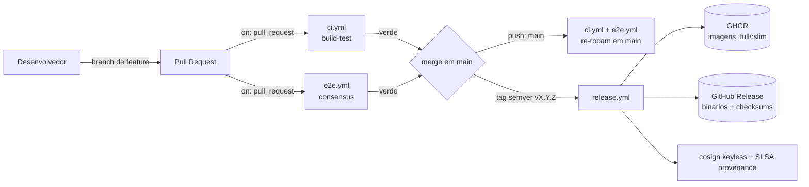
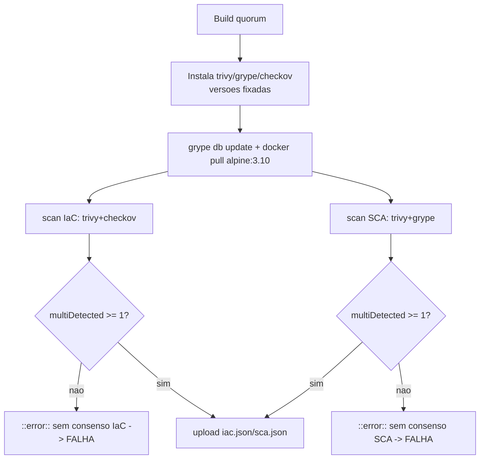
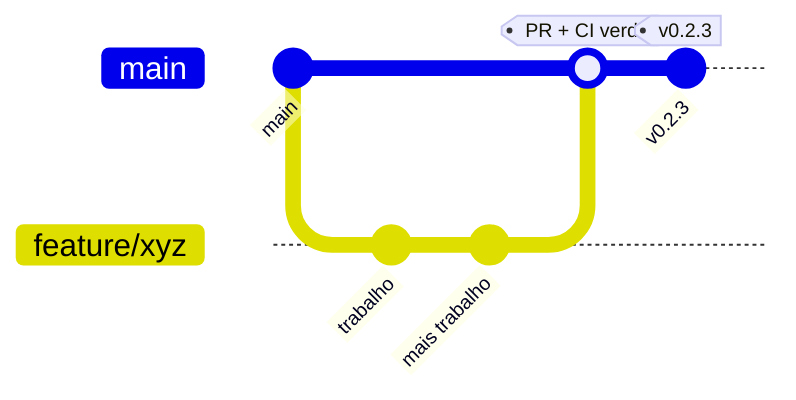
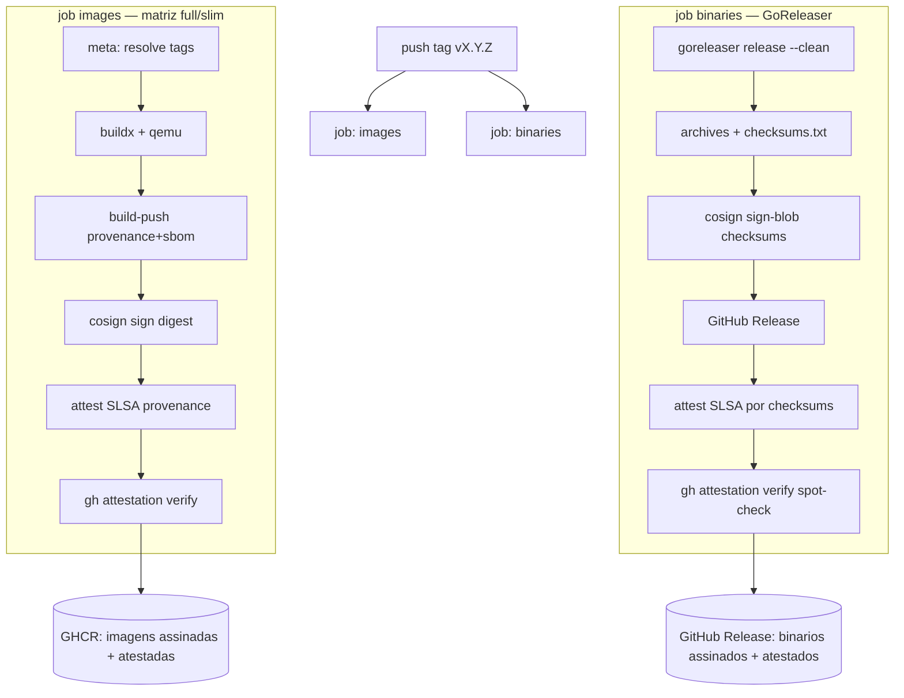
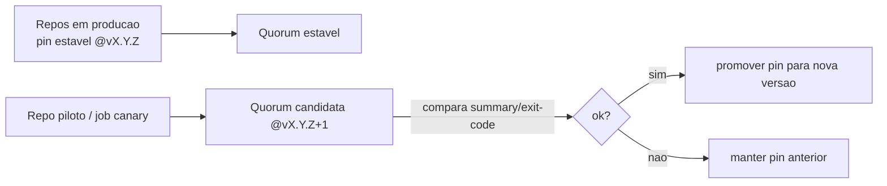

# 11 - DevOps

Esta seção descreve, de forma fiel ao código, como o **Quorum** (`quorum-sec-scan`, v0.2.3) é construído, testado, versionado e distribuído. O Quorum é uma ferramenta **CLI/Docker** de _consensus security scanning_ escrita em **Go 1.26**; não há serviço em execução contínua, frontend web, banco de dados ou API REST. Por isso, "DevOps" aqui significa essencialmente **engenharia de release**: um pipeline de Integração Contínua (CI) que prova que o consenso entre scanners realmente acontece, e uma Entrega Contínua (CD) que publica **imagens Docker assinadas** e **binários nativos assinados**, ambos com **atestação de proveniência SLSA** verificada no próprio release. O artefato é imutável e versionado; "deploy" é publicar; "rollback" é re-apontar uma tag móvel para um digest anterior.

Todos os fatos abaixo derivam diretamente de:

- [`.github/workflows/ci.yml`](https://github.com/Martinez1991/quorum-sec-scan/blob/main/.github/workflows/ci.yml) — job `build-test`.
- [`.github/workflows/e2e.yml`](https://github.com/Martinez1991/quorum-sec-scan/blob/main/.github/workflows/e2e.yml) — job `consensus`.
- [`.github/workflows/release.yml`](https://github.com/Martinez1991/quorum-sec-scan/blob/main/.github/workflows/release.yml) — jobs `images` e `binaries`.
- [`.goreleaser.yaml`](https://github.com/Martinez1991/quorum-sec-scan/blob/main/.goreleaser.yaml) — build de binários nativos.
- [`action.yml`](https://github.com/Martinez1991/quorum-sec-scan/blob/main/action.yml) — GitHub Action composite que envolve a imagem `:full`.

---

## 1. Visão geral



| Estágio | Workflow | Gatilho | O que prova / faz |
|---|---|---|---|
| Build & teste | `ci.yml` | `push` em `main`, qualquer `pull_request` | Compila, `go vet`, `go test -race`, build do binário, smoke (`list-scanners`) |
| Prova de consenso | `e2e.yml` | `push` em `main`, qualquer `pull_request`, `workflow_dispatch` | Roda scanners **reais** sobre alvos conhecidos e falha se nenhum finding for corroborado por dois engines |
| Release | `release.yml` | `push` de tag `v[0-9]+.[0-9]+.[0-9]+`, `workflow_dispatch` | Publica imagens e binários, assina (cosign keyless), atesta e verifica proveniência SLSA |

---

## 2. Integração Contínua (CI)

### 2.1 `ci.yml` — job `build-test`

Gatilho: `push` para `main` e **qualquer** `pull_request`. Runner: `ubuntu-latest`. Go `1.26` com cache habilitado.

Passos exatos:

| # | Passo | Comando | Falha se |
|---|---|---|---|
| 1 | Checkout | `actions/checkout@v4` | — |
| 2 | Setup Go | `actions/setup-go@v5` (`go-version: "1.26"`, `cache: true`) | — |
| 3 | Vet | `go vet ./...` | Erro estático/suspeito reportado pelo vet |
| 4 | Test | `go test -race ./...` | Qualquer teste falha **ou** _data race_ detectado |
| 5 | Build | `go build -trimpath -o dist/quorum ./cmd/quorum` | Falha de compilação |
| 6 | Smoke | `./dist/quorum list-scanners` | Binário não executa o comando básico |

Pontos relevantes:

- **`-race` é obrigatório.** O orquestrador faz _fan-out_ paralelo com goroutines (um scanner por goroutine), portanto o detector de corridas é a primeira linha de defesa contra regressões de concorrência.
- Os **contract tests** de cada adapter (Trivy, Grype, Checkov, KICS, Dockle, Kubescape) rodam contra fixtures em `internal/adapter/testdata` dentro do `go test ./...` — não exigem os scanners instalados, sendo determinísticos e rápidos.
- O passo **Smoke** garante que o binário sobe e que o registro de scanners (`list-scanners`) responde, sem depender de rede ou de scanners externos.

### 2.2 `e2e.yml` — job `consensus`

Este workflow é a prova viva do princípio do produto: _"0 findings is not proof of safety"_ e o consenso só vale com scanners **de verdade**, não fixtures. Gatilho: `push` para `main`, qualquer `pull_request` e `workflow_dispatch` (execução manual).

Sequência:

1. **Checkout** + **Setup Go 1.26**.
2. **Build do quorum** para `dist/quorum` e adição de `dist/` e `~/.local/bin` ao `GITHUB_PATH`.
3. **Instalação dos scanners** por download direto de releases (versões fixadas):
   - Trivy `0.71.2`, Grype `0.114.0` (comentário no workflow alerta que schemas antigos do DB de vulnerabilidades do Grype são aposentados pela Anchore), Checkov via `pipx install checkov`.
4. **Verificação dos scanners e pré-busca do DB**: `trivy --version`, `grype version`, `checkov --version`, `grype db update` (falha cedo se o DB não puder ser baixado), `docker pull alpine:3.10` (garante que ambos os engines resolvem a mesma imagem local) e `quorum list-scanners`.
5. **Consenso de IaC** (Trivy + Checkov sobre `examples/terraform`, `--type repo`, `--offline`): exige `summary.multiDetected >= 1`, senão emite `::error::no cross-engine IaC consensus reached` e falha.
6. **Consenso de SCA** (Trivy + Grype sobre `alpine:3.10`, `--type image`, `--offline`): mesma regra de `multiDetected >= 1`.
7. **Upload de relatórios** (`iac.json`, `sca.json`) como artefato, com `if: always()`.

> O `--offline` desliga as consultas de alias na OSV.dev, tornando o e2e determinístico e independente de variações de rede em relação à correlação por alias.



---

## 3. Git flow e estratégia de branch

O fluxo é o **GitHub Flow** clássico, baseado em PR para `main`, com versionamento por **tag semver**.



Regras práticas:

1. **`main` é a linha de release.** Todo trabalho acontece em branches de feature/fix (ex.: `fix/probe-timeout-...`, `ci/restrict-release-trigger-...`, como visto no histórico recente).
2. **Toda mudança entra via Pull Request.** O PR aciona `ci.yml` (build-test) e `e2e.yml` (consensus). Ambos devem estar verdes antes do merge.
3. **Merge em `main`** re-roda `ci.yml` e `e2e.yml` no `push` para `main` (defesa em profundidade contra _race_ de merge).
4. **Release por tag semver.** Apenas tags no formato `v[0-9]+.[0-9]+.[0-9]+` (ex.: `v0.2.3`) disparam `release.yml`. Não há release automático por merge — a tag é o gesto explícito de publicação.
5. **Tag móvel `v0`** (major) existe **apenas** para fixar o GitHub Action: consumidores usam `uses: Martinez1991/quorum-sec-scan@v0`. Essa tag move-se entre releases compatíveis. O `release.yml` **ignora** propositalmente tags como `v0` no gatilho (o padrão semver exige `X.Y.Z`), evitando que mover o ponteiro do Action reconstrua imagens.

### Checklist de PR (recomendado)

- [ ] Branch criada a partir de `main` atualizada.
- [ ] `go vet ./...` e `go test -race ./...` passam localmente.
- [ ] Novos parsers de adapter têm contract test contra fixture em `internal/adapter/testdata`.
- [ ] CI (`build-test`) verde.
- [ ] E2E (`consensus`) verde — o consenso real ainda ocorre.
- [ ] Mensagens de commit seguem prefixos convencionais (`fix:`, `feat:`, `ci:`, etc.); `docs:`/`test:`/`chore:` são filtrados do changelog (ver `.goreleaser.yaml`).

---

## 4. Entrega Contínua (CD) — `release.yml`

Gatilho de release: `push` de tag `v[0-9]+.[0-9]+.[0-9]+` ou `workflow_dispatch` (com input `version`, default `dev`).

Permissões do workflow (mínimo necessário):

| Permissão | Por quê |
|---|---|
| `contents: read` (job `images`) / `contents: write` (job `binaries`) | Ler o repo; criar release e subir assets de binários |
| `packages: write` | Push das imagens no GHCR |
| `id-token: write` | OIDC para assinatura **keyless** com cosign (Sigstore) |
| `attestations: write` | Atestação de **build-provenance SLSA** |

### 4.1 Job `images`

Matriz de variantes (`fail-fast: false`):

| Variante | Dockerfile | Plataformas | Conteúdo |
|---|---|---|---|
| `full` | `Dockerfile.full` | `linux/amd64` | Todos os scanners empacotados (binários dos scanners são amd64; grype DB pré-cacheado) |
| `slim` | `Dockerfile` | `linux/amd64`, `linux/arm64` | Apenas o orquestrador |

Resolução de tags (passo `meta`), com `image=ghcr.io/<owner>/<repo>` em minúsculas e `version` derivada de `GITHUB_REF_NAME` sem o prefixo `v`:

| Variante | Tags publicadas |
|---|---|
| `full` | `:full`, `:<version>`, `:<version>-full`, `:latest` |
| `slim` | `:slim`, `:<version>-slim` |

Pipeline do job:

1. **Checkout**.
2. **Resolve versão e nome da imagem** (passo `meta`, escreve `image`, `version`, `tags` em `GITHUB_OUTPUT`).
3. **QEMU** + **Buildx** (necessários para build multi-arch do `slim`).
4. **Login no GHCR** com `GITHUB_TOKEN`.
5. **Install cosign** (`sigstore/cosign-installer@v3`).
6. **Build & push** via `docker/build-push-action@v6` com `provenance: true`, `sbom: true`, cache GHA por escopo (`quorum-<variant>`) e `build-args: VERSION=<version>`.
7. **Sign image (keyless)**: `cosign sign --yes "${IMAGE}@${DIGEST}"` — assina o **digest do manifesto** (multi-arch) uma vez, cobrindo todas as tags que apontam para ele. Identidade vem do token OIDC do GitHub.
8. **Attest SLSA build provenance**: `actions/attest-build-provenance@v2` gera atestação SLSA v1 (`subject-digest` = digest da imagem, `push-to-registry: true`).
9. **Verify provenance attestation**: `gh attestation verify "oci://${IMAGE}@${DIGEST}" --repo ...` — re-verifica fim-a-fim (log de transparência Sigstore + identidade OIDC). Atestação quebrada **falha o release**.
10. **Summary**: escreve variante, plataformas, digest e tags no `GITHUB_STEP_SUMMARY`.

### 4.2 Job `binaries`

Condição: `if: github.ref_type == 'tag'` (GoReleaser precisa da tag). Permissões adicionais: `contents: write`, `id-token: write`, `attestations: write`.

Pipeline:

1. **Checkout** com `fetch-depth: 0` (GoReleaser precisa do histórico completo para o changelog).
2. **Setup Go 1.26**.
3. **Install cosign**.
4. **GoReleaser** (`goreleaser/goreleaser-action@v6`, `version: "~> v2"`, `args: release --clean`) — conforme [`.goreleaser.yaml`](https://github.com/Martinez1991/quorum-sec-scan/blob/main/.goreleaser.yaml):
   - Builds `CGO_ENABLED=0`, `-trimpath`, `ldflags -s -w -X main.version={{.Version}}`.
   - Matriz `goos: [linux, darwin, windows]` x `goarch: [amd64, arm64]`.
   - Archives `quorum_<version>_<os>_<arch>` (zip no Windows) incluindo `README.md`, `README.pt-BR.md`, `LICENSE` e o diretório `crosswalk/**`.
   - `checksums.txt` cobrindo todos os artefatos.
   - **Assinatura keyless** do arquivo de checksums via `cosign sign-blob` (gera `${artifact}.sig` e `${artifact}.pem`). Como o checksum fixa os hashes de todos os artefatos, a assinatura sobre ele cobre o release inteiro.
   - Cria o **GitHub Release** (`draft: false`, `prerelease: auto`) com changelog do GitHub (exclui `docs:`/`test:`/`chore:`).
5. **Attest SLSA build provenance for binaries**: `subject-checksums: dist/checksums.txt` — uma atestação cobrindo todos os artefatos listados.
6. **Verify binary provenance attestation**: `gh attestation verify dist/quorum_*_linux_amd64.tar.gz --repo ...` (spot-check de um artefato).



---

## 5. "Deploy" para um CLI/Docker

Não há ambiente de runtime gerenciado por este projeto. **Deploy = publicar artefatos imutáveis e verificáveis.** A unidade de implantação é o usuário ou pipeline consumidor que puxa a imagem ou baixa o binário.

| Conceito tradicional | Equivalente no Quorum |
|---|---|
| Servidor/ambiente de runtime | **N/A** — não há serviço persistente |
| Deploy | Publicar imagens no GHCR + Release de binários no GitHub |
| Versão imutável | Digest da imagem (`@sha256:...`) e tag semver |
| Integridade/origem | cosign keyless (OIDC) + atestação de proveniência SLSA |
| Configuração de runtime | Flags da CLI (`--type`, `--scanners`, `--fail-on`, ...) e mounts Docker |

### Como o consumidor verifica antes de usar

Imagem:

```bash
cosign verify ghcr.io/martinez1991/quorum-sec-scan:slim \
  --certificate-identity-regexp \
    "https://github.com/Martinez1991/quorum-sec-scan/.github/workflows/release.yml@.*" \
  --certificate-oidc-issuer https://token.actions.githubusercontent.com

gh attestation verify oci://ghcr.io/martinez1991/quorum-sec-scan:slim \
  --repo Martinez1991/quorum-sec-scan
```

A própria [`action.yml`](https://github.com/Martinez1991/quorum-sec-scan/blob/main/action.yml) faz isso automaticamente: por padrão (`verify: true`) ela **cosign-verifica** `ghcr.io/martinez1991/quorum-sec-scan:full` (instalando o cosign se preciso) antes de executar a imagem via `docker run`. Recomenda-se fixar a imagem por `@sha256:...` em produção (input `image`).

Binário (a partir de um release):

```bash
cosign verify-blob checksums.txt \
  --signature checksums.txt.sig \
  --certificate checksums.txt.pem \
  --certificate-identity-regexp \
    "https://github.com/Martinez1991/quorum-sec-scan/.github/workflows/release.yml@.*" \
  --certificate-oidc-issuer https://token.actions.githubusercontent.com
sha256sum -c checksums.txt
```

---

## 6. Rollback

Como os artefatos são imutáveis e versionados, rollback é uma operação de **re-apontamento/pin**, não de "desfazer um deploy".

### Para o consumidor (recomendado)

- **Pin por versão exata**: trocar `:latest`/`:full` por `:<versão-anterior>-full` (ex.: `:0.2.2-full`) ou, idealmente, pelo **digest** `@sha256:...` de uma release boa conhecida.
- **Action**: trocar `@v0` por uma tag fixa anterior, ou fixar `image:` no digest desejado.

| Cenário | Ação de rollback |
|---|---|
| Imagem nova com regressão | Repin para `:<versão-anterior>-full` ou digest anterior |
| Binário com bug | Baixar o asset da release anterior (assinada) |
| Action `@v0` instável | Pin `@vX.Y.Z` específico ou pin do `image:` por digest |

### Para o mantenedor

- **Re-tag da tag móvel**: mover `:full`/`:latest`/`:v0` de volta para o digest da release anterior. O cosign assina o **digest**, então a assinatura/atestação da release anterior permanece válida ao re-apontar a tag.
- **Forward-fix preferível**: cortar uma nova tag semver (`vX.Y.Z+1`) com a correção é o caminho mais limpo, pois cada release é integralmente reconstruída, assinada e atestada — evitando estados ambíguos.

> Por design, **não** se sobrescreve uma tag semver existente com conteúdo diferente. A tag semver é imutável; tags móveis (`full`, `latest`, `v0`) é que se reposicionam.

### Checklist de rollback

- [ ] Identificar a última versão boa conhecida (tag semver + digest).
- [ ] Consumidores: repin para versão/digest anterior (ou `@vX.Y.Z` do Action).
- [ ] Mantenedor: se necessário, re-apontar tags móveis para o digest anterior.
- [ ] Confirmar `cosign verify` + `gh attestation verify` no artefato de destino.
- [ ] Abrir forward-fix e cortar nova tag semver assim que possível.

---

## 7. Feature flags, Blue-Green e Canary

**N/A para o produto.** Estas técnicas pressupõem um serviço de longa duração com tráfego ao vivo que possa ser roteado, alternado ou gradualmente migrado. O Quorum é um processo **CLI/Docker efêmero**: executa, produz um relatório (SARIF/JSON/XML) e termina. Não há tráfego, não há réplicas em paralelo, não há estado de runtime para alternar.

| Técnica | Status | Justificativa |
|---|---|---|
| Feature flags | **N/A** | Comportamento é controlado por flags da CLI em tempo de invocação (`--scanners`, `--format`, `--fail-on`, `--offline`, ...); não há toggles dinâmicos de runtime |
| Blue-Green | **N/A** | Não há ambiente "live" com pool de tráfego para alternar |
| Canary | **N/A** (no produto) | Não há frota servindo requisições para liberar gradualmente |

### Como o CONSUMIDOR pode fazer canary de versões

Embora o produto não suporte canary internamente, o **pipeline consumidor** pode fazer canary de **versões do Quorum** com estratégias padrão de CI:

- **Pin escalonado**: a maioria dos repositórios fixa uma versão estável (digest/`@vX.Y.Z`); um repositório piloto adota a nova versão antes da adoção ampla.
- **Execução paralela não bloqueante**: rodar a versão nova em um job com `continue-on-error: true` lado a lado com a versão estável (gate), comparando o `summary` e o `exit-code` antes de promover.
- **`workflow_dispatch` / matriz de versões**: comparar relatórios de duas tags (estável vs. candidata) sobre o mesmo alvo e só então atualizar o pin.
- **Comparação de relatórios determinística**: usar `--offline` para reduzir variância de rede ao comparar `multiDetected`/`detectionCount` entre versões.



> Feature flag de comportamento de scan = simplesmente escolher flags da CLI por invocação. Não há, nem é desejável, um sistema de flags dinâmico para um binário de uma execução só.

---

## 8. Resumo de gatilhos e responsabilidades

| Workflow | `pull_request` | `push: main` | tag `vX.Y.Z` | `workflow_dispatch` |
|---|:--:|:--:|:--:|:--:|
| `ci.yml` (build-test) | sim | sim | — | — |
| `e2e.yml` (consensus) | sim | sim | — | sim |
| `release.yml` (images+binaries) | — | — | sim | sim |

| Artefato | Onde | Assinatura | Proveniência | Multi-arch |
|---|---|---|---|---|
| Imagem `:full` | GHCR | cosign keyless | SLSA (verificada) | `linux/amd64` |
| Imagem `:slim` | GHCR | cosign keyless | SLSA (verificada) | `linux/amd64`, `linux/arm64` |
| Binários | GitHub Release | cosign sign-blob (sobre checksums) | SLSA (verificada) | linux/darwin/windows x amd64/arm64 |

---

## Premissas

1. **Conteúdo dos Dockerfiles não foi detalhado linha a linha.** As variantes `:full`/`:slim` e o conteúdo (scanners empacotados, grype DB pré-cacheado) baseiam-se nos comentários de `release.yml`, no `.goreleaser.yaml` e na descrição do produto; o passo de build em si (`docker/build-push-action@v6`) foi documentado a partir do workflow, não da análise interna de `Dockerfile`/`Dockerfile.full`.
2. **`secrets.GITHUB_TOKEN`** é o token padrão fornecido pelo GitHub Actions; assume-se que os escopos `packages: write`, `id-token: write` e `attestations: write` estejam disponíveis no repositório (são declarados no workflow).
3. **Branch protection / required checks**: o documento descreve o fluxo via PR para `main` como prática; não há arquivo de configuração de proteção de branch no repositório verificável aqui, então as regras de "checks obrigatórios" são recomendações alinhadas ao comportamento dos workflows.
4. **Comandos de verificação para o consumidor** (cosign/`gh attestation verify`) foram extrapolados dos comentários e dos passos de verificação presentes em `release.yml` e `action.yml`; o regexp de identidade usa o owner `Martinez1991`, conforme `action.yml`.
5. **`v0` como tag móvel** do Action: confirmado pelo comentário em `action.yml` (`uses: Martinez1991/quorum-sec-scan@v0`) e pelo gatilho restrito a semver em `release.yml`. O reposicionamento de `v0`/`v0.2` é **automatizado** pelo workflow `.github/workflows/tag-major.yml`, que roda a cada release semver e avança as tags móveis para o mesmo commit (essas tags não re-disparam `release.yml`/`tag-major.yml`).

---

Ver também: [README.md](https://github.com/Martinez1991/quorum-sec-scan/blob/main/README.md) · [README.pt-BR.md](https://github.com/Martinez1991/quorum-sec-scan/blob/main/README.pt-BR.md) · [DESIGN.md](https://github.com/Martinez1991/quorum-sec-scan/blob/main/DESIGN.md) (supply chain §12, status de scanner §14).
