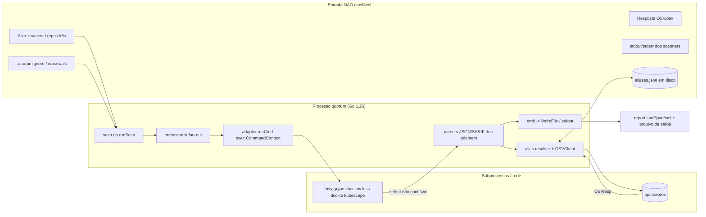
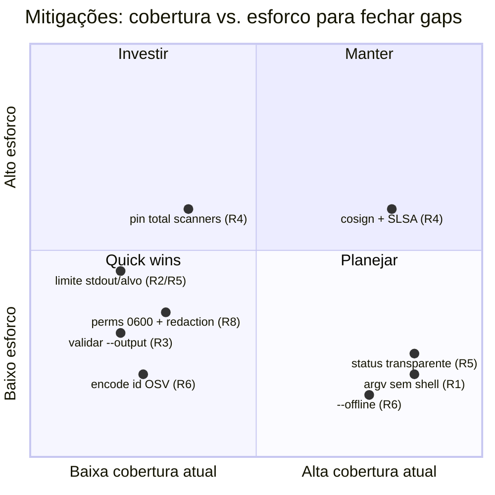

# Segurança

Esta seção é a análise de segurança completa do **Quorum** (`quorum-sec-scan`, v0.2.3),
uma ferramenta **CLI/Docker** de *consensus security scanning*. O Quorum não escaneia
artefatos diretamente: ele **orquestra um pool de scanners OSS** (trivy, grype, checkov,
kics, dockle, kubescape), faz **parse da saída não confiável** de cada um, **lê alvos
arbitrários** (imagens, repositórios, manifests) e, opcionalmente, **consulta a OSV.dev**
pela rede. Esse perfil — *uma ferramenta de segurança que executa outras ferramentas e
ingere dados não confiáveis* — concentra o risco em quatro fronteiras: **shell-out**,
**parsing**, **I/O de arquivos** e **rede/supply chain**.

O documento modela as ameaças sobre essas fronteiras, mapeia o produto contra os
principais frameworks (OWASP, MITRE, STRIDE, DREAD, LINDDUN, NIST, CIS, ISO 27001, PCI DSS,
LGPD) e, para cada risco, apresenta Descrição, Impacto, Probabilidade, Severidade,
Mitigação, Recomendação e Ferramentas sugeridas. Onde um framework não se aplica ao
escopo CLI/Docker (MASVS, OWASP LLM Top 10, MITRE ATLAS), declara-se **N/A** com
justificativa técnica.

Cross-links: [Arquitetura](04-arquitetura.md) · [Operação/CI](10-operacao.md) ·
[Supply Chain & Releases](13-supply-chain.md) · `DESIGN.md` (§12 CLI & Docker, §14 Riscos).

---

## 1. Modelo de fronteiras de confiança

O Quorum é um processo Go que, a partir de entrada controlada pelo usuário/CI, dispara
subprocessos e consome bytes que ele **não produziu**. Toda análise abaixo se ancora neste
modelo.

**Fronteiras de confiança (trust boundaries):**

| # | Fronteira | Entrada não confiável | Onde no código |
|---|-----------|------------------------|----------------|
| B1 | Shell-out | `target.Ref`, nomes de scanner, flags | `internal/adapter/adapter.go:runCmd` (`exec.CommandContext`) |
| B2 | Parsing | stdout JSON/SARIF dos scanners | `internal/adapter/*.go` (`json.Unmarshal`) |
| B3 | I/O de arquivo | `--output`, `--cache`, `--baseline`, `--crosswalk` | `cmd/quorum/scan.go:emit`, `internal/cache/store.go` |
| B4 | Rede | resposta da OSV.dev | `internal/alias/osv.go` |
| B5 | Supply chain | binários dos scanners, imagem base | `Dockerfile.full`, `action.yml`, GHCR |
| B6 | Recursos | tamanho do alvo (repo/imagem) | orchestrator (timeout por scanner) |

---

## 2. STRIDE por fronteira

| Fronteira | Spoofing | Tampering | Repudiation | Info Disclosure | DoS | Elevation |
|-----------|:--------:|:---------:|:-----------:|:---------------:|:---:|:---------:|
| B1 Shell-out | — | — | — | — | ▲ | ▲ (injeção de comando) |
| B2 Parsing | — | ▲ (saída forjada infla/oculta findings) | — | — | ▲ (JSON gigante) | — |
| B3 I/O arquivo | — | ▲ (path traversal/overwrite) | — | ▲ (findings em local errado) | — | — |
| B4 Rede OSV | ▲ (DNS/MITM) | ▲ (resposta forjada) | — | ▲ (vaza IDs consultados) | ▲ (latência) | — |
| B5 Supply chain | ▲ (imagem/binário falso) | ▲ (binário trojanizado) | — | — | — | ▲ |
| B6 Recursos | — | — | — | — | ▲ (zip/img bomb) | — |

▲ = vetor relevante para o Quorum. Vazios indicam vetor não aplicável ao escopo CLI.

---

## 3. Matriz de risco (DREAD)

Escala DREAD por critério 1–10; **Score = média**; Severidade derivada:
Crítico ≥ 8, Alto 6–7.9, Médio 4–5.9, Baixo < 4.

| ID | Risco | Damage | Reprod. | Exploit. | Affected | Discover. | **Score** | **Sev** | Estado |
|----|-------|:------:|:-------:|:--------:|:--------:|:---------:|:---------:|:-------:|--------|
| R1 | Injeção de comando via `target`/flags | 9 | 3 | 3 | 6 | 4 | **5.0** | Médio | Mitigado (sem shell) |
| R2 | Parse de saída maliciosa do scanner | 6 | 7 | 5 | 7 | 5 | **6.0** | Alto | Parcial |
| R3 | Path traversal / overwrite via `--output` | 7 | 8 | 7 | 5 | 6 | **6.6** | Alto | Gap |
| R4 | Supply chain (binários `curl\|sh`, tag mutável) | 9 | 5 | 5 | 8 | 4 | **6.2** | Alto | Parcial |
| R5 | DoS por alvo gigante / zip bomb / img bomb | 6 | 6 | 5 | 6 | 6 | **5.8** | Médio | Parcial |
| R6 | SSRF / exfiltração de IDs via OSV | 5 | 4 | 3 | 5 | 5 | **4.4** | Médio | Parcial |
| R7 | Cache poisoning (`aliases.json`) | 5 | 6 | 5 | 5 | 4 | **5.0** | Médio | Gap |
| R8 | Exposição de findings (relatório sensível) | 6 | 5 | 4 | 6 | 5 | **5.2** | Médio | Parcial |
| R9 | Crosswalk/baseline adulterado (false merge/suppress) | 7 | 5 | 4 | 5 | 4 | **5.0** | Médio | Parcial |
| R10 | RCE no parser/dep do scanner trojanizado | 9 | 3 | 3 | 7 | 3 | **5.0** | Médio | Parcial |

> **Princípio de produto que reduz risco de classe:** *"false split > false merge"* —
> na dúvida, o Quorum **não** funde findings. Isso limita o dano de R2/R9 (uma saída
> forjada tende a gerar findings extras, não a esconder findings reais).

---

## 4. Riscos detalhados

### R1 — Injeção de comando via `target` / flags (B1)

- **Descrição.** O `runCmd` executa cada scanner com
  `exec.CommandContext(ctx, bin, args...)` em `internal/adapter/adapter.go`. Os argumentos
  (incluindo `target.Ref`) são passados como **slice de argv**, **sem shell intermediário**
  (`/bin/sh -c`). Não há interpolação de string em comando, então metacaracteres de shell
  (`;`, `|`, `$()`, backticks) num alvo do tipo `repo; rm -rf /` são tratados como um
  literal de caminho, não como comando.
- **Impacto.** Execução arbitrária de comando no contexto do processo Quorum (e, em
  Docker, dentro do container `:full`).
- **Probabilidade.** Baixa — exige uma regressão que reintroduza `sh -c` ou um scanner que
  ele próprio interprete o alvo como shell.
- **Severidade.** Médio (alto impacto, baixa probabilidade no estado atual).
- **Mitigação (presente).** `exec.CommandContext` com argv; nenhum `sh -c` no código; o tipo
  de alvo é resolvido por `resolveTargetType` e o ref é sempre posicional.
- **Resíduo / atenção.** Um alvo que comece com `-` (ex.: `--config=/etc/...`) pode ser
  interpretado como **flag** pelo scanner subjacente (*argument injection*), não como path.
  Hoje o ref é concatenado direto nos args (ex.: trivy `args = []string{"image", ..., target.Ref}`).
- **Recomendação.**
  - [ ] Inserir o separador `--` antes do alvo em cada adapter, quando o scanner suportar.
  - [ ] Validar/normalizar `target.Ref` (rejeitar refs que comecem com `-`; validar formato
        de referência de imagem e existência de path para repo).
  - [ ] Teste de regressão garantindo que nenhum adapter use `sh -c`.
- **Ferramentas.** `gosec` (G204), `semgrep` regra `go.lang.security.audit.dangerous-exec`,
  `golangci-lint`.

### R2 — Parsing de saída maliciosa do scanner (B2)

- **Descrição.** Cada adapter faz `json.Unmarshal` do stdout do scanner
  (ex.: `trivy.parse`, `grype.parse`). Um scanner comprometido ou um alvo que induza o
  scanner a emitir saída adversária pode (a) inflar findings, (b) injetar conteúdo em
  campos como `Title`/`Description` que depois vão para o SARIF, ou (c) emitir JSON enorme.
- **Impacto.** Relatório poluído; potencial XSS/HTML injection se o SARIF for renderizado em
  uma UI de terceiros (GitHub code scanning, etc.); consumo de memória.
- **Probabilidade.** Média — depende de comprometer um scanner ou alvo hostil.
- **Severidade.** Alto.
- **Mitigação (presente).** Parsing estruturado por structs Go (campos desconhecidos
  ignorados), não `eval`; `runCmd` só trata exit≠0 como erro quando stdout está vazio
  (convenção "findings-found"), evitando que um exit code seja confundido com sucesso;
  princípio *false split > false merge* limita ocultação.
- **Gaps.** Sem limite de tamanho no stdout lido; sem sanitização explícita de campos
  textuais antes de emitir SARIF; sem validação de schema da saída.
- **Recomendação.**
  - [ ] `io.LimitReader`/cap de bytes no stdout do scanner (DoS de memória).
  - [ ] Sanitizar/escapar `Title`/`Description`/`Location` na camada `report`.
  - [ ] Manter os *contract tests* por adapter (`internal/adapter/testdata`) e adicionar
        fixtures adversárias (campos gigantes, unicode de controle, JSON malformado).
- **Ferramentas.** `go-fuzz`/native fuzzing nos parsers, `semgrep`, SARIF validators.

### R3 — Path traversal / overwrite via `--output` (B3)

- **Descrição.** Em `cmd/quorum/scan.go:emit`, o caminho de `--output` é usado diretamente:
  `os.MkdirAll(filepath.Dir(output), 0o755)` e `os.WriteFile(output, ..., 0o644)`. Não há
  validação de que o destino esteja dentro de um diretório esperado, nem proteção contra
  `..` ou caminhos absolutos.
- **Impacto.** Em CI, um `--output` controlado por entrada (ex.: derivado de nome de
  branch/PR) pode sobrescrever arquivos arbitrários graváveis pelo runner; criação de
  diretórios fora do workspace.
- **Probabilidade.** Média (em pipelines que montam `--output` a partir de variáveis).
- **Severidade.** Alto.
- **Mitigação (presente).** Nenhuma específica além das permissões do FS do runner.
- **Recomendação.**
  - [ ] Resolver `--output` com `filepath.Abs` + `filepath.Clean` e recusar saída fora de um
        diretório base (`--output-dir`) ou do CWD.
  - [ ] Recusar caminhos contendo `..` após `Clean`; documentar que `--output` não deve vir
        de entrada não confiável.
  - [ ] Considerar `O_EXCL`/escrita atômica quando não for sobrescrita intencional.
- **Ferramentas.** `gosec` (G304 file path provided as taint), `semgrep`.

### R4 — Supply chain dos scanners e imagem (B5)

- **Descrição.** O `Dockerfile.full` mistura dois níveis de confiança:
  - **Pinado por digest:** `aquasec/trivy@sha256:…`, `checkmarx/kics@sha256:…`.
  - **Checksum-verificado:** Dockle (baixa `.tar.gz` + `checksums.txt` e roda `sha256sum -c`).
  - **`curl | sh` de URL mutável (gap):** Grype e Syft via `install.sh` da Anchore;
    Kubescape via release URL + fallback `install.sh`; Checkov via `pip install` por versão
    (sem hash pin). O instalador da Anchore valida checksum interno, mas o **script em si**
    é buscado de `raw.githubusercontent.com/.../main/install.sh` (branch móvel).
  - O próprio `DESIGN.md §12` reconhece: *"pinar cada ferramenta por digest/SHA, não por tag
    mutável… houve incidente de supply chain em Actions de scanners em 2026"*. O cabeçalho do
    Dockerfile repete o aviso.
- **Impacto.** Binário trojanizado executado dentro do trust boundary → RCE, exfiltração.
- **Probabilidade.** Média.
- **Severidade.** Alto.
- **Mitigação (presente).** Trivy/KICS pinados por digest; Dockle com checksum; imagens
  publicadas no GHCR **assinadas keyless com cosign (OIDC)** + **atestação SLSA
  build-provenance** (`actions/attest-build-provenance`), verificadas no release; o
  **GitHub Action composite** (`action.yml`) faz `cosign verify` da imagem `:full` **antes**
  de executá-la (`verify: true` por padrão); tag móvel `v0` para pin do action; binários
  nativos via GoReleaser também assinados.
- **Gaps.** Grype/Syft/Kubescape/Checkov não pinados por digest/hash; `install.sh` por branch
  mutável; sem SBOM publicado da própria imagem `:full`; `pip install` sem `--require-hashes`.
- **Recomendação.**
  - [ ] Substituir cada tag/branch mutável por `@sha256` / commit SHA pin.
  - [ ] `pip install --require-hashes` com lockfile para o Checkov.
  - [ ] Publicar SBOM da imagem `:full` e verificá-lo no release.
  - [ ] No `action.yml`, manter `verify` obrigatório e pinar a versão do cosign (hoje usa
        `releases/latest/download` — também mutável).
  - [ ] Verificar a atestação SLSA no consumidor (`cosign verify-attestation`).
- **Ferramentas.** cosign, `slsa-verifier`, syft (SBOM), trivy/grype na própria imagem,
  `pip-audit`, Dependabot/Renovate com pin por digest.

### R5 — DoS por alvo gigante, zip bomb, image bomb (B6)

- **Descrição.** O Quorum lê alvos arbitrários e delega a leitura aos scanners. Um repo
  gigante, uma imagem com camadas infladas ou um arquivo compactado malicioso (zip bomb)
  pode exaurir CPU/memória/disco do runner.
- **Impacto.** Travamento do pipeline; custo de runner; OOM.
- **Probabilidade.** Média.
- **Severidade.** Médio.
- **Mitigação (presente).** **Timeout por scanner** (`--timeout`, default 5m; `PerScannerTime`
  no orchestrator) com fan-out paralelo isolando cada scanner; **probe de versão de 60s**
  (`Options.ProbeTime`) que distingue timeout / killed(OOM) / não-instalado e gera mensagem
  acionável (*"version probe killed — likely out of memory; raise the container's memory
  limit"*); status por scanner (`ran|skipped|unavailable|error|timeout`) deixa o DoS visível
  em vez de mascarar como "0 findings". Princípio *"0 findings is not proof of safety"*.
- **Gaps.** Sem limite de tamanho de alvo, sem ulimit/cgroup imposto pelo Quorum, sem cap de
  bytes no stdout (ver R2).
- **Recomendação.**
  - [ ] Documentar/recomendar limites de memória e `--timeout` em CI.
  - [ ] Rodar a imagem com `--memory`/`--pids-limit`/`--read-only` e `tmpfs` para `/tmp`.
  - [ ] Limite opcional de tamanho de alvo / profundidade de descompressão.
- **Ferramentas.** limites de cgroup do Docker/K8s, `timeout(1)`, monitor de runner.

### R6 — SSRF / exfiltração via OSV (B4)

- **Descrição.** O resolver de aliases consulta `https://api.osv.dev/v1/vulns/<id>`
  (`internal/alias/osv.go`). O `<id>` vem da saída do scanner e é **concatenado na path da
  URL sem sanitização**. A `BaseURL` é fixa (não controlável por flag), o que limita SSRF
  clássico, mas um `id` adversário poderia conter caracteres de path/query.
- **Impacto.** (a) Exfiltração passiva: a lista de IDs consultados revela quais
  vulnerabilidades existem no alvo a um terceiro (OSV.dev). (b) Risco residual de
  manipulação de URL se `id` não for validado.
- **Probabilidade.** Baixa–Média.
- **Severidade.** Médio.
- **Mitigação (presente).** **`--offline` desliga totalmente o OSV** (usa apenas aliases
  locais do scanner + cache); `BaseURL` fixa; cliente com **timeout de 8s** e backoff
  limitado (degradação graciosa — falha de rede nunca quebra o scan, *DESIGN §7*); CVE é
  preferido localmente antes de tocar a rede (`preferCVE`/`isCVE`), reduzindo nº de queries.
- **Gaps.** `id` não validado/encodado antes de virar path; sem allowlist de host explícita
  além da constante; consulta vaza metadados ao provedor.
- **Recomendação.**
  - [ ] `url.PathEscape(id)` e validar formato (`CVE-…`, `GHSA-…`) antes da requisição.
  - [ ] Documentar `--offline` para ambientes air-gapped / dados sensíveis.
  - [ ] Permitir mirror interno de OSV via env, com allowlist de host.
- **Ferramentas.** `gosec` (G107 url taint), proxy egress allowlist, `semgrep`.

### R7 — Cache poisoning de `aliases.json` (B3)

- **Descrição.** `internal/cache/store.go` é um KV JSON em `~/.cache/quorum/aliases.json`
  (escrita atômica via `.tmp`+`rename`, perm `0644`). Um arquivo corrompido/adulterado é
  **silenciosamente aceito** (`Open` ignora erro de unmarshal → cache vazio; `Get` confia no
  valor). Um atacante com acesso ao FS poderia mapear um GHSA para um CVE errado, afetando a
  correlação.
- **Impacto.** Correlação incorreta (false merge/split direcionado); ofuscação localizada.
- **Probabilidade.** Baixa (exige acesso ao FS do usuário/runner).
- **Severidade.** Médio.
- **Mitigação (presente).** Escrita atômica; cache é só otimização (nunca quebra o scan);
  OSV é arbiter quando o cache não tem a chave.
- **Gaps.** Sem integridade/assinatura do cache; valores confiados sem revalidação; perm
  `0644` (legível por outros usuários do host).
- **Recomendação.**
  - [ ] Em CI efêmero, **não persistir cache** entre jobs não confiáveis, ou usar `--cache ""`.
  - [ ] Perm `0600` no arquivo de cache.
  - [ ] TTL/versão de schema e checksum por entrada; opção `--no-cache`.
- **Ferramentas.** controle de permissão de FS, `gosec` (G306 file perms).

### R8 — Exposição de findings (B3 / output)

- **Descrição.** O relatório (SARIF/JSON/XML) contém vulnerabilidades, misconfigs e
  **secrets detectados** (trivy/dockle emitem findings de segredo). Esse output é dado
  sensível: revela a superfície de ataque do alvo e pode conter trechos próximos a segredos.
  `emit` escreve com perm `0644`.
- **Impacto.** Divulgação de postura de segurança / pistas de exploração a quem ler o
  artefato.
- **Probabilidade.** Média (artefatos de CI frequentemente são públicos ou amplamente
  acessíveis).
- **Severidade.** Médio.
- **Mitigação (presente).** Saída default é stdout (não persiste por padrão); `--min-severity`
  e `--quiet` reduzem ruído; baseline `.quorumignore` permite suprimir findings conhecidos.
- **Gaps.** Perm `0644` no arquivo; sem redaction de valores de segredo no relatório; nenhum
  aviso de classificação do artefato.
- **Recomendação.**
  - [ ] Tratar relatórios SARIF como artefatos restritos (não públicos por padrão em CI).
  - [ ] Redigir/mascarar valores de segredo; perm `0600` para `--output`.
  - [ ] Documentar retenção/expurgo dos artefatos.
- **Ferramentas.** controles de artifact storage do CI, DLP, ACL.

### R9 — Crosswalk / baseline adulterado (B3)

- **Descrição.** O crosswalk (YAML rule→control) e o `.quorumignore` influenciam correlação e
  **supressão**. `resolveCrosswalkDir` faz fallback automático para `/opt/quorum/crosswalk`
  quando `./crosswalk` não existe. Um baseline adulterado pode suprimir findings reais; um
  crosswalk adulterado pode forçar merges incorretos.
- **Impacto.** Ocultação de findings (supressão indevida) ou perda de granularidade.
- **Probabilidade.** Baixa–Média.
- **Severidade.** Médio.
- **Mitigação (presente).** Supressões são **sempre logadas**
  (`filtered: N suppressed by baseline …`); princípio *false split > false merge* + flag
  `unmapped` (DESIGN §6/§14) limita merge silencioso; crosswalk bundled é parte da imagem
  assinada.
- **Gaps.** Baseline/crosswalk do usuário não são assinados nem revisados; fallback de
  diretório pode mascarar um crosswalk vazio.
- **Recomendação.**
  - [ ] Versionar `.quorumignore`/crosswalk no repo com revisão obrigatória (CODEOWNERS).
  - [ ] Logar contagem de regras carregadas e alertar quando 0 (já há log de `crosswalk=N`).
  - [ ] Opcional: assinar/validar crosswalk customizado.
- **Ferramentas.** code review/CODEOWNERS, git history, política de PR.

### R10 — RCE via parser/dependência de scanner trojanizado (B5 ⟶ B2)

- **Descrição.** Combinação de R4+R2: se um binário de scanner for trojanizado, ele roda
  dentro do trust boundary e sua saída alimenta os parsers. É o pior caso de cadeia.
- **Impacto.** Comprometimento total do container/runner.
- **Probabilidade.** Baixa.
- **Severidade.** Médio (alto impacto, baixa probabilidade dado o pinning parcial).
- **Mitigação (presente).** Pinning por digest (trivy/kics), cosign/SLSA na imagem Quorum,
  verificação no `action.yml`.
- **Recomendação.** Ver R4 (pin total + SBOM) e executar a imagem com privilégios mínimos
  (rootless, `--read-only`, `--cap-drop=ALL`, sem `--privileged`).
- **Ferramentas.** cosign, slsa-verifier, runtime hardening do container.

---

## 5. OWASP Top 10 (2021) — mapeamento ao contexto CLI/Docker

| Categoria | Aplicabilidade ao Quorum | Risco(s) | Estado |
|-----------|--------------------------|----------|--------|
| A01 Broken Access Control | Parcial — sem authz própria; acesso = FS/CI runner | R3, R7, R8 | Depende do ambiente |
| A02 Cryptographic Failures | OSV via HTTPS; sem dados em repouso cifrados | R6, R8 | OK (TLS) / gap em repouso |
| A03 Injection | **Central** — command/argument injection | R1 | Mitigado (argv, sem shell); resíduo argument-injection |
| A04 Insecure Design | *false split > false merge*, status transparente | R2, R9 | Forte por design |
| A05 Security Misconfiguration | Perms `0644`, fallback de crosswalk, Docker run | R3, R7, R8 | Parcial |
| A06 Vulnerable & Outdated Components | Scanners/imagem base bundled | R4, R10 | Parcial (pin parcial) |
| A07 Identification & Auth Failures | **N/A** — sem contas/auth | — | N/A |
| A08 Software & Data Integrity Failures | cosign + SLSA; cache/baseline não assinados | R4, R7, R9 | Parcial |
| A09 Logging & Monitoring Failures | Logs de status/supressão em stderr | R9 | OK (escopo CLI) |
| A10 SSRF | OSV.dev (BaseURL fixa, id não encodado) | R6 | Parcial |

---

## 6. OWASP API Security Top 10 (2023) — mapeado ao CLI

O Quorum **não expõe API REST/HTTP** (sem servidor, sem endpoints). É **cliente** da API
OSV.dev. O Top 10 de API se aplica por analogia ao consumo dessa API:

| Item | Aplicabilidade | Observação |
|------|----------------|------------|
| API1 BOLA | N/A | Sem objetos/usuários expostos |
| API2 Broken Authentication | N/A | OSV é endpoint público sem auth |
| API3 BOPLA | Parcial | Quorum confia em campos da resposta OSV (R6) |
| API4 Unrestricted Resource Consumption | Parcial | Timeout 8s + backoff no cliente OSV |
| API5 BFLA | N/A | Sem funções/níveis |
| API6 Unrestricted Business Flows | N/A | — |
| API7 SSRF | Parcial | BaseURL fixa; `id` não encodado (R6) |
| API8 Security Misconfiguration | Parcial | `--offline` para air-gap |
| API9 Improper Inventory | N/A | Um único endpoint conhecido |
| API10 Unsafe Consumption of APIs | **Aplicável** | Consumir OSV: validar/encodar `id`, tratar resposta como não confiável (R6) |

> **Proposta futura (claramente separada):** *se* o Quorum vier a expor uma API/daemon, este
> Top 10 passa a ser primário (authn/z, rate limit, BOLA). Hoje é **N/A** por design.

---

## 7. OWASP ASVS 5.0 — controles aplicáveis ao escopo

Nível alvo recomendado: **ASVS L1 (com L2 onde aplicável a ferramenta de linha de comando)**.

| Capítulo ASVS | Requisito relevante | Estado no Quorum |
|---------------|---------------------|------------------|
| V1 Encoding/Sanitization | Tratar saída de scanner e resposta OSV como não confiável | Parcial (R2/R6 — falta encode/sanitização) |
| V2 Validation | Validar `target`, `--output`, `id` OSV | Parcial (R1/R3/R6) |
| V5 File Handling | Path traversal em `--output`/cache | Gap (R3); perms `0644` (R7/R8) |
| V8 Data Protection | Findings/secrets em repouso | Parcial (R8) |
| V10 Communication | TLS para OSV | OK |
| V12 Secure Comms / Egress | `--offline`, allowlist de host | Parcial (R6) |
| V14 Configuration | Pin de dependências, hardening de build | Parcial (R4) |
| V50 (Authn) / V51 (Session) | Autenticação/sessão | **N/A** — sem usuários |

---

## 8. OWASP SAMM — maturidade do processo

| Função SAMM | Prática | Evidência no projeto | Maturidade alvo |
|-------------|---------|----------------------|-----------------|
| Governance | Education & Guidance | DESIGN.md §12/§14, este doc | 2 |
| Design | Threat Assessment | STRIDE/DREAD deste doc | 2 |
| Design | Security Requirements | Princípio *false split > false merge*; *0 findings ≠ safe* | 2 |
| Implementation | Secure Build | Dockerfile pin parcial, GoReleaser, cosign/SLSA | 2→3 (fechar R4) |
| Implementation | Software Dependencies | Pin parcial dos scanners | 1→2 |
| Verification | Security Testing | Contract tests por adapter; CI/E2E | 2 |
| Verification | Architecture Assessment | Trust boundaries (§1) | 2 |
| Operations | Incident Mgmt | Status transparente por scanner | 1 (definir runbook) |

---

## 9. OWASP MASVS — **N/A**

O Quorum não é aplicação móvel: não há app iOS/Android, sem armazenamento em dispositivo,
sem IPC móvel, sem WebView. **Todos os controles MASVS (STORAGE, CRYPTO, AUTH, NETWORK,
PLATFORM, CODE, RESILIENCE) são N/A.** Os temas equivalentes de proteção de dados em repouso
e rede são cobertos por ASVS (§7) e pelos riscos R6/R8.

## 10. OWASP LLM Top 10 — **N/A**

O Quorum **não usa IA/LLM** em nenhum ponto: correlação e consenso são determinísticos
(`correlationKey`, `Fingerprint = sha256(correlationKey)`, fórmula de confiança baseada em
diversidade de engines/severidade/confirmação autoritativa). Não há prompts, embeddings,
RAG ou agentes. **LLM01–LLM10 não se aplicam.**

> **Proposta futura (separada):** se um dia houver enriquecimento por LLM (ex.: sumarização
> de findings), reavaliar Prompt Injection (LLM01), Insecure Output Handling (LLM02) e
> Sensitive Information Disclosure (LLM06), tratando a saída do LLM como não confiável.

---

## 11. MITRE ATT&CK — TTPs relevantes (atacante mira o pipeline)

| Tática | Técnica | Relação com o Quorum | Mitigação |
|--------|---------|----------------------|-----------|
| Initial Access | T1195 Supply Chain Compromise | Binário de scanner / imagem trojanizada (R4/R10) | Pin por digest, cosign/SLSA |
| Execution | T1059 Command/Scripting Interpreter | Shell-out (R1) | argv sem shell |
| Execution | T1203 Exploitation for Client Execution | Parser explorado por saída forjada (R2) | parsing estruturado, fuzzing |
| Persistence | T1554 Compromise Host Software Binaries | Substituir scanner no PATH (modo `:slim`) | imagem `:full` assinada; PATH controlado |
| Defense Evasion | T1027/T1070 Obfuscation/Indicator Removal | Baseline/crosswalk adulterado (R9) | supressões sempre logadas |
| Discovery | T1082/T1083 System/File Discovery | Findings revelam superfície (R8) | restringir artefatos |
| Exfiltration | T1041 Exfil over C2 / web | IDs vazados via OSV (R6) | `--offline`, egress allowlist |
| Impact | T1499 Endpoint DoS | Alvo gigante / zip bomb (R5) | timeout, limites de container |

## 12. MITRE ATLAS — **N/A**

ATLAS cobre ameaças a sistemas de **machine learning** (evasão de modelo, envenenamento de
dados de treino, extração de modelo). O Quorum não possui componente de ML/IA (ver §10),
portanto **nenhuma técnica ATLAS é aplicável**. O envenenamento relevante aqui é de **cache
de aliases** (R7), tratado como tampering de dados clássico, não como ML data poisoning.

---

## 13. LINDDUN — privacidade

Dados pessoais processados pelo Quorum são **mínimos e incidentais** (não há contas; pode
haver metadados em paths/segredos detectados). Mapeamento:

| Ameaça LINDDUN | Aplicabilidade | Risco | Mitigação |
|----------------|----------------|-------|-----------|
| **L**inkability | Baixa | IDs de vuln consultados na OSV correlacionáveis | `--offline` |
| **I**dentifiability | Baixa | Paths/secrets podem conter dados pessoais | min-severity, redaction (gap) |
| **N**on-repudiation | N/A | Sem ações de usuário a repudiar | — |
| **D**etectability | Média | Consulta OSV revela existência de vuln (R6) | `--offline`, mirror interno |
| **D**isclosure of info | Média | Relatório/secrets expostos (R8) | perms, restrição de artefato |
| **U**nawareness | Baixa | — | documentação |
| **N**on-compliance | Média | LGPD se findings contiverem dado pessoal | ver §19 |

---

## 14. NIST Cybersecurity Framework (CSF 2.0)

| Função | Estado | Evidência / lacuna |
|--------|--------|--------------------|
| **GOVERN** | Parcial | Princípios e riscos documentados; falta runbook de incidente |
| **IDENTIFY** | Bom | Trust boundaries, inventário de dependências (Dockerfile) |
| **PROTECT** | Parcial | cosign/SLSA, `--offline`; gaps em pin total, perms, path validation |
| **DETECT** | Bom (escopo) | Status por scanner, *0 findings ≠ safe*, supressões logadas |
| **RESPOND** | Inicial | Mensagens acionáveis (OOM/probe); sem processo formal |
| **RECOVER** | N/A→Inicial | Ferramenta stateless; rebuild da imagem refaz estado |

## 15. NIST SP 800-53 (controles selecionados)

| Família/Controle | Aplicação | Estado |
|------------------|-----------|--------|
| AC-3/AC-6 Least Privilege | Rodar container rootless, `--cap-drop=ALL` | Recomendado (gap) |
| AU-2/AU-12 Audit Logging | Logs de execução/supressão em stderr | OK (escopo) |
| CM-7 Least Functionality | `--scanners` limita superfície | OK |
| SA-12 Supply Chain Protection | Pin/cosign/SLSA | Parcial (R4) |
| SC-7 Boundary Protection | Egress só para OSV; `--offline` | Parcial |
| SC-8 Transmission Confidentiality | TLS OSV | OK |
| SI-7 Software/Info Integrity | Assinatura de artefatos; cache sem integridade | Parcial (R7) |
| SI-10 Input Validation | Validação de target/output/id | Parcial (R1/R3/R6) |

## 16. CIS Controls v8 (relevantes)

| Control | Aplicação | Estado |
|---------|-----------|--------|
| 2 Inventory of Software | Dockerfile lista scanners/versões | OK |
| 4 Secure Configuration | Hardening de container, perms | Parcial |
| 7 Continuous Vuln Mgmt | É o propósito do Quorum (consenso) | Core |
| 8 Audit Log Mgmt | Logs em stderr | OK |
| 16 Application Software Security | SDL deste doc, contract tests | Parcial |
| 18 Penetration Testing | Fuzzing de parsers recomendado | Gap |

## 17. ISO/IEC 27001:2022 (Anexo A — controles relevantes)

| Controle | Tema | Estado |
|----------|------|--------|
| A.5.23 Segurança em serviços cloud | Uso de OSV.dev | Parcial (`--offline`) |
| A.8.8 Gestão de vulnerabilidades técnicas | Produto-fim | Core |
| A.8.28 Codificação segura | argv, parsing estruturado | Parcial |
| A.8.30 Outsourced/3rd-party | Scanners terceiros bundled | Parcial (pin) |
| A.5.31 Requisitos legais (LGPD) | Dados em findings | Ver §19 |
| A.8.16 Monitoramento | Status por scanner | OK |

## 18. PCI DSS v4.0

O Quorum não armazena/processa dados de cartão (não há CHD/SAD). É **ferramenta de apoio à
conformidade**, não um sistema no escopo CDE.

| Requisito | Relação | Estado |
|-----------|---------|--------|
| Req 6.2/6.3 Software seguro e patching | Quorum ajuda a evidenciar SCA/IaC | Apoio |
| Req 6.4.3 Componentes de software | SBOM/pin | Parcial |
| Req 11.3 Detecção de vulnerabilidades | Scans de consenso em CI | Apoio |
| Req 12 Políticas | Integrar Quorum ao processo | Organizacional |
| Demais (1–4, 7–10) | **N/A** — sem CHD, sem rede CDE | N/A |

## 19. LGPD (Lei 13.709/2018)

O Quorum **não coleta dados pessoais de usuários** (sem contas, sem telemetria). Risco
residual: **dados pessoais podem aparecer incidentalmente** em findings (paths,
segredos/credenciais detectados, e-mails em código).

| Aspecto | Situação | Ação |
|---------|----------|------|
| Coleta direta de dado pessoal | Nenhuma | — |
| Dado pessoal incidental em relatórios | Possível (R8) | Tratar relatório como restrito; redaction |
| Transferência internacional | Consulta a OSV.dev (EUA) envia **apenas IDs de vuln**, não dado pessoal | `--offline` para air-gap |
| Base legal / minimização | Saída default em stdout; `--min-severity` | Reter o mínimo |
| Direitos do titular | N/A (sem cadastro) | — |

---

## 20. Mitigações presentes vs. gaps (resumo executivo)

**Já presentes (forças):**
- Shell-out sem `sh -c` — argumentos via argv (`exec.CommandContext`).
- Parsing estruturado por struct + contract tests por adapter com fixtures versionadas.
- `--offline` desliga OSV; cliente OSV com timeout/backoff e degradação graciosa.
- Distribuição assinada: **cosign keyless (OIDC) + atestação SLSA build-provenance**;
  `action.yml` faz `cosign verify` antes de rodar; tag móvel `v0` para pin do action.
- Pin por digest de trivy/kics; Dockle com checksum; grype DB pré-cacheado (1ª scan offline).
- Timeout por scanner + probe de versão de 60s que distingue timeout/OOM/ausente.
- Transparência: status por scanner, *"0 findings is not proof of safety"*, supressões logadas.
- Design *false split > false merge* limita ocultação de findings.

**Gaps prioritários (backlog acionável):**
- [ ] **R3** Validar/normalizar `--output` (Abs+Clean, recusar `..`/saída fora de base, `0600`).
- [ ] **R6** `url.PathEscape` + validação de formato do `id` antes da query OSV.
- [ ] **R4** Pinar grype/syft/kubescape/checkov por digest/hash; SBOM da imagem `:full`; cosign pinado.
- [ ] **R2/R5** Cap de bytes no stdout do scanner e limite/aviso de tamanho de alvo.
- [ ] **R1** Inserir `--` antes do alvo nos adapters; rejeitar refs iniciando com `-`.
- [ ] **R7** Perms `0600` no cache; opção de TTL/integridade; `--no-cache` em CI efêmero.
- [ ] **R8** Redaction de valores de segredo no relatório; documentar artefato como restrito.

---

## 21. Checklist de hardening operacional (CI/Docker)

- [ ] Executar `quorum:full` rootless, `--read-only`, `--cap-drop=ALL`, sem `--privileged`.
- [ ] Impor `--memory`, `--pids-limit` e `tmpfs` em `/tmp` (mitiga R5).
- [ ] Restringir egress do runner a `api.osv.dev` (ou usar `--offline`).
- [ ] Verificar a imagem com `cosign verify` (default do `action.yml`) e a atestação SLSA.
- [ ] Pinar a imagem por `@sha256` no pipeline, não pela tag `:full`.
- [ ] Tratar relatórios SARIF como artefatos restritos; definir retenção/expurgo.
- [ ] Não derivar `--output` de entrada não confiável (branch/PR title) até R3 ser fechado.
- [ ] Não persistir `aliases.json` entre jobs não confiáveis (ou `--cache ""`).
- [ ] Limitar scanners com `--scanners` ao necessário (least functionality / CM-7).

---

## Premissas

- **Versão analisada:** v0.2.3, a partir do código em `main` (commit do snapshot inicial).
  Afirmações foram verificadas em `internal/adapter/adapter.go` (`runCmd`),
  `internal/adapter/{trivy,grype}.go`, `cmd/quorum/scan.go` (`emit`/`runScan`),
  `internal/alias/{osv.go,resolver.go}`, `internal/cache/store.go`,
  `internal/orchestrator/orchestrator.go` (probe/timeout), `Dockerfile.full`, `action.yml`
  e `DESIGN.md` (§12, §14).
- O `DESIGN.md` traz a discussão de supply chain em **§12 (CLI & Docker)** e os riscos em
  **§14 (Riscos e mitigações)** — o enunciado citava "§12 supply chain"; tratei ambos.
- Confirmado que **não há** shell intermediário no shell-out (sem `sh -c`); a injeção de
  comando clássica (R1) está mitigada e o resíduo relevante é *argument injection*.
- Os scores DREAD são estimativas qualitativas para priorização, não medições empíricas.
- "Mitigado/Parcial/Gap" refletem o estado do código lido; afirmações sobre cosign, SLSA,
  GHCR `:full`/`:slim`, GoReleaser e tag `v0` baseiam-se no `action.yml` e nas premissas de
  distribuição descritas no enunciado/README (workflows de release não foram exaustivamente
  auditados nesta seção — ver [Supply Chain](13-supply-chain.md)).
- Assume-se que o relatório SARIF pode ser consumido por UIs de terceiros (GitHub code
  scanning), o que motiva a recomendação de sanitização de campos textuais (R2).
- Frameworks marcados **N/A** (MASVS, OWASP LLM Top 10, MITRE ATLAS, e a maioria do PCI DSS)
  o são por ausência, respectivamente, de app móvel, de IA/LLM, de ML e de dados de cartão —
  reavaliar caso o escopo do produto mude (vide "Propostas futuras").
