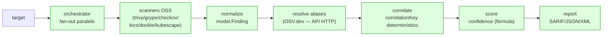
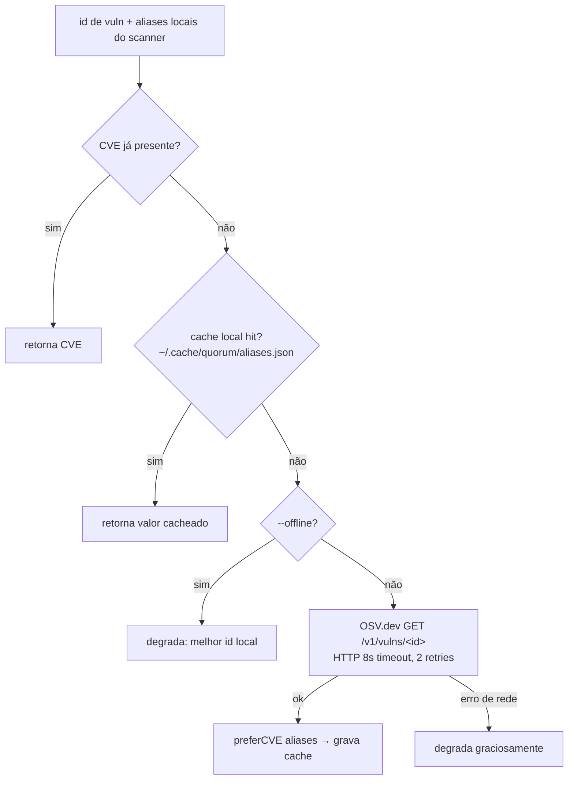

# 13. IA (Inteligência Artificial)

Este documento descreve, de forma fiel ao código (as-is), o uso de Inteligência
Artificial no **Quorum** (`quorum-sec-scan`, v0.2.3). O resumo é direto: **o
Quorum não utiliza IA**. Não há LLMs, RAG, embeddings, vector databases, MCP,
agentes autônomos, function-calling/tool-use de modelo, nem qualquer componente
de machine learning no pipeline. Toda a "inteligência" do produto é
**determinística e baseada em regras** — orquestração de scanners OSS,
normalização canônica, correlação por chave determinística (`correlationKey`) e
um score de confiança (consenso) calculado por fórmula explícita. A única
dependência externa que poderia ser confundida com "inteligência" é a resolução
de aliases de vulnerabilidade via **OSV.dev**, uma **API HTTP determinística e
não-ML** (ver §2).

Cross-links: [DESIGN.md](../DESIGN.md) (modelo de dados, matriz de correlação §6,
matemática do consenso, alias §7), [README.md](../README.md).

---

## 1. Veredito: por que IA é N/A no Quorum

O Quorum é uma camada de **correlação + consenso** sobre scanners de segurança
open-source (Trivy, Grype, Checkov, KICS, Dockle, Kubescape). Ele é
**CLI/Docker only**, projetado para rodar dentro de um pipeline de CI/CD e
"gate" um build via exit code. Nesse desenho, determinismo e reprodutibilidade
são requisitos de primeira ordem: o mesmo input deve produzir o mesmo
`Fingerprint = sha256(correlationKey)` em qualquer execução, para que o GitHub
code scanning / DefectDojo possam deduplicar findings entre runs.

IA generativa é, por natureza, **probabilística e não-determinística**, o que
colidiria diretamente com:

- o princípio de design **"false split > false merge"** (na dúvida, mantém
  findings separados — um merge errado esconde risco);
- o requisito de **fingerprints estáveis** entre execuções;
- a auditabilidade exigida de uma ferramenta de segurança que decide se um build
  passa ou falha.

Evidência no código (verificada):

- `go.mod` declara apenas `github.com/spf13/cobra` e `gopkg.in/yaml.v3` como
  dependências diretas (mais `pflag`/`mousetrap` indiretas). **Nenhuma**
  biblioteca de ML/LLM/HTTP-de-IA está presente.
- Busca por `openai|anthropic|llm|gpt|gemini|embedding|vector|rag|langchain|`
  `huggingface|onnx|tensorflow|pytorch|ollama|cohere|mistral|claude` no
  repositório retorna **zero** ocorrências em código — o único match é um arquivo
  de fixture de teste (`internal/adapter/testdata/sca_grype_alpine.json`, saída
  real do Grype, sem relação com IA).
- O único cliente de rede do produto é `internal/alias/osv.go` — um `net/http`
  GET contra `https://api.osv.dev/v1/vulns/<id>` (ver §2).

> Nota: a etapa de "resolve aliases" usa rede (OSV.dev), mas continua
> **determinística e não-ML**. Nenhuma caixa do pipeline contém um modelo.

---

## 2. A única "inteligência" externa: OSV.dev (determinística, não-ML)

A resolução de aliases (`internal/alias/`) unifica identificadores de
vulnerabilidade — por exemplo, o `GHSA-…` do Grype e o `CVE-…` do Trivy para o
**mesmo** bug — para que correlacionem em vez de se dividirem (`DESIGN §7`).

Isto **não é IA**. É uma cadeia de lookup em três camadas, com preferência
determinística por CVE:

Propriedades relevantes (de `internal/alias/resolver.go` e `osv.go`):

| Propriedade | Valor | Por que importa |
|---|---|---|
| Tipo de serviço | API HTTP JSON (`api.osv.dev/v1/vulns/<id>`) | Consulta de banco de aliases, **não** inferência de modelo |
| Determinismo | `preferCVE`: CVE > GHSA > primeiro não-vazio | Mesmo input → mesma saída |
| ML envolvido | Nenhum | É lookup em base curada da comunidade |
| Falha de rede | Degradação graciosa (nunca falha o scan) | `DESIGN §7` |
| Desligar | Flag `--offline` (passa `osv=nil`) | Execução 100% local/air-gapped |
| Timeout/retries | 8s, `MaxRetries=2`, backoff exponencial 200ms | Robustez de CI |

Conclusão: OSV.dev é equivalente a um DNS/whois de vulnerabilidades — **dados
de referência determinísticos**, não um modelo que "raciocina".

---

## 3. Itens do template de IA — declaração N/A item a item

A tabela abaixo cobre cada item esperado em uma seção de IA enterprise e
declara o status para o Quorum **as-is**, com justificativa técnica.

| Item do template | Status | Justificativa (as-is) |
|---|---|---|
| Modelos de linguagem (LLM) | **N/A** | Nenhum LLM no código ou em `go.mod`; pipeline 100% determinístico |
| Provedor de modelo (OpenAI/Anthropic/etc.) | **N/A** | Sem cliente de provedor de IA; único cliente HTTP é OSV.dev |
| Prompts / templates de prompt | **N/A** | Não há prompts; não há geração de linguagem natural |
| RAG (Retrieval-Augmented Generation) | **N/A** | Não há geração; "retrieval" do OSV alimenta lógica de regras, não um modelo |
| Embeddings / busca semântica | **N/A** | Correlação é por `correlationKey` determinístico, não por similaridade vetorial |
| Vector database (pgvector/Pinecone/etc.) | **N/A** | Sem banco vetorial; sem banco relacional (CLI/Docker only) |
| Fine-tuning / treinamento de modelo | **N/A** | Não há modelo para treinar |
| Inferência / serving de modelo | **N/A** | Sem runtime de inferência (sem ONNX/TF/PyTorch) |
| MCP (Model Context Protocol) | **N/A** | O Quorum não é cliente nem servidor MCP |
| Agentes / orquestração agentic | **N/A** | "Orchestrator" aqui = fan-out de goroutines para scanners, não agente de IA |
| Function-calling / tool-use de modelo | **N/A** | Não há modelo para invocar ferramentas |
| Guardrails de modelo / content moderation | **N/A** | Sem saída gerada por modelo a ser moderada |
| Avaliação de modelo (evals) | **N/A** | Sem modelo; a qualidade é validada por contract tests de adapters |
| Observabilidade de IA (tracing de tokens/custos) | **N/A** | Sem chamadas a modelos; sem tokens/custo de inferência |
| Custos de inferência | **N/A** | OSV.dev é gratuito e determinístico; sem custo por token |
| Versionamento de modelo / model registry | **N/A** | Sem modelo; versionamento é do binário/imagem (GoReleaser/GHCR) |
| Privacidade de dados enviados a modelos | **N/A** | Nenhum dado de usuário é enviado a um LLM. Ao OSV.dev só vai o **id de vuln** (ex.: `CVE-2021-...`), nunca código-fonte |

---

## 4. Riscos de IA — N/A com justificativa

Como não há nenhum componente de IA no caminho de execução, a superfície de
ataque específica de IA **não existe** no Quorum.

| Risco de IA (OWASP LLM Top 10 / similares) | Status | Por quê |
|---|---|---|
| Prompt injection (direta/indireta) | **N/A** | Não há prompt nem LLM que interprete entrada como instrução |
| Jailbreak / bypass de system prompt | **N/A** | Sem system prompt; sem modelo |
| Data poisoning (envenenamento de dados de treino) | **N/A** | Sem treino; sem dataset de modelo |
| Model poisoning / supply chain de modelo | **N/A** | Sem artefato de modelo na imagem/binário |
| Hallucination (alucinação) | **N/A** | Saída é derivada determinística de findings reais dos scanners |
| Insecure output handling | **N/A** | Saída (SARIF/JSON/XML) é serialização estruturada, não texto gerado por modelo |
| Sensitive information disclosure via modelo | **N/A** | Nada é enviado a um modelo; só ids de vuln ao OSV.dev |
| Excessive agency (agência excessiva) | **N/A** | Sem agente; o Quorum só lê targets e emite relatório |
| Model denial of service / custo descontrolado | **N/A** | Sem inferência; OSV tem timeout/retries e fallback offline |

> Riscos **reais** do Quorum (supply chain das imagens/binários dos scanners,
> over-merge de MISCONFIG, falsos negativos por mount malformado) são tratados
> fora desta seção — ver `DESIGN §12` (supply chain) e o README ("Known
> limitations", "Security of the chain itself"). Esses riscos são de software
> tradicional, não de IA.

---

## 5. Checklist de conformidade (estado atual)

- [x] Confirmado que nenhum LLM/provedor de IA é importado (`go.mod` revisado).
- [x] Confirmado que não há RAG/embeddings/vector DB.
- [x] Confirmado que não há MCP/agentes/function-calling.
- [x] Confirmado que não há runtime de inferência (ONNX/TF/PyTorch ausentes).
- [x] Confirmado que o único cliente de rede é OSV.dev (`internal/alias/osv.go`).
- [x] Confirmado que OSV é desligável via `--offline` (modo air-gapped).
- [x] Confirmado que nenhum código-fonte do usuário é enviado a serviço externo.
- [ ] (Futuro) Caso IA seja adotada, reabrir este checklist com os guardrails da §6.

---

## 6. Proposta futura (claramente separada — NÃO implementado)

> Tudo nesta seção é **hipotético** e não existe no código. Listado apenas como
> direção possível, com guardrails recomendados caso seja adotado.

Casos de uso plausíveis onde um LLM poderia agregar valor **sem** comprometer o
núcleo determinístico:

1. **Triagem assistida por LLM** — sugerir prioridade/explicação de um finding já
   correlacionado, como *camada opcional de apresentação*, nunca alterando o
   `correlationKey`, o `confidence` ou o exit code do gate.
2. **Sumarização de findings** — gerar um resumo executivo em linguagem natural
   do relatório (ex.: "12 issues HIGH, 3 corroborados por ≥2 engines").
3. **Sugestão de mapeamento de crosswalk** — propor rascunhos de
   `rule→canonicalControl` para revisão humana (PR), nunca aplicados
   automaticamente.

Guardrails recomendados **se** adotado:

| Guardrail | Regra proposta |
|---|---|
| Opt-in explícito | Funcionalidade atrás de flag (ex.: `--ai-summary`), **off por padrão** |
| Núcleo intocável | LLM não pode alterar correlação, fingerprint, confidence ou exit code |
| Determinismo do gate | Decisão de pass/fail permanece 100% determinística |
| Privacidade | Enviar apenas findings normalizados; nunca código-fonte bruto sem consentimento |
| Modo offline | `--offline` deve desabilitar qualquer chamada a LLM, como já faz com OSV |
| Anti prompt-injection | Tratar conteúdo de findings como dados, não instruções; sanitizar/escapar |
| Rotulagem | Toda saída gerada por modelo marcada como "AI-generated, advisory only" |
| Auditabilidade | Logar provider/modelo/versão e custo; permitir reprodutibilidade ou seed |
| Custo/limites | Timeout, rate limit e fallback gracioso (igual ao padrão do OSV client) |
| Evals | Suite de avaliação antes de promover qualquer recurso de IA a default |

---

## Premissas

- A análise reflete o estado do repositório na v0.2.3, branch `main`, verificado
  via `go.mod` e busca textual por termos de IA em todo o código.
- "OSV.dev" é tratado como serviço de dados determinístico (lookup de aliases),
  não como sistema de ML — consistente com `internal/alias/osv.go` e `DESIGN §7`.
- O termo "orchestrator" no Quorum refere-se ao fan-out paralelo de scanners
  (`internal/orchestrator`), e não a um agente de IA; isso foi assumido pela
  ausência total de componentes de modelo.
- A seção "Proposta futura" é especulativa e não representa compromisso de
  roadmap; o roadmap oficial está no README e não inclui IA até a v1.0.
- Assumiu-se que fixtures de teste (`internal/adapter/testdata/`) não fazem parte
  do caminho de execução de produção (são dados de contract tests).
