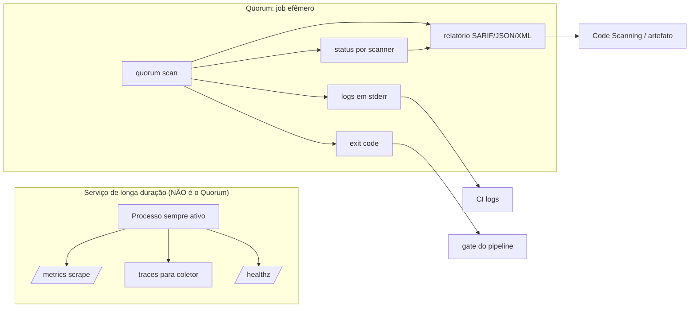
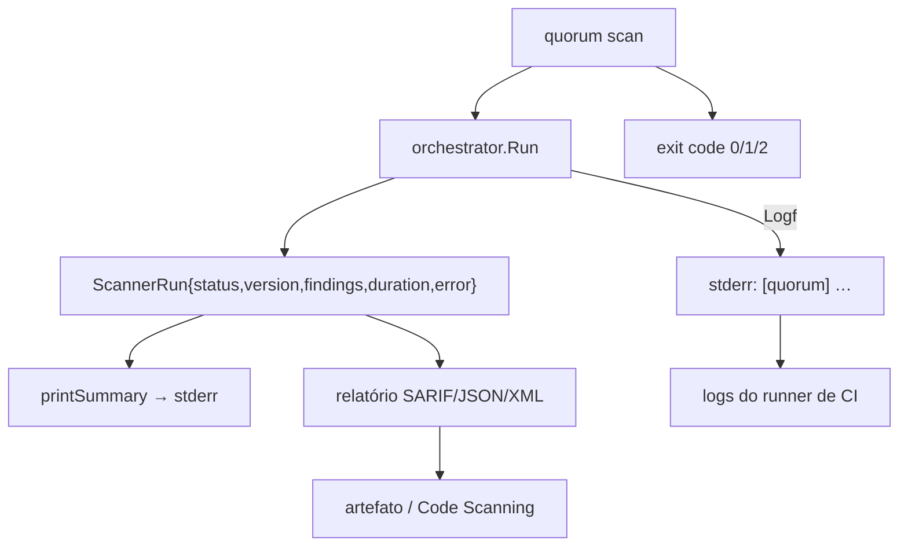

# Observabilidade

O Quorum (`quorum-sec-scan`, v0.2.3) é uma ferramenta **CLI/Docker efêmera**: cada execução nasce com `quorum scan <target>`, roda um pool de scanners em paralelo, emite um relatório e morre. Não há daemon, servidor, banco de dados nem painel — o próprio `root.go` resume a filosofia: *"Built for CI/CD: configure via flags, gate via exit code. No panel, no daemon."* Por isso, a observabilidade do Quorum não segue o modelo de serviço de longa duração (métricas push, tracing distribuído, health checks, dashboards ao vivo). Em vez disso, ela se apoia em quatro sinais de processo: **logs estruturados em stderr**, **status por scanner**, **exit codes** e o **relatório (SARIF/JSON/XML) como artefato auditável**.

Este documento descreve com precisão o que existe hoje (as-is), declara explicitamente o que é **N/A** para um CLI efêmero (com justificativa técnica) e oferece **propostas futuras** concretas e claramente separadas do estado atual.

---

## 1. Modelo mental: observabilidade de um CLI efêmero vs. serviço

A maioria dos pilares clássicos de observabilidade (Logs, Métricas, Traces) pressupõe um processo de longa duração que pode ser raspado (scraped), consultado e correlacionado ao longo do tempo. O Quorum não é esse processo. Ele é um **job batch**: executa em segundos a minutos, normalmente dentro de um step de CI ou de um `docker run`, e termina.



Consequência prática: a "telemetria" do Quorum é consumida pela **plataforma que o invoca** (runner de CI, orquestrador de jobs, shell), não por um stack de observabilidade próprio. Os sinais são projetados para serem capturados pelos logs do step, pelo upload de artefatos e pela ingestão de SARIF (ex.: GitHub Code Scanning).

---

## 2. Estado atual (as-is)

### 2.1 Logs estruturados-*ish* em stderr

Toda a saída de progresso vai para **stderr**, prefixada com `[quorum]`, mantendo o **stdout limpo** para o relatório (quando `--output` não é usado, o relatório sai em stdout — separar os streams é o que permite `quorum scan img > report.sarif` sem poluição).

O logger é definido em `cmd/quorum/scan.go` (`runScan`):

```go
logf := func(format string, args ...any) {
    if !f.quiet {
        fmt.Fprintf(os.Stderr, "[quorum] "+format+"\n", args...)
    }
}
```

Esse `logf` é injetado no orquestrador via `orchestrator.Options.Logf`, de modo que **CLI e pipeline compartilham o mesmo canal de log**.

Eventos logados hoje (linhas reais do código):

| Origem | Evento | Exemplo de mensagem |
|---|---|---|
| `scan.go` | contexto inicial | `[quorum] target=… type=… crosswalk=N rules (…) offline=false` |
| `scan.go` | filtragem/supressão | `[quorum] filtered: N suppressed by baseline (M entries), K below min-severity …` |
| `scan.go` | gate disparado | `[quorum] gate: found HIGH finding >= --fail-on high → exit 1` |
| `orchestrator.go` | scanner desconhecido | `[quorum] warning: unknown scanner "foo" ignored (known: …)` |
| `orchestrator.go` | skip por não-suporte | `[quorum] skip <name>: does not support target <type>` |
| `orchestrator.go` | probe de versão | `[quorum] skip <name>: version probe timed out after 60s …` |
| `orchestrator.go` | probe OOM | `[quorum] skip <name>: version probe killed (likely OOM …)` |
| `orchestrator.go` | indisponível | `[quorum] skip <name>: not installed/available` |
| `orchestrator.go` | início de execução | `[quorum] run  <name> (<ver>) ...` |
| `orchestrator.go` | falha de execução | `[quorum] fail <name>: <erro>` |
| `orchestrator.go` | conclusão | `[quorum] done <name>: N findings in <dur>` |

**Características e limites (honestos):**

- É "estruturado-*ish*", **não JSON**: as mensagens têm um prefixo estável e um formato razoavelmente parseável, mas são **texto livre formatado com `Printf`**. Não há campos chave=valor garantidos, nem níveis de log (`INFO`/`WARN`/`ERROR`) explícitos, nem timestamps por linha.
- **`--quiet` / `-q`** silencia todo o progresso e o summary (controlado por `f.quiet`). Não há um modo `--verbose`/`--debug` com mais granularidade.
- Não há rotação, sampling ou correlação de log — desnecessário para um processo efêmero; quem persiste é o runner de CI.

### 2.2 Status por scanner (o sinal central de "rodou de verdade")

O princípio de design *"0 findings is not proof of safety"* exige que o Quorum nunca confunda **"zero vulnerabilidades"** com **"o scanner não rodou"**. Isso é materializado pelo `ScannerRun.Status` (em `internal/orchestrator/orchestrator.go`):

| Status | Significado | Como é determinado |
|---|---|---|
| `ran` | rodou e produziu resultado | `a.Run` retornou sem erro |
| `skipped` | não se aplica ao alvo | `!a.Supports(target)` |
| `unavailable` | binário ausente, probe estourou (timeout) ou foi morto (OOM) | falha no `a.Version` durante o probe |
| `error` | rodou mas falhou | `a.Run` retornou erro que não é deadline |
| `timeout` | excedeu `--timeout` por scanner | `runCtx.Err() == DeadlineExceeded` |

O **probe de versão** (`Options.ProbeTime`, default **60s**) é um diagnóstico de observabilidade por si só: ele distingue *timeout* de *killed (OOM)* de *não instalado*, e gera mensagens acionáveis (ex.: "raise the container's memory limit", "scope --scanners"). Ver também [11-troubleshooting.md](11-troubleshooting.md) e a seção de status de scanner em DESIGN §14.

### 2.3 Summary no terminal

Após emitir o relatório, `printSummary` (`scan.go`) escreve em **stderr** um resumo legível por humano (suprimido por `--quiet`):

```
── quorum summary ───────────────────────────
  trivy      ran           12 findings
  grype      ran            9 findings
  checkov    unavailable    0 findings  (version probe killed — likely OOM …)
  ----------------------------------------
  18 findings after consensus  (7 multi-detected)
  CRIT 1  HIGH 4  MED 9  LOW 3  INFO 1
  elapsed 8.412s
  note: 0 findings is not proof of safety — see scanner statuses above.
```

Sinais embutidos no summary: status + contagem **por scanner**, total pós-consenso, quantos foram **multi-detectados** (`DetectionCount > 1`), distribuição por severidade, e **duração total** (`res.Duration`). A nota final reforça o princípio anti-falso-negativo.

### 2.4 Exit codes como sinal de máquina

Os exit codes são o sinal primário consumido por pipelines (contrato em `scan.go` e `root.go`):

| Código | Significado |
|---|---|
| `0` | OK — execução concluída e nenhum finding atingiu `--fail-on` |
| `1` | Gate — algum finding `>=` `--fail-on` disparou (`os.Exit(1)`) |
| `2` | Erro de uso/runtime |

Esse é o "monitoramento" mais barato e confiável de um job: o pipeline decide passar/falhar lendo um inteiro. Ver [05-cli.md](05-cli.md) para o detalhamento das flags de gate (`--fail-on`, `--min-severity`).

### 2.5 Relatório como artefato auditável

O relatório é a **trilha de auditoria** persistente de cada execução. Em **SARIF** (formato primário) e **JSON**, o status de cada scanner é embutido no próprio documento — não fica só no log volátil:

- **SARIF** (`internal/report/sarif.go`): a lista de scanners (`scannerSummary` → `name/status/version`) é gravada em `properties.scanners` do `run`; cada resultado carrega `partialFingerprints["quorum/v1"]` (= `Fingerprint = sha256(correlationKey)`), permitindo deduplicação e rastreio estável entre execuções e ferramentas a montante (ex.: GitHub Code Scanning).
- **JSON** (`internal/report/json.go`): inclui `scanners` (os `ScannerRun`, com `status`, `version`, `findings`, `durationMs`, `error`) e os findings canônicos detalhados.
- **XML** (`internal/report/xml.go`): expõe `status` por scanner como atributo.

Como o relatório carrega **status + versão + duração por scanner + fingerprint determinístico**, ele é auto-suficiente para auditoria post-mortem, mesmo que os logs do runner já tenham expirado. Ver [09-relatorios-sarif.md](09-relatorios-sarif.md).

### 2.6 Mapa dos sinais atuais



---

## 3. O que é N/A (e por quê)

Para um binário/contêiner efêmero que termina em segundos, os pilares abaixo **não se aplicam ao runtime do Quorum**. Declaramos N/A com justificativa técnica; cada um tem uma **Proposta futura** correspondente na §4.

| Pilar | Status | Justificativa técnica |
|---|---|---|
| **Métricas (Prometheus/StatsD)** | **N/A (runtime)** | Não há processo persistente para expor `/metrics` nem para ser raspado. O ciclo de vida (segundos) é mais curto que um intervalo típico de scrape. |
| **Tracing distribuído (OpenTelemetry traces)** | **N/A (runtime)** | Execução local, single-process, fan-out em goroutines dentro do mesmo processo. Não há saltos de rede entre serviços para correlacionar. |
| **Endpoint de Health check (`/healthz`, readiness/liveness)** | **N/A** | Não há servidor para checar saúde. O análogo de "health" é o **exit code** e o **status por scanner**. `list-scanners` serve como verificação de capacidade. |
| **Dashboards ao vivo (Grafana)** | **N/A (runtime)** | Sem série temporal emitida em tempo real. A visualização de tendência é responsabilidade da plataforma que ingere o SARIF. |
| **Alertas (Alertmanager/PagerDuty)** | **N/A (runtime)** | O alerta nativo é o gate por exit code (`--fail-on`) interpretado pelo CI. Não há regras de alerta internas. |
| **Log aggregation própria (ELK/Loki)** | **N/A** | O Quorum escreve em stderr; a agregação é delegada ao runner. Reimplementar shippers de log seria reinventar a plataforma hospedeira. |
| **APM / profiling contínuo** | **N/A** | Sem processo vivo para perfilar continuamente; profiling pontual é tarefa de desenvolvimento (`go test -bench`, `pprof` ad hoc), não de produção. |

> Importante: N/A significa "não aplicável ao modelo de execução atual", **não** "impossível". As propostas da §4 mostram como exportar telemetria sem transformar o Quorum num serviço.

---

## 4. Propostas futuras (NÃO implementado)

> Tudo nesta seção é **proposta**, claramente separada do estado atual. Nada abaixo existe no código hoje. São desenhos de evolução compatíveis com a natureza efêmera e CLI-first do Quorum (princípio: telemetria **opt-in**, sem daemon).

### 4.1 `--log-format json` (logs estruturados de verdade)

Tornar o `logf` pluggável para emitir **NDJSON** (uma linha JSON por evento) em stderr, mantendo o texto atual como default.

- [ ] Adicionar flag `--log-format text|json` (default `text`).
- [ ] Definir um struct de evento (`ts`, `level`, `scanner`, `event`, `msg`, `durationMs`).
- [ ] Manter `--quiet` ortogonal (silencia ambos os formatos).
- [ ] Garantir que o relatório continue indo só para stdout/`--output`.

```json
{"ts":"2026-06-27T10:00:01Z","level":"info","event":"scanner_done","scanner":"trivy","findings":12,"durationMs":3140}
```

### 4.2 `--metrics <arquivo>` (Prometheus textfile / node_exporter)

Em vez de expor um endpoint, **escrever um arquivo `.prom`** no formato textfile, que pode ser coletado pelo `node_exporter --collector.textfile` ou pelo Pushgateway no fim do job de CI. Isso preserva o modelo efêmero (sem servidor).

- [ ] Flag `--metrics <path>` (off por default).
- [ ] Emitir métricas por execução e por scanner.
- [ ] Documentar coleta via textfile collector / Pushgateway.

```
# HELP quorum_scan_duration_seconds Wall-clock duration of the scan.
# TYPE quorum_scan_duration_seconds gauge
quorum_scan_duration_seconds 8.412
# HELP quorum_findings_total Findings after consensus by severity.
# TYPE quorum_findings_total gauge
quorum_findings_total{severity="critical"} 1
quorum_findings_total{severity="high"} 4
# HELP quorum_scanner_status Status per scanner (1=present).
# TYPE quorum_scanner_status gauge
quorum_scanner_status{scanner="trivy",status="ran"} 1
quorum_scanner_status{scanner="checkov",status="unavailable"} 1
# HELP quorum_scanner_duration_seconds Per-scanner duration.
# TYPE quorum_scanner_duration_seconds gauge
quorum_scanner_duration_seconds{scanner="trivy"} 3.140
```

Métricas candidatas (todas já existem como dados em `Result`/`ScannerRun`):

| Métrica | Tipo | Fonte no código |
|---|---|---|
| `quorum_scan_duration_seconds` | gauge | `res.Duration` |
| `quorum_findings_total{severity}` | gauge | `bySev` em `printSummary` |
| `quorum_findings_multi_detected` | gauge | `multi` (`DetectionCount > 1`) |
| `quorum_scanner_status{scanner,status}` | gauge | `ScannerRun.Status` |
| `quorum_scanner_findings{scanner}` | gauge | `ScannerRun.Findings` |
| `quorum_scanner_duration_seconds{scanner}` | gauge | `ScannerRun.Duration` |
| `quorum_gate_triggered` | gauge | resultado de `worstSeverity` vs `--fail-on` |

### 4.3 OpenTelemetry para o pipeline (spans opt-in via OTLP)

Mesmo sendo single-process, o pipeline `scan → normalize → resolve aliases → correlate → score → report` tem fases bem definidas e o fan-out de scanners é naturalmente um conjunto de spans irmãos. Uma exportação **opt-in** via OTLP (ativada por env vars OTel padrão e `--otel`) permitiria correlacionar uma execução de Quorum com o trace do pipeline de CI que a invocou (via `traceparent` herdado).

- [ ] Flag `--otel` + honrar `OTEL_EXPORTER_OTLP_ENDPOINT`, `OTEL_SERVICE_NAME`, `traceparent`.
- [ ] Span raiz `quorum.scan`; spans filhos por scanner (`runOne`) e por fase do correlator.
- [ ] Exportar no shutdown (flush síncrono — processo efêmero não pode confiar em batch assíncrono).

```mermaid
gantt
    title Trace proposto de um quorum scan (spans)
    dateFormat X
    axisFormat %S
    section scan
    quorum.scan            :a, 0, 9
    section scanners (fan-out)
    trivy.run              :0, 4
    grype.run              :0, 5
    checkov.probe (OOM)    :0, 1
    section pós
    correlate+alias        :5, 7
    consensus.score        :7, 8
    report.write           :8, 9
```



### 4.4 Dashboards de tendência via SARIF (sem servidor)

A análise de tendência (findings ao longo do tempo, MTTR, taxa de multi-detecção) deve ser delegada à plataforma que **ingere o SARIF** — tipicamente **GitHub Code Scanning**, que já oferece histórico, gráficos e alertas a partir dos `partialFingerprints["quorum/v1"]`. O Quorum não precisa de Grafana próprio.

- [ ] Documentar o fluxo `quorum scan -f sarif` → `upload-sarif` → Code Scanning como o caminho de tendência recomendado.
- [ ] (Opcional) snippet de query/Action para extrair contagens por severidade dos artefatos JSON e plotar via job de relatório.
- [ ] Garantir estabilidade do fingerprint entre versões (já é `sha256(correlationKey)`).

### 4.5 "Alertas" opt-in pós-execução

Manter o gate por exit code como mecanismo primário, e oferecer um **hook de notificação opcional** (ex.: `--notify-webhook <url>` enviando o summary JSON), executado **apenas no fim** do processo. Sem polling, sem daemon.

- [ ] Flag `--notify-webhook` (off por default; respeita `--offline`).
- [ ] Payload = summary estruturado (severidades, status por scanner, gate).
- [ ] Falha de envio é não-fatal (degradação graciosa, como o alias OSV).

### 4.6 Resumo das propostas

| Proposta | Flag/mecanismo | Compatível com efêmero? | Substitui N/A de |
|---|---|---|---|
| Logs JSON | `--log-format json` | Sim (stderr) | — (evolui §2.1) |
| Métricas textfile | `--metrics <path>` | Sim (arquivo, sem servidor) | Métricas Prometheus |
| OTel pipeline | `--otel` + env OTLP | Sim (flush no shutdown) | Tracing |
| Tendência SARIF | Code Scanning | Sim (delegado) | Dashboards/Alertas |
| Webhook | `--notify-webhook` | Sim (one-shot) | Alertas |

---

## 5. Como observar o Quorum hoje (guia prático)

Checklist para integrar a observabilidade existente num pipeline:

- [ ] **Capture stdout e stderr separadamente.** Direcione o relatório com `-o report.sarif` e deixe os logs `[quorum]` em stderr para o runner.
- [ ] **Use `--fail-on`** para que o exit code seja seu sinal de alerta primário (gate).
- [ ] **Faça upload do relatório como artefato** (e/ou ingira o SARIF no Code Scanning) — é sua trilha de auditoria durável.
- [ ] **Inspecione o status por scanner**, não só a contagem de findings: um `unavailable`/`timeout`/`error` significa cobertura reduzida, não ausência de risco.
- [ ] **Não use `--quiet` em CI** a menos que você já persista o relatório JSON/SARIF — `--quiet` remove o summary e o progresso.
- [ ] **Trate exit code `2` como falha de infraestrutura** (uso/runtime), distinta do gate `1`.
- [ ] **Em ambientes com pouca memória**, observe as mensagens de probe (OOM/timeout) e ajuste memória ou `--scanners` (ver [11-troubleshooting.md](11-troubleshooting.md)).

Exemplo (GitHub Actions, conceitual):

```yaml
- name: Quorum scan
  run: quorum scan . -f sarif -o quorum.sarif --fail-on high
  # exit 1 => gate; exit 2 => erro de runtime
- name: Upload SARIF
  if: always()
  uses: github/codeql-action/upload-sarif@v3
  with: { sarif_file: quorum.sarif }
- name: Upload raw report (auditoria)
  if: always()
  uses: actions/upload-artifact@v4
  with: { name: quorum-report, path: quorum.sarif }
```

---

## 6. Referências cruzadas

- [05-cli.md](05-cli.md) — flags, gating e exit codes.
- [09-relatorios-sarif.md](09-relatorios-sarif.md) — estrutura do SARIF, `partialFingerprints`, scanners no `properties`.
- [11-troubleshooting.md](11-troubleshooting.md) — diagnóstico de status `unavailable`/`timeout`/OOM.
- `DESIGN.md` §14 (status de scanner) e §6 (matriz de correlação).
- Código: `cmd/quorum/scan.go` (`logf`, `printSummary`, exit codes), `internal/orchestrator/orchestrator.go` (`ScannerRun`, probe, status), `internal/report/sarif.go` (`scannerSummary`, fingerprints).

---

## Premissas

- **Versão de referência:** v0.2.3; afirmações verificadas em `cmd/quorum/scan.go`, `cmd/quorum/root.go`, `internal/orchestrator/orchestrator.go` e `internal/report/sarif.go` no estado atual do repositório.
- **"Logs estruturados-*ish*"** descreve fielmente o que existe: texto formatado com prefixo `[quorum]` em stderr, **não** JSON e **sem** níveis/timestamps por linha. Não assumi a existência de qualquer formatação estruturada além do prefixo.
- Assumi que o consumidor de telemetria é a **plataforma invocadora** (runner de CI, `docker run`, shell), pois o Quorum não possui stack de observabilidade próprio.
- O nome dos campos no SARIF (`properties.scanners`, `partialFingerprints["quorum/v1"]`) e no JSON (`scanners`, `durationMs`) foi tirado do código; mudanças futuras de schema podem alterá-los.
- Todas as flags propostas na §4 (`--log-format`, `--metrics`, `--otel`, `--notify-webhook`) são **hipotéticas**; nenhuma existe hoje e os nomes são sugestões de design, não compromissos.
- Os exemplos de saída (summary, `.prom`, NDJSON) são ilustrativos; valores numéricos não vêm de uma execução real.
- O default do probe de versão é **60s** (`defaultProbeTime`) e o `--timeout` por scanner é **5m**, conforme o código; assumi que esses são os defaults efetivos quando `Options.ProbeTime`/`PerScannerTime` não são sobrescritos.
