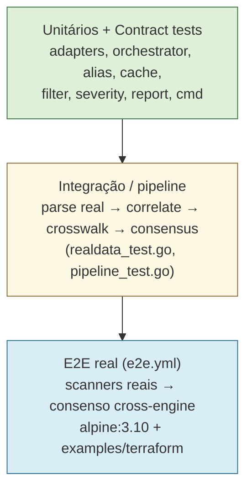
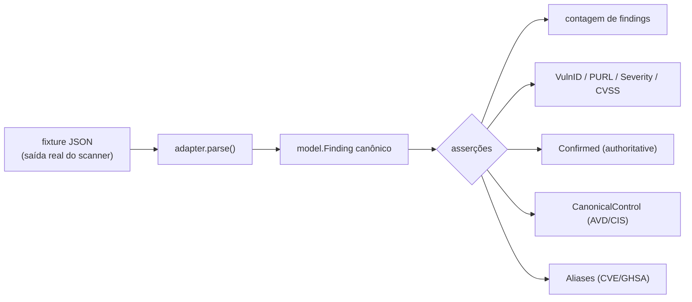
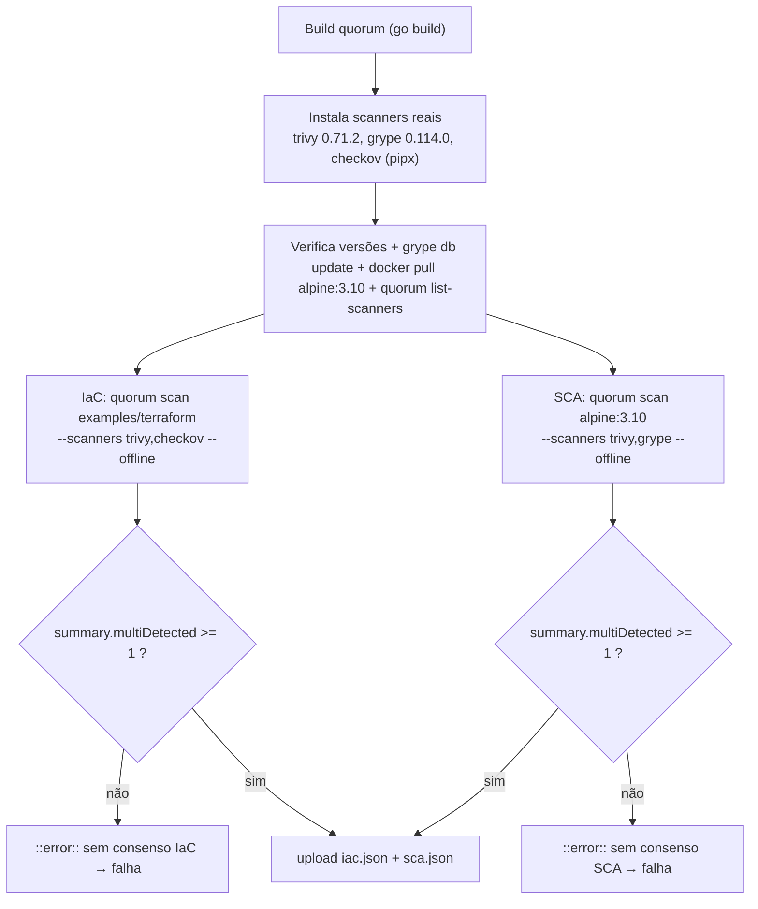

# Testes

Esta seção descreve a estratégia de testes do **Quorum** (`quorum-sec-scan`, v0.2.3): o que já existe no código hoje (as-is), como executar, e o que está proposto como evolução. O Quorum é uma ferramenta **CLI/Docker** de *consensus security scanning* escrita em Go 1.26; portanto, partes clássicas de um plano de testes corporativo que pressupõem frontend web, banco de dados relacional ou API REST são declaradas **N/A** com justificativa técnica. O princípio de produto "*false split > false merge*" e o axioma operacional "*0 findings is not proof of safety*" guiam também as escolhas de teste: preferimos quebrar cedo (contract tests, `-race`, gates de consenso no E2E) a passar silenciosamente.

Documentos relacionados: [Arquitetura](04-arquitetura.md) · [CI/CD](13-cicd.md) · [Supply chain](14-supply-chain.md) · `DESIGN.md` (§5 contract tests, §6 matriz de correlação, §14 status de scanner).

---

## 1. Visão geral da pirâmide de testes

O Quorum concentra peso na base (unitários + contract tests determinísticos sobre fixtures) e mantém um topo enxuto, porém *real* (E2E com scanners de verdade). Não há camada de testes de UI porque não há UI.



| Camada | Onde vive | Determinístico? | Roda em | Gate de PR |
|---|---|---|---|---|
| Unitário | `internal/**/<pkg>_test.go`, `cmd/quorum/scan_test.go` | Sim | `go test -race ./...` (ci.yml) | Sim |
| Contract (parsers) | `internal/adapter/adapter_test.go` + `realdata_test.go` vs `internal/adapter/testdata/*.json` | Sim (fixtures versionadas) | `go test ./...` | Sim |
| Integração (pipeline) | `internal/adapter/realdata_test.go`, `internal/correlate/pipeline_test.go` | Sim (fixtures + crosswalk real do repo) | `go test ./...` | Sim |
| E2E (consenso real) | `.github/workflows/e2e.yml` | Não (rede/DBs externos) | GitHub Actions | Sim (push/PR/manual) |

---

## 2. Como executar localmente

Targets relevantes do `Makefile`:

```bash
make test      # go test ./...  → unitários + contract + integração
make vet       # go vet ./...
make all       # vet + test + build
make build     # binário em ./dist/quorum
make run ARGS="scan <target> --type image --scanners trivy,grype"
```

Variações úteis (não embrulhadas em target, mas suportadas):

```bash
go test -race ./...                         # detector de corrida (igual ao CI)
go test ./internal/adapter/...              # só os contract tests dos adapters
go test -run TestMVPConsensus ./internal/correlate
go test -cover ./...                        # cobertura por pacote (resumo)
go test -coverprofile=cover.out ./... && go tool cover -func=cover.out
```

> O CI usa exatamente `go test -race ./...` (ver [CI/CD](13-cicd.md)), então rodar com `-race` localmente reproduz o gate.

---

## 3. Testes unitários (atual)

Cobrem a lógica pura e as regras de negócio, sem dependências externas (sem rede, sem binários de scanner — exceto os contract tests, que leem fixtures de disco).

| Pacote | Arquivo | O que verifica |
|---|---|---|
| `internal/severity` | `severity_test.go` | `FromCVSS` (faixas → severidade), `FromDockle` (FATAL/WARN/INFO), `Max`, `AtLeast`, `Parse`. |
| `internal/filter` | `filter_test.go` | `--min-severity` (`Apply`), baseline `.quorumignore` (match por fingerprint case-insensitive e por correlationKey), contadores `SuppressedSeverity`/`SuppressedBaseline`, baseline ausente e `Has` em baseline vazio. |
| `internal/cache` | `store_test.go` | Put/Get/persistência em disco (cria diretório-pai), reabertura, segurança em `*Store` nil e modo in-memory (path vazio). |
| `internal/alias` | `alias_test.go` | Cliente OSV via `httptest` (aliases, erro 500, retry em 503, sem retry em 404), preferência por aliases locais (zero chamadas de rede), cache após primeira resolução, degradação graciosa em falha de rede (id inalterado). |
| `internal/orchestrator` | `orchestrator_test.go` | Fan-out e merge cross-scanner (`fakeAdapter`), status `ran`/`unavailable`/`error`, scanner desconhecido descartado **com warning**, probe-timeout (`ProbeTime`) marcando `unavailable` com erro "version probe exceeded" e log "timed out". |
| `internal/report` | `report_test.go` | SARIF (schema 2.1.0, `partialFingerprints["quorum/v1"]`, fingerprint, `level: error`, `detectionCount`), JSON (`summary.totalFindings`/`multiDetected`), XML (`<?xml`, `quorumReport`, `detectionCount`), `ParseFormat` (aceita sarif/json/xml case-insensitive, rejeita `pdf`). |
| `cmd/quorum` | `scan_test.go` | `resolveCrosswalkDir` (flag explícita verbatim, default existente, fallback para `/opt/quorum/crosswalk` quando default ausente, retorno original quando nenhum existe) e `isDir`. |

Pontos de atenção (boas práticas já adotadas no código):

- **Tabelas de casos** (`TestFromCVSS`, `TestRealParse_Counts`).
- **`t.TempDir()`** para isolamento de FS (cache, baseline, crosswalk).
- **`httptest.NewServer`** para isolar a dependência de rede do OSV.dev — nenhum teste unitário fala com a internet real.
- **Subtests `t.Run`** com `t.Skipf`/`t.Skip` quando o ambiente não satisfaz a pré-condição (ex.: `bundledCrosswalkDir` só existe na imagem Docker).

---

## 4. Contract tests dos adapters (atual)

São o *guarda-formato*: parseiam saídas **reais e versionadas** de cada scanner e quebram **antes da produção** quando uma ferramenta muda seu JSON (`DESIGN §5`). Vivem em `internal/adapter/` e leem fixtures de `internal/adapter/testdata/`.

Fixtures presentes:

```
internal/adapter/testdata/
├── trivy_image.json          grype_image.json
├── sca_trivy_alpine.json     sca_grype_alpine.json
├── iac_trivy.json            iac_trivy_v071.json
├── iac_checkov.json          iac_kics.json
└── img_dockle_alpine.json
```

Garantias travadas pelos contract tests:



Casos notáveis (e por que existem):

- `TestTrivyParse` / `TestGrypeParse`: mapeamento de campos canônicos (PURL, severidade, CVSS, `Confirmed`), e fallback de versão do Grype para o `descriptor`.
- `TestRealParse_Counts`: contagens exatas por fixture (trivy-iac=12, checkov-iac=17, kics-iac=9, trivy-sca=1, grype-sca=1) e invariantes (`Scanner`/`Title` não vazios).
- `TestTrivyV071AVDPrefix`: trava a **correção de drift** — Trivy ≥ ~0.60 passou a emitir ids "AWS-0086" sem prefixo; o adapter restaura `AVD-AWS-0086` para casar com o crosswalk. (Mesma família do fix do commit recente de "relax version probe / unknown scanners".)
- `TestDockleParse`: linhas PASS/SKIP/IGNORE são descartadas; FATAL/WARN/INFO viram findings `ImgHardening`; códigos `CIS-DI-*` já canônicos; mapeamento de severidade WARN→MEDIUM, INFO→LOW.

> **Manutenção:** ao subir a versão suportada de um scanner, capture uma nova fixture (rodando o scanner via imagem oficial contra `examples/terraform` ou `alpine:3.10`), adicione-a a `testdata/` e fixe a contagem esperada — exatamente o padrão de `iac_trivy_v071.json`.

---

## 5. Testes de integração / pipeline (atual)

Diferem dos unitários por exercitar o **caminho real end-to-end de dados** (sem rede): `parse → correlate.Enrich → crosswalk → consensus.Merge`, usando o crosswalk **real do repositório** (`../../crosswalk`).

| Teste | Arquivo | Invariante de produto |
|---|---|---|
| `TestMVPConsensus` | `correlate/pipeline_test.go` | Trivy(CVE) + Grype(GHSA) → após resolução de alias, **1 finding**, `detectionCount=2`, `confidence∈(0,1]`. Critério "done" do MVP. |
| `TestUnmappedNeverMerges` | `correlate/pipeline_test.go` | Misconfigs sem controle canônico resolvido **não** se fundem (`false split > false merge`). |
| `TestCrosswalkMerges` | `correlate/pipeline_test.go` | Com regra de crosswalk mapeando Checkov + Trivy ao mesmo `AVD-AWS-0091`, eles se fundem (`detectionCount=2`). Exercita o **loader YAML real**. |
| `TestRealIaCConsensus` | `adapter/realdata_test.go` | Trivy+Checkov+KICS sobre o mesmo Terraform: consenso 3-way em `AVD-AWS-0090/0089/0092/0057`; 2-way em `AVD-AWS-0132`. |
| `TestRealSCAConsensus` | `adapter/realdata_test.go` | Trivy+Grype concordam em `CVE-2021-36159` (apk-tools) → 1 finding, `detectionCount=2`, severidade CRITICAL. |

Esses testes são a **prova determinística de que o consenso acontece sobre dados reais** — o E2E (§6) é a prova *não determinística* equivalente com binários ao vivo.

---

## 6. Testes E2E (atual)

`.github/workflows/e2e.yml` — "*End-to-end proof that consensus actually happens with REAL scanners (not fixtures)*". Dispara em `push` para `main`, em `pull_request` e em `workflow_dispatch`.

Fluxo:



Características-chave:

- **Gate de consenso explícito:** o job falha se `jq '.summary.multiDetected'` for `< 1` em qualquer cenário — ou seja, falha se nenhum finding for corroborado por dois engines. Isso protege contra regressões silenciosas na correlação.
- **Mesma imagem local nos dois scanners** (`docker pull alpine:3.10`) para garantir que Trivy e Grype resolvam o mesmo artefato.
- **`grype db update`** roda cedo para falhar caso o DB de vulnerabilidades não possa ser obtido.
- **`--offline`** desliga o OSV.dev nos cenários (a resolução depende de aliases locais), reduzindo flakiness de rede.
- Relatórios `iac.json`/`sca.json` são publicados como artefatos (`if: always()`).

> **N/A — DAST de aplicação:** não há um servidor/endpoint para atacar; o "E2E" aqui é de pipeline de scanning, não de aplicação web.

---

## 7. Testes de carga, stress e chaos (propostos)

Não existem hoje. Por ser CLI batch (sem servidor de longa duração), as métricas relevantes são **throughput de scan** e **degradação sob recurso escasso**, não RPS.

### 7.1 Carga (proposta)
- **Objetivo:** medir tempo total e uso de memória ao escanear targets grandes (monorepos, imagens com muitos pacotes) com o pool completo de 6 scanners em fan-out.
- **Como:** matriz de targets sintéticos crescentes + medição de `--timeout`, picos de RSS e tempo de parede; assertar regressão contra baseline.
- **Ferramenta sugerida:** `hyperfine` para wall-clock, `/usr/bin/time -v` para RSS, mais um harness Go opcional (`go test -bench`) para o pipeline `correlate/consensus`.

### 7.2 Stress (proposta)
- **Objetivo:** comportamento quando um scanner é morto por OOM ou estoura `--timeout`/`ProbeTime`. O orchestrator já distingue `timeout`/`killed(OOM)`/`unavailable`; um teste de stress confirmaria isso ao vivo.
- **Como:** rodar em container com `--memory` baixo e targets pesados; asserir que o status por scanner é reportado corretamente e que o relatório nunca afirma "0 findings = safe".

### 7.3 Chaos (proposta)
- **Objetivo:** robustez a dependências instáveis: OSV.dev intermitente/lento, registry inacessível, DB do Grype ausente, fixture/crosswalk corrompido.
- **Como:** injeção de falha (proxy que devolve 5xx/latência para OSV, bloqueio de rede, crosswalk inválido) e verificação da **degradação graciosa** (já coberta unitariamente em `alias_test.go`, faltando o equivalente E2E).
- **Ferramenta sugerida:** `toxiproxy` para a rede; jobs dedicados de "chaos" no Actions.

---

## 8. Testes de segurança (SAST/DAST/IAST/SCA/Container/IaC)

O Quorum faz **dogfooding**: ele é uma ferramenta de segurança, então usa a si mesmo (e seus próprios scanners OSS) para cobrir partes desta matriz. Os exemplos de `examples/terraform`, `examples/k8s` e `examples/ci` servem tanto de fixture quanto de alvo de dogfooding.

| Disciplina | Status | Como hoje / proposta | Ferramenta |
|---|---|---|---|
| **SCA** (dependências) | Parcial via dogfooding | E2E escaneia `alpine:3.10` com trivy+grype; propor `quorum scan .` sobre o próprio repo Go + `govulncheck` no CI | Trivy, Grype, (propor) `govulncheck` |
| **IaC scan** | Atual via dogfooding | E2E escaneia `examples/terraform` com trivy+checkov (consenso); cobre KICS nos testes de integração | Trivy, Checkov, KICS |
| **Container scan** | Atual via dogfooding | E2E sobre `alpine:3.10`; propor escanear as próprias imagens `:full`/`:slim` no `release.yml` | Trivy, Grype, Dockle |
| **SAST** | Proposto | `go vet` já roda no CI; propor `golangci-lint` + `gosec` + CodeQL (Go) | `golangci-lint`, `gosec`, CodeQL |
| **DAST** | **N/A** | Não há superfície de runtime (sem API/servidor/web) para atacar dinamicamente | — |
| **IAST** | **N/A** | IAST requer instrumentação de app em execução servindo requisições; modelo CLI batch não se aplica | — |
| **Supply chain / provenance** | Atual | Imagens e binários assinados keyless (cosign OIDC) + atestação SLSA build-provenance, **re-verificada no `release.yml`** (`gh attestation verify`); GitHub Action composite cosign-verifica a `:full` antes de rodar | cosign, `actions/attest-build-provenance`, `gh attestation` |
| **Secret scanning** | Proposto | Não há varredura de segredos própria; propor `gitleaks` no CI | `gitleaks` |

> **Dogfooding como teste de segurança:** rodar `quorum scan` contra os próprios artefatos do projeto (repo, Terraform de exemplo, imagens publicadas) é simultaneamente um teste funcional e a varredura de segurança IaC/Container/SCA do próprio Quorum.

Checklist de hardening do CI de segurança (proposta):

- [ ] Adicionar `golangci-lint` + `gosec` ao `ci.yml`.
- [ ] Habilitar CodeQL (Go) em workflow dedicado.
- [ ] Job que roda `quorum scan .` (dogfooding SCA/IaC) com `--fail-on high`.
- [ ] Escanear as imagens `:full`/`:slim` recém-construídas no `release.yml` antes do push.
- [ ] `govulncheck ./...` como gate.
- [ ] `gitleaks` para segredos.

---

## 9. Testes de API / CLI

**N/A — API REST/HTTP:** o Quorum não expõe API HTTP, então não há testes de contrato de API, OpenAPI ou fuzzing de endpoint.

**CLI (a "API" real do produto):** parcialmente coberto e com lacunas claras.

| Aspecto da CLI | Status | Onde |
|---|---|---|
| Resolução de `--crosswalk` (flag/default/fallback) | Atual | `cmd/quorum/scan_test.go` (`resolveCrosswalkDir`) |
| `list-scanners` (smoke) | Atual | `ci.yml` (Smoke) e `e2e.yml` (Verify) |
| `scan` real ponta-a-ponta com flags `--scanners/--format/--output/--offline` | Atual (E2E) | `e2e.yml` |
| Parsing/validação de flags (`--type`, `--format`, `--fail-on`, `--min-severity`, `--timeout`) | **Lacuna** | propor testes de tabela em `cmd/quorum` |
| **Exit codes** (0 ok / 1 gate `--fail-on` / 2 erro de uso/runtime) | **Lacuna** | propor testes E2E asserindo `$?` por cenário |
| `--quiet`, `--baseline`, `--cache` | **Lacuna** | propor cobertura dedicada |

Proposta de teste de exit codes (acionável no E2E):

```bash
# 0 = nenhum finding atingiu --fail-on
quorum scan examples/terraform --type repo --min-severity critical --fail-on critical; test $? -eq 0
# 1 = gate disparou
quorum scan alpine:3.10 --type image --fail-on low; test $? -eq 1
# 2 = uso inválido
quorum scan; test $? -eq 2
```

---

## 10. Performance

Não há benchmarks no código hoje. Pontos quentes candidatos a `testing.B`:

- `consensus.Merge` e `correlate.Enrich` (agrupamento por `correlationKey`, hashing de fingerprint) sobre conjuntos grandes de findings.
- Geração de relatório SARIF/JSON/XML em volumes altos.
- Fan-out do orchestrator (overhead de goroutines/timeouts).

Proposta:

```bash
go test -bench=. -benchmem ./internal/consensus/... ./internal/correlate/... ./internal/report/...
```

Métricas-alvo a estabelecer como baseline: tempo do pipeline de merge para N findings (ex.: 1k, 10k), alocações/op, e wall-clock de um scan completo `:full` contra um target de referência.

---

## 11. Cobertura

### 11.1 Como medir (atual)
A cobertura **não** é coletada no CI hoje, mas a toolchain Go a fornece nativamente:

```bash
go test -coverprofile=cover.out ./...
go tool cover -func=cover.out        # resumo por função + total
go tool cover -html=cover.out -o cover.html
go test -covermode=atomic -coverpkg=./... ./...   # cobertura cruzada entre pacotes
```

### 11.2 Estado de fato por pacote

| Pacote | Tem `_test.go`? |
|---|---|
| `internal/adapter` | Sim (contract + realdata) |
| `internal/orchestrator` | Sim |
| `internal/correlate` (+ consensus, alias, crosswalk via pipeline) | Sim |
| `internal/alias` | Sim |
| `internal/cache` | Sim |
| `internal/filter` | Sim |
| `internal/severity` | Sim |
| `internal/report` | Sim |
| `cmd/quorum` | Sim (parcial: crosswalk/isDir) |
| `internal/model`, `internal/purl`, `internal/consensus`, `internal/crosswalk` | Sem `_test.go` dedicado (exercitados indiretamente pelo pipeline) |

### 11.3 Metas (propostas)
- **Meta global:** ≥ 80% de cobertura de linhas (`-coverpkg=./...`).
- **Componentes críticos** (`correlate`, `consensus`, `crosswalk`, `severity`, `report`): ≥ 90% — são o núcleo do produto.
- Adicionar coleta no `ci.yml` (upload do `cover.out` como artefato e, opcionalmente, gate de "não regredir").
- Fechar lacunas: testes diretos para `internal/purl` e `internal/consensus`; ampliar `cmd/quorum` para flags e exit codes.

Checklist de cobertura:

- [ ] Coletar `-coverprofile` no `ci.yml` e publicar artefato.
- [ ] Definir threshold mínimo global e por pacote crítico.
- [ ] Adicionar testes unitários diretos para `internal/purl` e `internal/consensus`.
- [ ] Cobrir parsing de flags e exit codes em `cmd/quorum`.

---

## 12. Matriz mestre: tipo → status → ferramenta

| Tipo de teste | Status | Onde / como | Ferramenta |
|---|---|---|---|
| Unitário | **Atual** | `internal/**/*_test.go`, `cmd/quorum/scan_test.go` | `go test -race` |
| Contract (formato de scanner) | **Atual** | `internal/adapter/*_test.go` + `testdata/*.json` | `go test`, fixtures versionadas |
| Integração (pipeline) | **Atual** | `realdata_test.go`, `pipeline_test.go` (crosswalk real) | `go test` |
| E2E (consenso real) | **Atual** | `.github/workflows/e2e.yml` | trivy, grype, checkov, `jq`, Actions |
| Smoke (CLI) | **Atual** | `ci.yml` / `e2e.yml` (`list-scanners`) | binário compilado |
| Race detection | **Atual** | `ci.yml` (`go test -race`) | Go race detector |
| Estático (vet) | **Atual** | `ci.yml` (`go vet`) | `go vet` |
| Cobertura | **Proposto** | coletar no CI; metas §11 | `go tool cover` |
| Performance / Benchmark | **Proposto** | `consensus`/`correlate`/`report` | `go test -bench`, `hyperfine` |
| Carga | **Proposto** | targets grandes, fan-out 6 scanners | `hyperfine`, `time -v` |
| Stress (OOM/timeout) | **Proposto** | container com `--memory` baixo | Docker limits |
| Chaos (deps instáveis) | **Proposto** | OSV 5xx/latência, registry off | `toxiproxy` |
| SAST | **Proposto** | lint/sec estático do código Go | `golangci-lint`, `gosec`, CodeQL |
| SCA | **Parcial / dogfooding** | E2E `alpine:3.10`; propor self-scan + `govulncheck` | Trivy, Grype, `govulncheck` |
| IaC scan | **Atual / dogfooding** | E2E `examples/terraform` | Trivy, Checkov, KICS |
| Container scan | **Atual / dogfooding** | E2E `alpine:3.10`; propor self-scan das imagens | Trivy, Grype, Dockle |
| DAST | **N/A** | sem superfície de runtime | — |
| IAST | **N/A** | sem app instrumentável em execução | — |
| API REST testing | **N/A** | sem API HTTP | — |
| Supply chain / provenance | **Atual** | re-verificação de atestação no `release.yml`; Action cosign-verifica `:full` | cosign, SLSA attest, `gh attestation` |
| Secret scanning | **Proposto** | varredura de segredos no repo | `gitleaks` |
| Exit codes (CLI) | **Proposto** | assertar `$?` por cenário no E2E | shell + Actions |

---

## 13. Backlog priorizado de testes (acionável)

- [ ] **P0** — Coletar cobertura no `ci.yml` e estabelecer baseline (§11).
- [ ] **P0** — Testes de **exit codes** (0/1/2) no E2E, cobrindo `--fail-on` (§9).
- [ ] **P1** — SAST no CI: `golangci-lint` + `gosec` + CodeQL (§8).
- [ ] **P1** — Dogfooding no CI: `quorum scan .` e self-scan das imagens publicadas (§8).
- [ ] **P1** — `govulncheck ./...` como gate (§8).
- [ ] **P2** — Testes diretos para `internal/purl` e `internal/consensus` (§11).
- [ ] **P2** — Benchmarks de `consensus`/`correlate`/`report` (§10).
- [ ] **P3** — Chaos de rede para OSV.dev via `toxiproxy` (§7.3).
- [ ] **P3** — Stress de OOM/timeout em container com memória limitada (§7.2).

---

## Premissas

- **As-is verificado em código:** as afirmações de "Atual" foram conferidas lendo `Makefile`, `.github/workflows/ci.yml`, `.github/workflows/e2e.yml`, `.github/workflows/release.yml` e todos os `*_test.go` listados em §3–§5. "Proposto" indica explicitamente o que **não** existe hoje.
- **Versão do produto:** v0.2.3; Go 1.26 (conforme `go.mod` e os workflows que fixam `go-version: "1.26"`).
- **`-race` no CI:** o `ci.yml` usa `go test -race ./...`; o `Makefile test` usa `go test ./...` (sem `-race`). Ambos os comandos são apresentados como válidos.
- **Cobertura não é coletada hoje** no CI — todas as metas numéricas de cobertura (80%/90%) são propostas, não estado atual.
- **E2E não é determinístico:** depende de releases de scanners (trivy 0.71.2, grype 0.114.0, checkov via pipx), do DB do Grype e da imagem `alpine:3.10`; mudanças upstream podem afetar contagens. Por isso os gates do E2E checam apenas `multiDetected >= 1`, não contagens exatas (essas ficam nos contract tests determinísticos).
- **DAST/IAST/API REST = N/A** porque o Quorum é CLI/Docker batch, sem servidor, API HTTP, frontend, banco relacional, autenticação ou componente de IA/LLM.
- **Dogfooding** assume que `examples/terraform`, `examples/k8s` e `examples/ci` permanecem como alvos válidos de scan no repositório.

---

## Lacunas conhecidas (gaps)

- Não foi inspecionado o conteúdo de cada fixture JSON individualmente além do que os testes asseguram; contagens citadas vêm das asserções dos testes.
- Não há números reais de cobertura medidos neste documento (a coleta é proposta).
- `internal/model`, `internal/purl`, `internal/consensus` e `internal/crosswalk` não possuem `_test.go` dedicado próprio — são exercitados indiretamente; a profundidade exata dessa cobertura indireta não foi quantificada.
