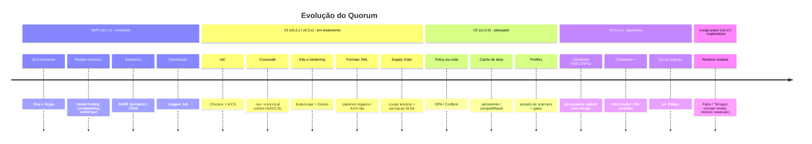
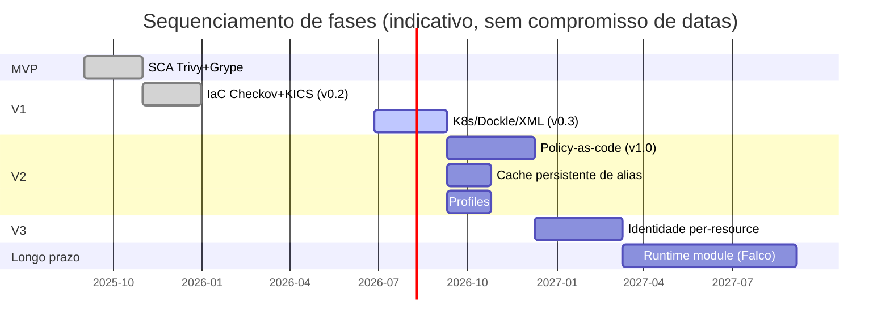

# Roadmap

Este documento descreve a evolução planejada do **Quorum** (`quorum-sec-scan`),
a ferramenta de *consensus security scanning* CLI/Docker. Ele consolida a tabela
de roadmap publicada no [README.md](../README.md#roadmap), explicita o estado
atual (**v0.2.3**), e organiza o trabalho em fases (MVP / V1 / V2 / V3 / Longo
prazo) com **objetivos**, **entregáveis** e **critérios de saída** verificáveis
por fase. O documento é *as-is* sobre o que já existe e *forward-looking* (com
rótulo claro) sobre o que ainda não existe.

> Princípio de produto que guia todas as fases: **false split > false merge** —
> na dúvida, o Quorum mantém findings separados e os marca como `unmapped`, pois
> uma fusão errada esconde risco. Toda fase abaixo preserva esse invariante.

> [!IMPORTANT]
> O Quorum é **CLI/Docker only**: não há frontend web, banco relacional, API
> REST de runtime, autenticação de usuários nem IA/LLM. Nenhum item deste roadmap
> introduz essas categorias. Itens que poderiam sugerir o contrário estão
> marcados como **Fora de escopo** com justificativa na seção dedicada.

---

## 1. Visão geral das fases

A numeração de fases (MVP/V1/V2/V3) é a abstração de planejamento; ela mapeia
para as versões SemVer reais conforme a tabela abaixo. O *trigger* de release é
restrito a tags `v[0-9]+.[0-9]+.[0-9]+` em
[`.github/workflows/release.yml`](../.github/workflows/release.yml).

| Fase | Versão(ões) | Tema | Status |
|------|-------------|------|--------|
| **MVP** | v0.1.x | SCA por consenso (Trivy + Grype), SARIF/JSON, imagem `:full` | Concluído |
| **V1** | v0.2.x → v0.3.x | IaC (Checkov/KICS) + crosswalk, K8s/hardening (Kubescape/Dockle), XML | Em andamento (atual: **v0.2.3**) |
| **V2** | v1.0.0 | Policy-as-code (OPA/Conftest), cache persistente de alias, *profiles* de imagem | Planejado |
| **V3** | v1.x | Identidade per-resource em MISCONFIG, ampliação de crosswalk, novos engines | Planejado |
| **Longo prazo** | v2.x+ | Módulo de runtime separado (Falco/Tetragon, modelo de stream) | Exploratório |

### Linha do tempo (Mermaid)

### Gantt indicativo (sequenciamento, não datas firmes)

> As datas no Gantt são **relativas e indicativas** (sequenciamento), não
> compromissos de calendário. O único *gating* real de release é uma tag SemVer.

---

## 2. MVP — SCA por consenso (v0.1.x) · Concluído

### Objetivos
- Provar a tese central: correlacionar e pontuar findings sobre os quais
  múltiplos scanners **concordam**, em vez de produzir N relatórios duplicados.
- Estabelecer o modelo canônico (`model.Finding`) e o pipeline
  scan → normalize → correlate → score → report.

### Entregáveis
- Adapters `trivy` e `grype` implementando a interface `Adapter`
  (`Name`/`Version`/`Supports`/`Capabilities`/`Run`) — ver
  [`internal/adapter/trivy.go`](../internal/adapter/trivy.go) e
  [`grype.go`](../internal/adapter/grype.go).
- `correlationKey` de VULN baseado em `vulnId + purl`; `Fingerprint =
  sha256(correlationKey)`.
- Relatórios **SARIF** (primário) e **JSON**, com
  `partialFingerprints["quorum/v1"]` e `properties.detectedBy/detectionCount/confidence`.
- Imagem Docker `:full` com os scanners empacotados.
- Comandos `scan <target>` e `list-scanners` (cobra) em
  [`cmd/quorum`](../cmd/quorum).

### Critérios de saída
- [x] Dois CVEs equivalentes (CVE x GHSA) para o mesmo pacote/versão fundem em um
      único finding com `detectionCount = 2`.
- [x] Saída SARIF válida ingerível pelo GitHub code scanning.
- [x] Exit codes determinísticos: `0` ok, `1` gate, `2` erro.
- [x] Contract test por adapter contra fixture real em
      [`internal/adapter/testdata`](../internal/adapter/testdata).

---

## 3. V1 — IaC, K8s, hardening e formatos (v0.2.x → v0.3.x) · Em andamento

Estado atual do produto: **v0.2.3**. As subfases v0.2 (IaC) já estão entregues;
v0.3 (K8s/Dockle/XML) está em curso — vários componentes já existem no código.

### 3.1 v0.2 — IaC por consenso · Concluído
**Objetivos:** estender o consenso para *misconfigurations* de IaC, onde
engines divergem em IDs de regra e identidade de recurso.

**Entregáveis:**
- Adapters `checkov` e `kics` ([`internal/adapter/checkov.go`](../internal/adapter/checkov.go),
  [`kics.go`](../internal/adapter/kics.go)).
- **Crosswalk** YAML `rule → canonical control` (AVD/CIS) em
  [`internal/crosswalk`](../internal/crosswalk), bundled em `/opt/quorum/crosswalk`
  (com fallback automático a partir de `--crosswalk ./crosswalk`).
- `correlationKey` de MISCONFIG por `basename(file) + resourceType +
  canonicalControl`, com *fallback* por categoria; regra sem mapeamento fica
  isolada e marcada `unmapped`.

**Critérios de saída:**
- [x] Misconfig de S3/IAM detectado por Checkov **e** Trivy funde via
      `canonicalControl` comum.
- [x] Regra não mapeada permanece isolada (nunca "adivinhada").
- [x] Supressões via baseline `.quorumignore` sempre logadas.

### 3.2 v0.3 — K8s, hardening de imagem e XML · Em andamento
**Objetivos:** cobrir postura Kubernetes e hardening de imagem; adicionar saída
XML para pipelines legados/JUnit-like.

**Entregáveis (estado no código):**
- Adapter `kubescape` (K8S_POSTURE) — [`internal/adapter/kubescape.go`](../internal/adapter/kubescape.go). ✅ presente
- Adapter `dockle` (IMG_HARDENING, controles CIS-DI) — [`internal/adapter/dockle.go`](../internal/adapter/dockle.go). ✅ presente
- Saída **XML** (mesma estrutura do JSON serializada) — [`internal/report`](../internal/report). ✅ presente
- **Polaris** (K8s) está listado no roadmap original do README, mas **ainda NÃO
  tem adapter** — há apenas referência ao engine na família `k8s` em
  [`internal/consensus/consensus.go`](../internal/consensus/consensus.go). Reclassificado
  para a **V3** (novos engines).

**Entregáveis de cadeia (supply chain), já vigentes nesta linha:**
- Assinatura **cosign keyless** (OIDC) de imagens e binários.
- **Atestação SLSA build-provenance** (`actions/attest-build-provenance`)
  verificada no release.
- **GitHub Action composite** ([`action.yml`](../action.yml)) que cosign-verifica
  a imagem `:full` antes de rodar; tag móvel `v0` para pin do action.

**Critérios de saída:**
- [x] `kubescape` e `dockle` registrados em `list-scanners` e cobertos por
      contract tests.
- [x] `--format xml` produz documento bem-formado equivalente ao JSON.
- [ ] Polaris explicitamente **deferido** (rastreado em V3) — sem promessa em v0.3.
- [x] Probe de versão (`Options.ProbeTime`, 60s) distingue
      timeout/killed(OOM)/não-instalado; status por scanner
      (`ran`/`skipped`/`unavailable`/`error`/`timeout`) sempre presente no relatório.

---

## 4. V2 — Policy-as-code, cache persistente e profiles (v1.0.0) · Planejado

### Objetivos
Levar o Quorum de "consenso + relatório" para "consenso + política", mantendo o
modelo CLI/Docker. Reduzir custo de rede do alias e simplificar a configuração
recorrente em CI.

### Entregáveis propostos
1. **Camada policy-as-code (OPA/Conftest).**
   - Avaliar findings normalizados contra políticas Rego declarativas
     (ex.: "bloquear qualquer VULN ≥ HIGH sem baseline aprovada", "exigir
     `confidence ≥ 0.8` para auto-aprovar exceção").
   - Política como *gate* adicional, complementar a `--fail-on`/`--min-severity`;
     resultado refletido no exit code (`1` = gate de política disparou).
   - Empacotada de forma que rode offline (sem servidor OPA externo).
2. **Cache persistente de alias.**
   - Hoje os aliases vão para `~/.cache/quorum/aliases.json` (local). Proposta:
     formato versionado, compartilhável entre runs/CI (artefato cacheável),
     com TTL e invalidação; mantém degradação graciosa e respeito a `--offline`.
3. **Profiles de imagem/scan.**
   - Presets nomeados (ex.: `sca-fast`, `iac-strict`, `k8s-posture`) combinando
     `--scanners`, `--min-severity`, `--fail-on`, política e crosswalk, para
     evitar linhas de comando longas e divergência entre pipelines.

### Critérios de saída
- [ ] Política Rego de exemplo roda offline e altera o exit code de forma
      determinística.
- [ ] Cache de alias persistido e reusado entre dois runs reduz chamadas OSV
      observáveis (mensurável nos logs).
- [ ] Pelo menos 3 *profiles* documentados, cada um reproduzível por uma flag.
- [ ] Sem regressão de contrato: todos os contract tests verdes.
- [ ] Documentação de cada recurso novo com exemplo executável em CI.

> **Nota de escopo (V2):** OPA/Conftest aqui é uma **biblioteca/binário avaliado
> localmente** dentro do pipeline CLI — **não** introduz API REST, daemon nem
> servidor de políticas. Se uma "Proposta futura" exigir servidor, ela cai em
> *Fora de escopo* abaixo.

---

## 5. V3 — Identidade per-resource, crosswalk++ e novos engines (v1.x) · Planejado

### Objetivos
Atacar a principal limitação conhecida de correlação MISCONFIG e ampliar
cobertura de controles e engines.

### Entregáveis propostos
1. **Identidade per-resource em MISCONFIG.**
   - Limitação atual (ver [README §Known limitations](../README.md#known-limitations)):
     dois recursos *distintos* do *mesmo tipo* com o *mesmo* controle no *mesmo*
     arquivo podem **over-merge**. Proposta: identidade de recurso normalizada
     (ex.: endereço Terraform `aws_s3_bucket.data`) para correlacionar com
     precisão sem violar `false split > false merge`.
2. **Ampliação do crosswalk.**
   - Mais clouds/controles além de S3/IAM; validação contra catálogos oficiais
     AVD/CIS; possível ferramenta de lint do crosswalk.
3. **Novos engines.**
   - **Polaris** (K8s) como adapter completo (deferido da V1); avaliação de
     outros engines OSS conforme demanda, sempre via interface `Adapter` +
     contract test.

### Critérios de saída
- [ ] Caso de teste com dois recursos do mesmo tipo/controle/arquivo deixa de
      over-merge e produz dois findings corretos.
- [ ] Crosswalk lintado contra catálogos oficiais; cobertura documentada.
- [ ] Polaris registrado em `list-scanners` com contract test contra fixture
      real e mapeado na família de engines `k8s`.

---

## 6. Longo prazo — Módulo de runtime (v2.x+) · Exploratório

### Objetivos
Estender a tese de consenso para **sinais de runtime**, sem comprometer a
natureza CLI/batch do Quorum atual.

### Entregáveis propostos
- **Módulo de runtime separado** consumindo streams de Falco/Tetragon
  (modelo de eventos de execução), entregue como **componente distinto** do
  orquestrador de scan estático — para não transformar o Quorum em um daemon
  de propósito geral.

### Critérios de saída
- [ ] Modelo de stream especificado e isolado do `model.Finding` estático
      (ou explicitamente versionado/separado).
- [ ] Prova de conceito que correlaciona um achado estático com um evento de
      runtime sem acoplar o caminho de scan existente.

> Esta fase é **exploratória**: sujeita a redefinição/cancelamento. Não há
> compromisso de entrega.

---

## 7. Fora de escopo (N/A) — e por quê

Itens frequentemente esperados em roadmaps de produtos de segurança que o Quorum
**não** persegue, por decisão de arquitetura:

| Item | Status | Justificativa |
|------|--------|---------------|
| Frontend web / dashboard | **N/A** | Quorum é CLI/Docker; relatórios (SARIF/JSON/XML) são consumidos por ferramentas existentes (GitHub code scanning, DefectDojo). |
| Banco de dados relacional | **N/A** | Estado é efêmero por run; persistência limita-se a cache de alias em arquivo. |
| API REST / daemon de runtime do scanner | **N/A** | Modelo é batch em CI/CD com gate por exit code; um servidor mudaria o modelo de confiança. |
| Autenticação / contas de usuário | **N/A** | Sem multi-tenant; identidade é a do pipeline. Verificação de cadeia usa OIDC/cosign, não login. |
| IA / LLM para triagem | **N/A** | Consenso é determinístico e auditável; LLM introduziria não-determinismo no `correlationKey`/`confidence`. |
| Plataforma SaaS/cloud gerenciada | **N/A** | Distribuição é imagem Docker + binário nativo; o consumidor opera o pipeline. |

> **Proposta futura (claramente separada):** se houver demanda, um *runtime
> module* (V/Longo prazo) e/ou integrações de exportação (ex.: webhook para
> sistemas de tracking) poderiam ser estudados como **componentes opcionais e
> separados**, sem reverter a decisão de não ter daemon/SaaS no núcleo.

---

## 8. Como uma fase "fecha" (definição de pronto)

Independentemente da fase, um item só é considerado entregue quando:

- [ ] Código segue a interface `Adapter` (quando aplicável) e o modelo canônico.
- [ ] Há **contract test** contra fixture real do output da ferramenta
      ([`internal/adapter/testdata`](../internal/adapter/testdata)).
- [ ] `make test`, `make vet`, `make build` verdes; CI
      ([`ci.yml`](../.github/workflows/ci.yml)) e e2e
      ([`e2e.yml`](../.github/workflows/e2e.yml)) passam.
- [ ] Invariante **false split > false merge** preservado (sem fusões
      especulativas; `unmapped` quando não houver mapeamento).
- [ ] Status por scanner e supressões de baseline permanecem explícitos
      ("0 findings is not proof of safety").
- [ ] Documentação atualizada e, quando aplicável, exemplo de CI em
      [`examples/ci/`](../examples/ci).
- [ ] Release apenas por tag SemVer `v[0-9]+.[0-9]+.[0-9]+`, com imagens/binários
      assinados (cosign) e atestação SLSA verificada.

---

## 9. Rastreabilidade README ↔ fases

Mapeamento direto da tabela do [README §Roadmap](../README.md#roadmap) para as
fases deste documento:

| Linha do README | Fase aqui | Observação de fidelidade |
|-----------------|-----------|--------------------------|
| MVP — Trivy + Grype, `vulnId+purl`, SARIF+JSON, `:full` | **MVP** | Igual. |
| v0.2 — Checkov + KICS, crosswalk, category fallback | **V1 / v0.2** | Concluído. |
| v0.3 — Kubescape + Polaris, Dockle, XML | **V1 / v0.3** | Kubescape/Dockle/XML presentes; **Polaris deferido para V3** (sem adapter no código). |
| v1.0 — OPA/Conftest, cache persistente de alias, profiles | **V2** | Planejado. |
| future — runtime Falco/Tetragon | **Longo prazo** | Exploratório, módulo separado. |

---

## Premissas

- **Versão de referência:** o estado atual é **v0.2.3**; `git describe` no
  repositório retorna a tag móvel `v0` (usada para pin do GitHub Action), e o
  número de versão do produto vem do enunciado/README, não de um literal
  encontrado em `cmd/quorum/*.go`.
- **Polaris:** tratado como **não implementado** porque existe apenas a
  referência ao engine na família `k8s` em `internal/consensus/consensus.go`
  (`"polaris": "k8s"`), sem arquivo `internal/adapter/polaris.go`. Por isso foi
  reclassificado de v0.3 (README) para V3 neste roadmap.
- **Subfases v0.3 "em andamento":** os adapters `kubescape`/`dockle` e a saída
  XML já existem no código; "em andamento" reflete o gap do Polaris e a posição
  v0.2.3 (ainda não cortada como v0.3.0), não ausência dos componentes.
- **Datas:** nenhuma data de calendário é compromisso; os blocos do Gantt são
  sequenciais e indicativos. O único gate real de release é uma tag SemVer.
- **Conteúdo das fases V2/V3/Longo prazo:** descrito como **proposta** derivada
  da linha "v1.0/future" do README; detalhes de implementação (formato de cache,
  esquema de políticas, nomes de profiles) são ilustrativos e sujeitos a design.
- **Itens "Fora de escopo":** derivados explicitamente dos princípios declarados
  (CLI/Docker only; sem web/DB/REST/auth/IA); não são funcionalidades removidas,
  e sim categorias nunca pretendidas para o núcleo.
