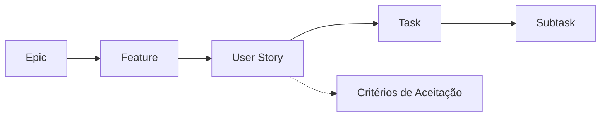
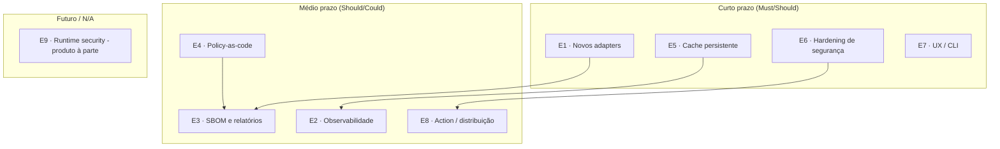
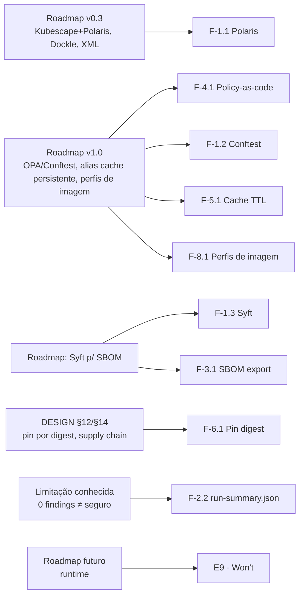

# Backlog

Backlog acionável do **Quorum** (`quorum-sec-scan`, v0.2.3) derivado do roadmap oficial
([`README.md`](../README.md) §Roadmap e [`DESIGN.md` §13](../DESIGN.md)) e das lacunas
observadas no código-fonte (limitações conhecidas, itens de v1.0 ainda não implementados e
oportunidades de *hardening* e UX). O backlog está organizado de forma hierárquica
**Epic → Feature → User Story → Task → Subtask**, com **Critérios de Aceitação**,
**Prioridade (MoSCoW)**, **Estimativa (story points, escala Fibonacci)** e **Dependências**.

> Este documento descreve trabalho **planejado/proposto**. O estado *as-is* da v0.2.3 está
> documentado em [01-visao-geral.md](01-visao-geral.md) e [10-infraestrutura.md](10-infraestrutura.md).
> Tudo aqui marcado como "proposta futura" **não existe ainda** no código; é backlog.
>
> Referências de código verificadas: [`cmd/quorum/scan.go`](../cmd/quorum/scan.go),
> [`internal/cache/store.go`](../internal/cache/store.go),
> [`internal/adapter/`](../internal/adapter), [`internal/report/`](../internal/report),
> [`DESIGN.md`](../DESIGN.md), [`README.md`](../README.md).

---

## 1. Convenções do backlog

### 1.1 Hierarquia



| Nível | Definição no Quorum | Exemplo |
|-------|---------------------|---------|
| **Epic** | Objetivo de produto que cruza vários pacotes/releases | "Cache persistente de aliases" |
| **Feature** | Capacidade entregável dentro de um Epic | "Cache com TTL e expurgo" |
| **User Story** | Necessidade de um usuário, no formato *As a … I want … so that …* | ver §4+ |
| **Task** | Unidade técnica de implementação | "Adicionar campo `expiresAt` ao registro de cache" |
| **Subtask** | Passo concreto dentro de uma Task | "Migrar schema do JSON v1→v2" |

### 1.2 Prioridade — MoSCoW

| Sigla | Significado | Critério de uso |
|-------|-------------|-----------------|
| **M** (Must) | Obrigatório para a próxima minor | Fecha lacuna do roadmap ou risco de segurança |
| **S** (Should) | Importante, mas não bloqueia release | Alto valor, com *workaround* aceitável |
| **C** (Could) | Desejável se houver folga | Melhoria incremental |
| **W** (Won't, *now*) | Fora de escopo deliberado | Itens N/A (ver §13) ou produto futuro à parte |

### 1.3 Estimativa — story points (Fibonacci)

`1, 2, 3, 5, 8, 13, 21`. **1** = mudança trivial localizada; **21** = épico inteiro que
**deve ser quebrado** antes de entrar em sprint. Pontos são esforço relativo, não horas.

### 1.4 Definição de Pronto (DoD) — aplica-se a toda User Story

- [ ] Código segue a interface canônica (adapters não calculam `correlationKey` — [`DESIGN.md` §5](../DESIGN.md)).
- [ ] Testes unitários cobrindo o caminho feliz e a degradação graciosa.
- [ ] Para adapters: **teste de contrato** contra fixture versionada em [`internal/adapter/testdata`](../internal/adapter/testdata).
- [ ] `make test`, `make vet` e `make build` verdes.
- [ ] Documentação atualizada (README + doc relevante em `docs/`).
- [ ] Princípio preservado: *false split > false merge*; *"0 findings is not proof of safety"*.
- [ ] Sem regressão de determinismo de `correlationKey`/`Fingerprint`.

---

## 2. Mapa de Epics



| Epic | Tema | Origem | Prioridade dominante |
|------|------|--------|----------------------|
| **E1** | Novos adapters (Polaris, Conftest/OPA, Syft/SBOM, Hadolint) | Roadmap v0.3/v1.0; [`DESIGN.md` §13](../DESIGN.md) | Must/Should |
| **E2** | Observabilidade (logs estruturados, métricas, *run summary* JSON) | Lacuna (hoje só stderr humano) | Should |
| **E3** | SBOM e relatórios (CycloneDX/SPDX, HTML, sarif rollups) | Roadmap (Syft p/ SBOM); lacuna de formatos | Should/Could |
| **E4** | Policy-as-code (OPA/Conftest como camada opcional) | Roadmap v1.0 | Should |
| **E5** | Cache persistente (TTL, expurgo, cache de findings/SBOM) | Roadmap v1.0; [`internal/cache/store.go`](../internal/cache/store.go) | Must |
| **E6** | Hardening de segurança (pin por digest, SBOM da própria imagem, SLSA L3) | [`DESIGN.md` §12/§14](../DESIGN.md) | Must |
| **E7** | UX / CLI (saída TTY, `--diff`/baseline auto, `explain`, perfis) | Lacuna de UX | Should/Could |
| **E8** | Action / distribuição (perfis de imagem, action versionada, GitLab/Azure) | Roadmap (perfis); [`action.yml`](../action.yml) | Should/Could |
| **E9** | Runtime security (Falco/Tetragon) | [`DESIGN.md` §2/§13](../DESIGN.md) — **fora de escopo** | Won't (agora) |

---

## 3. Resumo priorizado (visão de portfólio)

| ID | Epic | Feature | MoSCoW | SP | Dependências |
|----|------|---------|--------|----|--------------|
| F-1.1 | E1 | Adapter Polaris (K8s posture) | M | 8 | — |
| F-1.2 | E1 | Adapter Conftest/OPA (policy-as-code) | S | 13 | F-4.1 |
| F-1.3 | E1 | Adapter Syft (SBOM nativo) | S | 8 | — |
| F-1.4 | E1 | Adapter Hadolint (Dockerfile lint) | C | 5 | — |
| F-2.1 | E2 | Logs estruturados (JSON) com nível | S | 5 | — |
| F-2.2 | E2 | `run-summary.json` machine-readable | S | 5 | — |
| F-2.3 | E2 | Métricas opcionais (OTel/Prometheus textfile) | C | 8 | F-2.1 |
| F-3.1 | E3 | Export SBOM CycloneDX/SPDX | S | 8 | F-1.3 |
| F-3.2 | E3 | Relatório HTML estático | C | 8 | — |
| F-3.3 | E3 | Enriquecer SARIF (help, tags, security-severity) | S | 3 | — |
| F-4.1 | E4 | Camada policy-as-code (OPA bundles do usuário) | S | 13 | — |
| F-4.2 | E4 | Política de gate declarativa (`quorum.policy.yaml`) | C | 8 | F-4.1 |
| F-5.1 | E5 | Cache de aliases com TTL + expurgo | M | 5 | — |
| F-5.2 | E5 | Cache de SBOM/findings por digest | C | 13 | F-1.3 |
| F-6.1 | E6 | Pin de scanners por `@sha256` + verificação | M | 8 | — |
| F-6.2 | E6 | SBOM e atestação da própria imagem Quorum | S | 5 | F-3.1 |
| F-6.3 | E6 | Hardening de runtime do container (rootless, RO FS) | S | 5 | — |
| F-7.1 | E7 | Saída TTY colorida + tabela legível | S | 5 | — |
| F-7.2 | E7 | `quorum explain <fingerprint>` | C | 5 | F-2.2 |
| F-7.3 | E7 | Modo `--baseline-write` (gerar baseline) | S | 3 | — |
| F-8.1 | E8 | Perfis de imagem `:sca`/`:iac`/`:k8s` | S | 8 | F-6.1 |
| F-8.2 | E8 | Outputs ricos da Action + cache do GH | S | 5 | — |
| F-8.3 | E8 | Templates GitLab/Azure/Jenkins ampliados | C | 5 | — |

> **Total estimado (M+S+C):** ~150 SP. Itens **W** (E9) não pontuam — são produto separado.

---

## 4. Epic E1 — Novos adapters

> **Objetivo:** ampliar o *pool* de scanners mantendo a interface `Adapter`
> (`Name/Version/Supports/Capabilities/Run`) e o contrato de teste por fixture
> ([`internal/adapter/adapter.go`](../internal/adapter/adapter.go), [`DESIGN.md` §5](../DESIGN.md)).
> **Invariante:** o novo adapter emite `model.Finding` canônico e **não** calcula `correlationKey`.

### Feature F-1.1 — Adapter Polaris (K8s posture) · **Must** · 8 SP

Polaris foi explicitamente prometido na fase v0.3 do roadmap ([`DESIGN.md` §13](../DESIGN.md))
e ainda não tem adapter em [`internal/adapter/`](../internal/adapter).

#### User Story US-1.1.1

> **Como** engenheiro de plataforma que valida manifests Kubernetes,
> **quero** que o Quorum rode o Polaris junto com o Kubescape,
> **para que** a postura de K8s tenha consenso entre duas engines (`detectionCount ≥ 2`).

**Critérios de Aceitação**

- [ ] `quorum list-scanners` exibe `polaris` com tipo `K8S_POSTURE` e target `k8s`.
- [ ] `quorum scan ./k8s --type k8s --scanners kubescape,polaris` produz, para um manifest
      com privilégio elevado, um `MergedFinding` com `detectedBy: [kubescape, polaris]` e
      `detectionCount: 2`.
- [ ] Severidade do Polaris é normalizada pela tabela única ([`DESIGN.md` §10](../DESIGN.md)).
- [ ] Crosswalk mapeia check do Polaris → `canonicalControl` (categoria como fallback).
- [ ] Polaris ausente no PATH → status `unavailable` (scan não falha).
- [ ] Teste de contrato contra fixture `testdata/k8s_polaris.json` versionada.

| Task | Descrição | SP | Subtasks |
|------|-----------|----|----------|
| T-1.1.1a | Criar `internal/adapter/polaris.go` implementando `Adapter` | 3 | invocar CLI com saída JSON; mapear campos → `Finding`; preencher `Resource{Kind,Name,Namespace}` |
| T-1.1.1b | Parser + normalização de severidade | 2 | mapear enum do Polaris; `Location` quando disponível |
| T-1.1.1c | Entradas de crosswalk Polaris→AVD/categoria | 1 | adicionar `ids.polaris` no YAML; nota de validação |
| T-1.1.1d | Fixture + teste de contrato | 2 | capturar saída real; `testdata/k8s_polaris.json`; assert canônico |

**Dependências:** nenhuma (Kubescape já existe).

---

### Feature F-1.2 — Adapter Conftest/OPA · **Should** · 13 SP

#### User Story US-1.2.1

> **Como** time de AppSec com políticas Rego próprias,
> **quero** rodar minhas políticas OPA/Conftest pelo Quorum,
> **para que** violações de política apareçam no **mesmo** relatório de consenso.

**Critérios de Aceitação**

- [ ] `--scanners conftest` roda políticas Rego sobre o alvo `repo`/`k8s`.
- [ ] Violações viram `Finding` de tipo `MISCONFIG` (ou novo `POLICY`) com `CanonicalControl`
      derivado do nome da política.
- [ ] Usuário traz suas regras via flag (ex.: `--policy ./policies`) — Quorum **não** embute
      políticas opinativas (conforme [`DESIGN.md` §2](../DESIGN.md): "usuário traz regras").
- [ ] Sem políticas configuradas → adapter `skipped`, não `error`.

**Dependências:** F-4.1 (define a superfície de policy-as-code).
**Nota:** 13 SP → **quebrar** em decisão de modelo (`MISCONFIG` vs novo `TypePolicy`) antes do sprint.

---

### Feature F-1.3 — Adapter Syft (SBOM nativo) · **Should** · 8 SP

O roadmap cita "Syft p/ SBOM" ([`DESIGN.md` §2](../DESIGN.md)); ainda não há adapter.

#### User Story US-1.3.1

> **Como** engenheiro que precisa de inventário de dependências,
> **quero** que o Quorum gere um SBOM do alvo via Syft,
> **para que** eu tenha o componente-base reaproveitável por SCA, SBOM export e cache.

**Critérios de Aceitação**

- [ ] Syft produz inventário interno (PURLs) consumível pelo pipeline.
- [ ] Quando habilitado, alimenta o **export de SBOM** (F-3.1) e o **cache por digest** (F-5.2).
- [ ] Não emite "findings" por si — é fonte de dados, não detector (status próprio no summary).

**Dependências:** nenhuma; habilita F-3.1 e F-5.2.

---

### Feature F-1.4 — Adapter Hadolint (Dockerfile) · **Could** · 5 SP

#### User Story US-1.4.1

> **Como** desenvolvedor que mantém Dockerfiles,
> **quero** lint de Dockerfile via Hadolint no Quorum,
> **para que** problemas de build de imagem entrem no consenso `IMG_HARDENING`/`MISCONFIG`.

**Critérios de Aceitação**

- [ ] `hadolint` registrado; targets `repo` (detecta `Dockerfile*`).
- [ ] Regras `DL****` mapeadas para `canonicalControl` quando equivalentes a controles CIS-DI
      do Dockle (potencial `detectionCount ≥ 2`).
- [ ] Teste de contrato com fixture de saída JSON do Hadolint.

---

## 5. Epic E2 — Observabilidade

> **Estado atual:** o único "observável" é o resumo humano em `stderr`
> (`printSummary` em [`cmd/quorum/scan.go`](../cmd/quorum/scan.go)) e logs `[quorum] …`
> controlados por `--quiet`. Não há log estruturado nem saída de telemetria.

### Feature F-2.1 — Logs estruturados · **Should** · 5 SP

#### User Story US-2.1.1

> **Como** operador de CI que agrega logs em um SIEM,
> **quero** logs em JSON com nível e campos (`scanner`, `status`, `duration`),
> **para que** eu possa filtrar e alertar sobre execuções de scan.

**Critérios de Aceitação**

- [ ] Flag `--log-format text|json` (default `text`, retrocompatível com `[quorum] …`).
- [ ] Cada evento de orquestrador (scanner start/stop/timeout/unavailable) vira uma linha JSON.
- [ ] `--quiet` continua suprimindo logs de progresso; erros sempre visíveis.
- [ ] Sem segredos nos logs (alvo, fingerprints e contagens são permitidos).

| Task | SP | Subtasks |
|------|----|----------|
| T-2.1.1a · abstrair `Logf` para um logger com campos | 3 | interface `Logger`; adaptar chamadas em `orchestrator` e `scan.go` |
| T-2.1.1b · writer JSON + flag | 2 | parse de `--log-format`; testes de formato |

### Feature F-2.2 — `run-summary.json` machine-readable · **Should** · 5 SP

#### User Story US-2.2.1

> **Como** plataforma que coleta métricas de N pipelines,
> **quero** um arquivo de resumo estruturado por execução,
> **para que** dashboards consumam status por scanner e rollup de severidade sem parsear texto.

**Critérios de Aceitação**

- [ ] Flag `--summary-file run-summary.json` grava: por-scanner `{name,status,findings,duration,error}`,
      `mergedCount`, `multiDetected`, rollup por severidade e `elapsed`.
- [ ] O conteúdo espelha exatamente o `printSummary` atual (fonte única de verdade).
- [ ] Ausência da flag = comportamento atual inalterado.

**Dependências:** reusa `orchestrator.Result` ([`cmd/quorum/scan.go`](../cmd/quorum/scan.go)).

### Feature F-2.3 — Métricas opcionais · **Could** · 8 SP

#### User Story US-2.3.1

> **Como** SRE,
> **quero** exportar métricas (duração por scanner, contagem por severidade) via OpenTelemetry
> ou *textfile* Prometheus,
> **para que** eu acompanhe tendência de findings entre execuções.

**Critérios de Aceitação**

- [ ] Flag `--metrics-file metrics.prom` (formato textfile do node_exporter) **ou** endpoint OTLP via env.
- [ ] Métricas: `quorum_scan_duration_seconds{scanner}`, `quorum_findings_total{severity}`,
      `quorum_scanner_status{scanner,status}`.
- [ ] Desabilitado por padrão; nenhuma chamada de rede sem opt-in (respeita filosofia *offline-first*).

**Dependências:** F-2.1.

---

## 6. Epic E3 — SBOM e relatórios

> **Estado atual:** três reporters — SARIF/JSON/XML ([`internal/report/`](../internal/report)).
> Não há SBOM export nem relatório legível por humanos (HTML).

### Feature F-3.1 — Export SBOM (CycloneDX/SPDX) · **Should** · 8 SP

#### User Story US-3.1.1

> **Como** responsável por compliance de cadeia de suprimentos,
> **quero** exportar o SBOM do alvo em CycloneDX ou SPDX,
> **para que** eu cumpra requisitos regulatórios (ex.: EO 14028) com o mesmo comando de scan.

**Critérios de Aceitação**

- [ ] `--sbom cyclonedx|spdx` + `--sbom-output sbom.json` gera o SBOM do alvo.
- [ ] SBOM derivado do inventário do Syft (F-1.3); PURLs consistentes com os findings de VULN.
- [ ] Operação não bloqueante: falha de SBOM não derruba o scan principal (loga e segue).

**Dependências:** F-1.3.

### Feature F-3.2 — Relatório HTML estático · **Could** · 8 SP

#### User Story US-3.2.1

> **Como** tech lead que compartilha resultados num PR,
> **quero** um relatório HTML único (sem servidor),
> **para que** revisores vejam consenso, `confidence` e status por scanner sem ferramentas extras.

**Critérios de Aceitação**

- [ ] `--format html -o report.html` produz HTML **autônomo** (sem JS externo, sem rede).
- [ ] Mostra tabela de `MergedFinding` ordenada por `severity` e `confidence`, com `detectedBy`.
- [ ] Inclui o aviso *"0 findings is not proof of safety"* e o status por scanner.
- [ ] **N/A explícito:** não é um painel web/daemon — é artefato estático (ver [13-ia.md](13-ia.md) p/ limites de escopo).

### Feature F-3.3 — Enriquecer SARIF · **Should** · 3 SP

#### User Story US-3.3.1

> **Como** usuário do GitHub code scanning,
> **quero** que o SARIF traga `security-severity`, `help` e `tags` por regra,
> **para que** o triage no GitHub mostre severidade e contexto corretos.

**Critérios de Aceitação**

- [ ] `rules[].properties["security-severity"]` derivado do CVSS/severidade.
- [ ] `rules[].help.text` com origem (`detectedBy`) e link do controle canônico (AVD/CIS) quando houver.
- [ ] `partialFingerprints["quorum/v1"]` preservado (sem regressão de dedup — [`DESIGN.md` §11](../DESIGN.md)).
- [ ] Teste atualizado em [`internal/report/report_test.go`](../internal/report/report_test.go).

---

## 7. Epic E4 — Policy-as-code

> Roadmap v1.0: "OPA/Conftest policy-as-code layer". Princípio do design: OPA/Conftest
> **não** é "scanner", é camada **opcional** em que **o usuário traz as regras**
> ([`DESIGN.md` §2](../DESIGN.md)).

### Feature F-4.1 — Camada policy-as-code · **Should** · 13 SP

#### User Story US-4.1.1

> **Como** time de governança,
> **quero** avaliar políticas Rego sobre o alvo e/ou sobre os próprios findings do Quorum,
> **para que** decisões de gate sigam nossas regras de negócio, não só severidade.

**Critérios de Aceitação**

- [ ] `--policy ./policies` carrega bundles Rego do usuário (nenhuma política embutida).
- [ ] Modo A: política sobre o alvo (IaC/K8s) → violações viram `Finding`.
- [ ] Modo B: política sobre `[]MergedFinding` → pode **decidir o gate** (ex.: "bloquear se algum
      finding `confidence ≥ 0.8` e `severity ≥ HIGH`").
- [ ] Degradação graciosa: erro de avaliação de política → status `error` do "scanner" policy,
      sem corromper o resto do relatório.

**Dependências:** habilita F-1.2 e F-4.2.
**Nota:** 13 SP — quebrar em "modo A" e "modo B" como Features distintas no refinamento.

### Feature F-4.2 — Política de gate declarativa · **Could** · 8 SP

#### User Story US-4.2.1

> **Como** mantenedor,
> **quero** declarar o gate em `quorum.policy.yaml` (limiares por tipo/severidade/confidence),
> **para que** o critério de bloqueio fique versionado e auditável, além do simples `--fail-on`.

**Critérios de Aceitação**

- [ ] YAML declarativo: regras como `{type: VULN, minSeverity: HIGH, minConfidence: 0.7 → fail}`.
- [ ] Convive com `--fail-on` (a flag continua funcionando; YAML refina).
- [ ] Exit codes inalterados (`0/1/2`, [`README.md`](../README.md) §Exit codes).

---

## 8. Epic E5 — Cache persistente

> **Estado atual:** já existe um cache JSON persistente para aliases
> ([`internal/cache/store.go`](../internal/cache/store.go)): map `id→canonical`, *flush* atômico,
> tolerante a falha. **Lacunas:** sem TTL/expiração, sem versionamento de schema, sem cache de
> SBOM/findings por digest. O roadmap v1.0 lista "persistent alias cache" como meta.

### Feature F-5.1 — TTL + expurgo de cache · **Must** · 5 SP

#### User Story US-5.1.1

> **Como** usuário de CI de longa duração,
> **quero** que entradas de alias expirem e o cache não cresça indefinidamente,
> **para que** dados de alias desatualizados sejam revalidados e o arquivo permaneça pequeno.

**Critérios de Aceitação**

- [ ] Registro passa de `string` para `{value, fetchedAt}` com **migração** transparente do schema v1.
- [ ] `--cache-ttl 720h` (default razoável) revalida entradas vencidas via OSV (respeitando `--offline`).
- [ ] Cache corrompido/ilegível continua produzindo cache vazio (sem quebrar scan — invariante atual).
- [ ] `quorum cache prune` remove entradas vencidas.

| Task | SP | Subtasks |
|------|----|----------|
| T-5.1.1a · novo schema de registro + migração v1→v2 | 3 | struct com timestamp; ler v1 (map plano) e converter; teste de migração |
| T-5.1.1b · lógica de TTL no `alias.Resolver` | 1 | considerar expirado antes do hit; respeitar `--offline` |
| T-5.1.1c · subcomando `cache prune` | 1 | iterar e remover vencidos; log de contagem |

### Feature F-5.2 — Cache de SBOM/findings por digest · **Could** · 13 SP

#### User Story US-5.2.1

> **Como** pipeline que re-escaneia a mesma imagem por digest,
> **quero** reaproveitar SBOM/findings em cache por `sha256` da imagem,
> **para que** re-scans sejam muito mais rápidos quando o conteúdo não mudou.

**Critérios de Aceitação**

- [ ] Chave de cache = digest do alvo (imagem) ou hash do tree (repo).
- [ ] `--no-cache`/cache miss recalculam; resultado determinístico idêntico ao scan sem cache.
- [ ] Invalidações: versão do scanner muda → invalida (a versão entra na chave).

**Dependências:** F-1.3 (Syft).
**Nota:** quebrar; risco de invalidação incorreta. 13 SP.

---

## 9. Epic E6 — Hardening de segurança

> Fonte: [`DESIGN.md` §12/§14](../DESIGN.md) e [`README.md`](../README.md) §"Security of the chain itself".
> O `:full` hoje pina scanners **por versão**; o design recomenda **digest imutável** + verificação.

### Feature F-6.1 — Pin de scanners por `@sha256` + verificação · **Must** · 8 SP

#### User Story US-6.1.1

> **Como** consumidor da imagem `:full`,
> **quero** que cada scanner embutido seja pinado por digest e verificado por checksum no build,
> **para que** um comprometimento de tag *upstream* não entre na minha *trust boundary*.

**Critérios de Aceitação**

- [ ] [`Dockerfile.full`](../Dockerfile.full) referencia cada ferramenta por `@sha256:<digest>` (não tag móvel).
- [ ] Build valida checksum de cada binário baixado (falha o build em divergência).
- [ ] Documentado em [10-infraestrutura.md](10-infraestrutura.md) e na seção de supply chain do README.
- [ ] CI [`release.yml`](../.github/workflows/release.yml) continua assinando keyless (cosign) e gerando atestação SLSA.

| Task | SP | Subtasks |
|------|----|----------|
| T-6.1.1a · pinar base + scanners por digest | 3 | substituir tags por digests; arquivo de lock de digests |
| T-6.1.1b · verificação de checksum no build | 3 | baixar checksum oficial; `sha256sum -c`; falhar em mismatch |
| T-6.1.1c · job de renovação de digests | 2 | workflow agendado que abre PR ao atualizar digests |

### Feature F-6.2 — SBOM e atestação da própria imagem Quorum · **Should** · 5 SP

#### User Story US-6.2.1

> **Como** auditor da minha cadeia de suprimentos,
> **quero** que as imagens `:full`/`:slim` publiquem um SBOM próprio e atestação,
> **para que** eu inventarie o que está dentro do Quorum, não só do que ele escaneia.

**Critérios de Aceitação**

- [ ] `release.yml` gera SBOM (CycloneDX/SPDX) da imagem e o anexa ao GHCR.
- [ ] Atestação SLSA build-provenance já existente permanece verificável via
      `gh attestation verify` ([`README.md`](../README.md) §Install).
- [ ] `cosign verify` da assinatura keyless documentado e testado no fluxo de release.

**Dependências:** F-3.1 (reuso da geração de SBOM).

### Feature F-6.3 — Hardening de runtime do container · **Should** · 5 SP

#### User Story US-6.3.1

> **Como** operador de segurança,
> **quero** que o container Quorum rode como não-root e com FS read-only,
> **para que** o blast radius de uma falha do orquestrador seja mínimo.

**Critérios de Aceitação**

- [ ] Imagens rodam como UID não-root por padrão (montagem `/work` permanece gravável quando preciso).
- [ ] Compatível com `--read-only` + `--cap-drop ALL` documentado nos exemplos.
- [ ] Exemplo de SecurityContext para uso como `container:` em GitHub Actions.
- [ ] Cache (`~/.cache/quorum`) redirecionável via env quando o HOME não for gravável.

---

## 10. Epic E7 — UX / CLI

> **Estado atual:** dois comandos (`scan`, `list-scanners`); saída humana só no `stderr summary`;
> baseline manual ([`cmd/quorum/scan.go`](../cmd/quorum/scan.go)).

### Feature F-7.1 — Saída TTY legível · **Should** · 5 SP

#### User Story US-7.1.1

> **Como** desenvolvedor rodando o Quorum localmente,
> **quero** uma tabela colorida de findings no terminal,
> **para que** eu entenda o resultado sem abrir o SARIF.

**Critérios de Aceitação**

- [ ] Quando `stdout` é um TTY e `--format` não foi forçado, exibir tabela legível
      (severidade colorida, `detectionCount`, `confidence`).
- [ ] Cores desligadas se `NO_COLOR` setado ou saída não-TTY (CI permanece estável).
- [ ] `--quiet` suprime; formatos de máquina (sarif/json/xml) inalterados quando explicitados.

### Feature F-7.2 — `quorum explain <fingerprint>` · **Could** · 5 SP

#### User Story US-7.2.1

> **Como** analista triando um finding,
> **quero** `quorum explain <fingerprint>` a partir de um relatório,
> **para que** eu veja por que o `confidence` tem aquele valor (pesos de diversidade/severidade/autoridade).

**Critérios de Aceitação**

- [ ] Recebe um relatório JSON (`--from report.json`) + fingerprint.
- [ ] Mostra membros, `detectedBy`, e a **decomposição** da fórmula de confiança ([`DESIGN.md` §9](../DESIGN.md)).
- [ ] Mensagem clara se o fingerprint não existir.

**Dependências:** F-2.2 (resumo/relatório machine-readable estável).

### Feature F-7.3 — `--baseline-write` (gerar baseline) · **Should** · 3 SP

#### User Story US-7.3.1

> **Como** equipe adotando `--fail-on` pela primeira vez num repo com findings legados,
> **quero** gerar um `.quorumignore` a partir do scan atual,
> **para que** eu congele o backlog existente e barre apenas regressões novas.

**Critérios de Aceitação**

- [ ] `quorum scan … --baseline-write .quorumignore` grava 1 fingerprint por linha com comentário
      (`# <title> [<severity>] reviewed <data>`).
- [ ] Formato 100% compatível com o leitor de baseline atual (`filter.LoadBaseline`).
- [ ] Não escreve nada se o scan falhar com erro de runtime (exit 2).

**Exemplo de saída**

```
# .quorumignore — gerado por quorum --baseline-write em 2026-06-27
2f1a…e9c4   # CVE-2021-… in apk-tools [HIGH] reviewed 2026-06-27
MISCONFIG|main.tf|aws_s3_bucket|AVD-AWS-0089   # S3 logging [MEDIUM] reviewed 2026-06-27
```

---

## 11. Epic E8 — Action / distribuição

> **Estado atual:** Action composite ([`action.yml`](../action.yml)) que cosign-verifica e roda
> a `:full`; tags `:full` (amd64) e `:slim` (amd64+arm64); GoReleaser para binários;
> exemplos em [`examples/ci/`](../examples/ci). Roadmap menciona **perfis de imagem**.

### Feature F-8.1 — Perfis de imagem `:sca`/`:iac`/`:k8s` · **Should** · 8 SP

#### User Story US-8.1.1

> **Como** pipeline que só faz SCA,
> **quero** uma imagem enxuta com apenas Trivy+Grype,
> **para que** o pull e a superfície de ataque sejam menores que a `:full`.

**Critérios de Aceitação**

- [ ] Tags `:sca` (trivy+grype), `:iac` (checkov+kics) e `:k8s` (kubescape[+polaris]) publicadas.
- [ ] Cada perfil herda o pin por digest (F-6.1) e a assinatura/atestação.
- [ ] README documenta a matriz de tags atualizada (hoje só `:full`/`:slim`).

**Dependências:** F-6.1.

### Feature F-8.2 — Outputs ricos da Action + cache do GH · **Should** · 5 SP

#### User Story US-8.2.1

> **Como** autor de workflow,
> **quero** outputs estruturados da Action e cache do alias-store entre runs,
> **para que** eu reaja ao resultado e acelere execuções.

**Critérios de Aceitação**

- [ ] Outputs além de `output-file`/`exit-code`: `critical-count`, `high-count`, `multi-detected-count`.
- [ ] Exemplo usando `actions/cache` para `~/.cache/quorum` (integra com F-5.1).
- [ ] Tag móvel `v0` continua funcionando; pin por `@<sha>` documentado para produção.

### Feature F-8.3 — Templates GitLab/Azure/Jenkins · **Could** · 5 SP

#### User Story US-8.3.1

> **Como** usuário fora do GitHub,
> **quero** exemplos prontos para GitLab CI, Azure Pipelines e Jenkins,
> **para que** eu adote o Quorum no meu CI sem reescrever do zero.

**Critérios de Aceitação**

- [ ] Novos arquivos em [`examples/ci/`](../examples/ci) para Azure e Jenkins (GitLab já existe).
- [ ] Cada exemplo mostra gating por exit code, upload de artefato SARIF/JSON e `cosign verify`.

---

## 12. Epic E9 — Runtime security (produto à parte) · **Won't (agora)**

> [`DESIGN.md` §2/§13](../DESIGN.md): runtime (Falco/Tetragon/Inspektor Gadget) segue **modelo de
> *stream***, que **não cabe** num scan estático. Mantido como **proposta futura, produto separado**.

| Item | MoSCoW | Justificativa |
|------|--------|---------------|
| Módulo de runtime (stream Falco/Tetragon) | **W** | Modelo arquitetural incompatível com o orquestrador *stateless* atual |
| OpenSCAP host scanning | **W** | Alvo (host vivo) fora do escopo CLI/Docker de scan de artefato |

> Itens deste epic permanecem no backlog apenas como sinalização de **não-escopo**. Reabrir só com
> decisão de produto formal — seriam um repositório/produto distinto.

---

## 13. Itens N/A do template enterprise

Templates corporativos de backlog costumam exigir épicos que **não se aplicam** ao Quorum
por decisão de arquitetura (CLI/Docker only, *stateless*). Declaração explícita:

| Item de template | Status | Justificativa técnica | Proposta futura (separada) |
|------------------|--------|-----------------------|----------------------------|
| Frontend web / painel | **N/A** | Não há UI/daemon; saída é relatório estático e exit code | F-3.2 (HTML estático, **não** é painel) |
| Banco de dados relacional | **N/A** | Estado mínimo é cache JSON local ([`internal/cache/store.go`](../internal/cache/store.go)); sem persistência relacional | — |
| API REST HTTP / autenticação / contas | **N/A** | Ferramenta de linha de comando; sem servidor, sem multiusuário | — |
| IA / LLM | **N/A** | `confidence` é fórmula determinística, não modelo; ver [13-ia.md](13-ia.md) | — |
| Cloud/K8s de **runtime** | **N/A** | Quorum escaneia **manifests** (`--type k8s`), não clusters vivos | E9 (runtime, produto à parte) |

---

## 14. Rastreabilidade roadmap → backlog



| Origem (roadmap/doc) | Backlog |
|----------------------|---------|
| v0.3 — Polaris | F-1.1 |
| v0.3 — XML (✅ feito) / Dockle (✅ feito) | — (já entregue na v0.2.x) |
| v1.0 — OPA/Conftest policy-as-code | E4 (F-4.1, F-4.2), F-1.2 |
| v1.0 — alias cache persistente (✅ base feita) | F-5.1 (TTL/expurgo), F-5.2 |
| v1.0 — perfis de imagem | F-8.1 |
| Syft p/ SBOM | F-1.3, F-3.1 |
| DESIGN §12/§14 — pin por digest, supply chain | F-6.1, F-6.2, F-6.3 |
| Limitação "0 findings is not proof of safety" | F-2.2, F-3.2 (avisos), F-7.1 |
| Limitação granularidade MISCONFIG ([`README.md`](../README.md) §Known limitations) | candidato a Epic futuro "identidade por recurso" (a refinar) |
| futuro — runtime | E9 (Won't) |

---

## 15. Próximos passos sugeridos (primeira sprint candidata)

Seleção **Must** de menor risco e maior desbloqueio, ~26 SP:

- [ ] **F-1.1** Adapter Polaris (8 SP) — fecha lacuna v0.3 de consenso K8s.
- [ ] **F-5.1** Cache TTL + expurgo (5 SP) — evolui cache existente sem regressão.
- [ ] **F-6.1** Pin de scanners por digest (8 SP) — *hardening* de supply chain prioritário.
- [ ] **F-2.2** `run-summary.json` (5 SP) — desbloqueia observabilidade e `explain`.

---

## Premissas

- **Versão de referência.** Backlog alinhado à v0.2.3; os estados *as-is* (o que já existe vs.
  lacuna) foram conferidos no código lido: [`cmd/quorum/scan.go`](../cmd/quorum/scan.go),
  [`internal/cache/store.go`](../internal/cache/store.go), [`internal/adapter/`](../internal/adapter),
  [`internal/report/`](../internal/report), além de [`DESIGN.md`](../DESIGN.md) e [`README.md`](../README.md).
- **Itens já entregues não viram backlog.** Dockle, XML e a base do cache persistente de aliases
  já existem no código (v0.2.x); por isso aparecem como "✅" na rastreabilidade e o backlog só cobre
  suas **evoluções** (ex.: TTL no cache).
- **Estimativas são relativas.** Story points em Fibonacci refletem esforço/risco relativo de uma
  equipe que conhece o codebase, não horas. Itens de 13/21 SP **devem ser quebrados** antes do sprint.
- **MoSCoW é por momento.** A classificação reflete a próxima janela de releases; "Won't" significa
  "não agora", não "nunca" (especialmente E9, condicionado a decisão de produto).
- **Escopo CLI/Docker preservado.** Nenhum item propõe frontend web, banco relacional, API REST HTTP,
  autenticação/contas ou IA/LLM; esses constam como **N/A** (§13) por decisão de arquitetura.
- **Determinismo é invariante.** Qualquer feature deve preservar `correlationKey`/`Fingerprint`
  determinísticos e o princípio *false split > false merge*; mudanças que alterem a entrada
  (ex.: nova versão de scanner) podem alterar a saída legitimamente.
- **Nomes de flags/comandos propostos são tentativos.** Flags como `--log-format`, `--policy`,
  `--sbom`, `--baseline-write`, `--cache-ttl` e subcomandos (`explain`, `cache prune`) são **propostas**
  de design deste backlog e ainda **não existem** no CLI atual; devem ser confirmados no refinamento.
- **Crosswalk como dívida gerenciada.** Novos adapters de MISCONFIG/K8s dependem de entradas de
  crosswalk; presume-se manutenção incremental (top-N controles) conforme [`DESIGN.md` §6/§14](../DESIGN.md).
