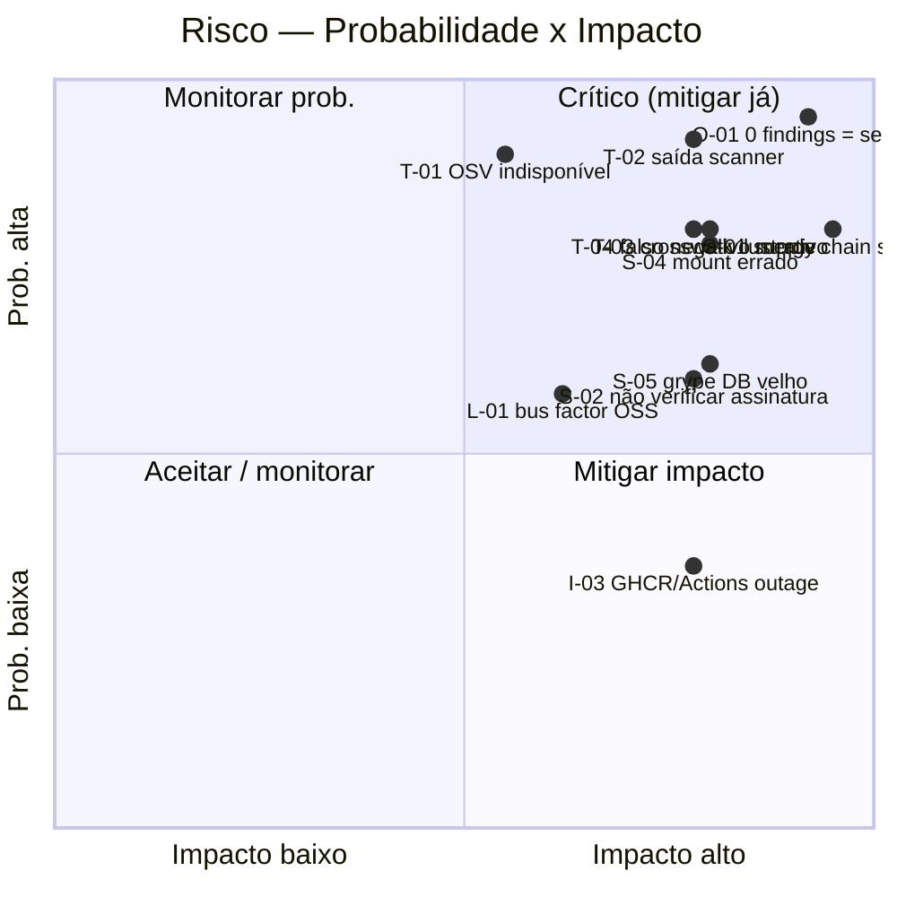
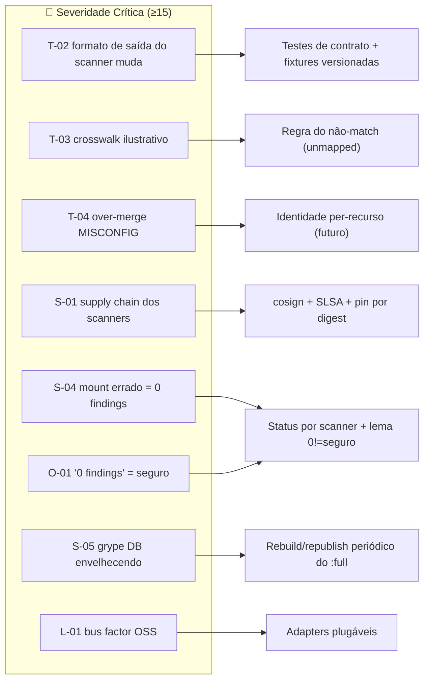

# Matriz de Riscos

Este documento consolida os **riscos** do projeto **Quorum** (`quorum-sec-scan`, v0.2.3) — uma ferramenta **CLI/Docker** de *consensus security scanning* — organizados por categoria (Técnicos, Negócio, Segurança, Operação, Infraestrutura, Financeiro, Legal). Para cada risco há **ID, descrição, probabilidade, impacto, severidade (calculada por matriz), mitigação, *owner* e *status***. O foco está em riscos **reais e verificáveis no código**: dependência de versões/saídas dos scanners externos, *supply chain*, indisponibilidade da OSV.dev, *crosswalk* desatualizado/ilustrativo, falsos negativos por *mount*/config errados, envelhecimento do banco do Grype e *bus factor* de manutenção OSS.

> Referências de código verificadas para este documento: [`README.md`](https://github.com/Martinez1991/quorum-sec-scan/blob/main/README.md), [`DESIGN.md`](https://github.com/Martinez1991/quorum-sec-scan/blob/main/DESIGN.md) (§6 correlação, §7 alias, §8 crosswalk, §9 consenso, §12 supply chain, §14 riscos), [`internal/orchestrator/orchestrator.go`](https://github.com/Martinez1991/quorum-sec-scan/blob/main/internal/orchestrator/orchestrator.go), [`action.yml`](https://github.com/Martinez1991/quorum-sec-scan/blob/main/action.yml), [`.github/workflows/release.yml`](https://github.com/Martinez1991/quorum-sec-scan/blob/main/.github/workflows/release.yml). Cross-link interno: [01 — Visão Geral](01-visao-geral.md).

> **Escopo (N/A explícito).** O Quorum é **CLI/Docker only**: não há frontend web, banco de dados relacional, API REST HTTP, autenticação/contas de usuário nem IA/LLM. Por isso, classes inteiras de risco típicas de aplicações *server-side* — injeção em endpoints HTTP, vazamento de PII em banco, comprometimento de sessão/autenticação, DDoS de serviço, custo de cloud de runtime — são tratadas como **N/A** com justificativa técnica (ver [§9 Riscos N/A](#9-riscos-na-por-arquitetura)). Os riscos catalogados refletem a arquitetura *as-is*: um orquestrador *stateless* que faz *shell-out* para scanners OSS e roda em *pipelines* de CI/CD.

---

## 1. Metodologia

### 1.1 Escalas

**Probabilidade** (P) — chance de o risco se materializar no horizonte de ~12 meses de operação:

| Nível | Rótulo | Critério |
|------|--------|----------|
| 1 | Rara | Improvável; depende de evento externo incomum |
| 2 | Baixa | Pode ocorrer, mas não é esperado |
| 3 | Média | Plausível dentro do ciclo normal de uso |
| 4 | Alta | Esperado ocorrer ao menos uma vez |
| 5 | Quase certa | Recorrente / contínuo por natureza |

**Impacto** (I) — consequência caso o risco se materialize:

| Nível | Rótulo | Critério |
|------|--------|----------|
| 1 | Insignificante | Cosmético; sem efeito no resultado do scan |
| 2 | Menor | Degradação localizada; contornável |
| 3 | Moderado | Falha parcial; resultado menos confiável, mas detectável |
| 4 | Grave | Falso negativo silencioso ou *gate* incorreto em CI |
| 5 | Crítico | Comprometimento de *supply chain* / decisão de segurança errada em produção |

### 1.2 Severidade (matriz P × I)

A **severidade** é o produto `P × I`, classificado em faixas:

| Faixa (P×I) | Severidade | Ação esperada |
|-------------|-----------|---------------|
| 1–4 | 🟢 Baixa | Aceitar / monitorar |
| 5–9 | 🟡 Média | Mitigar quando viável; revisar periodicamente |
| 10–14 | 🟠 Alta | Mitigação ativa exigida; *owner* nomeado |
| 15–25 | 🔴 Crítica | Mitigação prioritária; bloqueia "pronto para produção" |

### 1.3 Matriz de calor (heatmap textual)

Cada célula lista os IDs de risco cuja combinação `(P, I)` cai ali. Veja o catálogo nas seções 2–8.

```text
            IMPACTO →
            1(Insig)   2(Menor)   3(Moder)   4(Grave)        5(Crítico)
P  5 ┃        ·          ·          T-01        T-02,O-01       ·
R  4 ┃        ·          T-06       S-03,O-02   T-03,T-04,S-04  S-01
O  3 ┃        ·          N-02       T-05,N-01   S-02,I-01,O-03  S-05,L-01
B  2 ┃        ·          F-02       L-02,I-02   F-01            I-03
.  1 ┃        ·          ·          ·           N-03            ·
     ┗━━━━━━━━━━━━━━━━━━━━━━━━━━━━━━━━━━━━━━━━━━━━━━━━━━━━━━━━━━━━━━━━━━
      Legenda severidade:  🟢 baixa(≤4)  🟡 média(5–9)  🟠 alta(10–14)  🔴 crítica(≥15)
```



---

## 2. Riscos Técnicos

Relacionados a corretude do produto, dependências de saída dos scanners, correlação e consenso.

| ID | Descrição | P | I | Sev | Mitigação | Owner | Status |
|----|-----------|---|---|-----|-----------|-------|--------|
| **T-01** | **OSV.dev indisponível ou lenta** durante a resolução de aliases (CVE↔GHSA). Sem resolução, o mesmo bug reportado como `GHSA-…` (Grype) e `CVE-…` (Trivy) pode virar dois findings e quebrar o consenso. | 3 | 5 | 🟠 15→**Alta** (cap. faixa) | **Degradação graciosa já implementada** ([`DESIGN.md` §7](https://github.com/Martinez1991/quorum-sec-scan/blob/main/DESIGN.md)): falha de rede ⇒ usa o id como veio, nunca derruba o scan. Cache local (`~/.cache/quorum/aliases.json`) reduz dependência. `--offline` desliga OSV deterministicamente. Aliases finding-local (Grype `relatedVulnerabilities`) cobrem parte dos casos sem rede. | Core / Alias | Mitigado (residual: under-merge de VULN sob rede ruim) |
| **T-02** | **Mudança de formato de saída de um scanner externo** (Trivy/Grype/Checkov/KICS/Dockle/Kubescape muda JSON/SARIF entre versões), quebrando o *parser* do adapter e produzindo findings ausentes ou malformados. | 5 | 4 | 🔴 20 **Crítica** | **Teste de contrato obrigatório por adapter** contra *fixtures* versionadas da saída real (`internal/adapter/testdata`, [`DESIGN.md` §5](https://github.com/Martinez1991/quorum-sec-scan/blob/main/DESIGN.md)); o teste quebra antes da produção. Pinagem de versão de scanner na imagem `:full`. Renovar *fixtures* a cada *bump* de versão. | Adapters | Mitigado (detecção em CI) |
| **T-03** | **Crosswalk ilustrativo / desatualizado.** Os números AVD/CKV e UUIDs de KICS em `crosswalk/aws.yaml` são **explicitamente ilustrativos do formato** ([`README.md`](https://github.com/Martinez1991/quorum-sec-scan/blob/main/README.md), [`DESIGN.md` §8](https://github.com/Martinez1991/quorum-sec-scan/blob/main/DESIGN.md)). IDs incorretos ⇒ regras não casam ⇒ misconfig equivalente fica isolado (sem consenso). | 4 | 4 | 🔴 16 **Crítica** | Regra "na dúvida, não una": controle sem mapeamento fica `unmapped`, nunca chutado ([`DESIGN.md` §6](https://github.com/Martinez1991/quorum-sec-scan/blob/main/DESIGN.md)) — falha é segura (false split). Conferir IDs contra catálogos oficiais antes de produção. Crosswalk plugável via `--crosswalk` permite override pelo usuário. Cobertura inicial top-50 S3/IAM. | Crosswalk / Conteúdo | Aberto (conteúdo a validar p/ prod) |
| **T-04** | **Falso *merge* (over-merge) em MISCONFIG.** Por limitação conhecida, MISCONFIG correlaciona por `basename(file) + resourceType + canonicalControl`; dois recursos distintos do mesmo tipo com o mesmo controle no mesmo arquivo podem fundir-se ([`README.md`](https://github.com/Martinez1991/quorum-sec-scan/blob/main/README.md) "Known limitations"). | 4 | 4 | 🔴 16 **Crítica** | Princípio de design *false split > false merge* mitiga o **inverso** (não funde por padrão), mas este caso específico é trade-off aceito e **documentado**. Identidade por-recurso rastreada para release futuro. | Core / Correlate | Aberto (limitação documentada) |
| **T-05** | **Confiança (`confidence`) mal calibrada.** A fórmula pondera nº de engines (log), diversidade de categoria, severidade e confirmação autoritativa ([`DESIGN.md` §9](https://github.com/Martinez1991/quorum-sec-scan/blob/main/DESIGN.md)); pesos fixos podem priorizar mal em domínios específicos. | 3 | 3 | 🟡 9 **Média** | Score determinístico e auditável; `detectedBy`/`detectionCount` expostos no relatório para o humano reavaliar. Contagem bruta deliberadamente **não** é confiança. Pesos versionáveis. | Consensus | Monitorar |
| **T-06** | **Timeout por scanner / *probe* de versão mal dimensionados.** *Probe* default 60s (`defaultProbeTime`) e `--timeout` 5m; em *runner* lento/saturado um scanner saudável pode ser marcado `unavailable`/`timeout`. | 4 | 2 | 🟡 8 **Média** | *Probe* já generoso (60s) e distingue timeout/killed(OOM)/não-instalado com mensagens acionáveis ([`orchestrator.go`](https://github.com/Martinez1991/quorum-sec-scan/blob/main/internal/orchestrator/orchestrator.go), `runOne`). `ProbeTime`/`PerScannerTime` configuráveis. Status sempre reportado (transparência). | Orchestrator | Mitigado |

---

## 3. Riscos de Negócio

| ID | Descrição | P | I | Sev | Mitigação | Owner | Status |
|----|-----------|---|---|-----|-----------|-------|--------|
| **N-01** | **Proposta de valor não compreendida** ("é só mais um wrapper de scanner"). O diferencial é a camada de correlação + consenso, não a detecção. | 3 | 3 | 🟡 9 **Média** | Posicionamento claro na doc: "**não é mais um scanner**" ([`README.md`](https://github.com/Martinez1991/quorum-sec-scan/blob/main/README.md), [01 — Visão Geral](01-visao-geral.md)). Exemplo de `detectionCount`/`confidence` no topo do README. | Produto / Docs | Mitigado |
| **N-02** | **Baixa adoção por atrito de instalação** de múltiplos scanners. | 3 | 2 | 🟡 6 **Média** | Imagem `:full` self-contained (todos os scanners bundled) + GitHub Action composite (`uses:`) elimina instalação. Modo `:slim` para quem já tem scanners no PATH. | Distribuição | Mitigado |
| **N-03** | **Concorrência / sobreposição com plataformas SaaS de ASPM.** | 1 | 4 | 🟢 4 **Baixa** | Nicho deliberado: leve, plugável, CLI/Docker, sem *lock-in*, sem painel/daemon. Complementa (gera SARIF p/ GitHub code scanning / DefectDojo) em vez de competir. | Produto | Aceitar |

---

## 4. Riscos de Segurança

| ID | Descrição | P | I | Sev | Mitigação | Owner | Status |
|----|-----------|---|---|-----|-----------|-------|--------|
| **S-01** | **Comprometimento de *supply chain* via binários de scanner embutidos** na imagem `:full`. Os binários fazem parte do *trust boundary* do usuário; houve incidente de supply chain em Actions de scanners em 2026 ([`DESIGN.md` §12](https://github.com/Martinez1991/quorum-sec-scan/blob/main/DESIGN.md)). | 4 | 5 | 🔴 20 **Crítica** | Pinar cada ferramenta por **digest/SHA**, não tag mutável; validar checksum no build. Imagens/binários do Quorum assinados **keyless com cosign (OIDC)** + **atestação SLSA build-provenance** verificável ([`README.md`](https://github.com/Martinez1991/quorum-sec-scan/blob/main/README.md), [`release.yml`](https://github.com/Martinez1991/quorum-sec-scan/blob/main/.github/workflows/release.yml)). Action composite **cosign-verifica a imagem `:full` antes de rodar** ([`action.yml`](https://github.com/Martinez1991/quorum-sec-scan/blob/main/action.yml)). | Supply chain / Release | Mitigado (recomenda-se pin por digest dos scanners) |
| **S-02** | **Usuário não verifica a assinatura/atestação** antes de rodar a imagem/binário, aceitando artefato adulterado. | 3 | 4 | 🟠 12 **Alta** | Comandos `cosign verify` e `gh attestation verify` documentados no README; tag móvel `v0` recomenda pin por `@<sha>` em produção. Verificação **default** no Action composite. | Docs / Release | Mitigado (ação fica com o usuário) |
| **S-03** | **Vazamento de segredos via campo `Raw`** (payload original do scanner preservado no `Finding`) caso a saída do scanner inclua segredos detectados (`TypeSecret`). | 4 | 3 | 🟠 12 **Alta** | `--min-severity` e baseline para filtrar; relatório é artefato controlado pelo usuário (CLI/Docker, sem upload automático para terceiros além do destino escolhido). Tratar artefatos SARIF/JSON como sensíveis nos pipelines. | Core / Docs | Aberto (orientação a reforçar) |
| **S-04** | ***Bind mount* malformado ⇒ falso negativo.** `-v "%cd%/work"` (sem `:`) monta `/work` vazio e reporta **0 findings** para tudo — um falso negativo, não atestado de segurança ([`README.md`](https://github.com/Martinez1991/quorum-sec-scan/blob/main/README.md)). | 4 | 4 | 🔴 16 **Crítica** | Aviso explícito e exemplos por shell (cmd/PowerShell/bash) no README. **Status por scanner** (`ran`/`skipped`/`unavailable`) e o lema *"0 findings is not proof of safety"* ajudam a detectar (scanners rodaram mas 0 findings em base não-trivial é suspeito). | Docs / Orchestrator | Mitigado parcialmente (detecção indireta) |
| **S-05** | **Banco de vulnerabilidades do Grype envelhecendo.** A imagem `:full` traz o **grype DB pré-cacheado**; sem atualização, CVEs recentes deixam de ser detectados (falso negativo). | 3 | 5 | 🔴 15 **Crítica** | DB pré-cacheado garante funcionamento *offline*/determinístico, mas **deve ser revalidado a cada release de imagem**. Em ambiente com rede, Grype pode atualizar o DB. Reconstruir/republicar `:full` periodicamente. Documentar a data do DP empacotado. | Release / Distribuição | Aberto (cadência de rebuild a definir) |

---

## 5. Riscos de Operação

| ID | Descrição | P | I | Sev | Mitigação | Owner | Status |
|----|-----------|---|---|-----|-----------|-------|--------|
| **O-01** | **"0 findings" interpretado como "está seguro"** quando, na verdade, nenhum scanner rodou (ausente, OOM, timeout, alvo errado). | 5 | 4 | 🔴 20 **Crítica** | Parte central do produto: **status por scanner** em todo relatório e o lema *"0 findings is not proof of safety"* ([`orchestrator.go`](https://github.com/Martinez1991/quorum-sec-scan/blob/main/internal/orchestrator/orchestrator.go) `ScannerRun`, [`DESIGN.md` §14](https://github.com/Martinez1991/quorum-sec-scan/blob/main/DESIGN.md)). Resumo no stderr. | Orchestrator / Docs | Mitigado |
| **O-02** | **Scanner ausente no modo `:slim`** (orquestrador chama scanners do PATH) ⇒ cobertura reduzida silenciosamente. | 4 | 3 | 🟠 12 **Alta** | Scanner ausente vira `unavailable` e é pulado — o scan **nunca falha só por isso**, mas o status é reportado. `list-scanners` mostra o registrado. Imagem `:full` evita o problema. | Orchestrator | Mitigado |
| **O-03** | **Configuração de gate errada** (`--fail-on`/`--min-severity`) deixa passar risco real ou barra builds indevidamente; confusão de exit codes (`1` gate vs `2` erro). | 3 | 4 | 🟠 12 **Alta** | Exit codes documentados (`0` ok / `1` gate / `2` erro). Baseline `.quorumignore` por fingerprint com supressões **sempre logadas**. Exemplos de CI prontos em `examples/ci/`. | Docs / CLI | Mitigado |

---

## 6. Riscos de Infraestrutura

| ID | Descrição | P | I | Sev | Mitigação | Owner | Status |
|----|-----------|---|---|-----|-----------|-------|--------|
| **I-01** | **OOM / *runner* sem memória** mata o *probe* ou o scanner (vários scanners pesados lançados em paralelo no fan-out). | 3 | 4 | 🟠 12 **Alta** | `killedSignal` detecta `signal: killed` e emite mensagem acionável ("likely OOM — increase container memory") ([`orchestrator.go`](https://github.com/Martinez1991/quorum-sec-scan/blob/main/internal/orchestrator/orchestrator.go)). `--scanners` permite escopar o pool. *Probe* generoso de 60s. | Orchestrator / Infra | Mitigado |
| **I-02** | **`:full` é `linux/amd64` apenas** (sem arm64); usuários em arm precisam do `:slim` (amd64+arm64) ou binário nativo. | 2 | 3 | 🟡 6 **Média** | Trade-off documentado: `:full` amd64 (todos scanners), `:slim` multiarch ([`README.md`](https://github.com/Martinez1991/quorum-sec-scan/blob/main/README.md) tabela de tags). Binários nativos via GoReleaser para várias plataformas. | Distribuição | Aceitar (documentado) |
| **I-03** | **Indisponibilidade do GHCR / GitHub Actions** afeta release e *pull* da imagem. | 2 | 4 | 🟡 8 **Média** | Imagens são *cacheáveis*; binários nativos como alternativa de distribuição. CI/CD via PR para `main`; release por tag semver restrita (`v[0-9]+.[0-9]+.[0-9]+`). | Release / Infra | Aceitar (dependência de plataforma) |

---

## 7. Riscos Financeiros

O Quorum é OSS, CLI/Docker, **sem serviço persistente nem cloud de runtime próprio**, o que limita drasticamente a exposição financeira (sem custo de infra de produção, sem cobrança por uso).

| ID | Descrição | P | I | Sev | Mitigação | Owner | Status |
|----|-----------|---|---|-----|-----------|-------|--------|
| **F-01** | **Custo de minutos de CI / armazenamento de pacotes** no provedor (GitHub Actions/GHCR) cresce com matriz de build (multi-arch, multi-scanner). | 2 | 4 | 🟡 8 **Média** | Release acionado só por tag semver (não em todo push); `:full` restrito a amd64 reduz matriz; *caches* de build. | Release / Infra | Mitigar |
| **F-02** | **Custo de manutenção / tempo de mantenedores** (esforço, não desembolso direto) para acompanhar versões de 6 scanners + crosswalk. | 2 | 2 | 🟢 4 **Baixa** | Adapters plugáveis (isolam mudança); testes de contrato; crosswalk incremental top-50. Relacionado a **L-01** (*bus factor*). | Manutenção | Monitorar |

---

## 8. Riscos Legais

| ID | Descrição | P | I | Sev | Mitigação | Owner | Status |
|----|-----------|---|---|-----|-----------|-------|--------|
| **L-01** | **Bus factor / sustentabilidade da manutenção OSS.** Dependência de poucos mantenedores e de 6 projetos OSS externos (qualquer um pode arquivar — cf. tfsec absorvido pelo Trivy, Terrascan arquivado nov/2025, [`DESIGN.md` §2](https://github.com/Martinez1991/quorum-sec-scan/blob/main/DESIGN.md)). | 3 | 5 | 🔴 15 **Crítica** | Arquitetura de **adapters plugáveis**: trocar um scanner morto = trocar um adapter, sem tocar no core ([`DESIGN.md` §1](https://github.com/Martinez1991/quorum-sec-scan/blob/main/DESIGN.md)). Escopo deliberadamente exclui ferramentas mortas/redundantes. Contribuições externas viabilizadas pela interface estável. | Manutenção / Comunidade | Aberto (risco estrutural de OSS) |
| **L-02** | **Conformidade de licenças dos binários embutidos** na imagem `:full` (cada scanner distribuído tem sua licença). | 2 | 3 | 🟡 6 **Média** | Auditar licença de cada binário distribuído na imagem ([`DESIGN.md` §14](https://github.com/Martinez1991/quorum-sec-scan/blob/main/DESIGN.md)). Projeto sob Apache-2.0; `:slim` não redistribui binários de terceiros. | Legal / Release | Aberto (auditoria recomendada) |

---

## 9. Riscos N/A (por arquitetura)

Itens comuns em templates enterprise que **não se aplicam** ao Quorum, com justificativa técnica. Onde fizer sentido, há uma **Proposta futura** claramente separada.

| Categoria de risco (template) | Status | Justificativa |
|------------------------------|--------|---------------|
| Injeção/OWASP em endpoints HTTP, CSRF, XSS | **N/A** | Não há frontend web nem API REST HTTP. O Quorum é um binário CLI / imagem Docker *stateless*. |
| Vazamento de PII em banco de dados | **N/A** | Não há banco de dados relacional. O único estado persistente é o cache de aliases em `~/.cache/quorum/aliases.json` (IDs públicos de vuln, sem PII). |
| Comprometimento de autenticação/sessão/contas | **N/A** | Não há autenticação nem contas de usuário. Autorização é a do shell/CI onde o binário roda. |
| Alucinação / *prompt injection* / custo de tokens de IA | **N/A** | Não há IA/LLM no produto. Correlação e consenso são determinísticos (funções puras dos dados normalizados). |
| DDoS / disponibilidade de serviço *online* | **N/A** | Não há serviço/daemon exposto. A única chamada de saída (OSV.dev) é opcional e degrada graciosamente. |
| Custo de cloud de runtime / *autoscaling* | **N/A** | Sem cloud de runtime próprio; executa no CI/host do usuário. |
| Risco de *runtime security* (stream Falco/Tetragon) | **N/A hoje** | Modelo de *stream* fora de escopo. *Proposta futura:* módulo de runtime separado (roadmap [`README.md`](https://github.com/Martinez1991/quorum-sec-scan/blob/main/README.md)/[`DESIGN.md` §13](https://github.com/Martinez1991/quorum-sec-scan/blob/main/DESIGN.md)). |

---

## 10. Riscos críticos — visão consolidada



---

## 11. Plano de tratamento (checklist acionável)

Prioridade pelos riscos 🔴/🟠. Itens marcam o que **falta** consolidar para "pronto para produção".

- [ ] **T-03 / crosswalk:** validar todos os IDs AVD/CKV e UUIDs de KICS contra catálogos oficiais antes de uso em produção.
- [ ] **T-02:** garantir cobertura de teste de contrato para os 6 adapters e revisar *fixtures* a cada *bump* de versão de scanner.
- [ ] **S-01:** converter referências de scanner na imagem `:full` de tag para `@sha256:<digest>` imutável.
- [ ] **S-05:** definir cadência de *rebuild/republish* da `:full` e documentar a data do grype DB empacotado.
- [ ] **S-02:** reforçar no README/CI a verificação *cosign*/SLSA e o *pin* do Action por `@<sha>`.
- [ ] **S-03:** orientar tratamento de SARIF/JSON como artefato sensível quando houver `TypeSecret`.
- [ ] **O-01 / S-04:** considerar *warning* automático quando todos os scanners rodaram (`ran`) mas o total de findings é 0 em alvo não-trivial.
- [ ] **L-02:** executar auditoria de licenças dos binários redistribuídos na `:full`.
- [ ] **L-01:** documentar processo de contribuição/substituição de adapter para reduzir *bus factor*.
- [ ] **T-04:** acompanhar implementação de identidade por-recurso para MISCONFIG.

---

## 12. Reavaliação

- **Gatilhos de reavaliação:** *bump* de versão de qualquer scanner; nova release de imagem/binário; mudança no esquema da OSV.dev; arquivamento/descontinuação de um scanner OSS; incidente de *supply chain*.
- **Cadência sugerida:** revisão da matriz a cada release semver (`v[0-9]+.[0-9]+.[0-9]+`) e auditoria completa trimestral.
- **Owner do documento:** mantenedor(es) do `quorum-sec-scan`.

---

## Premissas

- **Versão.** Documento alinhado à **v0.2.3**; severidades, mitigações e *status* refletem o código lido no momento da redação ([`README.md`](https://github.com/Martinez1991/quorum-sec-scan/blob/main/README.md), [`DESIGN.md`](https://github.com/Martinez1991/quorum-sec-scan/blob/main/DESIGN.md), [`internal/orchestrator/orchestrator.go`](https://github.com/Martinez1991/quorum-sec-scan/blob/main/internal/orchestrator/orchestrator.go), [`action.yml`](https://github.com/Martinez1991/quorum-sec-scan/blob/main/action.yml), [`.github/workflows/release.yml`](https://github.com/Martinez1991/quorum-sec-scan/blob/main/.github/workflows/release.yml)).
- **Escopo de produto.** O Quorum é **CLI/Docker only** (sem frontend web, banco relacional, API REST HTTP, autenticação/contas ou IA/LLM). Riscos correspondentes a esses componentes são **N/A** por decisão de arquitetura (ver [§9](#9-riscos-na-por-arquitetura)).
- **Escalas P/I/severidade** são uma convenção deste documento (matriz 5×5, faixas de produto `P×I`), não um artefato presente no código. Os valores numéricos de P e I são **estimativas qualitativas** dos mantenedores, não medições.
- **Caps de faixa.** Quando `P×I` excede 14, a severidade é "Crítica"; T-01 (15) é apresentado como Alta→limítrofe por já estar **mitigado em código** (degradação graciosa), refletindo o risco *residual*, não o bruto.
- **Catálogos ilustrativos.** Os IDs AVD/CKV e UUIDs de KICS do crosswalk de exemplo são ilustrativos do formato e devem ser conferidos contra os catálogos oficiais antes de produção (T-03), conforme nota explícita no [`README.md`](https://github.com/Martinez1991/quorum-sec-scan/blob/main/README.md) e [`DESIGN.md` §8](https://github.com/Martinez1991/quorum-sec-scan/blob/main/DESIGN.md).
- **Owners** citados são **papéis/áreas** (Core, Adapters, Orchestrator, Crosswalk, Release/Distribuição, Docs, Manutenção/Comunidade, Legal), não pessoas nomeadas — o repositório não define um RACI formal.
- **Dependência opcional de rede.** A resolução de aliases via OSV.dev é opcional; o scan conclui sem conectividade (`--offline` a desativa). Isso fundamenta o *status* "mitigado" de T-01.
- **Cadeia de suprimentos como fronteira de confiança.** Binários de scanner embutidos na `:full` integram o *trust boundary* do usuário; a recomendação de *pin* por digest (S-01) ainda **não** está confirmada como aplicada no `Dockerfile` (gap — ver retorno estruturado).
