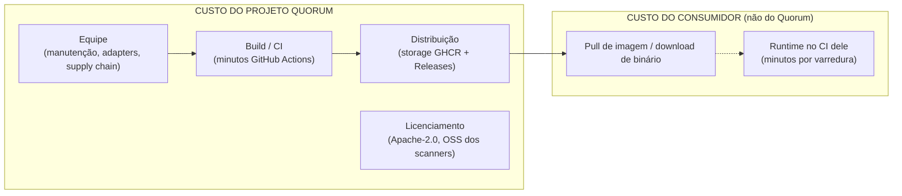
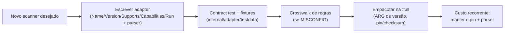
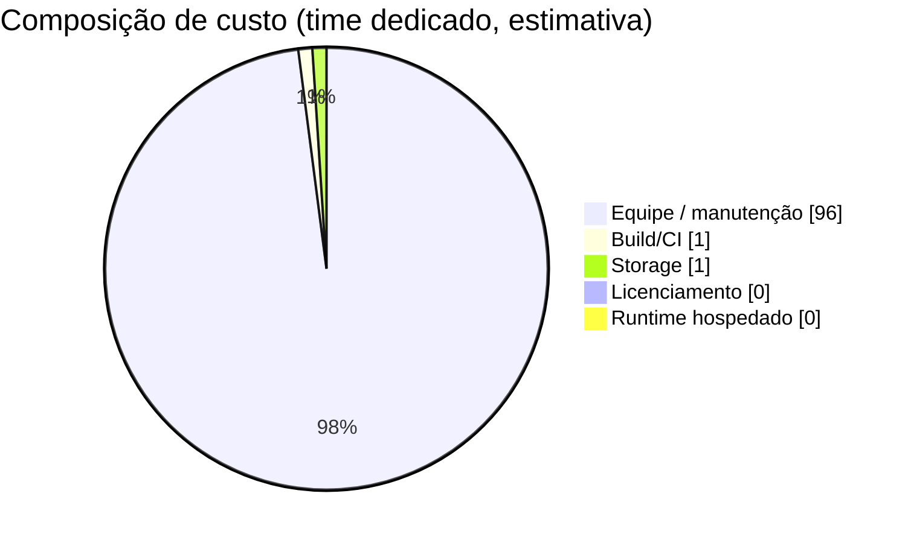

# Custos

> Documento de referência de **custos** do **Quorum** (`quorum-sec-scan`), v0.2.3.
> Escrito em pt-BR, padrão enterprise. Todos os valores monetários neste documento são
> **estimativas** baseadas em premissas explícitas (ver [Premissas](#premissas)), não em
> faturas reais. Verifique sempre o preço vigente do provedor.

O Quorum é uma ferramenta **CLI/Docker** de _consensus security scanning_. A consequência mais
importante para custos é arquitetural: **o Quorum não opera infraestrutura de runtime própria**.
Ele roda **no CI ou na estação do consumidor** e encerra o processo ao final da varredura. Logo,
o custo de _operar_ o produto é majoritariamente **transferido ao consumidor** (minutos do CI
dele), e o custo do **projeto Quorum** se concentra em **build, distribuição (supply chain) e
manutenção** — não em cloud de runtime.

Este documento estima os custos sob **dois cenários** — _mantenedor solo OSS_ e _time
dedicado_ — cobrindo: infra de build/distribuição (minutos de GitHub Actions, storage GHCR),
monitoramento (N/A hoje), licenciamento (OSS do Quorum e dos scanners), equipe, operação/
manutenção e escalabilidade. Componentes clássicos de custo de runtime (cloud, banco, APM) são
declarados **N/A** com justificativa, em consonância com
[10-infraestrutura.md](10-infraestrutura.md) e [14-observabilidade.md](14-observabilidade.md).

---

## 1. Modelo mental de custos

| Eixo de custo | Quem paga | Natureza | Magnitude relativa |
|---|---|---|---|
| **Build / CI** | Projeto Quorum | Variável (por push/PR/release) | Baixa–média |
| **Distribuição (storage)** | Projeto Quorum | Recorrente (armazenamento) | Baixa |
| **Equipe / manutenção** | Projeto Quorum | Recorrente (tempo humano) | **Dominante** |
| **Licenciamento** | — | **US$ 0** (tudo OSS permissivo) | Zero monetário |
| **Monitoramento de runtime** | — | **N/A** (sem serviço hospedado) | Zero |
| **Runtime da varredura** | **Consumidor** | Variável (CI dele) | Fora do escopo do projeto |

> Conclusão antecipada: o maior custo do Quorum **não é dinheiro de infra, é tempo de
> engenharia** (manutenção dos adapters, supply chain e acompanhamento de versões de scanner).

---

## 2. Custo de runtime próprio — N/A

O projeto **não provisiona** nenhum recurso de operação contínua. Cada item abaixo é **US$ 0
para o projeto** porque não existe.

| Componente | Status | Justificativa técnica |
|---|---|---|
| Compute de cloud (VM/serverless) | **N/A — US$ 0** | Sem serviço hospedado; binário/imagem roda no ambiente do consumidor. |
| Kubernetes de runtime | **N/A — US$ 0** | Quorum é processo CLI de vida curta; ele _escaneia_ K8s, não _roda_ em K8s como produto. |
| Banco de dados relacional | **N/A — US$ 0** | Correlação/consenso em memória; único estado é cache local de aliases (`~/.cache/quorum/aliases.json`). |
| API REST / gateway / LB / CDN / WAF | **N/A — US$ 0** | Sem superfície HTTP exposta. |
| APM / métricas / tracing hospedados | **N/A — US$ 0** | Sem serviço de longa duração; diagnóstico via `stderr` e status por scanner. |
| Chave de assinatura (HSM/KMS) | **N/A — US$ 0** | cosign **keyless** (OIDC do GitHub); nada para armazenar/rotacionar. |
| IA / LLM (API paga) | **N/A — US$ 0** | Não há IA no produto (ver [13-ia.md](13-ia.md)). |

> O custo de OSV.dev também é **US$ 0**: é um serviço público consultado sem credencial, com
> degradação graciosa e desligável via `--offline`.

---

## 3. Infra de build/distribuição (custo real do projeto)

A "infra" do Quorum é **GitHub Actions** (build efêmero) + **GHCR/GitHub Releases**
(distribuição). Em repositório **público OSS**, o GitHub oferece **Actions e armazenamento de
pacotes/artefatos gratuitos** dentro das políticas vigentes — portanto, no cenário OSS, o custo
monetário direto tende a **US$ 0**. As estimativas abaixo modelam o caso **privado/excedente**
(quando o repo é privado ou se ultrapassa cotas), para dar uma faixa de referência.

### 3.1 Minutos de GitHub Actions

Workflows reais do repositório:

| Workflow | Gatilho | Jobs / passos | Duração estimada* |
|---|---|---|---|
| [`ci.yml`](../.github/workflows/ci.yml) | push em `main`, PRs | `go vet`, `go test -race`, build, smoke | ~3–6 min |
| [`e2e.yml`](../.github/workflows/e2e.yml) | push/PR, dispatch | instala trivy+grype+checkov, `grype db update`, scans de consenso (IaC + SCA) | ~6–12 min |
| [`release.yml`](../.github/workflows/release.yml) | tag semver `vX.Y.Z`, dispatch | matrix `full`/`slim` (Buildx+QEMU, cosign, SLSA) + GoReleaser (binários) | ~15–30 min |

\* Estimativas de ordem de grandeza em runner `ubuntu-latest`. O `e2e.yml` e o `release.yml`
são mais caros porque baixam scanners, atualizam o grype DB e fazem build multi-arch com QEMU
(emulação arm64 é notoriamente lenta na `:slim`).

**Modelo de consumo mensal (estimativa, runner Linux):**

| Atividade | Eventos/mês (est.) | Min/evento (est.) | Min/mês (est.) |
|---|---:|---:|---:|
| CI em PRs/pushes | 60 | 5 | 300 |
| E2E (consenso) | 40 | 9 | 360 |
| Release (tags semver) | 2 | 25 | 50 |
| **Total** | — | — | **~710 min/mês** |

**Custo dos minutos (apenas se privado/excedente):**

| Cenário | Minutos/mês | Preço unit. Linux (est.) | Custo USD/mês (est.) | Custo BRL/mês (est.) |
|---|---:|---:|---:|---:|
| **OSS (repo público)** | ~710 | **US$ 0** (cota gratuita) | **US$ 0** | **R$ 0** |
| Privado, dentro da cota incluída | ~710 | coberto pelo plano | ~US$ 0 | ~R$ 0 |
| Privado, excedente (overage) | ~710 | ~US$ 0,008/min | ~US$ 5,7 | ~R$ 31 |
| Privado, time ativo (3× volume) | ~2.130 | ~US$ 0,008/min | ~US$ 17 | ~R$ 94 |

> Câmbio assumido: **US$ 1 ≈ R$ 5,50** (ver Premissas). Preço por minuto Linux ~US$ 0,008 é o
> preço de _overage_ típico do GitHub Actions; runners maiores/macOS/Windows custam múltiplos
> disso — o Quorum usa **apenas `ubuntu-latest`**, o mais barato.

**Alavancas de redução de custo de CI:**

- [x] Usar **somente `ubuntu-latest`** (já é o caso).
- [x] **Cache** do build Docker (`cache-from/cache-to: type=gha`) já configurado no `release.yml`.
- [x] **Cache** de módulos Go (`actions/setup-go ... cache: true`) já no `ci.yml`/`e2e.yml`.
- [x] grype DB **pré-cacheado** na imagem `:full` evita `db update` em runtime do consumidor.
- [ ] Restringir `e2e.yml` em PRs de docs-only via `paths-ignore` (gap — ver §9).
- [ ] Evitar build arm64 por QEMU quando possível (lento/caro) — considerar runner arm nativo.

### 3.2 Armazenamento (GHCR + Releases)

| Artefato | Onde | Tamanho est.* | Observação |
|---|---|---:|---|
| Imagem `:slim` (amd64+arm64) | GHCR | ~30–60 MB/arch | Só o binário + ca-certificates + crosswalks |
| Imagem `:full` (amd64) | GHCR | **~1–2 GB** | Todos os scanners + grype DB pré-cacheado |
| Binários nativos (6 alvos) | GitHub Releases | ~10–20 MB cada | linux/darwin/windows × amd64/arm64 |
| Assinaturas/atestações | GHCR/Releases | KB | cosign `.sig`/`.pem`, SLSA, SBOM |

\* Estimativas qualitativas derivadas do conteúdo dos Dockerfiles; **não medidas** no repo.

A `:full` domina o storage. Cada release acrescenta uma nova tag versionada; sem política de
retenção, o histórico cresce linearmente.

| Cenário | Storage acumulado est. (12 meses) | Custo USD/mês (est.) | Custo BRL/mês (est.) |
|---|---:|---:|---:|
| **OSS (repo público)** | dezenas de GB | **US$ 0** (incluído) | **R$ 0** |
| Privado, sem GC de tags antigas | ~30–50 GB | ~US$ 5–15 | ~R$ 27–82 |
| Privado, com GC (manter N últimas) | ~5–10 GB | ~US$ 1–3 | ~R$ 5–17 |

**Alavancas:**

- [ ] Política de **retenção/limpeza de versões antigas** no GHCR (gap — ver §9).
- [x] Pin por `@sha256` recomendado ao consumidor reduz dependência de muitas tags móveis.
- [ ] Considerar publicar `:full` **apenas** em releases (não em cada commit) — já é o caso.

---

## 4. Monitoramento / observabilidade — N/A (hoje)

Não há **custo de monitoramento de runtime** porque não há runtime hospedado a monitorar (ver
[14-observabilidade.md](14-observabilidade.md)). A "observabilidade" do produto é:

| Item | Custo | Natureza |
|---|---|---|
| Logs em `stderr` + status por scanner (`ran/skipped/unavailable/error/timeout`) | **US$ 0** | Embutido; consumido pelo CI do usuário |
| Relatório SARIF/JSON/XML como artefato | **US$ 0** | Gerado localmente |
| APM/Datadog/Grafana/Prometheus hospedados | **N/A** | Sem serviço de longa duração |

### Proposta futura (NÃO implementada)

Caso surja o **módulo runtime separado** mencionado em DESIGN §13 (Falco/Tetragon/OpenSCAP como
_produto à parte_), aí sim haveria custo de observabilidade contínua (coleta de stream, storage
de eventos, dashboards). **Fora do escopo do Quorum v0.2.x.**

---

## 5. Licenciamento

### 5.1 Licença do Quorum

| Item | Valor |
|---|---|
| Licença do projeto | **Apache License 2.0** (ver [`LICENSE`](../LICENSE)) |
| Custo de uso/redistribuição | **US$ 0** — permissiva, royalty-free, com grant de patentes |
| Obrigações | Manter avisos de copyright/licença; declarar modificações; (se houver) incluir `NOTICE` |

A Apache-2.0 **não impõe copyleft** sobre quem usa/integra o Quorum, e concede licença de
patente explícita (cláusula 3). Custo monetário de licenciamento do Quorum: **zero**.

### 5.2 Licenças dos scanners empacotados

O Quorum orquestra scanners OSS de terceiros. Cada um tem **sua própria licença**; o Quorum os
**invoca como processos externos** (via `os/exec`, ver [`internal/adapter/adapter.go`](../internal/adapter/adapter.go)) e
os **empacota** na imagem `:full`. As licenças abaixo são **estimativas baseadas no
conhecimento público de cada projeto** e **devem ser confirmadas** no upstream antes de
qualquer redistribuição comercial (ver gaps).

| Scanner | Projeto/origem | Licença típica (estimativa) | Custo | Distribuído na `:full`? |
|---|---|---|---|---|
| **Trivy** | Aqua Security | Apache-2.0 | US$ 0 | Sim (imagem pinada por `@sha256`) |
| **Grype** | Anchore | Apache-2.0 | US$ 0 | Sim (instalador oficial) |
| **Syft** (suporte ao Grype) | Anchore | Apache-2.0 | US$ 0 | Sim |
| **Checkov** | Prisma Cloud / Bridgecrew | Apache-2.0 | US$ 0 | Sim (`pip install`) |
| **KICS** | Checkmarx | Apache-2.0 | US$ 0 | Sim (imagem pinada por `@sha256`) |
| **Dockle** | Goodwith (comunidade) | Apache-2.0 (confirmar) | US$ 0 | Sim (tarball + checksum) |
| **Kubescape** | ARMO / CNCF | Apache-2.0 | US$ 0 | Sim |

> Pontos de atenção de licenciamento (não monetários, mas de conformidade):
> - **Bases de dados de vulnerabilidade** (ex.: grype DB, feeds) podem ter **termos próprios**
>   distintos do código do scanner. A `:full` congela o grype DB no build — confirmar os termos
>   de redistribuição do DB. _Gap conhecido._
> - **Marcas/trademarks**: Apache-2.0 (cláusula 6) não concede direito sobre nomes/marcas dos
>   scanners. Empacotá-los não autoriza uso da marca para promover o Quorum.
> - Redistribuir binários de terceiros na imagem pode exigir **incluir os avisos de
>   licença/NOTICE** de cada scanner. _Gap conhecido (ver §9)._

Custo **monetário** total de licenciamento (Quorum + scanners): **US$ 0**. O custo aqui é de
**conformidade/atribuição**, não financeiro.

---

## 6. Equipe (perfis e faixas)

O custo dominante do projeto é **tempo humano**. As faixas salariais abaixo são **estimativas
de mercado** (USD anual fully-loaded e o equivalente BRL aproximado) e variam enormemente por
geografia e senioridade — tratar como **ordem de grandeza**, não cotação.

| Perfil | Responsabilidade no Quorum | Faixa USD/ano (est.) | Faixa BRL/mês (est.) |
|---|---|---|---|
| **Eng. Go / Plataforma (sênior)** | Core (orchestrator, correlate, consensus, model), novos adapters | US$ 120k–200k | R$ 18k–40k |
| **Eng. Segurança / AppSec** | Crosswalk (AVD/CIS), severidade, validação de consenso, threat model | US$ 110k–180k | R$ 16k–35k |
| **Eng. DevOps / Supply chain** | CI/CD, cosign/SLSA, GHCR, GoReleaser, hardening de imagem | US$ 110k–180k | R$ 16k–35k |
| **Tech writer / DevRel** (parcial) | Docs (este conjunto), README, exemplos, adoção | US$ 80k–130k | R$ 10k–22k |
| **Maintainer/PM** (parcial) | Triagem de issues/PR, releases, roadmap | US$ 100k–160k | R$ 14k–28k |

> Conversões BRL são aproximadas e assumem _fully-loaded_ ÷ 12 a câmbio R$ 5,50; encargos e
> impostos brasileiros (CLT/PJ) **não** estão modelados em detalhe.

### 6.1 Composição por cenário

| Cenário | Composição típica | FTE total (est.) | Custo anual USD (est.) | Custo mensal BRL (est.) |
|---|---|---:|---:|---:|
| **Mantenedor solo OSS** | 1 pessoa cobrindo todos os papéis, **tempo parcial/voluntário** | 0,1–0,3 FTE | US$ 0 (voluntário) a ~US$ 50k | R$ 0 a ~R$ 23k |
| **Time enxuto** | 1 Go sênior + 1 AppSec/DevOps híbrido + writer parcial | ~2,3 FTE | ~US$ 350k–500k | ~R$ 160k–230k |
| **Time dedicado** | 2 Go + 1 AppSec + 1 DevOps + writer + maintainer parcial | ~4,5–5 FTE | ~US$ 650k–950k | ~R$ 300k–435k |

> No cenário **solo OSS**, o custo financeiro real costuma ser **próximo de zero** (trabalho
> voluntário + cotas gratuitas do GitHub para OSS). O custo verdadeiro é **risco de bus factor**
> e velocidade limitada de manutenção.

---

## 7. Operação e manutenção (recorrente)

Mesmo sem runtime hospedado, há **manutenção contínua** — e é onde mora o custo real do projeto.

| Atividade recorrente | Frequência (est.) | Esforço (est.) | Por quê |
|---|---|---|---|
| **Bump de versões de scanner** (`Dockerfile.full` ARGs) | mensal/trimestral | 0,5–2 dias | Scanners lançam rápido; pins ficam obsoletos |
| **Rebuild da imagem `:full`** (grype DB congelado) | por release / quando DB envelhece | automatizado + revisão | DB congela no build; sem rebuild, fica velho |
| **Acompanhar mudanças de output dos scanners** | a cada major do scanner | 1–5 dias | Parsers/adapters quebram se o JSON muda |
| **Manutenção dos contract tests** (fixtures em `internal/adapter/testdata`) | junto com bumps | horas | Garantir parsing fiel ao modelo canônico |
| **Crosswalk** (regra→controle AVD/CIS) | conforme novas regras | horas–dias | Mapear novas regras de scanner |
| **Triagem de issues/PR + release** | contínua | variável | Saúde do projeto OSS |
| **Hardening de supply chain** (pins por digest, base image) | trimestral | horas | Fechar gaps de §6.2 da infra |
| **Renovação de dependências Go** (Dependabot/manual) | mensal | horas | Segurança/atualidade |

**Custo de manutenção monetizado (estimativa, sobre o tempo de equipe):**

| Cenário | Esforço de manutenção/mês (est.) | Custo mensal USD (est.) | Custo mensal BRL (est.) |
|---|---:|---:|---:|
| **Solo OSS** | 2–6 dias (voluntário) | US$ 0 (ou custo de oportunidade) | R$ 0 |
| **Time enxuto** | ~0,5 FTE alocado | ~US$ 7k–12k | ~R$ 38k–66k |
| **Time dedicado** | ~1 FTE alocado | ~US$ 14k–20k | ~R$ 77k–110k |

> Custo de infra recorrente (Actions + storage) é **marginal** perto do custo de tempo: mesmo
> no pior caso privado estimado (§3), some ~US$ 20–30/mês — uma fração de um único dia de
> engenharia.

---

## 8. Custo de escalabilidade

A escalabilidade do Quorum tem **dois vetores de custo distintos**, e é importante não
confundi-los.

### 8.1 Escalar o **produto** (mais adapters, mais cobertura)

Adicionar um scanner = adicionar um `Adapter` (ver `internal/adapter/`); **nada no core muda**.
O custo é **linear e previsível**, dominado por engenharia, não por infra.

| Item de custo ao adicionar 1 adapter | Esforço único (est.) | Custo recorrente |
|---|---|---|
| Implementar adapter + parser | 2–5 dias-eng | — |
| Contract test + fixtures | 0,5–1 dia-eng | manutenção a cada major do scanner |
| Crosswalk (se misconfig) | 0,5–2 dias-eng | atualizar conforme novas regras |
| Empacotar na `:full` (ARG/pin/checksum) | horas | +tamanho da imagem; +tempo de build; +bump recorrente |
| Aumento do tempo de varredura do consumidor | — | scanners rodam em paralelo (goroutines), mas competem por CPU/RAM/IO |

> Cada novo scanner empacotado **aumenta o tamanho da `:full`** (mais storage, mais tempo de
> pull pelo consumidor) e **adiciona uma dívida de manutenção recorrente** (mais um pin, mais um
> parser para acompanhar). Esse é o custo de longo prazo mais subestimado.

### 8.2 Escalar o **build/CI** (mais commits, mais releases)

| Driver de crescimento | Efeito no custo | Mitigação |
|---|---|---|
| Mais PRs/commits | mais minutos de CI/E2E | `paths-ignore`, cache (já em uso) |
| Mais releases | mais builds `:full` (lentos) + mais tags no GHCR | retenção/GC; release menos frequente |
| Build arm64 via QEMU | minutos caros (emulação) | runner arm nativo (futuro) |
| Mais scanners na `:full` | build mais longo + imagem maior | manter `:slim` como caminho BYO-scanners |

### 8.3 Escalar a **adoção** (mais consumidores)

| Driver | Quem paga | Custo p/ o projeto |
|---|---|---|
| Mais `docker pull` / downloads | Borda do GHCR/GitHub | ~US$ 0 (egress coberto pelo GitHub) |
| Mais execuções de varredura | **Consumidor** (CI dele) | **US$ 0 para o Quorum** |
| Mais issues/suporte | Equipe | tempo (ver §7) |

> Propriedade-chave do modelo CLI: **a adoção escala sem custo de runtime para o projeto**. Mais
> usuários não aumentam a conta de cloud do Quorum (não há cloud); aumentam apenas a carga de
> **suporte/manutenção** (tempo humano).

---

## 9. Resumo executivo de custos

| Categoria | Solo OSS (est.) | Time enxuto (est.) | Time dedicado (est.) |
|---|---|---|---|
| Build/CI (Actions) | US$ 0 (público) | ~US$ 0–17/mês | ~US$ 17–50/mês |
| Storage (GHCR/Releases) | US$ 0 (público) | ~US$ 0–15/mês | ~US$ 5–15/mês |
| Monitoramento runtime | N/A (US$ 0) | N/A | N/A |
| Licenciamento (Quorum + scanners) | US$ 0 | US$ 0 | US$ 0 |
| Equipe + manutenção | US$ 0 (voluntário) | ~US$ 350k–500k/ano | ~US$ 650k–950k/ano |
| **Custo total dominante** | **tempo voluntário** | **folha de pagamento** | **folha de pagamento** |

> Mensagem central: **>95% do custo é equipe/tempo**. Infra de build/distribuição é marginal;
> licenciamento e runtime hospedado são **zero**. Otimizar custo = otimizar **eficiência de
> manutenção** (automatizar bumps, manter contract tests verdes, reduzir dívida de adapters).

### Checklist de governança de custos

- [ ] Definir política de **retenção/GC** de tags no GHCR (controla storage).
- [ ] Adicionar `paths-ignore` para PRs docs-only no `e2e.yml`/`ci.yml` (corta minutos).
- [ ] Automatizar **bump de versões de scanner** (ex.: Dependabot/Renovate p/ ARGs do Dockerfile).
- [ ] Confirmar e **documentar as licenças/NOTICE** de cada scanner empacotado na `:full`.
- [ ] Confirmar **termos de redistribuição do grype DB** congelado na `:full`.
- [ ] Avaliar runner **arm nativo** para evitar QEMU lento no build `:slim`.
- [ ] Acompanhar consumo de minutos do Actions mensalmente (alertar antes de overage, se privado).

---

## Premissas

- **Câmbio**: US$ 1 ≈ **R$ 5,50**. Valores em BRL são conversões aproximadas; não consideram
  encargos/impostos brasileiros (CLT/PJ) em detalhe.
- **Repositório público OSS**: assume-se que o `quorum-sec-scan` é público, logo GitHub Actions
  e armazenamento de pacotes/artefatos caem em **cotas gratuitas** — daí os cenários "US$ 0".
  As faixas pagas modelam o caso **privado/excedente** apenas como referência.
- **Preço de minuto do Actions (Linux)**: ~US$ 0,008/min (overage típico). O Quorum usa
  **apenas `ubuntu-latest`** (mais barato); macOS/Windows/runners grandes não são usados.
- **Volume de eventos de CI** (PRs, E2E, releases por mês) e **durações de workflow** são
  **estimativas de ordem de grandeza**, não medições — derivadas dos workflows reais
  (`ci.yml`, `e2e.yml`, `release.yml`).
- **Tamanhos de imagem/artefato** não estão medidos no repositório; são qualitativos, inferidos
  do conteúdo dos Dockerfiles (`:full` empacota todos os scanners + grype DB; `:slim`, só o
  binário). Ver [10-infraestrutura.md](10-infraestrutura.md) §3.
- **Faixas salariais** são estimativas de mercado fully-loaded e variam fortemente por
  geografia/senioridade; tratar como ordem de grandeza.
- **Licenças dos scanners** foram declaradas como _estimativas_ (Apache-2.0 na maioria) e
  **devem ser confirmadas no upstream** antes de redistribuição comercial. A licença **do
  Quorum** é confirmada como **Apache-2.0** via [`LICENSE`](../LICENSE).
- **Sem runtime hospedado**: o produto roda no CI/estação do consumidor; custos de operação de
  varredura são do **consumidor**, fora do escopo do orçamento do projeto.
