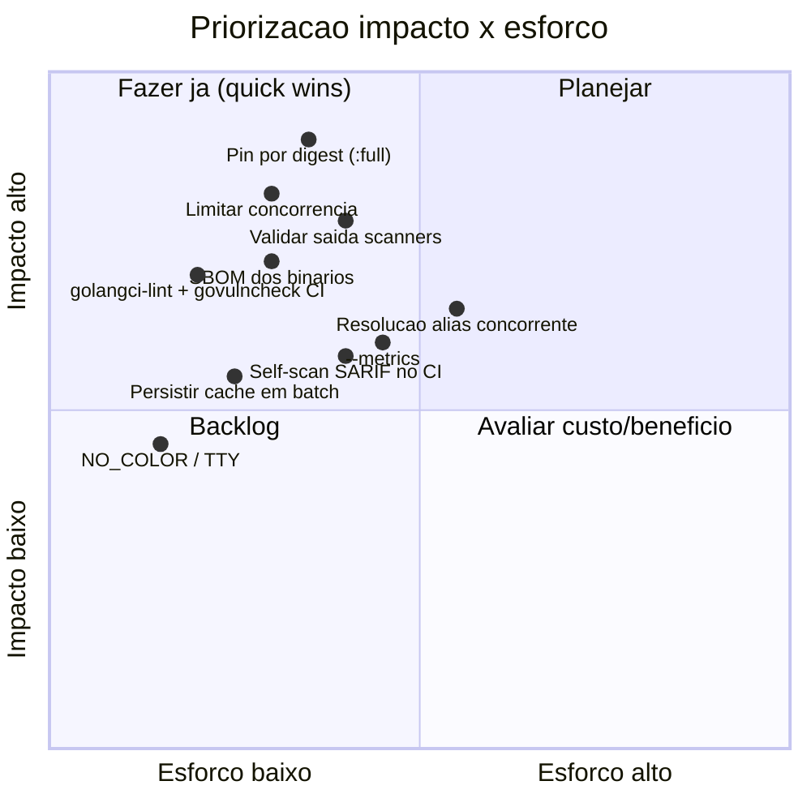

# Melhorias e Recomendações

Este documento reúne sugestões de evolução do **Quorum** (`quorum-sec-scan`, v0.2.3),
priorizadas por eixo (Arquitetura, Segurança, UX, Performance, Custos, Escalabilidade,
Qualidade, DevOps e Automação). Todas as recomendações estão **ancoradas no código real**
do repositório (arquivos e funções citados explicitamente), seguindo o princípio do produto
de que *"false split > false merge"* e *"0 findings is not proof of safety"*. Cada item traz
**problema → recomendação → esforço → impacto**, e o documento termina com uma tabela
priorizada por impacto × esforço, um roadmap sugerido e uma seção de premissas.

> Escopo: Quorum é uma ferramenta **CLI/Docker** de *consensus security scanning*. Itens que
> tocariam em frontend web, banco relacional, API REST de runtime ou IA/LLM são marcados como
> **N/A** com justificativa, e qualquer ideia nessa direção aparece como **Proposta futura**
> claramente separada. Veja [DESIGN.md](https://github.com/Martinez1991/quorum-sec-scan/blob/main/DESIGN.md) e o [README](https://github.com/Martinez1991/quorum-sec-scan/blob/main/README.md).

---

## 1. Como ler este documento

Cada recomendação usa esta convenção:

- **Esforço:** `P` (pequeno, ≤ 1 dia), `M` (médio, 2–5 dias), `G` (grande, > 1 semana).
- **Impacto:** `Alto`, `Médio`, `Baixo` — efeito sobre confiabilidade, segurança da cadeia,
  experiência de CI ou custo operacional.
- **Âncora no código:** arquivo/função onde a mudança incide.

---

## 2. Arquitetura

### A1. Limitar a concorrência de scanners pesados (fan-out sem teto)

- **Problema.** O orquestrador faz fan-out **ilimitado**: um goroutine por adapter, todos
  disparados de uma vez (`internal/orchestrator/orchestrator.go`, função `Run`, laço
  `for _, a := range adapters { go func() {...} }`). Com os seis scanners do `:full`
  (Trivy, Grype, Checkov-Python, KICS, Dockle, Kubescape) rodando simultaneamente em um
  runner com pouca memória, o resultado é justamente o cenário que o probe de 60s tenta
  diagnosticar: processos mortos por OOM (`killedSignal`, "version probe killed — likely out
  of memory"). O comentário de `defaultProbeTime` já reconhece "while every scanner launches
  at once on a memory-constrained runner".
- **Recomendação.** Introduzir `Options.MaxConcurrency` (default = `runtime.NumCPU()`,
  configurável via flag `--max-concurrency` ou env `QUORUM_MAX_CONCURRENCY`) e usar um
  semáforo com buffer (`chan struct{}`) ou `golang.org/x/sync/errgroup` com `SetLimit`.
  Tratar mitigação de OOM como controle de admissão, não só como diagnóstico pós-morte.
- **Esforço:** P–M. **Impacto:** Alto (estabilidade do `:full` em runners pequenos — o caso
  de uso primário de CI).

### A2. Validar a saída de cada scanner antes de parsear (contrato em runtime)

- **Problema.** `runCmd` (`internal/adapter/adapter.go`) trata "exit != 0 mas com stdout" como
  sucesso (convenção *findings-found*). Isso é correto, mas significa que um scanner que emite
  **stdout truncado/corrompido** (ex.: morto no meio do dump JSON) chega ao parser. Cada parser
  faz `json.Unmarshal` e, em caso de erro, **falha o adapter inteiro** retornando `error`
  (ex.: `trivy.parse`). Pior: um JSON sintaticamente válido mas **vazio** (`{}`) produz
  *0 findings* com status `ran` — indistinguível de "scanner rodou e não achou nada".
- **Recomendação.** Adicionar uma camada de validação leve por adapter: (a) checar que a saída
  decodifica para a estrutura esperada e que campos-âncora existem (ex.: `Results` presente no
  Trivy); (b) quando o exit foi != 0 **e** o JSON não tem o shape esperado, marcar o run como
  `error` com mensagem clara em vez de `ran/0 findings`. Reaproveitar as fixtures de contrato
  (`internal/adapter/testdata`) como *golden* dessa validação.
- **Esforço:** M. **Impacto:** Alto (evita falso negativo silencioso — o anti-objetivo
  declarado do produto, DESIGN §14).

### A3. Tornar o pipeline de enriquecimento *streamável* e observável

- **Problema.** `Correlator.Enrich` (`internal/correlate/correlate.go`) percorre **todos** os
  findings em um único laço sequencial e, para `VULN`, chama `Alias.Canonical` um id por vez,
  cada um podendo bater na rede (OSV). O resultado é acoplado: resolução de alias, crosswalk e
  keying acontecem juntos, sem ponto de instrumentação.
- **Recomendação.** Separar "resolução de alias" (I/O-bound, paralelizável — ver P3) de
  "crosswalk + keying" (CPU puro, determinístico). Expor contadores (resolvidos por cache vs
  OSV vs local) para `--metrics` (ver U3).
- **Esforço:** M. **Impacto:** Médio.

### A4. Perfis de imagem (`:sca`, `:iac`, `:k8s`)

- **Problema.** Hoje há `:full` (todos os scanners, amd64) e `:slim` (orquestrador). O `:full`
  embute Python+Checkov, KICS+assets, Grype DB pré-cacheado etc., resultando em imagem grande
  (já antecipado em DESIGN §12 "evitar a imagem-monstro"). Muitos pipelines só fazem SCA.
- **Recomendação.** Adicionar variantes por perfil no `release.yml` (matriz) que embutem apenas
  o subconjunto de binários necessário, reaproveitando o mesmo `Dockerfile.full` parametrizado
  por estágio. Cada perfil mapeia para o conjunto de adapters daquele tipo.
- **Esforço:** M. **Impacto:** Médio (custo de pull/armazenamento em CI; ver Custos).

---

## 3. Segurança (da própria cadeia)

### S1. Pinar TODAS as ferramentas do `:full` por digest imutável

- **Problema.** O `Dockerfile.full` pina **apenas Trivy e KICS por `@sha256:`**. Grype, Syft,
  Dockle, Kubescape e Checkov são instalados por **versão mutável** via `curl | sh`,
  installers e `pip install "checkov==..."`. O próprio cabeçalho do Dockerfile admite: *"the
  version tags below are PINNED VERSIONS for readability. Before shipping to production, replace
  each mutable tag with an immutable @sha256:<digest>"*. Um installer comprometido entra no seu
  *trust boundary* (DESIGN §12 cita incidente de supply chain em 2026).
- **Recomendação.**
  - [ ] Substituir `curl | sh` por download de artefato versionado + verificação de **checksum**
        contra um valor fixado no Dockerfile (Dockle já faz isso — replicar para Grype/Syft/Kubescape).
  - [ ] Para Checkov, fixar `checkov==<ver>` **com hashes** (`pip install --require-hashes` +
        `requirements.txt` gerado por `pip-compile --generate-hashes`).
  - [ ] Documentar o procedimento de re-resolução de digests (já há a dica
        `docker buildx imagetools inspect`).
- **Esforço:** M. **Impacto:** Alto (integridade da cadeia distribuída aos usuários).

### S2. Cosign-verificar os binários de scanner no build (não só confiar no installer)

- **Problema.** Anchore (Grype/Syft) e Kubescape publicam assinaturas cosign próprias; o build
  atual confia apenas no installer (Grype/Syft) ou baixa o binário cru (Kubescape, com fallback
  para `install.sh`). A verificação de assinatura upstream não é feita.
- **Recomendação.** No estágio de runtime do `Dockerfile.full`, após baixar cada binário,
  rodar `cosign verify-blob`/`cosign verify` com a identidade OIDC do projeto upstream, falhando
  o build se a verificação falhar. Complementa S1 (checksum garante integridade; cosign garante
  proveniência).
- **Esforço:** M. **Impacto:** Médio–Alto.

### S3. Estender SLSA/atestação aos artefatos do GoReleaser

- **Problema.** O `release.yml` gera atestação SLSA para a imagem (`subject-digest`) e para os
  binários (`subject-checksums: dist/checksums.txt`), e a imagem tem `sbom: true` no
  `build-push-action`. Porém os **binários nativos do GoReleaser não publicam SBOM** (só a
  imagem). Há cobertura, mas assimétrica entre os dois canais de distribuição.
- **Recomendação.** Adicionar geração de SBOM (Syft/CycloneDX) aos artefatos do GoReleaser
  (`sboms:` no `.goreleaser.yaml`) e anexá-los ao release, fechando a paridade com a imagem.
- **Esforço:** P–M. **Impacto:** Médio. (Ver também Q4 / DevOps.)

### S4. Endurecer a imagem em runtime (usuário não-root, capabilities, FS read-only)

- **Problema.** O `Dockerfile.full` termina como `root` (não há `USER`), com `docker-cli`
  instalado (para scan de imagem). Rodar como root amplia o raio de impacto se um scanner
  embutido tiver RCE ao processar entrada hostil.
- **Recomendação.** Criar usuário não-root e `USER quorum`; documentar execução com
  `--read-only`, `--cap-drop ALL`, e o mínimo de bind-mounts. Quando o socket do Docker for
  necessário para `--type image`, documentar o trade-off explicitamente.
- **Esforço:** M. **Impacto:** Médio.

### S5. Self-scan do próprio Quorum no CI

- **Problema.** O CI (`ci.yml`) roda `go vet`, `go test -race`, build e smoke — mas **não roda
  scanner de vulnerabilidade sobre o próprio repositório/imagem**. "A ferramenta de segurança
  que não se escaneia" é um mau sinal.
- **Recomendação.** Adicionar passo que roda Trivy/govulncheck contra o repo e a imagem, e faz
  upload do SARIF para o GitHub code scanning — usando o próprio Quorum como dogfooding.
- **Esforço:** P. **Impacto:** Médio. (Ver Q2 e Automação.)

---

## 4. UX (experiência de CI/linha de comando)

### U1. Respeitar `NO_COLOR` e detecção de TTY na saída de progresso

- **Problema.** A saída de progresso (`logf` em `scan.go`, prefixo `[quorum] `) e o
  `printSummary` usam texto puro hoje — **não há cor**, então não há quebra imediata. Mas o
  produto vive em CI, onde logs misturam stderr de múltiplos scanners. Qualquer enriquecimento
  visual futuro (cores, símbolos) precisa de uma política. Além disso, `printSummary` desenha
  *box-drawing* Unicode (`──`, `┄`) que pode sair ilegível em terminais legados/Windows não-UTF.
- **Recomendação.** Centralizar a saída humana atrás de um pequeno helper que: (a) honra
  `NO_COLOR` (convenção https://no-color.org) e `--no-color`; (b) detecta se stderr é TTY
  (`golang.org/x/term.IsTerminal`); (c) cai para ASCII puro quando não-TTY ou `NO_COLOR`.
  Adotar isso **antes** de introduzir cores, para nunca quebrar o item.
- **Esforço:** P. **Impacto:** Médio (legibilidade de logs em CI e Windows).

### U2. Saída legível por humano além de SARIF/JSON/XML (`--format table`)

- **Problema.** Os formatos são `sarif|json|xml` (`report.ParseFormat`); o único resumo humano
  é o `printSummary` em stderr (contagem por severidade + status por scanner). Para uso
  interativo/local, não há uma tabela de findings legível em stdout.
- **Recomendação.** Adicionar `--format table` (e talvez `markdown`) que lista os
  `MergedFinding` com `severity`, `detectedBy`, `detectionCount`, `confidence` e localização —
  ótimo para PR comments e execução local.
- **Esforço:** M. **Impacto:** Médio.

### U3. Mensagens de erro acionáveis em mais pontos do fluxo

- **Problema.** O orquestrador já tem mensagens excelentes para o probe (OOM, slow start). Mas
  outros pontos são secos: `crosswalk.Load` falho retorna `"loading crosswalk: %w"`;
  `LoadBaseline` retorna o erro cru. O usuário de CI raramente sabe **o que fazer** a seguir.
- **Recomendação.** Padronizar erros de runtime/uso (exit 2) com a tríade *o que falhou → por
  que → como corrigir*, no mesmo estilo do probe. Ex.: baseline ausente já sugere o caminho
  esperado; crosswalk vazio deveria avisar "0 regras carregadas — misconfigs ficarão `unmapped`".
- **Esforço:** P. **Impacto:** Médio.

### U4. Aviso explícito quando nenhum scanner rodou

- **Problema.** `printSummary` já imprime *"0 findings is not proof of safety"*, o que é ótimo.
  Mas se **todos** os scanners ficaram `unavailable/skipped/timeout`, o relatório sai com 0
  findings e exit 0 — o exato cenário do bind-mount malformado descrito no README (scan de
  `/work` vazio).
- **Recomendação.** Quando `count(status==ran) == 0`, emitir um aviso destacado e considerar uma
  flag opt-in `--require-scanners` (ou `--fail-if-no-scanner`) que retorna exit 2 nesse caso —
  transformando o silêncio perigoso em falha explícita, sem mudar o comportamento default.
- **Esforço:** P. **Impacto:** Alto (corrige a classe de falso negativo mais perigosa).

---

## 5. Performance

### P1. Persistir o cache de alias em lote (evitar reescrever o arquivo inteiro por chave)

- **Problema.** `cache.Store.Put` (`internal/cache/store.go`) **serializa e regrava o JSON
  inteiro a cada chamada** (snapshot completo → `MarshalIndent` → write-temp → rename). Em um
  scan de imagem grande com centenas de CVEs novos, isso é O(n²) em I/O: cada novo alias reescreve
  todos os anteriores. Em CI com cache em disco lento, custa.
- **Recomendação.** Adicionar um modo *batched*: acumular `Put` em memória e fazer **um único
  flush** ao final do scan (ex.: `Store.Flush()` chamado em `runScan` após `Enrich`), mantendo
  o flush-por-Put apenas como fallback. Preserva a robustez (cache nunca quebra o scan) e a
  atomicidade do rename.
- **Esforço:** P. **Impacto:** Médio.

### P2. Reaproveitar versão já obtida no probe (evitar `Version()` duas vezes)

- **Problema.** No fluxo de execução, `runOne` chama `a.Version(verCtx)` no probe; em seguida
  o adapter, dentro de `Run`, **chama `Version` de novo** (ex.: `trivy.Run` faz
  `ver, _ := t.Version(ctx)` para carimbar `ScannerVersion`). São dois `exec` do binário por
  scan.
- **Recomendação.** Passar a versão já resolvida para `Run` (ex.: incluir no `Target` ou em um
  `RunContext`), ou cachear a versão por adapter dentro de uma execução. Pequena economia por
  scanner, multiplicada por seis no `:full`.
- **Esforço:** P. **Impacto:** Baixo–Médio.

### P3. Resolver aliases de VULN concorrentemente (com pool limitado)

- **Problema.** `Enrich` resolve aliases **um id por vez** e cada um pode bater no OSV
  (`OSVClient.Aliases`, timeout 8s + 2 retries com backoff). Centenas de CVEs únicos não
  cacheados = centenas de round-trips sequenciais. Em modo `--offline` o ponto é nulo, mas
  online (default) é o maior gargalo do pipeline.
- **Recomendação.** Deduplicar ids antes da resolução (vários findings compartilham o mesmo
  CVE), resolver o conjunto único em paralelo com pool limitado (respeitando rate-limit do OSV),
  e então mapear de volta. Combinar com P1 (flush único).
- **Esforço:** M. **Impacto:** Médio–Alto (latência de scans online em CI).

### P4. Reutilizar a DB do Grype entre execuções

- **Problema.** O `:full` pré-cacheia a DB do Grype em `/opt/grype/db` com
  `GRYPE_DB_AUTO_UPDATE=false` — bom. Em uso `:slim`/binário nativo, porém, cada runner pode
  re-baixar a DB. Não há orientação no doc para montar/persistir esse cache.
- **Recomendação.** Documentar (e talvez expor via flag/env) o reuso de `GRYPE_DB_CACHE_DIR`
  montado como cache de CI; idem para o cache de DB do Trivy.
- **Esforço:** P (doc). **Impacto:** Médio (latência de cold start).

---

## 6. Custos

### C1. Reduzir tamanho do `:full` (multi-stage agressivo / perfis)

- **Problema.** O `:full` carrega Python+pip+venv (Checkov), git, docker-cli, tar/curl e a DB
  do Grype congelada. Isso pesa em egress do GHCR e tempo de pull a cada job de CI.
- **Recomendação.** (a) Remover ferramentas de build (`curl`, `tar`, headers de pip) do estágio
  final via multi-stage; (b) oferecer perfis (A4) para que pipelines SCA não puxem o stack
  Python; (c) avaliar `--no-cache-dir` já presente e limpeza de `*.pyc`.
- **Esforço:** M. **Impacto:** Médio (custo recorrente de CI).

### C2. Cache de camadas de build no release (já parcialmente feito)

- **Problema.** O `release.yml` já usa `cache-from/cache-to: type=gha`. Bom. O custo restante é
  o `grype db update` em todo build (rede + tempo).
- **Recomendação.** Avaliar cachear a DB do Grype como camada estável (versão fixada) para que
  rebuilds sem bump não re-baixem; documentar a cadência de refresh.
- **Esforço:** P. **Impacto:** Baixo–Médio.

---

## 7. Escalabilidade

### E1. Limite e priorização do fan-out por classe de scanner

- **Problema.** Mesmo com A1 (teto global), scanners têm perfis de recurso muito diferentes:
  Checkov (Python) é lento de iniciar e pesado de memória; Dockle é leve. Um teto único trata
  todos igual.
- **Recomendação.** Permitir *pesos* por adapter (via `Capabilities`/metadado) e um escalonador
  que não rode dois scanners "pesados" ao mesmo tempo em runners pequenos. Começar simples:
  classe `heavy|light` e teto separado para *heavy*.
- **Esforço:** M. **Impacto:** Médio.

### E2. Crosswalk como ativo escalável (validação + cobertura)

- **Problema.** `resolveControl` isola qualquer regra sem mapeamento como `Unmapped` — correto,
  mas a cobertura do crosswalk é dívida conhecida (DESIGN §14, README "Crosswalk coverage"). À
  medida que mais provedores/regras entram, manter consistência YAML manualmente não escala.
- **Recomendação.** (a) Validador de schema do crosswalk em CI (campos obrigatórios, IDs únicos,
  AVD bem-formados); (b) relatório de cobertura: % de regras de cada scanner com mapeamento,
  gerado a partir das fixtures reais; (c) métrica de `unmapped` exposta no relatório.
- **Esforço:** M. **Impacto:** Médio (qualidade do consenso de MISCONFIG/K8S).

### E3. Saída para alvos com volume alto de findings

- **Problema.** Hoje `report.Write` monta tudo em `bytes.Buffer` antes de gravar (`emit` em
  `scan.go`). Para imagens com milhares de vulns, isso mantém todo o relatório em memória.
- **Recomendação.** Streaming opcional do writer para o `io.Writer` de destino (JSON Lines /
  SARIF streaming) quando o volume justificar; manter buffer como default.
- **Esforço:** M. **Impacto:** Baixo (caso de cauda).

---

## 8. Qualidade

### Q1. Cobertura de erro nos parsers (fuzz + golden de saída malformada)

- **Problema.** Há contract tests por adapter contra fixtures reais
  (`internal/adapter/testdata`, `realdata_test.go`) — excelente base. Falta cobrir **entrada
  hostil/malformada** (JSON truncado, campos faltando, números fora de faixa).
- **Recomendação.** Adicionar `go test -fuzz` nos parsers e *golden tests* com fixtures
  deliberadamente quebradas, casados com a validação de A2.
- **Esforço:** M. **Impacto:** Médio.

### Q2. `golangci-lint` e `govulncheck` no CI

- **Problema.** O `ci.yml` roda `go vet` + `go test -race` + build + smoke. Não há linter
  abrangente nem checagem de vulnerabilidade das dependências Go.
- **Recomendação.**
  - [ ] Adicionar `golangci-lint` (errcheck, staticcheck, gocritic, gosec).
  - [ ] Adicionar `govulncheck ./...` como passo obrigatório.
  - [ ] Reportar cobertura (`go test -coverprofile`) como artefato/summary.
- **Esforço:** P. **Impacto:** Médio.

### Q3. Teste end-to-end determinístico do consenso (além do e2e.yml)

- **Problema.** Há `e2e.yml` (consensus). Vale garantir que a **matemática do consenso**
  (`confidence`, `detectionCount`, `aggregateSeverity`) tenha testes de tabela cobrindo os
  pesos de DESIGN §9 e os limites (clamp 0..1, log normalizado).
- **Recomendação.** Testes de unidade explícitos para `confidence(...)` com casos-âncora (3
  linters mesma linha vs SCA+IaC concordando) garantindo que o racional documentado não regrida.
- **Esforço:** P–M. **Impacto:** Médio.

### Q4. Documentar e versionar o esquema de saída (JSON/SARIF) como contrato

- **Problema.** O JSON é "dump direto de `[]MergedFinding`"; consumidores (DefectDojo, scripts)
  dependem desse shape. Não há versionamento explícito do esquema de saída além de
  `partialFingerprints["quorum/v1"]`.
- **Recomendação.** Publicar um JSON Schema do output e um teste que falha se o shape mudar sem
  bump de versão do esquema. Trata a saída como API pública (mesmo sem REST).
- **Esforço:** M. **Impacto:** Médio.

---

## 9. DevOps

### D1. Pin de actions de terceiros por SHA

- **Problema.** Os workflows usam tags móveis (`actions/checkout@v4`,
  `docker/build-push-action@v6`, `sigstore/cosign-installer@v3`, etc.). Tags de actions são
  mutáveis — mesmo risco de supply chain que o produto combate (DESIGN §12).
- **Recomendação.** Pinar cada `uses:` por `@<sha40>` e usar Dependabot/Renovate para bumps
  controlados. Coerente com o discurso de segurança da cadeia do próprio Quorum.
- **Esforço:** P. **Impacto:** Médio–Alto.

### D2. SBOM dos binários no release (paridade com a imagem)

- **Problema.** Ver S3: a imagem tem `sbom: true`; os binários do GoReleaser não.
- **Recomendação.** Habilitar `sboms:` no `.goreleaser.yaml` e anexar ao release. Item de
  release-readiness.
- **Esforço:** P. **Impacto:** Médio.

### D3. Verificação de reprodutibilidade / `make` targets completos

- **Problema.** O `Makefile` cobre `test/vet/build/docker-full`. Falta um alvo único de
  pré-release (lint + vuln + sbom local + smoke do `:full`) para reduzir surpresa no CI.
- **Recomendação.** Alvo `make ci` que reproduz localmente o que o pipeline faz, incluindo
  `cosign verify` da imagem recém-construída.
- **Esforço:** P. **Impacto:** Baixo–Médio.

### D4. Tag móvel `v0` do Action: automatizar e proteger

- **Problema.** O README orienta `uses: Martinez1991/quorum-sec-scan@v0` (pin por `@<sha>` em
  produção). O `release.yml` é restrito a semver e **não** atualiza a tag `v0`.
- **Recomendação.** Job dedicado (separado do release de imagens) que, após release semver
  bem-sucedido, move `v0` para o commit recém-lançado — com proteção para não disparar o build de
  release (a restrição de trigger já existe). Documentar a política de pin.
- **Esforço:** P. **Impacto:** Médio.

---

## 10. Automação

### AU1. `--metrics` (telemetria de execução em formato consumível)

- **Problema.** Métricas hoje só existem como texto humano em `printSummary` (stderr). Não há
  saída estruturada de métricas (durações por scanner — já capturadas em `ScannerRun.Duration` —,
  contagem por status, hits de cache vs OSV, `unmapped` count) para alimentar dashboards de CI.
- **Recomendação.** Adicionar `--metrics <arquivo>` que emite JSON (ou formato Prometheus
  textfile) com: por-scanner `{status, durationMs, findings, version}`; agregados
  `{merged, multiDetected, bySeverity}`; pipeline `{aliasCacheHits, osvLookups, unmapped}`. Os
  dados já existem em `Result`/`ScannerRun`; falta o reporter.
- **Esforço:** M. **Impacto:** Médio (observabilidade de CI sem inventar daemon).

### AU2. Geração de baseline assistida (`--write-baseline`)

- **Problema.** Adotar `--fail-on` exige um baseline (`.quorumignore`) montado à mão a partir
  dos fingerprints do relatório (README "Baseline"). Fricção de adoção.
- **Recomendação.** Flag `--write-baseline <arquivo>` que escreve os fingerprints atuais
  (com comentários: título, severidade, scanners) para o usuário triar — *snapshot* inicial de
  dívida aceita. Nunca suprime silenciosamente; apenas materializa o que já está no relatório.
- **Esforço:** P–M. **Impacto:** Médio (adoção do gate em CI).

### AU3. PR decoration / comentário automático

- **Problema.** O Action sobe SARIF (GitHub code scanning), mas não há um resumo legível no PR.
- **Recomendação.** Passo opcional no Action que posta um comentário com o resumo de consenso
  (reaproveitando `--format table/markdown` de U2). Mantém o produto CLI-only; a automação vive
  no Action.
- **Esforço:** M. **Impacto:** Médio.

### AU4. Atualização agendada da DB de vulnerabilidades / rebuild do `:full`

- **Problema.** A DB do Grype no `:full` é "frozen as of build time"; sem rebuild, fica velha.
- **Recomendação.** Workflow agendado (cron) que rebuilda e re-publica `:full` periodicamente
  (sem novo semver), atualizando apenas a DB; assinatura/atestação seguem o mesmo fluxo.
- **Esforço:** M. **Impacto:** Médio.

---

## 11. Itens marcados N/A (com justificativa)

| Tema do template | Status | Justificativa |
|---|---|---|
| Frontend web / SPA | **N/A** | Quorum é CLI/Docker only ("no panel, no daemon", README). Não há UI. |
| Banco de dados relacional | **N/A** | Persistência é apenas o cache JSON de aliases (`internal/cache`). Sem RDBMS por design (DESIGN §7 evita CGO/DB). |
| API REST HTTP de runtime | **N/A** | Integração é por exit code + SARIF/JSON/XML em CI. O único acesso de rede é OSV.dev (cliente HTTP de saída). |
| Autenticação / contas | **N/A** | Não há multiusuário nem sessão. Confiança vem de cosign/SLSA na distribuição. |
| IA / LLM | **N/A** | Consenso é determinístico (`correlationKey`, fórmula de `confidence`), não estatístico/ML. |
| Orquestração de runtime K8s (Falco/Tetragon) | **N/A (futuro separado)** | Modelo de *stream*, não scan estático — produto à parte (DESIGN §2, §13). |

> **Proposta futura (claramente separada):** se algum dia houver demanda por agregação
> centralizada de resultados entre muitos pipelines, o caminho coerente com o design seria um
> **consumidor externo** do SARIF/JSON (ex.: DefectDojo), **não** embutir banco/API no Quorum.
> O fingerprint portável (`quorum/v1`) já foi pensado para isso (DESIGN §11).

---

## 12. Tabela priorizada (impacto × esforço)

Ordenada por prioridade sugerida (quick wins de alto impacto primeiro).

| # | Eixo | Recomendação | Esforço | Impacto | Prioridade |
|---|------|--------------|:------:|:------:|:----------:|
| S1 | Segurança | Pinar todas as ferramentas do `:full` por digest/checksum | M | Alto | P0 |
| A1 | Arquitetura | Limitar concorrência de scanners (semáforo/errgroup) | P–M | Alto | P0 |
| U4 | UX | Aviso/flag quando nenhum scanner rodou (`--require-scanners`) | P | Alto | P0 |
| A2 | Arquitetura | Validar saída dos scanners antes de parsear | M | Alto | P0 |
| Q2 | Qualidade | `golangci-lint` + `govulncheck` no CI | P | Médio | P1 |
| D1 | DevOps | Pin de actions de terceiros por SHA | P | Médio–Alto | P1 |
| P1 | Performance | Cache de alias com flush em lote | P | Médio | P1 |
| U1 | UX | `NO_COLOR`/TTY antes de qualquer cor | P | Médio | P1 |
| S5 | Segurança | Self-scan (dogfooding) no CI | P | Médio | P1 |
| S3/D2 | Segurança/DevOps | SBOM dos binários no release | P–M | Médio | P1 |
| P3 | Performance | Resolução de alias concorrente + dedup | M | Médio–Alto | P1 |
| AU1 | Automação | `--metrics` (JSON/Prometheus textfile) | M | Médio | P2 |
| U2 | UX | `--format table/markdown` | M | Médio | P2 |
| U3 | UX | Mensagens de erro acionáveis (crosswalk vazio, baseline) | P | Médio | P2 |
| AU2 | Automação | `--write-baseline` | P–M | Médio | P2 |
| P2 | Performance | Reaproveitar versão do probe (não chamar `Version` 2x) | P | Baixo–Médio | P2 |
| S2 | Segurança | Cosign-verify dos binários upstream no build | M | Médio–Alto | P2 |
| S4 | Segurança | Imagem não-root + hardening de runtime | M | Médio | P2 |
| A4/C1 | Arquitetura/Custos | Perfis de imagem + redução de tamanho | M | Médio | P2 |
| E2 | Escalabilidade | Validador + cobertura do crosswalk em CI | M | Médio | P2 |
| Q1 | Qualidade | Fuzz/golden de saída malformada nos parsers | M | Médio | P2 |
| Q3 | Qualidade | Testes de tabela da fórmula de consenso | P–M | Médio | P2 |
| Q4 | Qualidade | JSON Schema versionado do output | M | Médio | P2 |
| AU4 | Automação | Rebuild agendado do `:full` (DB fresca) | M | Médio | P2 |
| D4 | DevOps | Automatizar tag móvel `v0` do Action | P | Médio | P2 |
| P4 | Performance | Reuso documentado da DB Grype/Trivy em CI | P | Médio | P3 |
| AU3 | Automação | PR decoration via Action | M | Médio | P3 |
| E1 | Escalabilidade | Pesos por classe de scanner (heavy/light) | M | Médio | P3 |
| A3 | Arquitetura | Separar/observabilizar enriquecimento | M | Médio | P3 |
| E3 | Escalabilidade | Writer streaming p/ relatórios enormes | M | Baixo | P3 |
| C2 | Custos | Cache de camada da DB Grype no build | P | Baixo–Médio | P3 |
| D3 | DevOps | Alvo `make ci` de pré-release | P | Baixo–Médio | P3 |

---

## 13. Roadmap sugerido por release

```mermaid
flowchart LR
    subgraph v0_2_x["v0.2.x (patches)"]
        a1["A1 limitar concorrencia"]
        u4["U4 require-scanners"]
        q2["Q2 lint+govulncheck"]
        d1["D1 pin actions SHA"]
        p1["P1 cache em lote"]
    end
    subgraph v0_3["v0.3 (IaC/K8s maduro)"]
        s1["S1 pin por digest"]
        a2["A2 validar saida"]
        e2["E2 crosswalk coverage"]
        au1["AU1 --metrics"]
        u2["U2 --format table"]
    end
    subgraph v0_4["v0.4 (supply chain++)"]
        s2["S2 cosign upstream"]
        s4["S4 imagem non-root"]
        a4["A4 perfis de imagem"]
        q4["Q4 schema versionado"]
    end
    v0_2_x --> v0_3 --> v0_4
```

---

## Premissas

- A versão corrente analisada é **v0.2.3**; afirmações refletem o código no estado atual do
  repositório (branch `main`), em especial: `internal/orchestrator/orchestrator.go`,
  `cmd/quorum/scan.go`, `cmd/quorum/root.go`, `internal/cache/store.go`,
  `internal/alias/{osv.go,resolver.go}`, `internal/correlate/correlate.go`,
  `internal/adapter/{adapter.go,trivy.go}`, `Dockerfile.full`, `.github/workflows/{ci,release}.yml`.
- "Esforço" é uma estimativa relativa de engenharia, sem considerar revisão/QA externos; serve
  para priorização, não para planejamento de sprint preciso.
- Assumi que o objetivo de produto permanece **CLI/Docker only** (sem painel, daemon, API REST,
  banco relacional ou IA), conforme README/DESIGN; por isso recomendações nessas direções foram
  tratadas como N/A ou Proposta futura externa.
- Assumi que o público primário é **CI/CD** (gating por exit code, consumo de SARIF), o que pesa
  na priorização de estabilidade em runners pequenos, segurança da cadeia e UX de logs.
- Não executei os scanners nem o pipeline completo; as conclusões de performance (P1–P4) derivam
  de leitura de código (ex.: `Put` regravando snapshot completo; `Version` chamado no probe e em
  `Run`; resolução de alias sequencial), não de profiling empírico.
- A ausência de cores hoje (U1) é uma observação de código (`printSummary`/`logf` usam texto
  puro); o item é preventivo para qualquer enriquecimento visual futuro e para terminais legados.
- Nomes de flags propostos (`--max-concurrency`, `--metrics`, `--require-scanners`,
  `--format table`, `--write-baseline`, `--no-color`) são sugestões; os definitivos devem seguir
  a convenção existente do `cobra` em `scan.go`.

---

### Ver também

- [DESIGN.md](https://github.com/Martinez1991/quorum-sec-scan/blob/main/DESIGN.md) — modelo de dados, matriz de correlação (§6), matemática do
  consenso (§9), supply chain (§12), status de scanner (§14).
- [README.md](https://github.com/Martinez1991/quorum-sec-scan/blob/main/README.md) — uso, exit codes, baseline, distribuição assinada.
