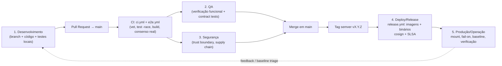
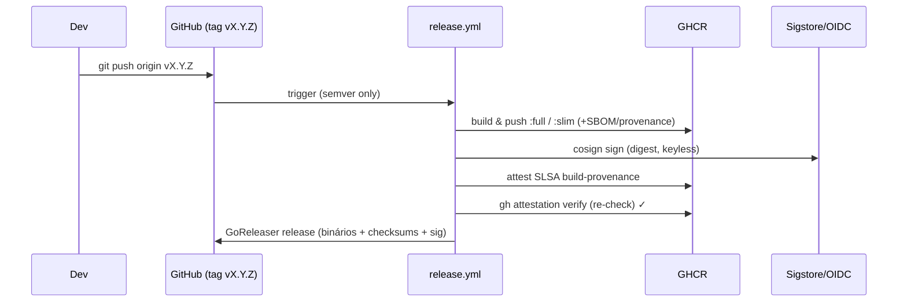

# Checklists

Este documento reúne **cinco checklists acionáveis** para o ciclo de vida do
Quorum (`quorum-sec-scan`, v0.2.3): Desenvolvimento, QA, Segurança,
Deploy/Release e Produção/Operação. Cada item é específico ao fluxo real do
projeto — uma ferramenta **CLI/Docker** de _consensus security scanning_ escrita
em Go 1.26, distribuída como imagens assinadas no GHCR e binários nativos via
GoReleaser. Os itens são verificáveis (com comando ou critério de aceite) e
ancorados no comportamento do código (`cmd/quorum`, `internal/*`) e dos
workflows (`.github/workflows/{ci,e2e,release}.yml`, `action.yml`).

> Princípio que atravessa todos os checklists: **"false split > false merge"** e
> **"0 findings is not proof of safety"**. Um item só está "feito" quando você
> consegue _provar_ que os scanners rodaram (status `ran`) — não quando o
> relatório veio vazio.

Cross-links úteis: [Visão geral](01-visao-geral.md) ·
[Arquitetura](04-arquitetura.md) · [DevOps](11-devops.md) ·
[Infraestrutura](10-infraestrutura.md) ·
[Observabilidade](14-observabilidade.md) · [Roadmap](16-roadmap.md).

---

## Mapa do fluxo (onde cada checklist atua)



| Etapa real | Gatilho | Workflow / artefato | Checklist |
|------------|---------|---------------------|-----------|
| Código em branch | trabalho local | `make test/vet/build` | 1. Desenvolvimento |
| PR para `main` | `pull_request` | `ci.yml`, `e2e.yml` | 2. QA |
| Revisão da cadeia | PR / pré-release | `release.yml`, `action.yml` | 3. Segurança |
| Tag `vX.Y.Z` | `push` de tag semver | `release.yml` (imagens+binários) | 4. Deploy/Release |
| Uso em pipeline | `docker run` / action | imagem `:full`/`:slim` | 5. Produção/Operação |

---

## 1. Checklist de Desenvolvimento

Objetivo: garantir que uma mudança é fiel à arquitetura do Quorum, passa nos
gates locais antes do PR e respeita os contratos dos adapters. Reproduz
localmente o que `ci.yml` exige.

### 1.1 Setup e branch

- [ ] Go **1.26+** instalado (`go version`) — é a versão fixada em
      `ci.yml`, `e2e.yml` e `release.yml`.
- [ ] Trabalho feito em **branch a partir de `main`** (nunca commit direto em
      `main`); fluxo é sempre via PR.
- [ ] Scanners OSS necessários no `PATH` para teste manual end-to-end
      (`trivy`, `grype`, `checkov`, `kics`, `dockle`, `kubescape`) ou uso da
      imagem `:full`. Ausentes são reportados como `unavailable`, não quebram o
      build.

### 1.2 Aderência à arquitetura (as-is)

- [ ] Mudança respeita os limites de pacote: `cmd/quorum` (CLI cobra) vs.
      `internal/{adapter,orchestrator,correlate,consensus,alias,cache,crosswalk,filter,model,purl,report,severity}`.
- [ ] Nada introduz dependência de **frontend web, banco relacional, API REST
      ou IA/LLM** — fora do escopo do produto (CLI/Docker only).
- [ ] Nova saída/normalização converge para o modelo canônico
      `model.Finding` (não vaza formato cru de scanner para fora do adapter).
- [ ] Se a mudança afeta correlação, o `correlationKey` permanece
      **determinístico por tipo** (VULN/MISCONFIG/etc — `DESIGN §6`) e o
      princípio **false split > false merge** é mantido (na dúvida, isola e marca
      `unmapped`).

### 1.3 Adapters (quando aplicável)

- [ ] Adapter implementa a interface completa `Adapter`:
      `Name` / `Version` / `Supports` / `Capabilities` / `Run`.
- [ ] Existe **contract test** contra fixture versionada em
      `internal/adapter/testdata` (uma mudança de formato deve quebrar o teste
      antes de quebrar produção).
- [ ] `Version(ctx)` é leve o suficiente para o **probe de 60s**
      (`Options.ProbeTime`) e distingue corretamente ausência vs. lentidão.
- [ ] `Supports(target)` reflete os alvos reais do scanner (ver matriz em
      `README.md` — ex.: `grype` não suporta `k8s`).

### 1.4 Gates locais (espelham `ci.yml`)

- [ ] `make vet` (ou `go vet ./...`) sem apontamentos.
- [ ] `make test` / `go test -race ./...` verde (unit + contract tests).
- [ ] `make build` / `go build -trimpath -o dist/quorum ./cmd/quorum` compila.
- [ ] Smoke: `./dist/quorum list-scanners` lista os adapters registrados.
- [ ] Teste funcional manual: `./dist/quorum scan <alvo> --format json` produz
      relatório e o resumo no stderr mostra status por scanner.

### 1.5 Higiene de PR

- [ ] Crosswalk novo/alterado em `crosswalk/*.yaml` segue o schema
      (`canonicalControl`, `category`, `ids.{checkov,kics,trivy}`); regra sem
      mapeamento **não é "chutada"** (fica `unmapped`).
- [ ] Documentação atualizada quando o comportamento muda (`README.md`,
      `README.pt-BR.md`, `DESIGN.md`, e este `docs/`).
- [ ] PR aberto contra `main`; aguarda `ci.yml` **e** `e2e.yml` verdes.

---

## 2. Checklist de QA

Objetivo: validar comportamento observável do Quorum — consenso real,
exit codes, formatos e transparência de status — não apenas "passou nos
unit tests". Ancora-se no `e2e.yml`, que roda scanners **reais** (não fixtures).

### 2.1 Suíte automatizada (PR)

- [ ] `ci.yml` verde: vet + `go test -race ./...` + build + smoke.
- [ ] `e2e.yml` verde nos dois cenários de consenso:
  - [ ] **IaC** (Trivy + Checkov sobre `examples/terraform`) com
        `summary.multiDetected >= 1`.
  - [ ] **SCA** (Trivy + Grype sobre `alpine:3.10`) com
        `summary.multiDetected >= 1`.
- [ ] Contract tests dos adapters cobrem o fixture atualizado da versão real da
      ferramenta.

### 2.2 Transparência de execução (status por scanner)

- [ ] Relatório expõe **status por scanner**:
      `ran | skipped | unavailable | error | timeout`.
- [ ] Cenário "ferramenta ausente" produz `unavailable` e **não** falha o scan.
- [ ] Cenário "timeout por scanner" (`--timeout` curto) produz status `timeout`
      e mensagem de erro associada, não `ran`.
- [ ] Validar manualmente que **"0 findings"** vem acompanhado dos status — um 0
      com tudo `ran` é diferente de 0 com tudo `unavailable`.

### 2.3 Exit codes (gate)

| Cenário de teste | Comando | Exit esperado |
|------------------|---------|---------------|
| Sem `--fail-on`, ou nada atinge o limiar | `scan … ` | `0` |
| Finding ≥ `--fail-on` | `scan … --fail-on high` | `1` |
| Erro de uso / runtime | `scan` sem alvo, `--type` inválido | `2` |

- [ ] `0` quando nenhum finding atinge `--fail-on` (ou flag ausente).
- [ ] `1` quando há finding com severidade ≥ `--fail-on` (gate dispara, log
      `gate: found … >= --fail-on`).
- [ ] `2` em erro de uso/runtime (ex.: `--fail-on` inválido, `--format`
      inválido, baseline inexistente passado explicitamente via `--baseline`).

### 2.4 Formatos de saída

- [ ] **SARIF** (default): contém `partialFingerprints["quorum/v1"]` =
      `sha256(correlationKey)` e `properties.detectedBy/detectionCount/confidence`.
- [ ] **JSON**: campo `fingerprint`, `summary.multiDetected`, `scanners[]` com
      status e contagem, rollup de severidade.
- [ ] **XML**: mesma estrutura serializada (pipelines legados/JUnit-like).
- [ ] `--output/-o` grava em arquivo (cria diretório pai se necessário); sem
      `-o` escreve em stdout.

### 2.5 Severidade, baseline e min-severity

- [ ] `--min-severity` remove findings abaixo do limiar do relatório **e** do
      gating; supressões são logadas (`filtered: … below min-severity`).
- [ ] `--baseline`/`.quorumignore` suprime por `fingerprint` **ou**
      `correlationKey`; supressões são **sempre logadas** (nunca descartadas em
      silêncio).
- [ ] Linha de comentário (`#`) e linhas em branco no `.quorumignore` são
      ignoradas corretamente.

### 2.6 Resolução de alias

- [ ] Com rede: `CVE-…` (Trivy) e `GHSA-…` (Grype) do mesmo bug correlacionam
      (alias local → cache `~/.cache/quorum/aliases.json` → OSV.dev, CVE
      preferido).
- [ ] `--offline`: nenhuma chamada a OSV; degradação graciosa (usa aliases
      locais + cache).
- [ ] Falha de rede simulada não derruba o scan (degradação graciosa).

---

## 3. Checklist de Segurança

Objetivo: tratar a própria cadeia do Quorum como _trust boundary_ e validar as
garantias de supply chain (`DESIGN §12`). Cobre tanto o que o Quorum produz
quanto o que ele consome (binários de scanners empacotados).

### 3.1 Cadeia de suprimentos do release

- [ ] Imagens são **assinadas keyless com cosign** (OIDC) — verificar antes de
      usar:
  ```bash
  cosign verify ghcr.io/martinez1991/quorum-sec-scan:slim \
    --certificate-identity-regexp \
      "https://github.com/Martinez1991/quorum-sec-scan/.github/workflows/release.yml@.*" \
    --certificate-oidc-issuer https://token.actions.githubusercontent.com
  ```
- [ ] **Atestação SLSA build-provenance** presente e verificável:
  ```bash
  gh attestation verify oci://ghcr.io/martinez1991/quorum-sec-scan:full \
    --repo Martinez1991/quorum-sec-scan
  ```
- [ ] Binários nativos: `checksums.txt` + assinatura cosign
      (`cosign verify-blob`) + atestação SLSA
      (`gh attestation verify quorum_<ver>_<os>_<arch>.tar.gz --repo …`).
- [ ] O próprio `release.yml` **re-verifica** a atestação (imagem e binário)
      como step do release — um release com atestação quebrada deve falhar.

### 3.2 Permissões e identidade do CI

- [ ] `release.yml` mantém `permissions` mínimas:
      `contents: read` (job `images`), `packages: write`,
      `id-token: write` (cosign keyless), `attestations: write`.
- [ ] Job `binaries` usa `contents: write` apenas para criar o release.
- [ ] Trigger de release **restrito a tags semver** `v[0-9]+.[0-9]+.[0-9]+` —
      tags móveis (`v0`, usada para pin do action) **não** disparam build.

### 3.3 GitHub Action composite (`action.yml`)

- [ ] Por padrão `verify: "true"` → cosign-verifica a imagem `:full` **antes**
      de rodá-la.
- [ ] Em produção, `image` é fixada por `@sha256:<digest>` (não tag móvel) e o
      action é pinado por `@<sha>`.
- [ ] Inputs sensíveis (`baseline`, `crosswalk`, `offline`) revisados quanto a
      impacto de segurança (ex.: baseline não está suprimindo risco real).

### 3.4 Binários de scanners empacotados (imagem `:full`)

- [ ] Reconhecido que os binários OSS empacotados **fazem parte do trust
      boundary** do consumidor.
- [ ] Para produção, versões pinadas convertidas para referências imutáveis
      `@sha256:<digest>` e checksums de release verificados (`DESIGN §12`).
- [ ] DB do Grype pré-cacheado na `:full` é proveniente de fonte confiável
      (Anchore) e a versão acompanha schema suportado.

### 3.5 Comportamento seguro por padrão

- [ ] `--offline` disponível para ambientes sem egress (desliga OSV).
- [ ] Supressões (`--baseline`, `--min-severity`) são auditáveis: sempre logadas;
      revisão garante que nenhuma entrada está mascarando finding ativo.
- [ ] Cache de alias (`~/.cache/quorum/aliases.json`) tratado como dado não
      confiável/derivado (pode ser apagado sem perda de correção).
- [ ] Falsos negativos por **mount malformado** são prevenidos (ver
      checklist 5.1) — um `/work` vazio reporta 0 findings.

---

## 4. Checklist de Deploy/Release

Objetivo: executar um release reprodutível e assinado. O release é disparado por
**push de uma tag semver** `vX.Y.Z`; o `release.yml` constrói/publica imagens
(`:full`, `:slim`) e binários (GoReleaser), assina e atesta tudo.

### 4.1 Pré-tag

- [ ] `main` está verde (`ci.yml` + `e2e.yml`) no commit a ser taggeado.
- [ ] Versão escolhida segue **semver estrito** `vX.Y.Z` (ex.: `v0.2.3`) — o
      `release.yml` só dispara para `v[0-9]+.[0-9]+.[0-9]+`.
- [ ] CHANGELOG/notas conferidos; GoReleaser tem **histórico completo**
      (`fetch-depth: 0`) para gerar o changelog.
- [ ] Crosswalk empacotado revisado (`crosswalk/*.yaml`) — vai bundled em
      `/opt/quorum/crosswalk` nas imagens e nos binários.

### 4.2 Disparo do release

- [ ] Tag criada e enviada:
  ```bash
  git tag v0.2.3
  git push origin v0.2.3
  ```
- [ ] Workflow `release.yml` iniciou para a tag (não para uma tag móvel).

### 4.3 Imagens (job `images`)

- [ ] **`:full`** publicada em `linux/amd64` com tags
      `:full`, `:<version>`, `:<version>-full`, `:latest` (todos scanners
      empacotados; DB do Grype pré-cacheado).
- [ ] **`:slim`** publicada em `linux/amd64,linux/arm64` com tags
      `:slim`, `:<version>-slim` (apenas orquestrador).
- [ ] `provenance: true` e `sbom: true` no build-push.
- [ ] `cosign sign` aplicado ao **digest do manifest** (cobre todas as tags que
      apontam para ele).
- [ ] `actions/attest-build-provenance` gerou e enviou a atestação ao GHCR.
- [ ] Step **"Verify provenance attestation"** passou (re-verificação fim a fim).

### 4.4 Binários (job `binaries`, só em tag)

- [ ] GoReleaser publicou archives por OS/arch + `checksums.txt` + assinatura
      cosign.
- [ ] Atestação SLSA por `subject-checksums: dist/checksums.txt` gerada.
- [ ] Step de verificação ("spot-check" de um artefato `linux_amd64`) passou.

### 4.5 GitHub Action / tag móvel

- [ ] Se aplicável, tag móvel `v0` reapontada para o novo release **após**
      sucesso (pin do action `uses: Martinez1991/quorum-sec-scan@v0`).
- [ ] Mover `v0` **não** disparou um novo build de release (trigger semver).

### 4.6 Validação pós-publicação (do lado do consumidor)

- [ ] `cosign verify` da imagem recém-publicada OK (ver 3.1).
- [ ] `gh attestation verify` da imagem e de um binário OK.
- [ ] `docker run --rm … :full list-scanners` lista os scanners empacotados.
- [ ] Smoke real: scan de um alvo conhecido produz consenso (`detectionCount > 1`
      em pelo menos um finding).



---

## 5. Checklist de Produção/Operação

Objetivo: rodar o Quorum corretamente em pipelines, evitar o falso negativo
clássico (mount errado) e operar o gate com confiança. Aplica-se a `docker run`
direto, ao `container:`/CI, e à action composite.

### 5.1 Mount correto (o erro nº 1)

- [ ] Fonte montada em **`/work`** com o **dois-pontos** do separador
      `host:container` correto:
  - [ ] Linux/macOS: `-v "$PWD:/work"`
  - [ ] PowerShell: `-v "${PWD}:/work"`
  - [ ] cmd.exe: `-v "%cd%:/work"`
- [ ] **Não** usar mount malformado tipo `-v "%cd%/work"` (sem `:`), que monta
      `/work` vazio → reporta **0 findings** para tudo (falso negativo).
- [ ] Workdir do container coerente (`-w /work`) quando o alvo é `.`.
- [ ] Validação anti-falso-negativo: confirmar no resumo que scanners estão
      `ran` (não `unavailable`) e que o número de arquivos analisados faz
      sentido.

### 5.2 Verificação antes de executar

- [ ] Imagem **cosign-verificada** antes do uso (ou `verify: true` na action) —
      ver 3.1.
- [ ] Em produção, imagem pinada por `@sha256:<digest>` e action por `@<sha>`.

### 5.3 Configuração do scan

- [ ] `--type` correto (`image|repo|k8s`) ou confirmado que a inferência
      (path existente → `repo`, senão `image`) acerta o alvo.
- [ ] `--scanners` define o pool desejado (ou omitido para todos que suportam o
      alvo).
- [ ] `--crosswalk`: usando o bundled `/opt/quorum/crosswalk` (auto-detectado na
      imagem) ou apontando mapeamentos próprios; log inicial mostra
      `crosswalk=N rules (<dir>)`.
- [ ] `--timeout` por scanner adequado ao runner (default `5m`); se houver
      `unavailable` por probe (60s) lento/OOM, **aumentar memória** do container
      ou reduzir `--scanners`.

### 5.4 Gate de build

- [ ] `--fail-on <sev>` definido conforme política (gate dispara exit `1`).
- [ ] Pipeline trata os exit codes corretamente: `0` ok · `1` gate · `2` erro
      (não confundir `1` com `2`).
- [ ] `--min-severity` usado para reduzir ruído sem mascarar o gate (revisar que
      o limiar não esconde a severidade de `--fail-on`).

### 5.5 Baseline e triagem contínua

- [ ] `.quorumignore` versionado, com **um fingerprint/correlationKey por
      linha** e comentário de justificativa + data de revisão.
- [ ] Fingerprints copiados do próprio relatório
      (`partialFingerprints["quorum/v1"]` no SARIF / `fingerprint` no JSON).
- [ ] Supressões revisadas periodicamente (toda supressão é logada — auditar o
      log do CI).

### 5.6 Integração e artefatos

- [ ] SARIF publicado para GitHub code scanning / DefectDojo (dedupe grátis via
      `partialFingerprints`).
- [ ] Relatório (`-o quorum.sarif`/`.json`/`.xml`) salvo como artefato do
      pipeline (sempre, inclusive em falha de gate).
- [ ] Ambiente sem egress: `--offline` ativado (desliga OSV; consenso de alias
      cai para cache local).

### 5.7 Operação e diagnóstico

- [ ] Resumo do stderr (`── quorum summary ──`) inspecionado: status por
      scanner, contagem multi-detected, severidades, `elapsed`.
- [ ] Status `unavailable`/`timeout`/`error` tratados como sinal — não como
      "limpo". Lembrar: **"0 findings is not proof of safety"**.
- [ ] Em OOM (`version probe killed`/`signal: killed`): aumentar limite de
      memória do container.
- [ ] `quorum list-scanners` usado para confirmar quais adapters estão
      registrados/empacotados na imagem em uso.

---

## Premissas

- **Versão de referência:** documentação escrita para o Quorum **v0.2.3**, com
  base no estado atual do repositório (`README.md`, `DESIGN.md`,
  `cmd/quorum/scan.go`, `internal/orchestrator/orchestrator.go`,
  `.github/workflows/{ci,e2e,release}.yml`, `action.yml`). Itens marcados como
  comportamento (exit codes, status, flags) refletem o código **as-is**.
- **Escopo do produto:** assume-se CLI/Docker only. Itens de checklist que em
  templates enterprise tratariam de frontend web, banco relacional, API REST ou
  IA/LLM são **N/A** por design e foram deliberadamente omitidos (não há
  superfície correspondente no código).
- **Owner/repo:** os comandos de verificação usam
  `ghcr.io/martinez1991/quorum-sec-scan` e
  `Martinez1991/quorum-sec-scan`, conforme `README.md`/`action.yml`/`release.yml`.
  Em forks, ajustar owner/identidade do certificado cosign.
- **Ambiente de produção típico:** assume-se execução em pipeline CI/CD
  (GitHub Actions, GitLab CI ou `docker run`), não em runtime de cluster — o
  Quorum não tem componente residente. Itens de "Produção/Operação" referem-se à
  operação do scanner em pipeline.
- **Plataformas:** `:full` é `linux/amd64` apenas (binários de scanner são
  amd64); `:slim` cobre `amd64`+`arm64`. Checklists de mount/execução assumem um
  host capaz de rodar a imagem alvo (ex.: emulação para arm64).
- **Probe de versão:** o valor de 60s (`Options.ProbeTime`/`defaultProbeTime`) é
  tratado como fixo; se exposto via flag em versões futuras, o item 5.3 deve ser
  atualizado.
